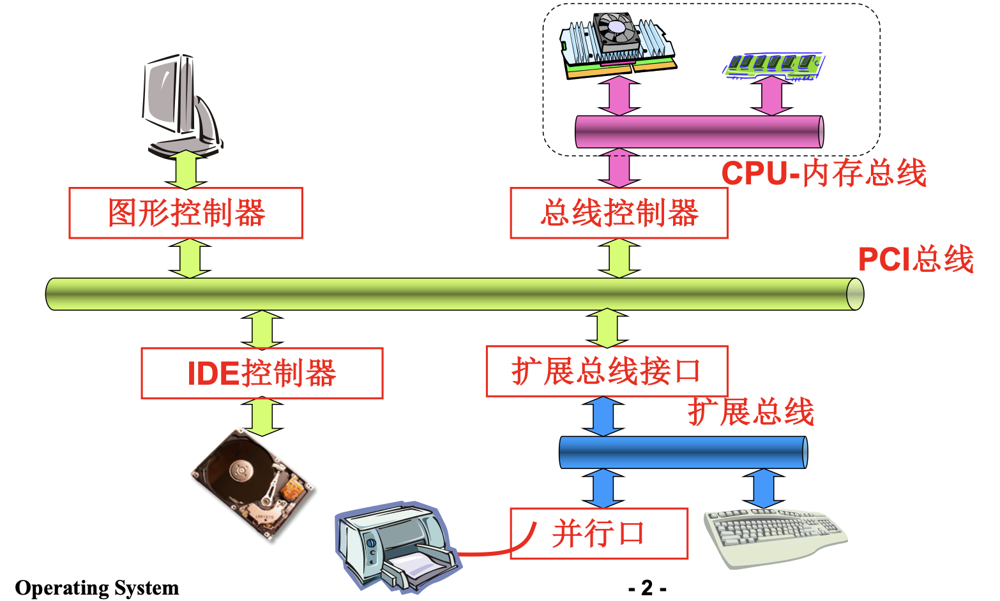
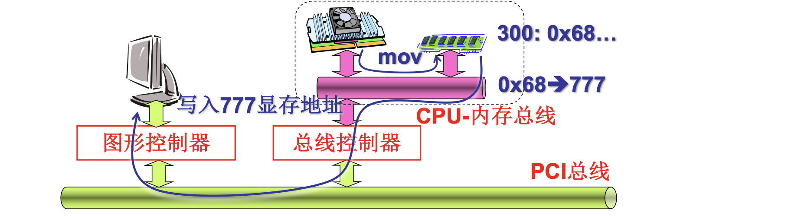
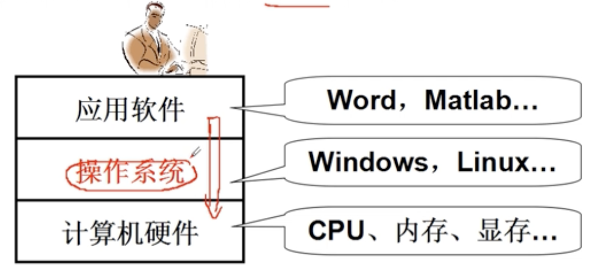
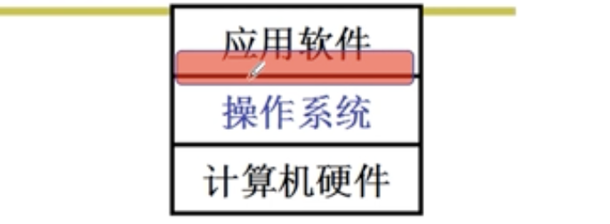
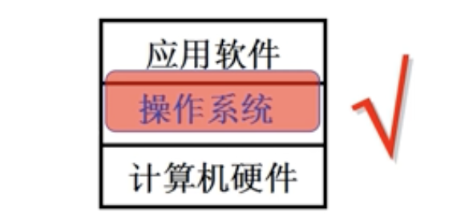
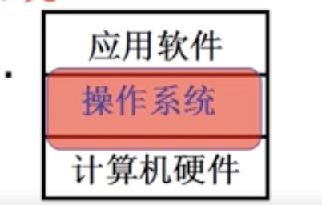

# 📘 1.1 什么是操作系统 (What is Operating System?)

> 来源说明：哈工大操作系统 L1 李治军老师 | 本节涵盖：操作系统定义、硬件基础、课程目标与学习层次

---

## 🧠 核心概念总览（严格按原文顺序）

- [*知识点1: 计算机硬件基本结构*](#id1)
- [*知识点2: 计算机专业的核心目标*](#id2)
- [*知识点3: 裸机概念与直接使用硬件的局限*](#id3)
- [*知识点4: 操作系统的定义与定位*](#id4)
- [*知识点5: 操作系统的核心功能*](#id5)
- [*知识点6: 操作系统管理的硬件资源*](#id6)
- [*知识点7: 操作系统学习的三个层次*](#id7)
- [*知识点8: 课程目标：进入操作系统*](#id8)

---

## ✅ 知识点1: 计算机硬件基本结构

**计算机概览**

- 计算机硬件包含多个核心组件，通过<b>总线(Bus)</b>连接
- **CPU-内存总线(CPU-Memory Bus)**：连接CPU和内存的高速通道
- **PCI总线(PCI Bus)**：连接外设的扩展总线
- **图形控制器(Graphics Controller)**：负责图像显示处理
- **IDE控制器(IDE Controller)**：管理磁盘存储设备
- **总线控制器(Bus Controller)**：协调各总线间的数据传输
- **扩展总线接口(Expansion Bus Interface)**：提供外部设备连接能力
- **并行口(Parallel Port)**：外部设备连接端口
- 关键组件：CPU、内存(Memory)、显存(Video Memory)等

---

## ✅ 知识点2: 计算机专业的核心目标

计算机专业本质：**用计算机帮助人们解决实际问题**
- 核心能力：掌握计算机这个"专业吃饭的家伙"
- 基础示例：在屏幕上输出 **"hello!"** 是计算机工作的基本功能验证
- 从底层到应用：即使是简单的 `printf("hello!")`，也涉及复杂的硬件协作过程

---

## ✅ 知识点3: 裸机概念与直接使用硬件的局限

**复杂的硬件协作**
- **裸机(Bare Machine)**：没有操作系统，只有硬件的计算机
- 裸机操作示例：直接通过 **mov** 指令将数据写入显存地址
  - 例如屏幕上输出“hello!”：`mov 0x68 → 777`（将字符写入显存地址777）
  
- 直接**裸机编程**的问题：
  - 需要直接操作硬件地址
  - 程序员必须了解硬件细节
- 需要一层让我们使用计算机更加简单高效！

---

## ✅ 知识点4: 操作系统的定义与定位

**中间层 - 操作系统**
- **操作系统(Operating System, OS)** 的定位：
  - 位于**计算机硬件(Computer Hardware)** 和 **应用软件(Application Software)** 之间的一层软件
  

- 操作系统的本质：**硬件之上、应用之下**的系统软件层

---

## ✅ 知识点5: 操作系统的核心功能

**实现核心**
- 操作系统两大核心功能：
  1. **方便使用硬件**：提供统一的接口，让应用程序不用关心硬件细节
     - 例如：使用显存只需调用 `printf`，不需要知道显存地址
  2. **高效使用硬件**：合理调度资源，支持多任务并发
     - 例如：开多个终端(窗口)时，操作系统协调CPU时间分配
- 对比示例：
  - 裸机：`mov 0x68 → 777`（直接写显存地址）
  - 有OS：`printf("hello!")`（简单函数调用）

---

## ✅ 知识点6: 操作系统管理的硬件资源

**主要管理的资源**
- 操作系统管理的主要硬件资源：
  - **CPU管理(CPU Management)**：进程调度、时间片分配
  - **内存管理(Memory Management)**：内存分配、虚拟内存、地址映射
  - **终端管理(Terminal Management)**：输入输出设备管理、多终端支持
  - **磁盘管理(Disk Management)**：磁盘I/O调度、存储空间管理
  - **文件管理(File Management)**：文件系统、目录结构、权限控制
  - **网络管理(Network Management)**：网络协议栈、通信接口 - **本课不包括**
  - **电源管理(Power Management)**：功耗控制、休眠唤醒 - **本课不包括**
  - **多核管理(Multi-core Management)**：多CPU/多核调度与同步 - **本课不包括**

---

## ✅ 知识点7: 操作系统学习的三个层次

学习操作系统可以从三个层次切入：

1. **从应用软件出发"探到操作系统"**
  
   - 集中在使用计算机的接口上
   - 使用显示器：`printf()`
   - 使用CPU：`fork()`
   - 使用文件：`open()`、`read()`
   - 停留在系统调用(System Call)的使用层面

2. **从应用软件出发"进入操作系统"**
  
   - 深入理解接口背后的实现机制
   - 例如：一段文字是如何写到磁盘上的？
   - 需要理解文件系统、设备驱动、缓冲区管理等

3. **从硬件出发"设计并实现操作系统"**
    
   - 给定一块硬件板子，配一个操作系统
   - 从底层开始构建完整的OS
   - 这是最高层次，也是本课程追求的目标

---

## ✅ 知识点8: 课程目标：进入操作系统

**理论**
- 本课程的核心目标：
  1. **理解真实操作系统的运转**：不是学概念，而是理解真实OS代码
  2. **在真实的基本操作系统上动手实践**：能改、能调、能实现
- 老师教学的出发点是学生：
  - 学生要成为**掌握计算机关键技术的工程师**
  - 必须理解 `printf("hello")` 到底怎么回事
  - 能改CPU管理、屏幕输出、系统接口、内存管理
- 核心理念：**能自己动手才是真正学会了**
- 能改操作系统 → 能改CPU管理 → 能改屏幕输出 → 能改系统接口 → 能改内存管理

---

## 🔑 核心要点总结

1. **操作系统是硬件和应用之间的系统软件层**，提供方便性和高效性两大核心价值
2. **裸机编程**直接操作硬件地址，复杂且低效；OS提供统一接口如 `printf()`
3. **OS管理八大硬件资源**：CPU、内存、终端、磁盘、文件、网络、电源、多核
4. **学习OS有三个层次**：用接口 → 理解实现 → 设计实现；本课程目标是进入后两个层次

## 📌 考试速记版

- **OS定义**：硬件与应用之间的系统软件，方便+高效使用硬件
- **OS功能**：管理CPU、内存、终端、磁盘、文件、网络、电源、多核
- **OS层次**：应用层 → OS层 → 硬件层

---

> 🔗 **返回本章导航**：[第1章 操作系统基础](./README.md)
> 🔗 **返回课程主页**：[操作系统 (Operating Systems)](../README.md)
