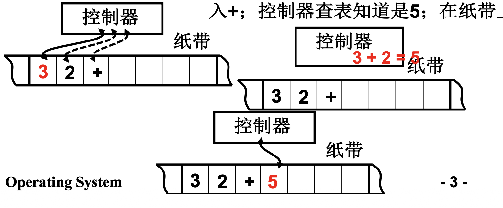
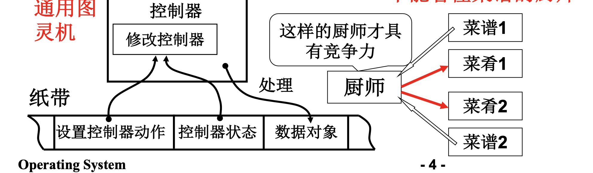
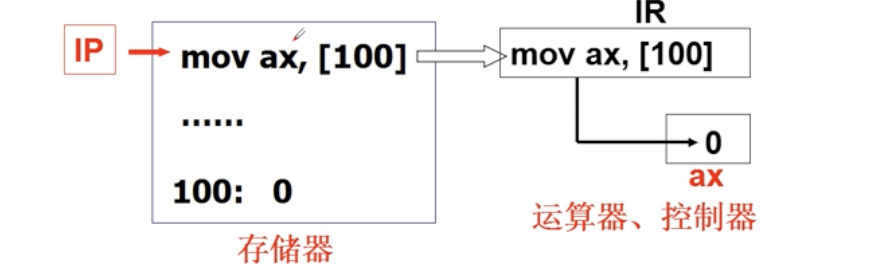
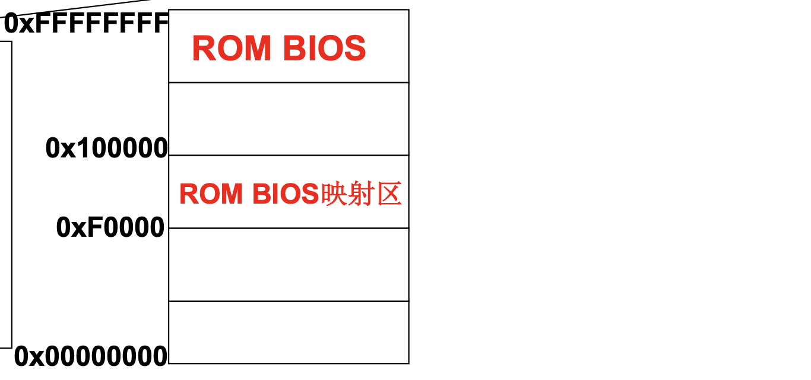
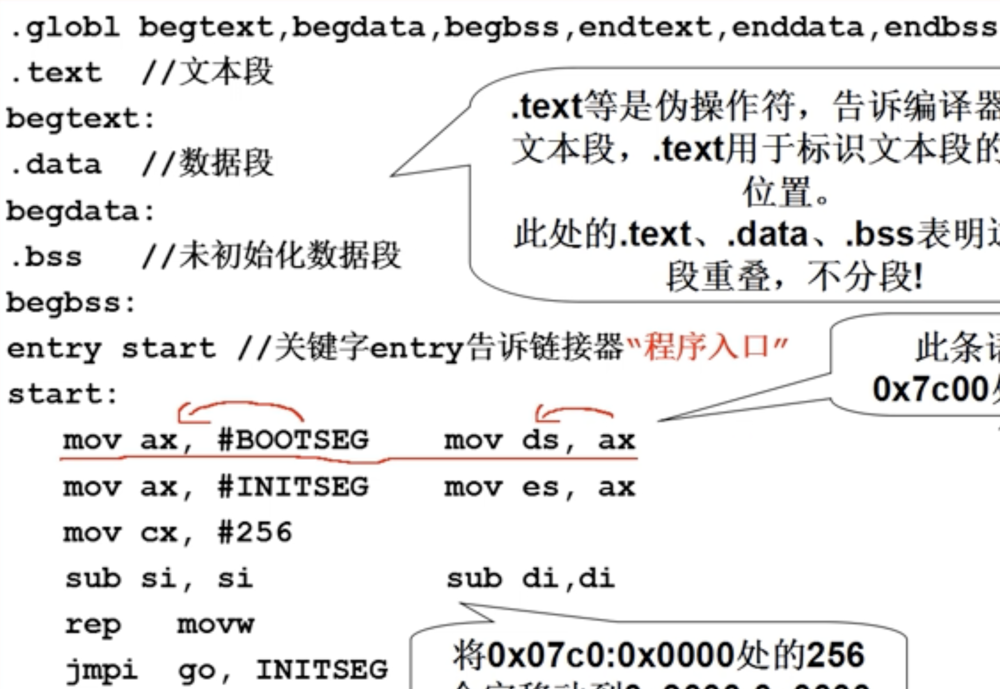
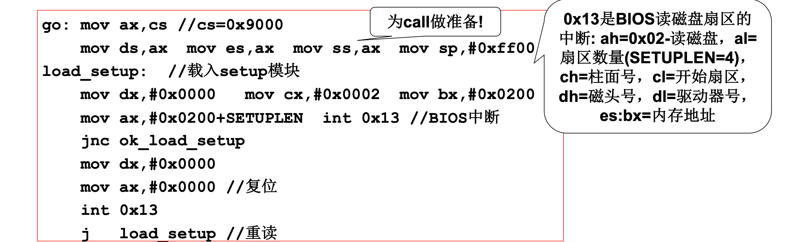
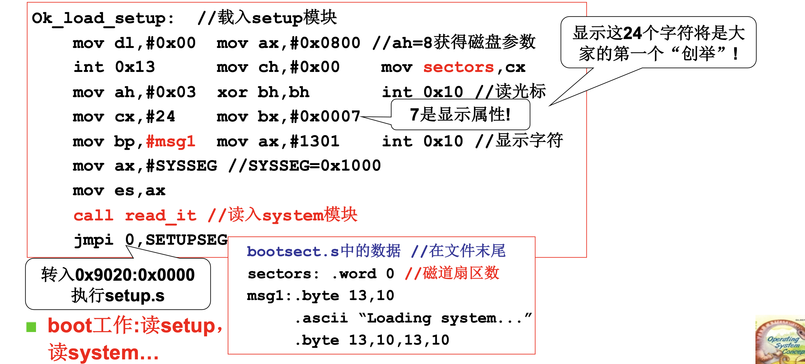
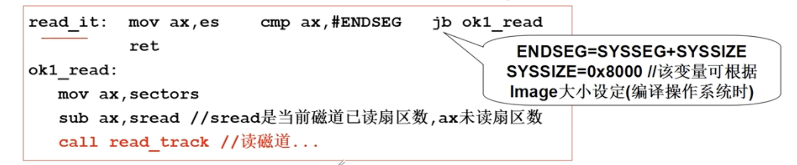

# 📘 1.2 揭开钢琴的盖子 (Open the OS!)

> 来源说明：哈工大操作系统 L2 李治军老师 | 本节涵盖：计算机启动流程、图灵机到冯诺依曼结构、x86 PC开机引导、bootsect.s引导代码

---

## 🧠 核心概念总览（严格按原文顺序）

- [*知识点1: 打开电源后的计算机启动后*](#id1)
- [*知识点2: 图灵机计算模型*](#id2)
- [*知识点3: 通用图灵机与程序的概念*](#id3)
- [*知识点4: 冯·诺依曼存储程序思想*](#id4)
- [*知识点5: x86 PC开机时的CPU状态与寻址*](#id5)
- [*知识点6: 引导扇区的概念与作用*](#id6)
- [*知识点7: bootsect.s引导代码结构*](#id7)
- [*知识点8: 加载setup模块与BIOS中断调用*](#id9)
- [*知识点9: 加载system模块与磁盘读取*](#id10)
- [*知识点10: 引导扇区结束标识与控制权移交*](#id11)

---

<a id="id1"></a>
## ✅ 知识点1: 打开电源后的计算机启动后

**打开电源后...**
- 从打开电源开始，计算机要开始工作
- **核心问题**：计算机怎么工作？背后发生着什么？
- **"不要总等着别人告诉你答案，尽量自己去寻找"** — 从知识和常识进行思索


---

<a id="id2"></a>
## ✅ 知识点2: 图灵机计算模型

**从白纸到模型**
- 计算机说到底就是一个**计算模型(Computational Model)**
- **图灵机(Turing Machine)** — 1936年，英国数学家 **A.C.图灵(A.C. Turing)** 提出
- 图灵机组成：
  - **控制器(Controller)**：根据当前状态和读入符号决定动作
  - **纸带(Tape)**：存储数据，可读写
- 计算示例：3 + 2 = 5
  
  - 在纸带上读入 3
  - 在纸带上读入 2
  - 在纸带上读入 +
  - 控制器查表知道结果是 5
  - 在纸带上写下 5
- 类比人类计算：人 + 笔 + 纸 = 控制器 + 读写头 + 纸带


---

<a id="id3"></a>
## ✅ 知识点3: 通用图灵机与程序的概念

**从图灵机到通用图灵机**
- **图灵机** vs **通用图灵机(Universal Turing Machine)**：
  - 图灵机：一个会做一道菜的厨师（只能执行固定操作）
  - 通用图灵机：一个能看懂菜谱的厨师（可以执行任意程序）
- 通用图灵机的关键：**将操作过程描述为菜谱（程序）**
- 通用图灵机工作方式：
  
  - 还有**设置控制器动作**的指令：可以将一套处理逻辑读取到控制器内
    - 并**修改控制器(Modify Controller)**
    - 得到能做不同菜肴的控制器
  - 并根据载入的逻辑处理纸带上**数据对象(Data Objects)**
  - 可以**处理控制器状态(Controller State)**
- 类比：
  - 厨师 + 菜谱1 = 菜肴1
  - 厨师 + 菜谱2 = 菜肴2
  - 同一个厨师，不同的菜谱，做出不同的菜
- **"这样的厨师才具有竞争力"** — 通用性是核心优势

> 📋 **术语提醒**：应用程序(Program) = 菜谱 = 指令序列，这是计算机可编程性的本质
> 💡 **理解技巧**：从"专用"到"通用"是计算机革命的核心——通用图灵机让一台机器可以做无数种不同的事


---

<a id="id4"></a>
## ✅ 知识点4: 冯·诺依曼存储程序思想

从通用图灵机到计算机：**伟大想法的工程实现**
- 又一个伟大的发明：**冯·诺依曼存储程序思想(Von Neumann Stored-Program Concept)** — 1946年提出
- 存储程序的主要思想：
  - 将**程序(Program)** 和**数据(Data)** 存放到计算机内部的存储器中
  - 计算机在程序的控制下，一步一步进行处理
- 计算机由**五大部件**组成：
  1. **输入设备(Input Device)**
  2. **输出设备(Output Device)**
  3. **存储器(Memory/Storage)**
  4. **运算器(Arithmetic Logic Unit, ALU)**
  5. **控制器(Control Unit)**
- 关键概念：
  - **IP(Instruction Pointer)**：指令指针，即那个读写指针
  - **IR(Instruction Register)**：指令寄存器，存放当前指令
- 代码示例：
  
- > ⚠️ 计算机的核心工作理念：**自动取指执行**

> ⚠️ **警告注意**：运算器和控制器在现代CPU中已合为一体，称为**CPU(Central Processing Unit)**
> 💡 **理解技巧**：冯·诺依曼结构就是"存储+读取+执行"的循环——IP指针就是这个循环的核心


---

<a id="id5"></a>
## ✅ 知识点5: x86 PC开机时的CPU状态与寻址

**回到开始的问题：计算机刚打开电源时，计算机执行的指令是什么？**
- Q：计算机刚打开电源时，**IP = ?**
- A：**由硬件设计者决定！**
- x86 PC 刚开机时的CPU状态：
  1. CPU处于**实模式(Real Mode)**
  2. 开机时：**CS = 0xFFFF; IP = 0x0000**
  3. 寻址：**0xFFFF0**（ROM BIOS映射区）
  - > 📋 **术语提醒**：
      > - **实模式(Real Mode)**：x86 CPU的16位兼容模式，寻址能力1MB
      > -  **保护模式(Protected Mode)**：32/64位模式，有内存保护机制
      > - **CS(Code Segment)**：标记一整块存放所有程序指令的内存区域（代码段）的起点，它管整片指令区在哪，不是某一条指令
      > - **IP**: 代码段内当前待执行指令的偏移地址
- 实模式寻址方式：**CS:IP**（代码段段寄存器:偏移寄存器）
  - 物理地址 = **CS左移4位 + IP**（即 CS × 16 + IP）
  - 0xFFFF0 = 0xFFFF × 16 + 0x0000 = 0xFFFF0
  - 和保护模式的寻址方式不同！
- 内存地址空间布局：
  

  - > ⚠️ 术语提醒
    >- **ROM BIOS**：主板上物理闪存芯片，存开机固件程序的硬件载体。
    >- **ROM BIOS**映射区：内存地址0xF0000~0xFFFFF，硬件把ROM芯片挂载到这片地址，CPU通过该地址读取BIOS代码。
    > **简单区分**：一个是实体芯片，一个是给CPU访问用的虚拟内存地址空间。
- 开机后执行ROM BIOS映射区的代码：
  1. 检查RAM
  2. 检查键盘
  3. 检查显示器
  4. 检查软硬磁盘
  5. 将磁盘0磁道0扇区读入 **0x7c00** 处(**引导扇区**)
  6. 设置 **cs = 0x07c0, ip = 0x0000**

> ⚠️ **警告注意**：0xFFFF0是ROM BIOS映射区，不是RAM！开机时RAM还没初始化
> ⚠️ **为什么ROM BIOS和ROM BIOS映射区不在一个地方？**：BIOS本体在闪存，CPU 只能通过内存地址总线取指令，不会直接单独读写闪存芯片，需要靠硬件映射把两边打通。


---

<a id="id6"></a>
## ✅ 知识点6: 引导扇区的概念与作用


0x7c00处存放的代码：从磁盘**引导扇区(Boot Sector)** 读入的512个字节
- **引导扇区** = 启动设备的**第一个扇区(First Sector)**
  - 开机时按住 **Del键** 可进入启动设备设置界面，可以设置为光盘启动
- 启动设备信息设置在 **CMOS** 中：
  - **CMOS(Complementary Metal-Oxide-Semiconductor)**：互补金属氧化物半导体
  - 大小：64B-128B
  - 用途：存储实时钟和硬件配置信息
- 关键结论：
  - **硬盘的第一个扇区上存放着开机后执行的第一段我们可以控制的程序**
  - **操作系统的故事从这里开始……**


---

<a id="id7"></a>
## ✅ 知识点7: bootsect.s引导代码结构

**概览**
  

**代码分析**
- bootsect.s 是Linux 0.11的引导扇区**汇编代码**
  - ⚠️ **为什么是汇编而不是C?**: C语言的对硬件控制不完整，不精确


- 程序入口：
  ```asm
  entry start     // 关键字entry告诉链接器"程序入口"
  start:
  ```
- 常量定义：
  - `BOOTSEG = 0x07c0`：引导扇区被BIOS加载到的段地址
  - `INITSEG = 0x9000`：引导代码要移动到的目标段地址
  - `SETUPSEG = 0x9020`：setup模块的加载地址


- **引导代码的第一段功能**：将自身从0x07c0移动到0x9000
  ```asm
      mov ax, #BOOTSEG      // 将BOOTSEG移动到ax, 得到ax = 0x07c0
      mov ds, ax            // ds = 0x07c0（源段地址）
      mov ax, #INITSEG      // ax = 0x9000
      mov es, ax            // es = 0x9000（目标段地址）
      mov cx, #256          // cx = 256（移动字数，256字=512字节）
      sub si, si            // si = 0（源偏移）
      sub di, di            // di = 0（目标偏移）
      rep movw              // 重复移动字：将ds:si处的256个字移动到es:di处
  ```
  - 用`rep movw`把整套引导代码完整复制到了`0x9000:0000`这块内存。
- 移动完成后：**段间跳转**
  - `jmpi` = **段间远跳转**，格式：`jmpi 偏移地址, 新段基址`
    - `CS = 第二个操作数(INITSEG)`，`IP = 第一个操作数(go)`
  ```asm
  jmpi go, INITSEG        // 段间跳转到INITSEG:go
  ```
  1. 切换代码段：`CS = 0x9000`
  2. 切换段内指令偏移：`IP = go`
  CPU 接下来取指令的地址公式变为：
      - 物理地址 = `CS×16 + IP = 0x9000×16 + go`
      - 也就是跳到复制后的新位置 0x9000 段里的 go 标签处运行
- 新位置初始化寄存器：
  ```asm
  go: mov ax, cs          // ax = 0x9000
      mov ds, ax          // ds = 0x9000
      mov es, ax          // es = 0x9000
      mov ss, ax          // ss = 0x9000（栈段）
      mov sp, #0xff00     // sp = 0xff00（栈顶）
  ```
  - `go`: 等价于记录这一行代码距离**本段开头的偏移值**，编译器会自动算出这个数字。
  - 为后续 `call` 做准备：必须设置好栈（ss:sp）
    > ⚠️ `ss:sp`：栈段寄存器:栈指针，call/ret需要栈支持

> **主要任务**：**引导扇区先把自己完整拷贝到 0x9000 高地址内存，再切换代码段跑到新地址运行，统一段寄存器、初始化堆栈，最后调用 BIOS 读取磁盘里的 setup 启动模块。**

> 💡 **理解技巧**：bootsect.s就像"先锋部队"——先到达战场（0x7c00），然后把自己转移到安全位置（0x9000）
> ⚠️ **为什么移动？**：0x7c00是BIOS约定的位置，空间太小，0x7C00 只有 512 字节，后面要用 BIOS 中断读磁盘，加载 setup 程序、内核镜像，0x7C00 这片地址可以空出来当做临时缓冲区，不会和引导代码互相覆盖。


---

<a id="id9"></a>
## ✅ 知识点9: 加载setup模块与BIOS中断调用

**加载setup模块并显示信息**
- 加载setup模块的代码：
  
  
- **代码解析**
  - **`int 0x13`** — BIOS读磁盘扇区中断
    - > 磁盘存着更大的启动程序，x86 CPU 没有直接读写硬盘指令，只能靠 BIOS 提前封装好了一套成熟磁盘操作函数，通过 int 0x13 中断调用即可直接用把 setup 代码读到内存里执行。
    - > 🔥 **核心记忆**：`int 0x13`是磁盘读写的BIOS大门，所有启动加载都要通过它
    - `ah = 0x02`：读磁盘功能
    - `al = 扇区数量`（SETUPLEN = 4）
    - `cl = 开始读扇区 = 0x0002`
    - `es:bx = 内存地址 = 0x9000:0x0200`
> **主要任务**：**调用BIOS磁盘中断把磁盘第2扇区起的setup程序读到`0x9000:0x0200`，读取失败就复位磁盘后反复重试。**


- 加载后成功：转入 `ok_load_setup`
- 加载失败：复位磁盘后重读

- 加载setup成功后：
  - **`int 0x10`**：BIOS 屏幕显示中断 （显示字符）
    > BIOS 提供的显卡 / 屏幕操作中断
  
- 显示字符串：
  - `mov cx,#24`：输出24个字符
  - 具体输出字符：
    ```asm
    mov bp,#msg1
      ...
    msg1: .byte 13, 10
          .ascii "Loading system..."
          .byte 13, 10, 13, 10
    ```
  - `"Loading system..."` — 这24个字符将是大家的第一个"创举"！
- 调用读入system模块函数：
  ```asm
    mov ax,#SYSSEG
    mov es,ax
    call read_it 
  ```
> **主要任务**：**bootsect.s就像"舞台调度"——先把setup（4个扇区）搬上舞台，然后显示"Loading..."，再搬system模块**

---

<a id="id10"></a>
## ✅ 知识点10: 加载system模块与磁盘读取

**System读入**

**代码解析**
- 为什么读入system模块需要定义一个函数？
  - 因为 **system模块可能很大，要跨越磁道！**
  - 跨越磁道的原因：
    - 一个磁道通常有多个扇区（如63个）
    - 当system模块超过当前磁道剩余扇区时，需要切换到下一个磁道/柱面
    - 需要重新计算磁头号、柱面号、扇区号
  - > 💡 **理解技巧**：system模块是OS的主体代码，可能几十KB甚至更大，不可能在一个磁道内装下
- `read_it`函数：
  - 循环分批把完整内核文件从磁盘搬运进内存，全部搬完就结束，每次优先搬完同一批磁盘数据再换下一批。
- `ok1_read`函数：
  - 算出当前磁盘这一圈还剩多少内核数据没读，然后调用函数把这圈剩余数据整块读到内存里。
- 常量定义：
  - `ENDSEG`：结束段地址，system模块加载的终点
  - `ENDSEG = SYSSEG + SYSSIZE`
  - `SYSSIZE = 0x8000`：该变量可根据Image大小设定（编译操作系统时）

> **主要任务**：**检查内核有没有全部装进内存，没装完就算出当前磁盘这一圈还剩多少数据，调用函数把这圈剩余数据读到内存里，全部装完就结束。**


---

<a id="id11"></a>
## ✅ 知识点11: 引导扇区结束标识与控制权移交

**控制权移交**
- 引导扇区的末尾标识：
  ```asm
  .org 510           // 定位到偏移510字节处
  .word 0xAA55       // 扇区的最后两个字节
  jmpi 0,SETUPSEG    //段间跳转
  ```
- **0xAA55** = 引导扇区标识(Magic Number)：
  1. `.org 510`：定位到510字节位置，`.word 0xAA55` 在扇区最后两字节写入引导标记，BIOS识别到这个标记才判定这是可启动磁盘；
  2. 内核全部加载完毕后，用`jmpi 0,SETUPSEG`段间跳转，切换代码段正式运行setup程序。
  - > 💡 **理解技巧**：0xAA55就像"通行证"——没有这个标识，BIOS不认你这个扇区是启动盘，直接不加载
> **主要任务**：**给磁盘扇区打上BIOS认可的启动标识，加载完内核就跳去setup运行。**
- 控制权移交流程：
  1. bootsect.s加载setup模块到0x9020
  2. bootsect.s加载system模块到0x1000
  3. 执行 `jmpi 0, SETUPSEG` → 转入 **0x9020:0x0000** 执行setup.s
  4. bootsect.s的使命完成！
- bootsect.s的工作总结：
  - 自我移动（0x7c00 → 0x9000）
  - 读setup（4个扇区到0x9020）
  - 读system（到0x1000起）
  - 移交控制权给setup.s

> 📋 **术语提醒**：`.org 510`是汇编伪指令，将位置计数器设置为510


---

## 🔑 核心要点总结

1. **计算机启动的本质**：从图灵机到冯·诺依曼结构，核心是存储程序+顺序执行
2. **x86开机状态**：CS=0xFFFF, IP=0x0000 → 物理地址0xFFFF0（ROM BIOS），实模式寻址
3. **引导扇区**：硬盘0磁道0扇区的512字节，BIOS加载到0x7c00，最后两个字节必须是0xAA55
4. **bootsect.s的三部曲**：自我移动（0x7c00→0x9000）→ 加载setup → 加载system → 跳转到setup
5. **BIOS中断是启动阶段的核心接口**：`int 0x13`读磁盘、`int 0x10`显示字符，是硬件到软件的桥梁

## 📌 考试速记版

- **图灵机**：1936年图灵提出，控制器+纸带，计算模型基础
- **通用图灵机**：能执行任意程序（菜谱），程序和数据都放在纸带上
- **冯·诺依曼思想**：1946年，存储程序+五大部件，IP是指令指针
- **实模式寻址**：CS:IP = CS×16 + IP，开机CS=0xFFFF, IP=0x0000 → 0xFFFF0
- **引导扇区**：512字节，0x7c00处执行，末尾必须是0xAA55
- **bootsect.s流程**：移动自身→加载setup(4扇区)→加载system→跳setup
- **BIOS中断**：int 0x13(磁盘)、int 0x10(显示)

**记忆口诀**：开机FFFF0000，BIOS自检读扇区，7c00启动512字节，AA55标识不可缺，搬到9000再加载，setup读入9020，system跟着进内存，跳入setup交棒去！

---

> 🔗 **返回本章导航**：[第1章 操作系统基础](./README.md)
> 🔗 **返回课程主页**：[操作系统 (Operating Systems)](../README.md)
