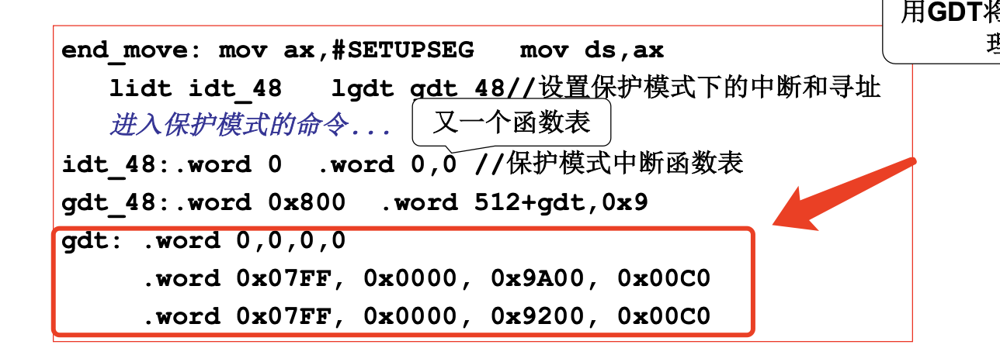
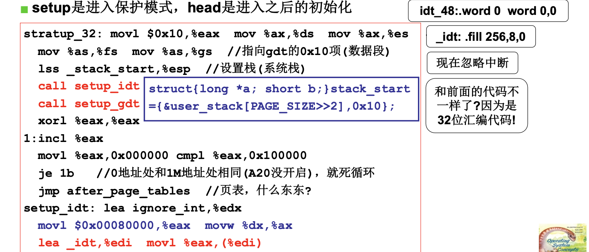
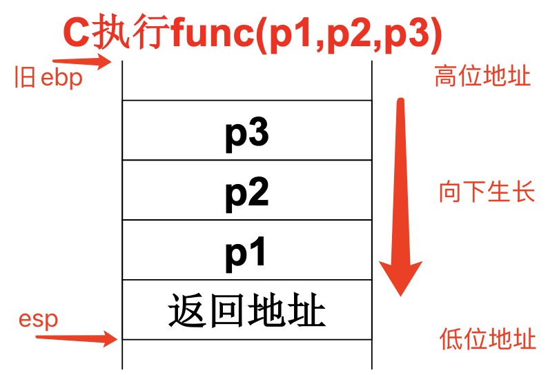
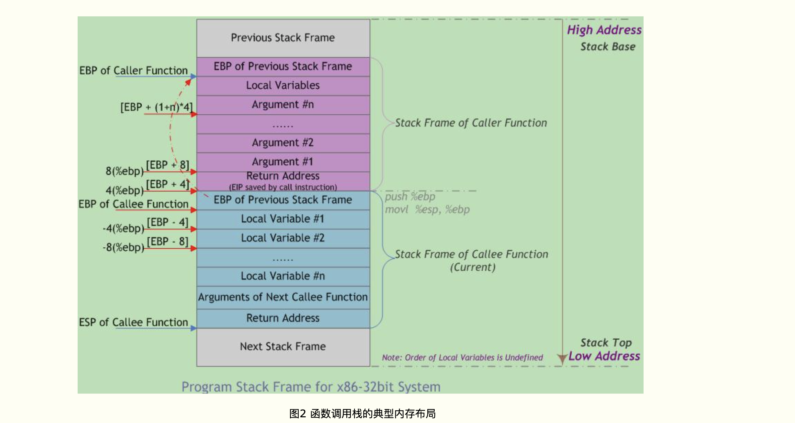

# 📘 1.3 操作系统启动 (OS Boot Process)

> 来源说明：哈工大李治军《操作系统》B站课程 L3 | 本节涵盖：从BIOS到main()的完整启动流程，setup/head模块、保护模式切换、页表初始化

---

## 🧠 核心概念总览（严格按原文顺序）

> 🔗 **返回知识库主页**：[操作系统笔记主页](./README.md)

- [*知识点1: setup模块与硬件参数获取*](#id1)
- [*知识点2: system模块移至0地址与内存布局*](#id2)
- [*知识点3: 进入保护模式——A20地址线与cr0寄存器*](#id5)
- [*知识点4: 保护模式下的地址翻译与中断处理*](#id4)
- [*知识点5: GDT与IDT的设置*](#id3)
- [*知识点6: jmpi 0,8 与GDT表项结构解析*](#id6)
- [*知识点7: system模块与head.s的定位*](#id7)
- [*知识点8: head.s——保护模式下的32位初始化*](#id8)
- [*知识点9: 汇编语法差异：as86 vs GNU as*](#id9)
- [*知识点10: after_page_tables与分页设置*](#id10)
- [*知识点11: 进入main函数与栈布局*](#id11)
- [*知识点12: mem_init与内存管理初始化*](#id12)

---

<a id="id1"></a>
## ✅ 知识点1: setup模块与硬件参数获取

**获取硬件参数**

**代码解析**
- `setup模块(setup.s)`负责完成OS启动前的设置工作
- >**主要任务：读取硬件参数并存放到指定内存位置，为后续启动做准备**
    - 通过BIOS中断`int 0x10`获取**光标位置(Cursor Position)**，存入`0x90000`处
    - 通过BIOS中断`int 0x15`获取**扩展内存大小(Extended Memory Size)**，通过`move [2] ax`存入`0x90002`处
    - 其他硬件参数（显卡参数、根设备号等）也按固定格式存放
- **关键内存地址布局**
    > 💡 **参数保存位置**：这些参数后续会被OS读取使用，如内存管理需要知道扩展内存大小

    | 内存地址 | 长度 | 名称 |
    |---------|------|------|
    | 0x90000 | 2 | 光标位置 |
    | 0x90002 | 2 | 扩展内存数 |
    | 0x9000C | 2 | 显卡参数 |
    | 0x901FC | 2 | 根设备号 |


> ⚠️ **实模式依赖**：setup阶段仍使用BIOS中断（`int`指令），因为此时还在**实模式**下运行
> 📋 **术语对照**：`setup.s` → setup模块，是进入保护模式前的最后一个准备阶段

---

<a id="id2"></a>
## ✅ 知识点2: system模块移至0地址与内存布局

**system模块移动**

- > **主要任务：循环分块把存放在0x9000段的system内核整块逐字搬运到内存0起始地址，搬完结束移动流程。**
    - `SYSSEG = 0x1000`，即system模块当前位于内存`0x10000`处
    - setup需要将<b>system模块(System Module)</b>整体移动到<b>0地址(0x0000)</b>处
    - 移动完成后，0地址处将存放system模块的内容
    - 0 地址开头原本存着 BIOS 中断向量表、BIOS 数据区，这里直接覆盖清空；
        - > ⚠️ BIOS 开机提前把中断表填在 0 号 RAM，bootsect 不用管，内核启动直接覆盖换掉它。


- **内存布局示意**
    ```
    0x00000000  ← 中断向量表（原）
    0x00010000  ← system模块原位置（SYSSEG=0x1000）
    0x00090000  ← setup.s存放硬件参数区域
    0x000F0000  ← ROM BIOS映射区
    0x00100000  ← 1MB边界（扩展内存开始）
    0xFFFFFFFF  ← 最高地址
    ```

---

<a id="id5"></a>
## ✅ 知识点3: 进入保护模式——A20地址线与cr0寄存器

**`setup`模块即将结束它的使命了，但是为了保证在使命交接途中操作系统不能断，需要跳转跳转保护模式**


> **主要任务：打开 A20 地址线解锁 1MB 以上扩展内存、初始化中断控制器，设置 CR0 开启 CPU 保护模式，最后跳转到保护模式下的内核代码执行**
- 进入保护模式需要三个关键步骤：
  1. **开启A20地址线(A20 Address Line)**：解决8086兼容性问题，允许访问1MB以上内存
        - >⚠️ **A20历史遗留**：8086只有20位地址线（1MB），80286以上有24/32位，但兼容模式下A20被关闭，需要显式开启才能访问1MB以上内存
  2. **初始化8259中断控制器**：重新配置中断向量
  3. **设置cr0寄存器**：切换CPU到**保护模式**
- **8042键盘控制器**：其输出端口P2用来控制A20地址线
- **cr0寄存器**：控制CPU运行模式的关键控制寄存器
    - >📋 **术语对照**：`A20` → 第20根地址线，`cr0` → Control Register 0（控制寄存器0），`PE` → Protection Enable

- **jmpi 0,8**：`cs=8`是GDT选择子（指向第1个代码段描述符），`ip=0`跳转到该段基址（即0地址）
    - >🔄 **知识关联**：`jmpi 0,8`之后，CPU正式在保护模式下运行，开始执行system模块的head.s


---


<a id="id4"></a>
## ✅ 知识点4: 保护模式下的地址翻译与中断处理

**地址翻译方式完全不同**

- 两中模式下，`cs:ip`的解释方式与实模式完全不同
    - **实模式**：`物理地址 = cs × 16 + ip`（直接移位相加）
        - > 实模式寻址方式最多只能达到20位地址也就是1M空间，太小了！
    - **保护模式**：**根据cs查GDT表 + ip**，段基址和限长由描述符决定
- **保护模式中断处理**：通过`int n`的n作为索引查IDT表，找到中断处理函数入口
- >⚠️ **本质差异**：保护模式下段寄存器`cs`不再是地址的一部分，而是**选择子(Selector)**，用于查表

- **机制对比**
    | 模式 | 地址翻译 | 中断处理 |
    |-----|---------|---------|
    | 实模式(Real Mode) | `cs << 4 + ip` | `int n` → 直接跳转到`n×4`地址 |
    | 保护模式(Protected Mode) | `cs`查GDT + `ip` | `int n` → 查IDT表第n项 |
---

<a id="id3"></a>
## ✅ 知识点5: GDT与IDT的设置

**理论**
- `setup`模块在移动system模块后，需要设置<b>保护模式(Protected Mode)</b>下的核心数据结构
- **GDT(Global Descriptor Table)**：全局描述符表，用于**保护模式**下的段式地址转换
- **IDT(Interrupt Descriptor Table)**：中断描述符表，用于**保护模式**下的中断处理
- `lidt idt_48`：加载IDT寄存器
- `lgdt gdt_48`：加载GDT寄存器

**GDT表初始化**


> **主要任务：加载临时空中断描述符表 IDT 与全局段描述符表 GDT，为切换 CPU 到保护模式搭建段寻址与中断底层框架。**
- `lidt idt_48`：
lidt = Load idt，把 `idt_48` 的地址边界载入 CPU 中断寄存器；这里 `idt_48` 全填 0，是临时空白中断表，切换保护模式初期先屏蔽异常中断，内核后续会替换成完整可用 IDT。
- `lgdt gdt_48`：
lgdt = Load gdt，加载全局段表 GDT，保护模式彻底抛弃实模式段 * 16 寻址，所有内存访问必须靠 GDT 里的段描述符；
- `gdt:`: gdt表的初始化


> ⚠️ **IDT初始为空**：此时IDT限长设为0，表示保护模式下中断尚未启用，后续由head.s重新设置


---


<a id="id6"></a>
## ✅ 知识点6: jmpi 0,8 与GDT表项结构解析

**进入到保护模式后在执行`jmpi 0,8`时工作逻辑就不一样了**
- **`jmpi 0,8`中`cs=8`的含义**：`jmpi 偏移地址, 段选择子`
    - 第二个参数8：GDT 里代码段描述符的索引，每个描述符占 8 字节
        - 0 号是空占位段，8 字节就是第 1 个有效段（代码段）
    - 第一个参数0：代码段内偏移 0，也就是内存 0 地址（我们之前把 system 内核搬到 0 地址）

- **整体动作**：
    1. CS = 8（选中 GDT 里的代码段）
    2. IP = 0，跳去内存 0 地址执行已经搬运好的 system 内核主程序
    
**主要任务：刷新 CPU 状态、切换段寻址规则，正式跳进保护模式下 0 地址的 Linux 内核入口，`setup`工作正式完成**

> 🔄 **知识关联**：jmpi 0,8后跳转到内存0x0000处，执行system模块的第一部分代码——head.s
> 📖 **总结`setup`的工作内容**:1. 读取硬件参数 2.将system模块挪到0x0000 3. 启动保护模式 4. 使用jmpi跳到system模块开始处


---

<a id="id7"></a>
## ✅ 知识点7: system模块与head.s的定位

**跳到system模块执行...**
- **system模块**由多个文件编译链接而成，是操作系统的核心
- `head.s`是system模块链接后的**第一部分代码(First Code)**，会被放在system模块的最前面
- 因此当`jmpi 0,8`跳转到0地址时，实际执行的是`head.s`

**Makefile链接顺序是树状结构**
```makefile
tools/system: boot/head.o init/main.o $(DRIVERS) …
	$(LD) boot/head.o init/main.o $(DRIVERS) … -o tools/system

Image: boot/bootsect boot/setup tools/system tools/build
	tools/build boot/bootsect boot/setup tools/system > Image

disk: Image
	dd bs=8192 if=Image of=/dev/PS0
```
**代码解析**
- <b>操作系统镜像（`Image:`）</b>是把引导扇区、`setup`、内核 `system` 等全部启动所需二进制数据，打包成一个完整、可直接写入磁盘 `/ U` 盘的整块文件，等同于复刻一整块启动盘的数据。
    - 可通过工具写到磁盘任何位置，一般是写到0磁0扇区
- `Image: boot/bootsect ...`:表示Image依赖于后面这几个如`boot/bootsect`等依次用 build 工具严格按磁盘扇区顺序拼接为二进制文件`Image`
- `$(LD)`：表示将模块用链接器 ld 打包成二进制内核`system`
    - `head.o`在链接顺序中排第一，所以其代码被放在system模块的0偏移处
- `/dev/PS0`是软驱A，Image被写入软盘启动

> ⚠️ **head.s命名由来**：因为它位于system模块的"头部(head)"，是保护模式后执行的第一段代码
> 🔄 **知识关联**：setup负责进入保护模式，head负责保护模式下的初始化


---

<a id="id8"></a>
## ✅ 知识点8: head.s——保护模式下的32位初始化

**一段在保护模式下运行的代码**

**主要任务：这是 32 位保护模式入口 head.s，初始化段寄存器、系统栈、重建 IDT/GDT，校验 A20 地址线状态，随后准备开启分页。**
- `head.s`是**在保护模式下运行的32位代码(32-bit Protected Mode Code)**
- 与setup.s的16位实模式代码不同，head.s使用**GNU as汇编（AT&T语法）**
- 核心初始化任务：
  1. 设置数据段寄存器指向GDT数据段（`0x10`）
  2. 设置系统栈（`lss _stack_start,%esp`）
  3. 设置新的IDT（`setup_idt`）和GDT（`setup_gdt`）重新设置更完整的描述符表，为后续分页做准备
        - >⚠️之前为什么要设置gdt表？因为之前需要在`jmpi 0,8`使用gdt
  4. 检查A20地址线是否成功开启


> ⚠️ **32位汇编差异**：
    - head.s使用GNU as的AT&T语法：`操作符 源操作数 目标操作数`
    - 与setup.s的as86 Intel语法相反： `操作符 目标操作数 源操作数`


---

<a id="id9"></a>
## ✅ 知识点9: 汇编语法差异：as86 vs GNU as

Linux 0.11启动代码使用了**两种不同的汇编器(Assemblers)**：

| 汇编器 | 用途 | 代码位宽 | 语法风格 |
|-------|------|---------|---------|
| **as86** | bootsect.s, setup.s | 16位 | Intel语法 |
| **GNU as** | head.s, 内核代码 | 32位 | AT&T语法 |

**Intel语法（as86）vs AT&T语法（GNU as）**
```assembly
; Intel语法（setup.s）
mov  ax, cs        ; cs → ax，目标操作数在前

; AT&T语法（head.s）
movl  %eax, %ebx   ; eax → ebx，源操作数在前
movl  var, %eax    ; (var) → eax，内存访问不加括号
movb  -4(%ebp), %al ; 基址+偏移寻址
```

**另一种汇编：C语言内嵌汇编（Inline Assembly）**
```c
__asm__("汇编语句" : 输出 : 输入 : 破坏部分描述);

__asm__("movb %%fs:%2, %%al" 
        :"=a"(_res)          ; 输出：结果存入_res
        :"0"(seg),"m"(*(addr)) ; 输入：seg用%0，addr用内存%2
        );
```
- `%0`表示第一个输出/输入操作数
- `a`表示使用`eax`寄存器
- `m`表示使用内存操作数
- `%%`在GCC内嵌汇编中表示寄存器引用

> 💡 **为什么要用两种**：boot阶段需要16位实模式代码（as86），内核需要32位保护模式代码（GNU as）
> 🔄 **知识关联**：GCC内嵌汇编允许在C代码中直接嵌入汇编，用于实现底层硬件精确操控（如端口I/O）


---

<a id="id10"></a>
## ✅ 知识点10: `after_page_tables`与分页设置

**`head.s`跳出来执行`main.c`，这是如何实现的？**

- **了解前，先要知道C如何通过栈来实现函数调用**

    - **先压参数，从右向左压入**：`p3、p2、p1`每 `push` 一个，地址变低一层，参数全部存在一片高地址区域。
    - **执行 call 指令**：CPU 自动 `push` 返回地址，这一步又会把返回地址写到比 `p1` 更低的地址，紧贴 `p1` 下方。
    - **ret弹出**：直接弹出紧贴旧 `ebp` 上方的返回地址，跳回调用代码
        >1. `ebp`：固定栈帧底座，全程不动，用来偏移读取参数与旧栈底。进入被调函数时，被调函数将主调函数的帧基指针EBP入栈，并将主调函数的栈顶指针ESP值赋给被调函数的EBP(作为被调函数的栈底)
        >2. `esp`：栈实时顶端指针，push/pop/局部变量分配时上下移动。
    - **向下生长**：都往低位地址压入
    


- **回到代码 - 跳至`main`函数也是同理**
    ```assembly
    after_page_tables:
        pushl  $0         ; 参数3（envp）
        pushl  $0         ; 参数2（argv）
        pushl  $0         ; 参数1（argc）
        pushl  $L6        ; 返回地址（main返回后进入死循环）
        pushl  $_main     ; 真正的跳转目标：main函数
        jmp    setup_paging

    L6:  jmp  L6          ; 死循环：main不应该返回

    setup_paging:
        ; 设置页表的代码...
        ret               ; 返回地址是栈顶值 = _main
    ```

**主要任务：先压栈占位参数、压入返回标记 `L6` 与 `C` 入口`_main`，跳转去初始化分页页表，页表配置完成 `ret` 后就进入 `C` 语言 `main` 函数，异常则卡死在 L6 死循环**
- `pushl $0`x3: 连续压入三个 0，充当预留 / 占位的函数参数栈空间。
- `pushl $L6`: 压入标记地址 `L6`，作为 `set_paging` 执行完毕后的返回跳转地址。
- `pushl $_main`: 压入 C 内核入口函数`_main` 的地址，是分页初始化完成后最终要执行的目标。
- `setup_paging`函数负责设置**页表(Page Tables)**，启用分页机制
    - `ret`：弹出栈上的`setup_paging` 地址直接跳转运行 C 主函数。
    - 分页设置完成后，通过巧妙的栈操作跳转到`main()`函数执行
- `main()` 是一个用不停机的程序，一旦停止便会死机在`L6`种死循环


> ⚠️ **巧妙的栈操作**：`setup_paging`的`ret`指令跳转到`_main`，而不是`after_page_tables`后面的代码
> 💡 **控制流分析**：`main()`的C函数签名是`void main(void)`，但栈上被压入了3个0参数和L6返回地址——这是为了兼容C调用约定，实际上main在这里不使用参数
> 🔄 **知识关联**：main函数的三个参数`envp, argv, argc`是C语言标准约定，但此处的main只是保留形式，并不会使用


---

<a id="id11"></a>
## ✅ 知识点11: 进入main函数与栈布局

**接入`main()`函数准备大干一番**
```c
void main(void)
{
    mem_init();        // 内存管理初始化
    trap_init();       // 中断/陷阱初始化
    blk_dev_init();    // 块设备初始化
    chr_dev_init();    // 字符设备初始化
    tty_init();        // 终端初始化
    time_init();       // 时钟初始化
    sched_init();      // 调度器初始化
    buffer_init();     // 缓冲区初始化
    hd_init();         // 硬盘初始化
    floppy_init();     // 软盘初始化
    sti();             // 开中断
    move_to_user_mode(); // 切换到用户态
    if(!fork()){ init(); } // 创建第一个用户进程
}
```

**主要任务**
- 内存、中断、设备、时钟、CPU等内容的**初始化(Initialization)**
- 初始化完成后，操作系统进入**多任务运行状态**

**C语言程序起步于这个`main()`**
- `main()`函数在`init/main.c`中定义，是C语言程序的入口
- 虽然定义为`void main(void)`，但由于栈上被压入了参数，**形式上保留了传统main的参数结构**

> 💡 **初始化顺序**：内存→中断→设备→时钟→调度→缓冲区→磁盘→开中断→用户态→第一个进程
> 🔄 **知识关联**：这是操作系统的"出生时刻"——之前是汇编代码的硬件初始化，main开始才是C语言的高级管理


---

<a id="id12"></a>
## ✅ 知识点12: `mem_init`与内存管理初始化

**我们挑一个典型来阅读**
```c
void mem_init(long start_mem, long end_mem)
{
    int i;
    // 步骤1：所有页标记为已使用
    for(i=0; i<PAGING_PAGES; i++)
        mem_map[i] = USED;
    
    // 步骤2：计算可用内存起始页号
    i = MAP_NR(start_mem);
    
    // 步骤3：计算可用页数（每页4KB = 2^12）
    end_mem -= start_mem;   // 可用内存大小
    end_mem >>= 12;         // 除以4096 = 页数，也就是4k
    
    // 步骤4：将可用页标记为空闲（0）
    while(end_mem-- > 0)
        mem_map[i++] = 0;
}
```
**主要任务：`mem_init()`在`linux/mm/memory.c`中定义，负责初始化内存管理数据结构**
- 核心数据结构：`mem_map[]`数组——记录每个物理页的使用情况
- 初始化逻辑：
  1. 先将所有页标记为**已使用(USED)**（防止未管理的页被分配）
        > ⚠️ 由于操作系统本身已经有使用，所以标为`USED`
        > ⚠️ **先全部标记USED再释放**：这是安全做法——确保只有明确被管理的内存才能被分配
  2. 计算可用内存范围（从`start_mem`到`end_mem`）
        > 💡 **参数来源**：`start_mem`和`end_mem`来自setup.s阶段读取的硬件参数（扩展内存大小）
  3. 将可用内存范围内的页标记为**空闲(0)**
  

**到现在为止，系统已经基本初始化完成!!!**  
- **读**：`bootsec.s` 与 `setup.s` 在实模式下完成引导扇区加载、硬件参数获取，并切换至保护模式
- **初始化**：`head.s` 与 `main.c` 建立保护模式内核环境、初始化各子系统，最终进入用户态创建第一个进程。


> 🔄 **知识关联**：操作系统管理硬件的核心模式——**数据结构 + 算法**，`mem_map`是数据结构，初始化/分配/回收是算法


---

## 🔑 核心要点总结

1. **启动三阶段**：bootsect（引导）→ setup（实模式初始化+进保护模式）→ head（保护模式初始化+进main）→ main（C语言初始化）
2. **保护模式切换关键**：setup负责设置GDT/IDT、开启A20、置cr0.PE=1，最后`jmpi 0,8`跳转到head.s
3. **地址翻译变革**：实模式直接`cs×16+ip`，保护模式通过GDT查表转换——这是操作系统接管硬件寻址的核心机制
4. **巧妙的控制流**：`setup_paging`后的`ret`通过栈操作直接跳到`main()`，而不是返回到调用处
5. **内存管理起点**：`mem_init`用`mem_map[]`数组标记每个物理页的状态，是OS管理内存的数据结构基础

## 📌 考试速记版

- **关键机制**：BIOS → bootsect → setup（实模式）→ head（32位保护模式）→ main（C语言初始化）
- **保护模式入口**：`mov cr0, ax`（PE=1）+ `jmpi 0,8`（GDT第1项）
- **A20地址线**：通过8042键盘控制器开启，解决1MB地址回绕问题
- **GDT结构**：8字节描述符 = 基址（32位）+ 限长（20位）+ 属性（12位）
- **main的栈**：`0 0 0 L6 _main` → main参数为0,0,0，返回进入死循环
- **mem_map初始化**：全部标记USED → 计算可用范围 → 可用页标记为0（空闲）

**记忆口诀**：
> "BIOS引路bootsect扛，setupSetup进保护场，head带头32位闯，main出场万物昌——mem_map管内存，_init轮番上，fork出个init来，操作系统始开张！"
