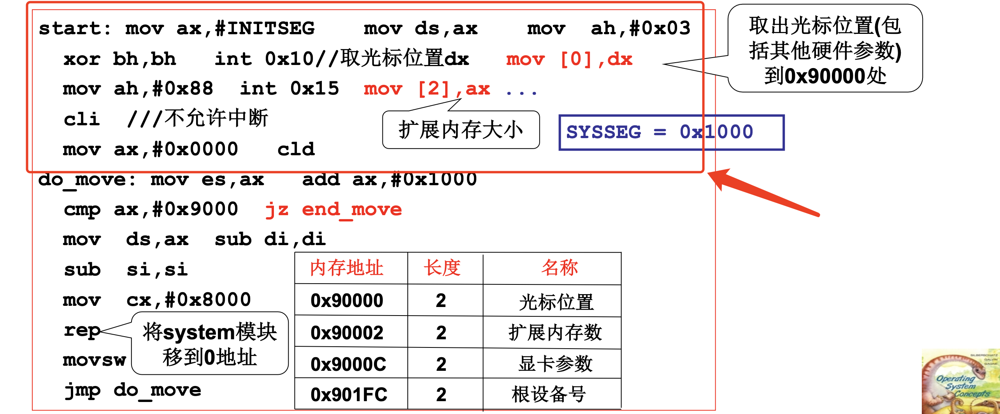
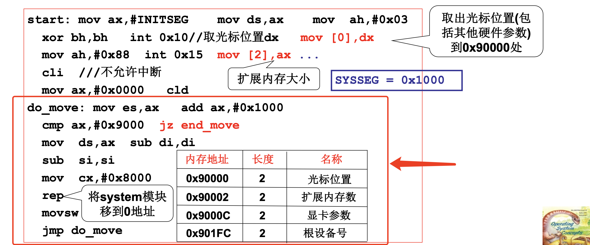
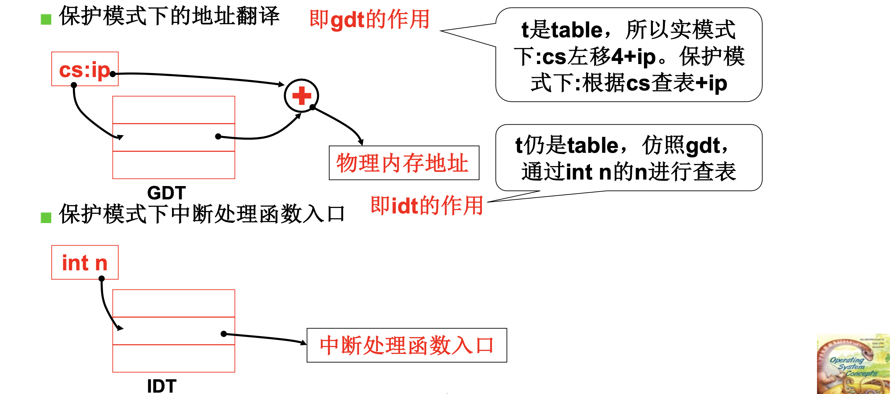
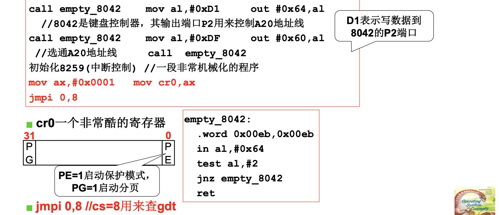

# 📘 L3 操作系统启动 (OS Boot Process)

> 来源说明：哈工大李治军《操作系统》B站课程 L3 | 本节涵盖：从BIOS到main()的完整启动流程，setup/head模块、保护模式切换、页表初始化

---

## 🧠 核心概念总览（严格按原文顺序）

- [*知识点1: setup模块与硬件参数获取*](#id1)
- [*知识点2: system模块移至0地址与内存布局*](#id2)
- [*知识点3: GDT与IDT的设置*](#id3)
- [*知识点4: 保护模式下的地址翻译与中断处理*](#id4)
- [*知识点5: 进入保护模式——A20地址线与cr0寄存器*](#id5)
- [*知识点6: jmpi 0,8 与GDT表项结构解析*](#id6)
- [*知识点7: system模块与head.s的定位*](#id7)
- [*知识点8: head.s——保护模式下的32位初始化*](#id8)
- [*知识点9: 汇编语法差异：as86 vs GNU as*](#id9)
- [*知识点10: after_page_tables与分页设置*](#id10)
- [*知识点11: 进入main函数与栈布局*](#id11)
- [*知识点12: mem_init与内存管理初始化*](#id12)

---

<a id="id1"></a>
## ✅ 知识点1: setup模块与硬件参数获取

**获取硬件参数**

**代码解析**
- `setup模块(setup.s)`负责完成OS启动前的设置工作
- >**主要任务：读取硬件参数并存放到指定内存位置，为后续启动做准备**
    - 通过BIOS中断`int 0x10`获取**光标位置(Cursor Position)**，存入`0x90000`处
    - 通过BIOS中断`int 0x15`获取**扩展内存大小(Extended Memory Size)**，通过`move [2] ax`存入`0x90002`处
    - 其他硬件参数（显卡参数、根设备号等）也按固定格式存放
- **关键内存地址布局**
    > 💡 **参数保存位置**：这些参数后续会被OS读取使用，如内存管理需要知道扩展内存大小

    | 内存地址 | 长度 | 名称 |
    |---------|------|------|
    | 0x90000 | 2 | 光标位置 |
    | 0x90002 | 2 | 扩展内存数 |
    | 0x9000C | 2 | 显卡参数 |
    | 0x901FC | 2 | 根设备号 |


> ⚠️ **实模式依赖**：setup阶段仍使用BIOS中断（`int`指令），因为此时还在**实模式**下运行
> 📋 **术语对照**：`setup.s` → setup模块，是进入保护模式前的最后一个准备阶段

---

<a id="id2"></a>
## ✅ 知识点2: system模块移至0地址与内存布局

**system模块移动**

- > **主要任务：循环分块把存放在0x9000段的system内核整块逐字搬运到内存0起始地址，搬完结束移动流程。**
    - `SYSSEG = 0x1000`，即system模块当前位于内存`0x10000`处
    - setup需要将<b>system模块(System Module)</b>整体移动到<b>0地址(0x0000)</b>处
    - 移动完成后，0地址处将存放system模块的内容
    - 0 地址开头原本存着 BIOS 中断向量表、BIOS 数据区，这里直接覆盖清空；
        - > ⚠️ BIOS 开机提前把中断表填在 0 号 RAM，bootsect 不用管，内核启动直接覆盖换掉它。


- **内存布局示意**
    ```
    0x00000000  ← 中断向量表（原）
    0x00010000  ← system模块原位置（SYSSEG=0x1000）
    0x00090000  ← setup.s存放硬件参数区域
    0x000F0000  ← ROM BIOS映射区
    0x00100000  ← 1MB边界（扩展内存开始）
    0xFFFFFFFF  ← 最高地址
    ```

---

<a id="id3"></a>
## ✅ 知识点3: GDT与IDT的设置

**理论**
- `setup`模块在移动system模块后，`setup`模块即将结束它的使命了，但是为了保证在使命交接途中操作系统不能断，需要设置<b>保护模式(Protected Mode)</b>下的核心数据结构
- **GDT(Global Descriptor Table)**：全局描述符表，用于保护模式下的段式地址转换
- **IDT(Interrupt Descriptor Table)**：中断描述符表，用于保护模式下的中断处理
- `lidt idt_48`：加载IDT寄存器
- `lgdt gdt_48`：加载GDT寄存器

**代码示例：GDT/IDT设置**
```assembly
end_move:
    mov  ax,#SETUPSEG
    mov  ds,ax
    lidt  idt_48       ; 设置保护模式中断表
    lgdt  gdt_48       ; 设置保护模式寻址表
    ...                ; 进入保护模式的命令

idt_48:
    .word  0           ; IDT限长（0表示暂时不启用）
    .word  0,0         ; IDT基地址

gdt_48:
    .word  0x800       ; GDT限长（2048字节=256项×8字节）
    .word  512+gdt,0x9 ; GDT基地址（0x90000 + 512 + gdt偏移）

gdt:
    .word  0,0,0,0              ; 第0项：空描述符
    .word  0x07FF, 0x0000, 0x9A00, 0x00C0  ; 第1项：代码段
    .word  0x07FF, 0x0000, 0x9200, 0x00C0  ; 第2项：数据段
```

**注意点**
- ⚠️ **IDT初始为空**：此时IDT限长设为0，表示保护模式下中断尚未启用，后续由head.s重新设置
- 💡 **GDT基地址计算**：`512+gdt`是因为setup.s被加载到0x90200处，加上gdt在文件内的偏移
- 🔄 **知识关联**：GDT和IDT是保护模式的两大核心表，分别替代了实模式下的段寄存器直接寻址和中断向量表
- 📋 **术语对照**：`lidt` → Load IDT，`lgdt` → Load GDT，`descriptor` → 描述符

---

<a id="id4"></a>
## ✅ 知识点4: 保护模式下的地址翻译与中断处理

**地址翻译方式完全不同**

- 两中模式下，`cs:ip`的解释方式与实模式完全不同
    - **实模式**：`物理地址 = cs × 16 + ip`（直接移位相加）
        - > 实模式寻址方式最多只能达到20位地址也就是1M空间，太小了！
    - **保护模式**：**根据cs查GDT表 + ip**，段基址和限长由描述符决定
- **保护模式中断处理**：通过`int n`的n作为索引查IDT表，找到中断处理函数入口
- ⚠️ **本质差异**：保护模式下段寄存器`cs`不再是地址的一部分，而是**选择子(Selector)**，用于查表

**机制对比**
| 模式 | 地址翻译 | 中断处理 |
|-----|---------|---------|
| 实模式(Real Mode) | `cs << 4 + ip` | `int n` → 直接跳转到`n×4`地址 |
| 保护模式(Protected Mode) | `cs`查GDT + `ip` | `int n` → 查IDT表第n项 |

- 💡 **理解技巧**：GDT相当于"地址翻译表"，IDT相当于"中断函数指针表"
- 🔄 **知识关联**：这是操作系统从"直接操控硬件"转向"通过数据结构管理硬件"的关键一步
- 📋 **术语对照**：`selector` → 选择子，`descriptor table` → 描述符表

---

<a id="id5"></a>
## ✅ 知识点5: 进入保护模式——A20地址线与cr0寄存器

**跳转保护模式**

- **主要任务：打开 A20 地址线解锁 1MB 以上扩展内存、初始化中断控制器，设置 CR0 开启 CPU 保护模式，最后跳转到保护模式下的内核代码执行**
- 进入保护模式需要三个关键步骤：
  1. **开启A20地址线(A20 Address Line)**：解决8086兼容性问题，允许访问1MB以上内存
    - >⚠️ **A20历史遗留**：8086只有20位地址线（1MB），80286以上有24/32位，但兼容模式下A20被关闭，需要显式开启才能访问1MB以上内存
  2. **初始化8259中断控制器**：重新配置中断向量
  3. **设置cr0寄存器**：切换CPU到**保护模式**
- **8042键盘控制器**：其输出端口P2用来控制A20地址线
- **cr0寄存器**：控制CPU运行模式的关键控制寄存器
    - >📋 **术语对照**：`A20` → 第20根地址线，`cr0` → Control Register 0（控制寄存器0），`PE` → Protection Enable

- **jmpi 0,8**：`cs=8`是GDT选择子（指向第1个代码段描述符），`ip=0`跳转到该段基址（即0地址）
    - >🔄 **知识关联**：`jmpi 0,8`之后，CPU正式在保护模式下运行，开始执行system模块的head.s


---

<a id="id6"></a>
## ✅ 知识点6: jmpi 0,8 与GDT表项结构解析

**理论**
- `jmpi 0,8`中`cs=8`的含义：在GDT中查找第`8/8=1`项（每项8字节，第0项为空）
- GDT中设置了两个表项，段基址都是`0x0000`：
  - 第1项（`cs=8`）：**代码段(Code Segment)**，只读，可执行
  - 第2项（`cs=16/0x10`）：**数据段(Data Segment)**，可读写

**GDT表项结构（8字节/64位）**
```
位0-15:   段限长15..0 (Limit 15..0)
位16-31:  段基址15..0 (Base 15..0)
位32-39:  段基址23..16 (Base 23..16)
位40-47:  属性位：P(存在位) | DPL(特权级) | S(段/系统) | Type(类型)
位48-51:  段限长19..16 (Limit 19..16) + G(粒度) + D/B(默认操作大小) + AVL(可用)
位52-55:  段基址31..24 (Base 31..24)
```

**代码示例：GDT表项解析**
```assembly
gdt:
    .word  0,0,0,0              ; 第0项：空描述符（必须）
    .word  0x07FF, 0x0000, 0x9A00, 0x00C0  ; 第1项（cs=8）
    .word  0x07FF, 0x0000, 0x9200, 0x00C0  ; 第2项（ds=16）
```

**第1项拆解（0x00C09A00000007FF）**
| 字段 | 值 | 含义 |
|-----|-----|------|
| 段限长 | 0x07FF | 限长 = 8MB（粒度=1，即4KB页） |
| 段基址 | 0x0000 | 从0地址开始 |
| 属性 | 0x9A | P=1, DPL=0, S=1, Type=1010（代码段，执行/读） |
| 扩展属性 | 0xC0 | G=1（4KB粒度）, D=1（32位） |

**注意点**
- ⚠️ **两个表项基址相同**：代码段和数据段都从0地址开始，**权限不同**——代码段只读执行，数据段可读写
- 💡 **为什么基址都是0**：Linux 0.11采用**平坦模型(Flat Model)**，逻辑地址经段转换后仍是线性地址，主要靠分页管理内存
- 🔄 **知识关联**：jmpi 0,8后跳转到内存0x0000处，执行system模块的第一部分代码——head.s
- 📋 **术语对照**：`DPL` → Descriptor Privilege Level（描述符特权级），`G` → Granularity（粒度）

---

<a id="id7"></a>
## ✅ 知识点7: system模块与head.s的定位

**理论**
- **system模块**由多个文件编译链接而成，是操作系统的核心
- `head.s`是system模块链接后的**第一部分代码(First Code)**，会被放在system模块的最前面
- 因此当`jmpi 0,8`跳转到0地址时，实际执行的是`head.s`

**Makefile链接顺序**
```makefile
tools/system: boot/head.o init/main.o $(DRIVERS) …
	$(LD) boot/head.o init/main.o $(DRIVERS) … -o tools/system

Image: boot/bootsect boot/setup tools/system tools/build
	tools/build boot/bootsect boot/setup tools/system > Image

disk: Image
	dd bs=8192 if=Image of=/dev/PS0
```

**关键理解**
- `head.o`在链接顺序中排第一，所以其代码被放在system模块的0偏移处
- `bootsect`（引导扇区）→ `setup` → `system` 依次拼接成Image文件
- `/dev/PS0`是软驱A，Image被写入软盘启动

**注意点**
- ⚠️ **head.s命名由来**：因为它位于system模块的"头部(head)"，是保护模式后执行的第一段代码
- 💡 **为什么不用boot命名**：bootsect和setup已经完成了"引导"工作，head是"引导完成后"的初始化代码
- 🔄 **知识关联**：setup负责进入保护模式，head负责保护模式下的初始化
- 📋 **术语对照**：`Image` → 最终可引导的镜像文件，`bootsect` → Boot Sector（引导扇区）

---

<a id="id8"></a>
## ✅ 知识点8: head.s——保护模式下的32位初始化

**理论**
- `head.s`是**在保护模式下运行的32位代码(32-bit Protected Mode Code)**
- 与setup.s的16位实模式代码不同，head.s使用**GNU as汇编（AT&T语法）**
- 核心初始化任务：
  1. 设置数据段寄存器指向GDT数据段（`0x10`）
  2. 设置系统栈（`lss _stack_start,%esp`）
  3. 设置新的IDT（`setup_idt`）和GDT（`setup_gdt`）
  4. 检查A20地址线是否成功开启

**代码示例：head.s初始化**
```assembly
startup_32:
    movl  $0x10,%eax      ; 0x10 = GDT第2项（数据段）
    mov   %ax,%ds
    mov   %ax,%es
    mov   %ax,%fs
    mov   %ax,%gs         ; 所有数据段指向GDT数据段
    lss   _stack_start,%esp ; 设置系统栈
    call  setup_idt       ; 设置IDT
    call  setup_gdt       ; 重新设置GDT

    ; 检查A20是否开启
    xorl  %eax,%eax
1:  incl  %eax
    movl  %eax,0x000000
    cmpl  %eax,0x100000   ; 比较0地址和1MB地址的内容
    je    1b              ; 如果相同，说明A20没开启，死循环
    jmp   after_page_tables

setup_idt:
    lea   ignore_int,%edx
    movl  $0x00080000,%eax
    movw  %dx,%ax
    lea   _idt,%edi
    movl  %eax,(%edi)     ; 暂时将所有中断指向ignore_int

_idt:    .fill 256,8,0     ; 256个中断门，每项8字节
```

**C语言栈结构**
```c
struct { long *a; short b; } stack_start = {
    &user_stack[PAGE_SIZE>>2], 0x10
};
```

**注意点**
- ⚠️ **32位汇编差异**：head.s使用GNU as的AT&T语法，与setup.s的as86 Intel语法不同（操作数顺序相反）
- 💡 **A20检测逻辑**：向0地址写入递增值，若1MB处值相同，说明A20未开启（回绕现象），进入死循环
- 🔄 **知识关联**：`setup_idt`和`setup_gdt`重新设置更完整的描述符表，为后续分页做准备
- 📋 **术语对照**：`lss` → Load Stack Segment（加载栈段），`AT&T语法` → AT&T Syntax（操作数源在前，目标在后）

---

<a id="id9"></a>
## ✅ 知识点9: 汇编语法差异：as86 vs GNU as

**理论**
- Linux 0.11启动代码使用了**两种不同的汇编器(Assemblers)**：

| 汇编器 | 用途 | 代码位宽 | 语法风格 |
|-------|------|---------|---------|
| **as86** | bootsect.s, setup.s | 16位 | Intel语法 |
| **GNU as** | head.s, 内核代码 | 32位 | AT&T语法 |

**Intel语法（as86）vs AT&T语法（GNU as）**
```assembly
; Intel语法（setup.s）
mov  ax, cs        ; cs → ax，目标操作数在前

; AT&T语法（head.s）
movl  %eax, %ebx   ; eax → ebx，源操作数在前
movl  var, %eax    ; (var) → eax，内存访问不加括号
movb  -4(%ebp), %al ; 基址+偏移寻址
```

**C语言内嵌汇编（Inline Assembly）**
```c
__asm__("汇编语句" : 输出 : 输入 : 破坏部分描述);

__asm__("movb %%fs:%2, %%al" 
        :"=a"(_res)          ; 输出：结果存入_res
        :"0"(seg),"m"(*(addr)) ; 输入：seg用%0，addr用内存%2
        );
```
- `%0`表示第一个输出/输入操作数
- `a`表示使用`eax`寄存器
- `m`表示使用内存操作数
- `%%`在GCC内嵌汇编中表示寄存器引用

**注意点**
- ⚠️ **语法差异关键**：AT&T语法中**操作数顺序相反**（源在前，目标在后），寄存器名前加`%`，立即数前加`$`
- 💡 **为什么要用两种**：boot阶段需要16位实模式代码（as86），内核需要32位保护模式代码（GNU as）
- 🔄 **知识关联**：GCC内嵌汇编允许在C代码中直接嵌入汇编，用于实现底层硬件操作（如端口I/O）
- 📋 **术语对照**：`inline assembly` → 内嵌汇编，`AT&T syntax` → AT&T语法，`Intel syntax` → Intel语法

---

<a id="id10"></a>
## ✅ 知识点10: after_page_tables与分页设置

**理论**
- `after_page_tables`是head.s中设置完页表后的代码位置
- `setup_paging`函数负责设置**页表(Page Tables)**，启用分页机制
- 分页设置完成后，通过巧妙的栈操作跳转到`main()`函数执行

**代码示例：栈操作跳转main**
```assembly
after_page_tables:
    pushl  $0         ; 参数3（envp）
    pushl  $0         ; 参数2（argv）
    pushl  $0         ; 参数1（argc）
    pushl  $L6        ; 返回地址（main返回后进入死循环）
    pushl  $_main     ; 真正的跳转目标：main函数
    jmp    setup_paging

L6:  jmp  L6          ; 死循环：main不应该返回

setup_paging:
    ; 设置页表的代码...
    ret               ; 返回地址是栈顶值 = _main
```

**栈布局解析**
```
栈顶（低地址）
    [p3 = 0]
    [p2 = 0]
    [p1 = 0]
    [返回地址 = L6]    ← main返回时跳到L6（死循环）
    [返回地址 = _main]  ← setup_paging的ret会跳到main!
栈底（高地址）
```

**注意点**
- ⚠️ **巧妙的栈操作**：`setup_paging`的`ret`指令跳转到`_main`，而不是`after_page_tables`后面的代码
- 💡 **控制流分析**：`main()`的C函数签名是`void main(void)`，但栈上被压入了3个0参数和L6返回地址——这是为了兼容C调用约定，实际上main在这里不使用参数
- 🔄 **知识关联**：main函数的三个参数`envp, argv, argc`是C语言标准约定，但此处的main只是保留形式
- 📋 **术语对照**：`page table` → 页表，`paging` → 分页机制，`stack frame` → 栈帧

---

<a id="id11"></a>
## ✅ 知识点11: 进入main函数与栈布局

**理论**
- `main()`函数在`init/main.c`中定义，是C语言程序的入口
- 虽然定义为`void main(void)`，但由于栈上被压入了参数，**形式上保留了传统main的参数结构**
- `main()`的核心工作就是调用各种`_init()`初始化函数

**代码示例：main函数**
```c
void main(void)
{
    mem_init();        // 内存管理初始化
    trap_init();       // 中断/陷阱初始化
    blk_dev_init();    // 块设备初始化
    chr_dev_init();    // 字符设备初始化
    tty_init();        // 终端初始化
    time_init();       // 时钟初始化
    sched_init();      // 调度器初始化
    buffer_init();     // 缓冲区初始化
    hd_init();         // 硬盘初始化
    floppy_init();     // 软盘初始化
    sti();             // 开中断
    move_to_user_mode(); // 切换到用户态
    if(!fork()){ init(); } // 创建第一个用户进程
}
```

**main的工作本质**
- 内存、中断、设备、时钟、CPU等内容的**初始化(Initialization)**
- 每个`_init()`函数初始化一个子系统
- 初始化完成后，操作系统进入**多任务运行状态**

**注意点**
- ⚠️ **main不返回**：main函数返回会进入`L6`死循环，正常操作系统不会"返回"到BIOS
- 💡 **初始化顺序**：内存→中断→设备→时钟→调度→缓冲区→磁盘→开中断→用户态→第一个进程
- 🔄 **知识关联**：这是操作系统的"出生时刻"——之前是汇编代码的硬件初始化，main开始才是C语言的高级管理
- 📋 **术语对照**：`fork()` → 创建进程，`init()` → 第一个用户进程（初始化进程），`sti()` → Set Interrupt（开中断）

---

<a id="id12"></a>
## ✅ 知识点12: mem_init与内存管理初始化

**理论**
- `mem_init()`在`linux/mm/memory.c`中定义，负责初始化内存管理数据结构
- 核心数据结构：`mem_map[]`数组——记录每个物理页的使用情况
- 初始化逻辑：
  1. 先将所有页标记为**已使用(USED)**（防止未管理的页被分配）
  2. 计算可用内存范围（从`start_mem`到`end_mem`）
  3. 将可用内存范围内的页标记为**空闲(0)**

**代码示例：mem_init**
```c
void mem_init(long start_mem, long end_mem)
{
    int i;
    // 步骤1：所有页标记为已使用
    for(i=0; i<PAGING_PAGES; i++)
        mem_map[i] = USED;
    
    // 步骤2：计算可用内存起始页号
    i = MAP_NR(start_mem);
    
    // 步骤3：计算可用页数（每页4KB = 2^12）
    end_mem -= start_mem;   // 可用内存大小
    end_mem >>= 12;         // 除以4096 = 页数
    
    // 步骤4：将可用页标记为空闲（0）
    while(end_mem-- > 0)
        mem_map[i++] = 0;
}
```

**注意点**
- ⚠️ **先全部标记USED再释放**：这是安全做法——确保只有明确被管理的内存才能被分配
- 💡 **参数来源**：`start_mem`和`end_mem`来自setup.s阶段读取的硬件参数（扩展内存大小）
- 🔄 **知识关联**：操作系统管理硬件的核心模式——**数据结构 + 算法**，`mem_map`是数据结构，初始化/分配/回收是算法
- 📋 **术语对照**：`mem_map` → Memory Map（内存映射表），`PAGING_PAGES` → 总页数，`MAP_NR` → 地址到页号的映射宏

---

## 🔑 核心要点总结

1. **启动三阶段**：bootsect（引导）→ setup（实模式初始化+进保护模式）→ head（保护模式初始化+进main）→ main（C语言初始化）
2. **保护模式切换关键**：setup负责设置GDT/IDT、开启A20、置cr0.PE=1，最后`jmpi 0,8`跳转到head.s
3. **地址翻译变革**：实模式直接`cs×16+ip`，保护模式通过GDT查表转换——这是操作系统接管硬件寻址的核心机制
4. **巧妙的控制流**：`setup_paging`后的`ret`通过栈操作直接跳到`main()`，而不是返回到调用处
5. **内存管理起点**：`mem_init`用`mem_map[]`数组标记每个物理页的状态，是OS管理内存的数据结构基础

## 📌 考试速记版

- **关键机制**：BIOS → bootsect → setup（实模式）→ head（32位保护模式）→ main（C语言初始化）
- **保护模式入口**：`mov cr0, ax`（PE=1）+ `jmpi 0,8`（GDT第1项）
- **A20地址线**：通过8042键盘控制器开启，解决1MB地址回绕问题
- **GDT结构**：8字节描述符 = 基址（32位）+ 限长（20位）+ 属性（12位）
- **main的栈**：`0 0 0 L6 _main` → main参数为0,0,0，返回进入死循环
- **mem_map初始化**：全部标记USED → 计算可用范围 → 可用页标记为0（空闲）

**记忆口诀**：
> "BIOS引路bootsect扛，setupSetup进保护场，head带头32位闯，main出场万物昌——mem_map管内存，_init轮番上，fork出个init来，操作系统始开张！"
