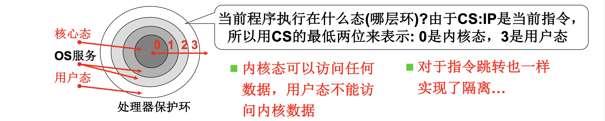
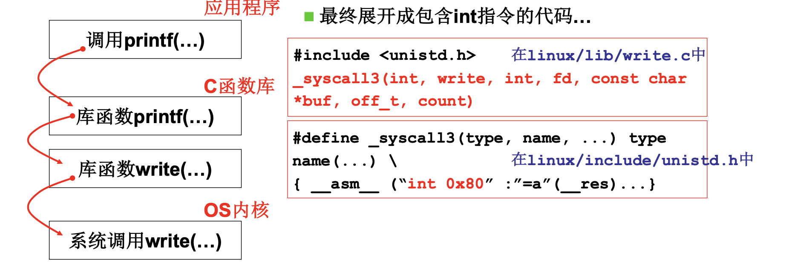
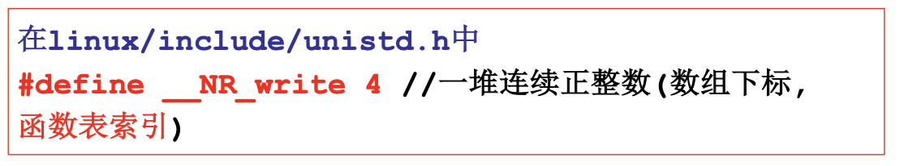

# 📘 L5 系统调用的实现 (System Call Implementation)

> 来源说明：哈工大李治军操作系统课程 L5 | 本节涵盖：系统调用从直观实现到安全实现的完整机制，包括内核态/用户态隔离、int 0x80 中断、系统调用表

---

## 🧠 核心概念总览（严格按原文顺序）

- [*知识点1: 系统调用的直观实现与安全隐患*](#id1)
- [*知识点2: 内核态与用户态隔离机制*](#id2)
- [*知识点3: `CPL`/`RPL`/`DPL` 特权级检查*](#id3)
- [*知识点4: int 指令——主动进入内核的唯一方式*](#id4)
- [*知识点5: 库函数封装与 `_syscall3` 宏*](#id6)
- [*知识点6: `int 0x80` 中断门设置*](#id7)
- [*知识点7: 中断处理程序 system_call*](#id8)
- [*知识点8: sys_call_table 与系统调用分发*](#id9)
- [*知识点9: 安全实现与不安全实现对比*](#id10)

---

<a id="id1"></a>
## ✅ 知识点1: 系统调用的直观实现与安全隐患

**从一个直观例子开始探索接口的实现**
- **直观想法**：反正操作系统和应用程序都在内存中，为什么不通过实现一个 `whoami()` 系统调用，字符串 `"lizhijun"` 放在操作系统内存中（系统引导时载入），用户程序直接访问并并打印不行吗？
- 用户程序代码（不安全实现）： 
    ```c
    whoami() {
        printf(100, 8);  // 直接访问内存地址 100
    }

    main() {
        whoami();
    }
    ```
- **安全隐患**：
  - 操作系统和应用程序都在内存中，应用程序可以**随意访问任何数据**
  - 可以看到 root 密码，可以修改它
  - 可以通过显存看到别人内存中 word 里的内容
  - 不能随意调用数据，不能随意 `jmp`

> ⚠️ **关键警告**：直接让用户程序访问操作系统内存是**极其危险的**——内存隔离是操作系统的基本安全底线
> 🔄 **知识关联**：这是引入**内核态/用户态**隔离的根本原因
> 📋 **术语提醒**：`系统调用(System Call)`——用户程序请求操作系统服务的受控接口

---

<a id="id2"></a>
## ✅ 知识点2: 内核态与用户态隔离机制

**凭什么我不能`jmp`? 因为硬件不让！**

- **硬件隔离**：硬件将内存一般分割为多个区域如**内核段**和**用户段**
    - **内核(用户)段**：将内核程序和用户程序所占内存段隔离！！！
    - **内核态(Kernel Mode)** 可以访问内核段用户段等所有数据，**用户态(User Mode)** 不能访问内核段，只能访问用户段
        > 📋 **术语提醒**：内核态`Kernel Mode` / 用户态`User Mode`——处理器执行的两种特权级别
    - 对于指令跳转也一样受限——用户态不能随意跳转到内核段代码
- 区分内核态和用户态：一种处理器**硬件设计**
- **处理器保护环(Protection Rings)**：



> 🔄 **知识关联**：Intel x86 架构提供 4 个特权级（0-3），实际操作系统主要使用 0（内核）和 3（用户）


---

<a id="id3"></a>
## ✅ 知识点3: `CPL`/`RPL`/`DPL` 特权级检查

**硬件如何实现隔离，拒绝非法访问？**
- **`CPL`(Current Privilege Level)**：**当前程序执行在什么态**（哪层环）？
  - 由于 `CS:IP` 是当前指令，所以用 **CS 的最低两位**来表示
  - `0` 是内核态，`3` 是用户态
- **`RPL`(Requestor Privilege Level)**：**请求特权级**，访问的数据段 DS 的最低两位，**是请求者主动出示的"证件等级"**
- **`DPL`(Descriptor Privilege Level)**：**描述符特权级**，目标段/门的特权级，**是段的"门禁等级"**
    - > ⚠️ **关键区分**：CPL 看 CS（当前执行段），RPL 看 DS（请求访问的数据段），DPL 看目标段的描述符
- **特权级检查规则：只有满足了以下规则指令才会被允许**
  - 数字上`DPL ≥ CPL`（目标段的特权级必须不低于当前特权级）
  - 数字上`DPL ≥ RPL`（目标段的特权级必须不低于请求特权级）
- **`RPL`有什么用？**
    - `DPL` 决定段允许多高特权进入，`RPL` 决定当前请求者声称自己有多高的特权。
    - 假设用户程序（特权级`CPL=3`）通过系统调用中断门进入内核时，硬件会自动把 `CPL` 从 `3` 切到 `0`。内核现在要帮用户访问一个数据段——如果只看 `CPL`，内核此时是 `0`，理论上能访问任何内核私有数据。但内核是在**代劳**，不是自己要访问。
    - **RPL 的作用就是让内核"出示用户的证件"**：内核把用户传进来的段选择子的 `RPL` 设成 `3`。访问检查时取 `max(CPL=0, RPL=3)=3`，如果目标段 `DPL=0`，直接拒绝。

- > **一句话：CPL 只代表"现在谁在执行"，RPL 代表"这次访问是为谁做的"，防止用户借内核之手偷看内核数据。**


> 🔄 **知识关联**：这是 x86 段保护机制的核心，是用户态无法访问内核内存的硬件基础
    > - DPL 是在 GDT 里，head.s 建立 GDT 时就把内核段 DPL 设为 0、用户段设为 3。
    > - CPL 和 RPL 是后续加载段寄存器时由硬件或选择子值确定的


---

<a id="id4"></a>
## ✅ 知识点4: int 指令——主动进入内核的唯一方式

**可以主动接入内核吗？**
- **硬件提供了"主动进入内核的方法"**
- 对于 Intel x86，唯一方法那就是**中断指令 `int`**
    - `int` 指令将使 CS 中的 CPL 改成 `0`，**"进入内核"**
    - 这是**用户程序发起的调用内核代码的唯一方式**
    - 此时，`CPL=3` 而 `DPL=0`，正常情况下无法访问，但通过中断门可以合法切换

- 系统调用的核心包含三个部分：
  1. **用户程序**中包含一段包含 `int` 指令的代码
     - **由谁封装 int 指令？库函数！**
     - >🔄 **知识关联**：L4 讲的 POSIX 标准函数（如 `write`、`fork`）最终都通过系统调用进入内核
     - >⚠️ **关键区分**：用户程序不直接写 `int` 指令——通过 C 库函数**封装**调用
     - >📋 **术语提醒**：库函数`Library Function`——封装系统调用的用户态接口函数
  2. **操作系统**写中断处理，获取想调用程序的编号
        - > 📋 **术语提醒**：中断指令`Interrupt Instruction`——x86 中用于触发软件中断的指令
  3. **操作系统**根据编号执行相应代码
- 分层结构：


> 🔄 **知识关联**：操作系统启动时设置中断向量表，将 0x80 号中断绑定到系统调用处理程序

---

<a id="id6"></a>
## ✅ 知识点5: 库函数封装与 `_syscall3` 宏

**如何主动接入内核吗？**
- Linux 中系统调用通过 `_syscallN` 宏封装，N 表示参数个数
- `_syscall3` 示例（3 个参数）：
    ```c
    #include <unistd.h>
    _syscall3(int, write, int, fd, const char *buf, off_t, count)
    ```
- 宏展开为包含 `int 0x80` 的C内嵌汇编代码：
    ```c
    #define _syscall3(type, name, ...) type name(...) \
    { __asm__ ("int 0x80" :"=a"(__res)... }
    ```
- 在 `linux/lib/write.c` 和 `linux/include/unistd.h` 中定义

- 完整的 `_syscall3` 宏定义：
    ```c
    #define _syscall3(type, name, atype, a, btype, b, ctype, c) \
    type name(atype a, btype b, ctype c) \
    { long __res; \
    __asm__ volatile (
        "int 0x80"              // ① 触发软中断，从用户态陷入内核态
        : "=a" (__res)          // ② 输出：系统调用返回后，把 eax 的值写进 __res
        : ""(__NR_##name),      // ③ 输入：""中间没有字符表示默认和上面一样也是使用eax，系统调用号（实际进 eax，与输出共用一个寄存器）
        "b"((long)(a)),       // ④ 参数a → ebx
        "c"((long)(b)),       // ⑤ 参数b → ecx
        "d"((long)(c)));      // ⑥ 参数c → edx
    if (__res >= 0) return (type)__res; errno = -__res; return -1; }
    ```
- **主要任务**： 
    1. **先准备输入** —  编译器先把约束里的 C 变量值塞进指定寄存器
    2. **再执行汇编指令** — `int 0x80` 触发中断，**CPU 带着这些寄存器值进入内核**
    3. **最后取回输出** — 中断返回后，把 `eax `里的结果写回 ` __res` 并返回
        - `__NR_##name` 是宏拼接——将形参`name`传入的实参`write`拼接为`__NR_write` 
        - `ebx`、`ecx`、`edx` 存放 3 个参数
        - `_syscall3` 表示有 3 个参数
            - >⚠️ **关键区分**：`_syscall3` 是宏定义，最终展开为**内联汇编**代码，不是普通 C 函数调用

    
- `_NR_write`展开为系统调用号 `4` 放在 `eax` 中（如 `__NR_write = 4`）
    - > 🔄 **知识关联**：系统调用号就像"函数索引"——告诉内核要调用哪个服务


> 📋 **术语提醒**：`_syscallN` 宏——Linux 中封装系统调用的 C 宏，N 为参数个数

---

<a id="id7"></a>
## ✅ 知识点7: `int 0x80` 中断门设置

**`int 0x80`到底做了什么**
- 中断门设置代码：
```c
void sched_init(void) {
    set_system_gate(0x80, &system_call);
}
```
- `set_system_gate` 用来设置 0x80 的中断处理
- 在 `linux/include/asm/system.h` 中定义：
```c
#define set_system_gate(n, addr) \
_set_gate(&idt[n], 15, 3, addr);  // idt 是中断向量表基址
```
- `_set_gate` 宏定义（设置中断描述符）：
```c
#define _set_gate(gate_addr, type, dpl, addr) \
__asm__("movw %%dx,%%ax\n\t" "movw %0,%%dx\n\t" \
"movl %%eax,%1\n\t" "movl %%edx,%2": \
:"i"((short)(0x8000 + (dpl << 13) + type << 8))), \
"o"(*((char*)(gate_addr))), \
"o"(*(4 + (char*)(gate_addr))), \
"d"((char*)(addr), "a"(0x00080000))
```
- **中断门描述符结构**：
```
段选择符  处理函数入口点偏移
0         4
处理函数入口点偏移  P  DPL  01110
```

**注意点**
- ⚠️ **关键区分**：`set_system_gate` 中 `dpl=3` 很关键——允许用户态（CPL=3）触发此中断门
- 💡 **理解技巧**：`idt[0x80]` 就是中断向量表中第 128 号条目，绑定到 `system_call` 处理函数
- 🔄 **知识关联**：操作系统初始化时设置所有中断门，0x80 专门留给系统调用
- 📋 **术语提醒**：IDT`中断描述符表(Interrupt Descriptor Table)`——存储中断/异常处理程序入口的数据结构

---

<a id="id8"></a>
## ✅ 知识点8: 中断处理程序 system_call

**理论**
- 在 `linux/kernel/system_call.s` 中定义：
```asm
nr_system_calls = 72

.globl _system_call
_system_call:
    cmpl $nr_system_calls - 1, %eax
    ja bad_sys_call       # 检查系统调用号是否越界
    
    push %ds
    push %es
    push %fs              # 保存段寄存器
    
    pushl %edx
    pushl %ecx
    pushl %ebx            # 调用的参数（按 C 调用约定）
    
    movl $0x10, %edx
    mov %dx, %ds
    mov %dx, %es          # 内核数据段（0x10 = 内核数据段选择符）
    
    movl $0x17, %edx
    mov %dx, %fs          # fs 可以找到用户数据（0x17 = 用户数据段选择符）
    
    call _sys_call_table(,%eax,4)  # a(,%eax,4) = a + 4*eax
    
    pushl %eax            # 返回值压栈，留着 ret_from_sys_call 时用
    ...                   # 其他代码（调度检查等）
    
ret_from_sys_call:
    popl %eax             # 恢复返回值
    # 其他 pop
    iret                  # 中断返回，恢复用户态上下文
```
- `eax` 中存放的是系统调用号

**注意点**
- ⚠️ **关键区分**：`call _sys_call_table(,%eax,4)` 是**查表调用**——`eax` 是索引，每个函数指针 4 字节
- 💡 **理解技巧**：寄存器保存顺序很重要——`ebx, ecx, edx` 是参数，返回时通过 `eax` 传回
- 🔄 **知识关联**：`iret` 指令恢复用户态 CS:IP 和标志寄存器，特权级从 0 回到 3
- 📋 **术语提醒**：`iret`——中断返回指令，恢复中断前的 CPU 状态

---

<a id="id9"></a>
## ✅ 知识点9: sys_call_table 与系统调用分发

**理论**
- 在 `include/linux/sys.h` 中定义：
```c
typedef int (*fn_ptr)();  // 函数指针类型

fn_ptr sys_call_table[] = {
    sys_setup, sys_exit, sys_fork, sys_read, sys_write, ...
};
```
- `sys_call_table` 是一个**全局函数数组**
- `sys_write` 对应的数组下标为 `4`，`__NR_write = 4`
- `eax = 4`，函数入口地址长度也为 4 字节
- `call _sys_call_table(,%eax,4)` 就是 `call sys_write`

- **系统调用完整流程图**：
```
用户调用 printf
    ↓
printf 展成 int 0x80
    ↓
中断处理 system_call
    ↓
查表 sys_call_table
    ↓
__NR_write = 4
    ↓
调用 sys_write
    ↓
故事结束！

用户态 → 内核态
```

**注意点**
- ⚠️ **关键区分**：`sys_call_table` 是**函数指针数组**，系统调用号就是数组下标
- 💡 **理解技巧**："查表"的本质是数组索引——`sys_call_table[eax]` 直接跳到对应函数
- 🔄 **知识关联**：新增系统调用只需在表中添加函数指针，并分配新的系统调用号
- 📋 **术语提醒**：`sys_call_table`——Linux 内核中的系统调用分发表，函数指针数组

---

<a id="id10"></a>
## ✅ 知识点10: 安全实现与不安全实现对比

**理论**
- **不安全实现（直接内存访问）**：
```c
// 用户程序
whoami() {
    printf(100, 8);  // 直接访问内核内存地址
}
main() {
    whoami();
}

// 内核
sys_whoami() {
    printk(100, 8);
}
```

- **不安全实现（用户直接 int）**：
```c
main() {
    eax = 72;       // 直接设置系统调用号
    int 0x80;       // 直接触发中断
}
```

- **安全实现（通过库函数封装）**：
```c
// 用户程序调用库函数
write(fd, buf, count);  // C 库函数

// 库函数内部展开为
__asm__("int 0x80" : ...);  // 封装好的 int 指令

// 内核处理
_system_call:
    call sys_call_table(,%eax,4)  // 查表调用 sys_write
```

| 对比维度 | 不安全实现 | 安全实现 |
|:---|:---|:---|
| 内存访问 | 直接访问任意地址 | 通过系统调用号查表 |
| 特权级切换 | 无保护 | int 指令通过中断门切换 |
| 参数传递 | 无约束 | 通过寄存器（ebx, ecx, edx） |
| 调用号 | 随意设置 | 由库函数封装，用户无感知 |
| 内核安全 | 完全暴露 | 只暴露系统调用表中的函数 |

**注意点**
- ⚠️ **关键区分**：安全实现的本质是**封装 + 查表 + 特权级切换**——三层保护
- 💡 **理解技巧**：不安全实现的问题不是"用了 int"，而是**绕过封装和检查**直接操作
- 🔄 **知识关联**：现代操作系统（包括 Linux）都基于这种机制，只是系统调用号和中断向量不同
- 📋 **术语提醒**：安全实现的核心是**受控接口(Controlled Interface)**——所有入口都经过统一检查

---

## 🔑 核心要点总结

1. **内存隔离是安全基础**——用户程序不能直接访问内核内存，必须借助硬件机制
2. **特权级是硬件实现的**——CPL/DPL/RPL 检查由 x86 处理器硬件完成，不是软件约定
3. **int 0x80 是进入内核的唯一合法途径**——用户态通过中断门切换到内核态
4. **系统调用 = 中断 + 查表 + 参数传递**——`eax` 存调用号，`ebx/ecx/edx` 存参数，查 `sys_call_table` 调用
5. **库函数封装是安全的关键**——用户不直接写 `int` 指令，通过 C 库（如 `_syscall3` 宏）间接调用

## 📌 考试速记版

- **关键机制**：
  - 用户态 CPL=3，内核态 CPL=0
  - 特权级检查：`DPL ≥ CPL` 且 `DPL ≥ RPL`
  - `int 0x80` 切换特权级，通过中断门（DPL=3）允许用户触发
  - 系统调用号在 `eax`，参数在 `ebx, ecx, edx`，返回值在 `eax`

- **易混淆概念对比**：
  - CPL vs DPL vs RPL：CPL 是当前执行的特权级，DPL 是目标段的特权级，RPL 是请求特权级
  - 用户态 vs 内核态：不是软件概念，是硬件 CPL 位的不同取值
  - 库函数 vs 系统调用：库函数在用户态执行，系统调用通过 `int` 进入内核态

- **常见考试陷阱**：
  - ❌ "用户程序可以直接调用内核函数" → ✅ 必须通过 `int` 中断 + 查表
  - ❌ "系统调用号是随意的" → ✅ 由操作系统统一分配，库函数封装隐藏了细节
  - ❌ "所有中断都能进入内核" → ✅ 只有设置了 DPL=3 的中断门才允许用户态触发

**记忆口诀**：用户内核靠隔离，特权检查硬件做；int 0x80 进内核，eax 号数查表过；参数 ebx ecx edx，库函数封装安全锁。
