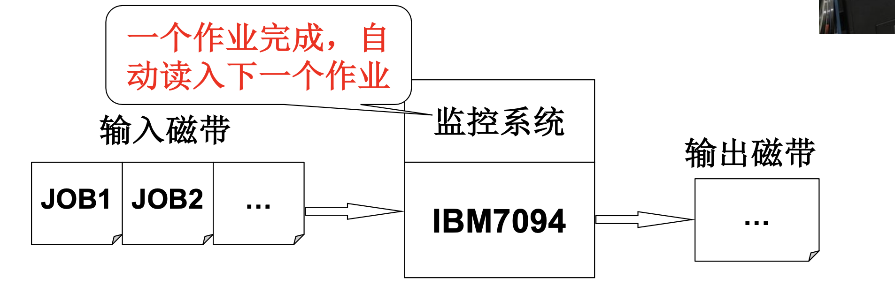
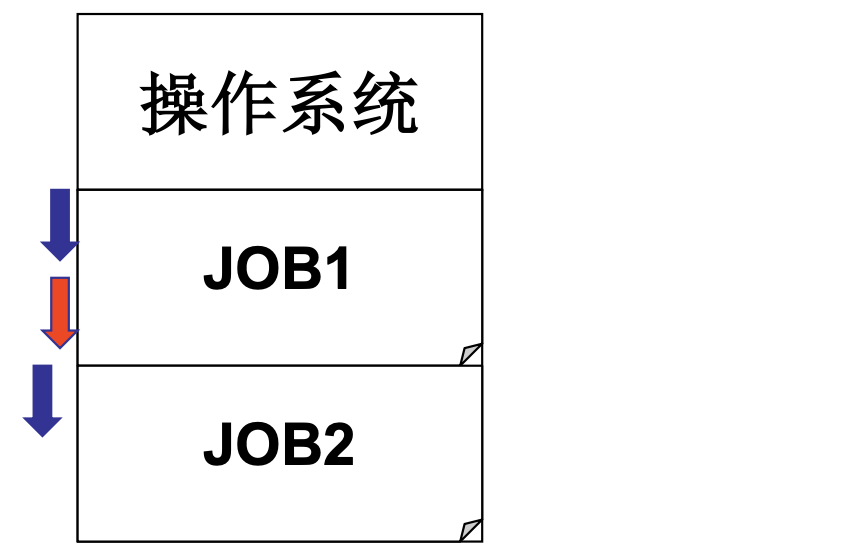
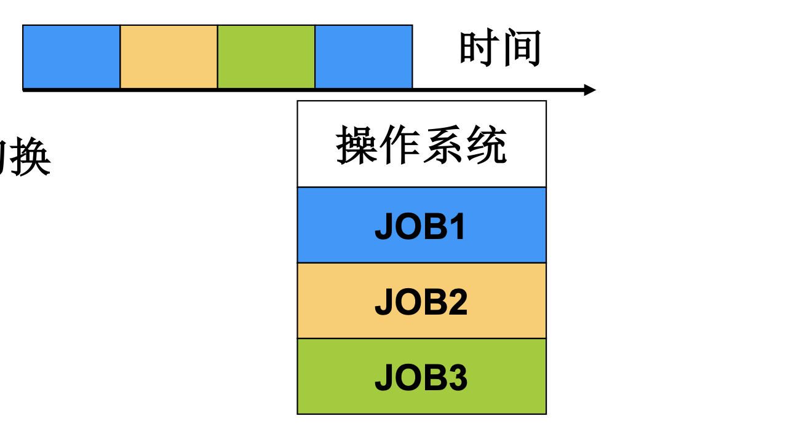

# 📘 1.6 操作系统历史 (History of Operating Systems)

> 来源说明：哈工大李治军操作系统课程 L6 | 本节涵盖：操作系统从批处理到现代系统的完整发展脉络，包括大型机线与PC线两大历史分支

---

## 🧠 核心概念总览（严格按原文顺序）

> 🔗 **返回知识库主页**：[操作系统笔记主页](./README.md)
- [*知识点1: 批处理操作系统*](#id1)
- [*知识点2: 多道程序操作系统*](#id2)
- [*知识点3: 分时系统*](#id3)
- [*知识点4: UNIX 的诞生*](#id4)
- [*知识点5: Linux 的诞生与发展*](#id5)
- [*知识点6: 大型机历史主线总结*](#id6)
- [*知识点7: PC 时代的开端 CP/M*](#id7)
- [*知识点8: QDOS 与 MS-DOS*](#id8)
- [*知识点9: Windows 的崛起*](#id9)
- [*知识点10: Mac OS 与 iOS*](#id10)
- [*知识点11: PC 线历史总结与核心任务*](#id11)

---

## ✅ 知识点1: 批处理操作系统 (Batch System)

**最开始的计算机是什么样子的？**
- **时代背景 (1955-1965)**：计算机极其昂贵，上古神机 `IBM 7094` 造价在 **250 万美元以上**
- **使用原则**：只专注于计算，**最大化硬件利用率**
- **核心机制**：`批处理 (Batch Processing)`
  - 多个作业 `JOB1, JOB2, ...` 依次排队
  - 由**监控系统**自动调度执行
  - 一个作业完成后，自动读入下一个作业
  - 输入/输出通过**磁带**完成
- **典型代表**：`IBSYS` 监控系统

**图示**

---

## ✅ 知识点2: 多道程序操作系统 (Multiprogramming OS)

**多进程思想开始萌芽**
- **时代背景 (1965-1980)**：计算机开始进入**多个行业**
  - 科学计算：`IBM 7094`
  - 银行业务：`IBM 1401`
  - **核心需求**：让一台计算机**干多种事**
- **核心概念**：`多道程序 (Multiprogramming)`
  - 内存中同时存放多个作业：既有 `I/O 任务`，又有`计算任务`
  - 通过**作业切换和调度**，让 `CPU` 保持忙碌于多个任务上
  - > 💡 **理解技巧**：厨师做菜时，一边等水开，一边切菜——CPU 不等 I/O
- **历史意义**：**多进程结构**和**进程管理**概念萌芽！
- **典型代表**：`IBM OS/360`
  - **360 表示全方位服务**
  - **开发周期 5000 个人年**——操作系统开发复杂度极高

**图示**

> 🔄 **知识关联**：这是现代 `进程管理(Process Management)` 和 `CPU 调度(CPU Scheduling)` 的前身

---

## ✅ 知识点3: 分时系统 (Timesharing System)

**资源复用概念的诞生**
- **时代背景**：计算机进入多个行业，**使用人数增加**
- **核心需求**：如果每个人启动一个作业，需要**快速切换**
- **核心概念**：`分时系统 (Timesharing)`
  - 多个用户共享一台计算机
  - 操作系统快速轮转，给每个用户"好像独占"的体验
- **代表系统**：`MIT MULTICS`
  - 全称：`MULTiplexed Information and Computer Service`
- **核心思想**：**资源复用 (Resource Multiplexing)**
  - 核心仍然是任务切换
  - 但资源复用的思想对操作系统影响深远
  - **`虚拟内存 (Virtual Memory)` 就是一种复用！**

**教材示例/公式**

- 🔄 **知识关联**：分时系统的资源复用思想直接催生了 `虚拟内存`、`虚拟 CPU` 等核心技术

---

## ✅ 知识点4: UNIX 的诞生

**UNIX诞生**
- **时代背景 (1980-1990)**：
  - `小型化计算机`出现
  - `PDP-1` 每台售价 **120,000 美元**，不足 7094 的 **5%**
  - 越来越多的**个人**可以使用计算机
- **关键事件 (1969年)**：
  - 贝尔实验室的 `Ken Thompson`、`Dennis Ritchie` 等人
    - > 🔄 **知识关联**：`Dennis Ritchie` 后来发明了 `C 语言`，而 UNIX 正是用 C 重写的——软硬件互相成就
  - 在一台没人使用的 `PDP-7` 上
  - 开发了一个**简化版 MULTICS**
  - 这就是后来的 **`UNIX`**
- **UNIX 的本质**：
  - 一个**简化的 MULTICS**
  - 核心概念差不多
  - 但**更灵活、更成功**

 > 💡 **理解技巧**：好的设计往往来自"做减法"而非"堆功能"

---

## ✅ 知识点5: Linux 的诞生与发展

**Linux诞生**
- **关键时间节点**：
  - **1981 年**：`IBM` 推出 `IBM PC`，个人计算机开始普及
  - **1987 年**：`Andrew Tanenbaum` 发布 `MINIX`
    - 非常类似 UNIX
    - 用于**教学目的**
  - **1991 年**：`Linus Torvalds` 在 `386sx` 兼容微机上学习 MINIX
    - 做出了**小 Linux** 并于当年发布
  - **1994 年**：`Linux 1.0` 发布并采用 `GPL` 协议
  - **1998 年以后**：互联网世界里展开了一场历史性的 **Linux 产业化运动**
- **核心意义**：
  - 从个人学习项目成长为全球协作的开源操作系统
  - 证明了**开源模式**的力量

> ⚠️ **关键区分**：Linux 是**内核(Kernel)**，不是完整的操作系统；GNU/Linux 才是完整系统

---

## ✅ 知识点6: 大型机历史主线总结 (IBSYS → Linux)

**历史主线**：`IBSYS → OS/360 → MULTICS → UNIX → Linux`

- **核心演进逻辑**：
  1. 用户通过执行程序来使用计算机（吻合**冯诺依曼思想**）
  2. 作为管理者，操作系统要让多个程序合理推进 → **`进程管理(Process Management)`**
  3. 多进程推进时需要**内存复用**等等

- **核心结论**：
  - **`多进程结构`是操作系统基本图谱！**
  - **对于操作系统，实现概念远比理解概念重要！**
  - 从 OS/360 到 UNIX，**需要真正的群体智慧**
  - 从 UNIX 到 Linux，**开源协作**改变了软件生产方式

**核心思想、技术 ↔ 软件实现**

**任务**：掌握操作系统的**多进程图谱**并实现它！

---

## ✅ 知识点7: PC 时代的开端 CP/M

**历史是多条线的**
- **时代背景**：`PC 机`的诞生一定会导致**百花齐放**
- **关键事件 (1975 年)**：
  - `Digital Research` 为 `Altair 8800` 开发了操作系统 **`CP/M`**
  - 运行平台：`8080 芯片`（8位）
- **CP/M 的核心功能**：
  - 写**命令**让用户使用
  - 执行命令对应的**程序**
  - **单任务执行**——一次只能跑一个程序
- **历史意义**：PC 上第一个广泛使用的操作系统

> ⚠️ **关键区分**：CP/M 是**单任务(Single-tasking)**，区别于大型机的多道程序

---

## ✅ 知识点8: QDOS 与 MS-DOS

**Bill Gates要进入舞台...**
- **关键人物登场**：
  - **1975 年**：22 岁的 `Paul Allen` 和 20 岁的 `Bill Gates`
  - 为 `Altair 8800` 开发了 `BASIC 解释器`
  - 据此开创了**微软 (Microsoft)**
  - **1977 年**：`Bill Gates` 开发了 `FAT` 管理磁盘
- **QDOS 的诞生 (1980 年)**：
  - 出现了 `8086`（16位芯片）
  - 从 `CP/M` 基础上开发了 **`QDOS (Quick and Dirty OS)`**
  - QDOS 的成功在于：以 CP/M 为基础，将 `BASIC` 和 `FAT` 包含了进来
- **微软的关键商业操作 (1980-1981 年)**：
  - **1980 年**：`IBM` 想和 `Digital Research` 协议授权使用 CP/M，但**没有达成**
  - IBM**转向和微软合作**
  - **1981 年**：微软**买下 QDOS**，改名为 **`MS-DOS (Disk OS)`**
  - 和 `IBM PC` **打包一起出售**

> ⚠️ **历史转折点**：如果 IBM 和 Digital Research 谈成了，可能就没有微软的今天

---

## ✅ 知识点9: Windows 的崛起

**新生代来临**
- **MS-DOS 的局限**：
  - 磁盘、文件、命令让用户方便
  - 但**似乎可以更方便**
- **关键时间节点**：
  - **1989 年**：`MS-DOS 4.0` 出现，**支持了鼠标和键盘**
  - 此时微软已经决定要**放弃 MS-DOS**
  - 不久后 **`Windows 3.0` 大获成功**
  - 后来就是一发不可收拾：`95 → XP → Vista → Win 7 → Win 8 ...`
- **核心演进**：
  - 从**命令行**到**图形界面 (GUI)**
  - 从**单任务**到**多任务**

---

## ✅ 知识点10: Mac OS 与 iOS

**另一条历史线**
- **关键事件 (1984 年)**：
  - 苹果推出 PC（`麦金塔机，Macintosh`），简称 **Mac 机**
  - 处理器使用 `IBM`、`Intel` 或 `AMD` 等
  - 核心在于**屏幕、能耗**等用户体验
  - 与 Mac 机一起发布 **`System X`** 系统
  - **一上来就是 GUI**——比 Windows 更早重视图形界面
- **演进路线**：
  - `System 1.0` → ... → `System 7`
  - `System 7` 以后改名为 **`Mac OS 8`**
  - **2007 年**：发布 **`iOS`**
    - 核心仍然是 `Mac OS`
    - 专为**移动设备**优化
    - 引入**手势**等交互方式
- **Mac OS 的核心**：
  - 底层是 **`UNIX`**（BSD 系）
  - 专注于**界面、文件、媒体**等和用户有关的内容

> ⚠️ **关键区分**：Mac OS 的 UNIX 内核 + 苹果自研 GUI = 稳定 + 好用的结合

---

## ✅ 知识点11: PC 线历史总结与核心任务

**历史主线**：`CP/M → QDOS → MS-DOS → Windows`
**另一条线**：`UNIX → System → Mac OS → iOS`

- **仍然是同样的基本结构**：
  - 程序执行、多进程
  - 程序执行带动其他设备使用
- **但用户的使用感觉倍受重视**：
  - 各种**文件**系统
  - **编程环境**（如 BASIC）
  - **图形界面 (GUI)**
- **核心思想、技术 ↔ 软件实现**：
  - 如何通过文件**存储代码、执行代码、操作屏幕**
  - 如何让文件和操作变成**图标、点击或触碰**

**任务**：
1. **掌握、实现操作系统的多进程图谱**
2. **掌握、实现操作系统的文件操作视图**

---

## 🔑 核心要点总结

1. **操作系统历史两条主线**：大型机线（IBSYS→Linux）追求资源利用率，PC线（CP/M→Windows/Mac）追求用户体验
2. **多进程结构是操作系统的基本图谱**——从多道程序到分时系统，核心都是让多个程序合理推进
3. **UNIX 是分水岭**——它将大型机的复杂思想简化，并影响了后续所有系统（Linux、Mac OS、iOS）
4. **实现概念远比理解概念重要**——OS/360 的 5000 人年、Linux 的开源协作都说明操作系统是"做出来"的
5. **现代 OS 的两大任务**：多进程图谱 + 文件操作视图

---