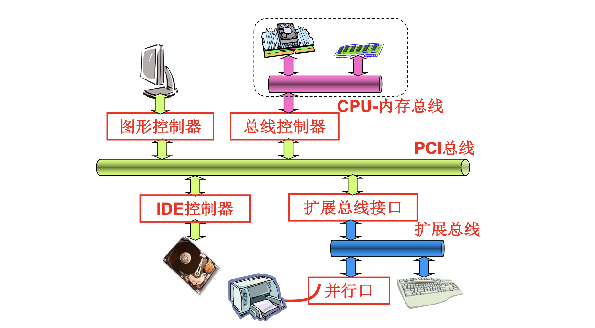
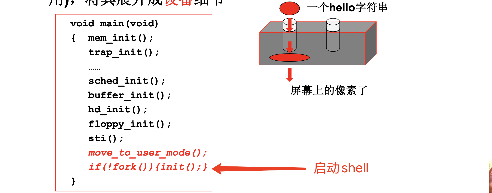
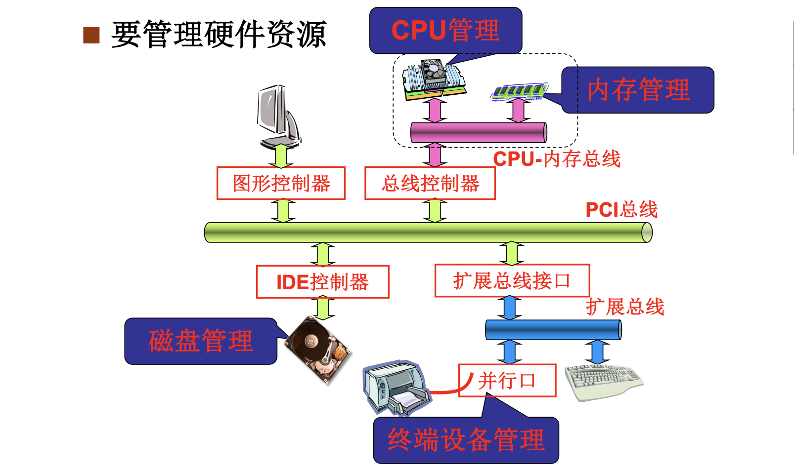
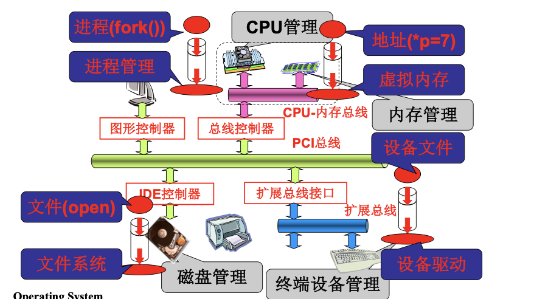

# 📘 1.7 回顾和计划 (Recap and Plan)

> 来源说明：哈工大李治军《操作系统》课程 L7 | 本节涵盖：操作系统核心管理任务的总览与后续学习路线图

---

## 🧠 核心概念总览（严格按原文顺序）

> 🔗 **返回知识库主页**：[操作系统笔记主页](./README.md)

- [*知识点1: 温故知新*](#id1) — 操作系统核心脉络回顾
- [*知识点2: 操作系统要管理的硬件资源*](#id2) — CPU/内存/磁盘/终端设备
- [*知识点3: 操作系统对硬件的抽象*](#id3) — 进程、虚拟内存、文件、设备文件
- [*知识点4: CPU 管理的学习路线*](#id4) — 从直观想法到进程抽象
- [*知识点5: 内存管理的学习路线*](#id5) — 从物理地址到虚拟地址
- [*知识点6: 文件与设备管理的学习路线*](#id6) — 从设备到文件抽象
- [*知识点7: 系统调用背后的核心机制*](#id7) — 多进程切换与文件操作

---

## ✅ 知识点1: 温故知新 — 操作系统核心脉络

**往期回顾**
- 操作系统课程前期内容回顾：
  1. **计算机硬件**：
    
  2. **操作系统启动**：`mem_init()`、`trap_init()` ... `sched_init()`、`buffer_init()`、`hd_init()`、`floppy_init()`，最后 `sti()` 开中断，进入用户态
  3. **系统调用接口**：用户通过系统调用来使用硬件资源
- 核心逻辑链：**硬件 → 操作系统 → 应用软件**，操作系统处于中间层，管理硬件并方便用户使用

**教材示例**

- 这是一个 hello 字符串变成屏幕上像素的完整路径

> ⚠️ **关键区分**：操作系统初始化完成后，进入用户态等待系统调用，而不是直接操作硬件

---

## ✅ 知识点2: 操作系统要管理的硬件资源

**接下来我们要学习的东西**
- 操作系统核心任务：**管理硬件资源**，主要包括两大类：
  - **多进程视图**：
    1. **`CPU管理(CPU Management)`** — 中央处理器的调度与分配
    2. **`内存管理(Memory Management)`** — 主存的分配、回收与保护
  - **文件视图**：
    1. **`磁盘管理(Disk Management)`** — 外存的文件存储与访问
    2. **`终端设备管理(Terminal Device Management)`** — 键盘、显示器等 I/O 设备
- 硬件结构层次：
  

---

## ✅ 知识点3: 操作系统对硬件的抽象

**再看细一些...**
- 操作系统的核心价值：**方便用户使用硬件资源**，通过抽象隐藏硬件细节：

  | 硬件资源 | 用户使用的抽象 | 典型系统调用 | 隐藏的细节 |
  |:------:|:-----------|:----------|:---------|
  | **CPU** | `进程(Process)` | `fork()` | CPU 调度、上下文切换 |
  | **内存** | `地址/虚拟内存(Address/Virtual Memory)` | `*p = 7` | 物理地址映射、页表、内存分配 |
  | **磁盘** | `文件(File)` | `open()`、`read()`、`write()` | 磁盘块、inode、文件系统结构 |
  | **终端设备** | `设备文件(Device File)` | `open()`、`read()`、`write()` | 设备控制器、驱动程序、中断处理 |
  
  

- 抽象的本质：**把复杂的硬件操作变成简单的接口调用**
  - 用户不需要知道 CPU 如何切换、内存如何分页、磁盘如何寻道
  - 只需要调用 `fork()`、`open()` 等简单接口

> ⚠️ **关键区分**：`进程(Process)` 是 CPU 的抽象，`虚拟内存(Virtual Memory)` 是内存的抽象，`文件(File)` 是磁盘和设备的统一抽象
> 💡 **理解技巧**：抽象就像"遥控器"——你按一个按钮（系统调用），背后是一整套复杂电路（内核机制）在工作

---

## ✅ 知识点4: CPU 管理的学习路线 — 从直观想法到进程抽象

**理论**
- CPU 管理的学习路径（由浅入深）：
  1. **`CPU管理的直观想法`** — 为什么需要管理 CPU？多个程序都想跑怎么办？
  2. **`CPU到进程的抽象`** — 什么是进程？进程如何代表一个运行中的程序？
  3. **`多进程基本结构`** — 进程控制块 PCB、进程状态、进程队列
  4. **`多进程相关问题`** — 进程同步、进程通信、死锁
  5. **`fork如何工作?`** — 从源码层面理解进程创建

- 核心问题：**如何让多个程序共享一个 CPU，让用户感觉它们在"同时"运行？**

---

## ✅ 知识点5: 内存管理的学习路线 — 从物理地址到虚拟地址

**理论**
- 内存管理的学习路径（由浅入深）：
  1. **`内存管理的直观想法`** — 为什么需要管理内存？多个进程都需要内存怎么办？
  2. **`物理地址到虚拟地址`** — 地址转换机制、MMU
  3. **`*p = 7的背后?`** — 一条简单的赋值语句，背后涉及页表查询、地址翻译、权限检查
  4. **`进程虚拟内存如何产生?`** — 进程的地址空间是如何建立和管理的

- 核心问题：**如何让每个进程都拥有"独立"的内存空间，同时共享物理内存？**

---

## ✅ 知识点6: 文件与设备管理的学习路线 — 从设备到文件抽象

**理论**
- 文件与设备管理的学习路径（由浅入深）：
  1. **`设备使用的基本结构`** — 设备如何工作？中断、DMA、缓冲
  2. **`从设备到文件的抽象`** — 为什么要把设备变成文件？`一切皆文件`
  3. **`open、read、write的背后?`** — 文件系统调用背后的分层结构：系统调用 → VFS → 具体文件系统 → 设备驱动

- 核心问题：**如何用统一的接口（文件操作）来访问截然不同的硬件（磁盘、键盘、显示器）？**

---

## ✅ 知识点7: 系统调用背后的核心机制 — 操作系统的心脏

**理论**
- 所有系统调用的背后，是操作系统的**核心机制**：
  - **`多进程切换(Multi-process Switching)`** — CPU 在多个进程之间快速切换，实现"并发"
  - **`文件操作(File Operations)`** — 从用户的路径名到磁盘块的完整映射链
- 操作系统的本质工作：
  1. **让硬件用起来** — 初始化、驱动、中断处理
  2. **进行抽象** — 进程、虚拟内存、文件
  3. **映射等等** — 地址映射、文件路径到磁盘块映射、用户请求到硬件操作映射
- 后续课程将逐层展开这些核心机制

---

## 🔑 核心要点总结

1. **操作系统管理四大硬件资源**：CPU、内存、磁盘、终端设备，通过抽象层向用户提供简单接口
2. **四大核心抽象**：CPU → 进程（`fork()`）、内存 → 虚拟地址（`*p = 7`）、磁盘/设备 → 文件（`open/read/write`）
3. **后续课程三条主线**：CPU 管理（进程与多进程切换）、内存管理（虚拟内存与地址映射）、文件/设备管理（文件抽象与设备驱动）
4. **系统调用是入口，内核机制是本质**：用户通过简单接口触发，内核完成复杂的资源调度和管理
5. **L7 是承上启下的一讲**：前面学了"是什么"和"怎么启动"，后面将深入"怎么管理"

## 📌 考试速记版

- **关键机制**：操作系统通过**进程**抽象 CPU、通过**虚拟内存**抽象内存、通过**文件**抽象磁盘和设备
- **易混淆概念对比**：

| 概念 | 代表 | 系统调用 | 解决的问题 |
|:----|:-----|:--------|:----------|
| 进程 | CPU 的抽象 | `fork()` | 多程序共享 CPU |
| 虚拟内存 | 内存的抽象 | `*p = 7` | 多进程独立地址空间 |
| 文件 | 磁盘/设备的抽象 | `open/read/write` | 统一持久存储和 I/O 接口 |

- **常见考试陷阱**：
  - ❌ 认为 `fork()` 只是"创建新进程"——实际上是**复制当前进程**的完整映像
  - ❌ 认为虚拟内存只是"扩大内存"——核心是**地址隔离与保护**
  - ❌ 认为文件系统只管理磁盘——Unix 中**设备也是文件**

**记忆口诀**：
> "CPU 变进程，内存加虚拟，磁盘设备统统一文件，系统调用是入口，内核机制藏真谛！"
