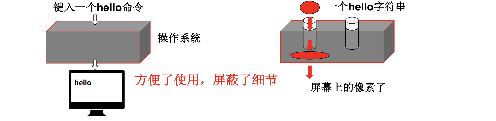
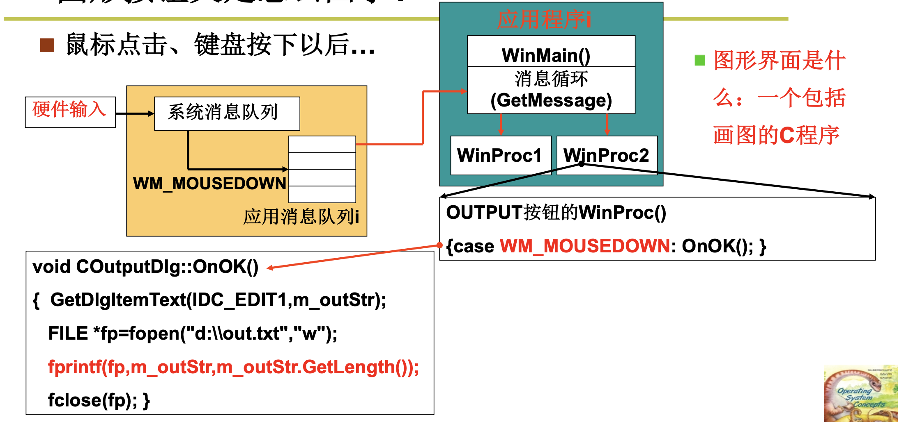
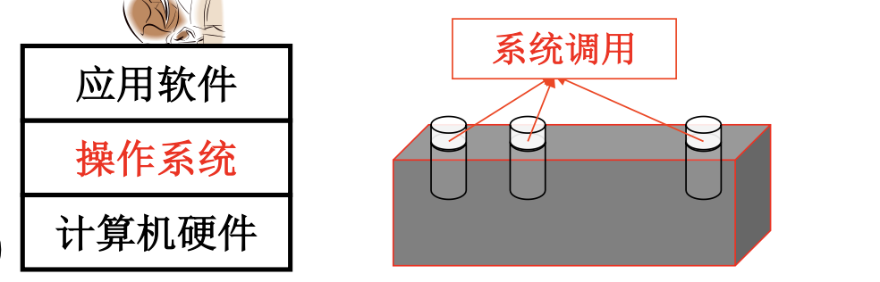

# 📘 L4 操作系统接口 (OS Interface)

> 来源说明：哈工大李治军操作系统课程 L4 | 本节涵盖：操作系统接口的本质、系统调用与POSIX标准

---

## 🧠 核心概念总览（严格按原文顺序）

- [*知识点1: 接口的常识*](#id1)
- [*知识点2: 操作系统接口的定义*](#id2)
- [*知识点3: 用户使用计算机的方式*](#id3)
- [*知识点4: 命令行的本质*](#id4)
- [*知识点5: 图形界面的本质*](#id5)
- [*知识点6: 操作系统接口的概念*](#id6)
- [*知识点7: POSIX标准*](#id7)

---

<a id="id1"></a>
## ✅ 知识点1: 接口的常识

**接口是什么？**
- 日常生活中有很多接口：`电源插座`、`汽车油门` 等
- **接口(Interface)** 的定义：
  - 连接两个东西的电路
  - 使一种格式的数据能够转换成另一种格式传输
  - **核心作用**：连接、信号转换、**屏蔽细节**

- > ⚠️ **关键区分**：接口的核心价值在于"屏蔽细节"——使用者不需要知道内部如何实现


---

<a id="id2"></a>
## ✅ 知识点2: 操作系统接口的定义

**那么操作系统接口又是什么？**
- 操作系统直接面对用户吗？**不是**
- 用户使用计算机的链路：
  
- **操作系统接口**连接的不是用户，而是**上层用户和操作系统软件**
- 用户通过命令（如键入 `hello`）与计算机交互，最终变成屏幕上的像素
- 操作系统接口的本质：**方便了使用，屏蔽了细节**

> 📋 **术语提醒**：操作系统接口`OS Interface`——连接上层应用与操作系统内核的边界

---

<a id="id3"></a>
## ✅ 知识点3: 用户使用计算机的方式

**除了命令，还有什么交互形式？**
- 用户如何使用计算机？通过**程序(Program)**（应用软件）
- 三种主要交互方式：
  1. **`命令行(Command Line)`**：命令程序
  2. **`图形界面(Graphical User Interface, GUI)`**：消息框架程序 + 消息处理程序
  3. **`应用程序(Application)`**：直接调用系统功能
> ⚠️ **关键区分**：无论是命令行还是图形界面，本质上都是**程序**


---

<a id="id4"></a>
## ✅ 知识点4: 命令行的本质

**先从命令行看看具体什么是系统接口**
- **命令(Command)** 是什么？**一段程序而已**
  - 示例：C语言编写的 echo 程序
  ```c
  #include <stdio.h>
  int main(int argc, char * argv[]) {
      printf("ECHO:%s\n", argv[1]);
  }
  ```
- 编译运行：
  ```bash
  gcc -o output output.c
  ./output "hello"
  ```
- **Shell** 也是一段程序：`/bin/sh`
- Shell 的核心逻辑（简化版）：
  ```c
  int main(int argc, char * argv[]) {
      char cmd[20];
      while(1) {
          scanf("%s", cmd);
          if(!fork()) {    // 创建子进程
              exec(cmd);    // 执行命令
          } else {
              wait();       // 父进程等待
          }
      }
  }
  ```
  - **核心任务：循环读取用户输入的命令，通过 `fork` 创建子进程执行命令，父进程`wait()`等待子进程结束后再读取下一条命令。**
- **完整的运行一遍`shell`+`output`**：
  1. 当系统启动的最后，shell程序被执行并等待用户输入
  2. 当用户输入`./output "hello"`后，shell通过`if(!fork()){exec(cmd);}`这段代码去申请CPU
  3. 并让CPU去执行`output`的代码并最终打印出想要的结果。
- 过程中，通过调用`scanf()`,`fork()`等实现对计算机硬件的使用

> ⚠️ **关键区分**：命令不是直接操作系统的"指令"，而是**由shell程序解析并执行的程序**
> 📋 **术语提醒**：Shell`命令解释器`——用户与操作系统之间的命令行接口


---

<a id="id5"></a>
## ✅ 知识点5: 图形界面的本质

**在从图形按钮了解什么是接口**
- 图形界面是什么？**一个包括画图的C程序**
  
  - **核心任务：一个消息循环`Message Loop`调用函数将内核中的消息挨个取出，每取出一个都会调用对应的消息处理函数**
- 鼠标点击、键盘按下后的事件处理流程：
  1. **硬件输入** → 产生系统消息
  2. **系统消息队列** → 操作系统管理
  3. **消息循环**：`GetMessage()` 从应用消息队列获取消息
  4. **窗口过程函数**：分发消息到对应的处理函数

- 依然是通过调用函数来实现硬件控制


> ⚠️ **关键区分**：图形界面本质也是**程序**，基于**消息驱动(Message-Driven)** 架构
> 🔄 **知识关联**：图形界面程序最终也要通过系统调用访问文件、网络等资源

---

<a id="id6"></a>
## ✅ 知识点6: 操作系统接口的概念

**所以什么是操作系统接口？**
- 用户使用计算机的链路总结：
  - **命令行**：命令程序
  - **图形界面**：消息框架程序 + 消息处理程序
- 这些程序需要什么来调动起计算机硬件实现？**操作系统提供的重要函数**
- 这就是**操作系统接口**：
  - **表现形式**：`函数调用(Function Call)`
  - **提供者**：系统（操作系统）
  - **名称**：`系统调用(System Call)`
  - >📋 **术语提醒**：系统调用`System Call`——操作系统提供给应用程序访问内核功能的接口

- 操作系统接口的连接关系：
  
  - **如何连接**：C语言程序中的函数调用
- 示例：
  ```c
  #include <stdio.h>
  int main(int argc, char * argv[]) {
      printf("ECHO:%s\n", argv[1]);  // printf 最终调用 write 系统调用
  }
  ```
  - >🔄 **知识关联**：应用程序 → 库函数（如printf）→ 系统调用（如write）→ 内核 → 硬件
- **普通C代码加上一些重要的函数** → 这些"重要的函数"就是系统调用

---

<a id="id7"></a>
## ✅ 知识点7: POSIX标准

**理论**
- **POSIX**：`Portable Operating System Interface of Unix`
  - IEEE 制定的标准族
  - 目标：统一操作系统接口，使应用程序可移植
- POSIX 定义的主要接口分类：

| 分类 | POSIX 定义 | 描述 |
|:---|:---|:---|
| **任务管理** | `fork` | 创建一个进程`Create a Process` |
| | `execl` | 运行一个可执行程序`Execute a Program` |
| | `pthread_create` | 创建一个线程`Create a Thread` |
| **文件系统** | `open` | 打开一个文件或目录`Open a File or Directory` |
| | `EACCES` | 返回值，表示没有权限`Permission Denied` |
| | `mode_t st_mode` | 文件头结构：文件属性`File Attributes` |

**注意点**
- ⚠️ **关键区分**：POSIX 是**标准**，不是具体实现——不同操作系统（Linux、macOS）都遵循 POSIX，但内部实现可能不同
- 💡 **理解技巧**：POSIX 就像**插头的规格标准**——规定了插头的形状和电压，但不规定发电厂怎么发电
- 🔄 **知识关联**：L3 学习的操作系统启动最终目的就是建立起支持系统调用的运行环境
- 📋 **术语提醒**：POSIX`可移植操作系统接口`——IEEE制定的操作系统接口标准族

---

## 🔑 核心要点总结

1. **操作系统接口的本质是系统调用**——表现为C语言函数调用，由操作系统提供，连接应用软件和内核
2. **命令行和图形界面都是"外壳"**——本质都是程序，最终都要通过系统调用访问系统资源
3. **Shell 的核心机制**——`fork()` 创建子进程 + `exec()` 执行程序 + `wait()` 等待返回
4. **GUI 基于消息驱动**——硬件输入 → 系统消息队列 → 消息循环 → 窗口过程函数处理
5. **POSIX 是统一标准**——定义了进程管理、文件系统等核心接口，保证应用程序的可移植性

## 📌 考试速记版

- **关键机制**：系统调用是操作系统接口的唯一形式，命令行/GUI都是上层封装
- **易混淆概念对比**：
  - 系统调用 vs 库函数：系统调用直接进入内核，库函数可能只封装系统调用
  - Shell vs 内核：Shell是用户态程序，内核是系统核心
  - POSIX vs Linux：POSIX是标准，Linux是实现
- **常见考试陷阱**：
  - ❌ "操作系统直接面对用户" → ✅ 操作系统通过应用软件面对用户
  - ❌ "命令是直接给操作系统的指令" → ✅ 命令是由shell程序解析执行的

**记忆口诀**：接口本质是调用，外壳两种面貌；fork exec wait三件套，POSIX标准统一道。
