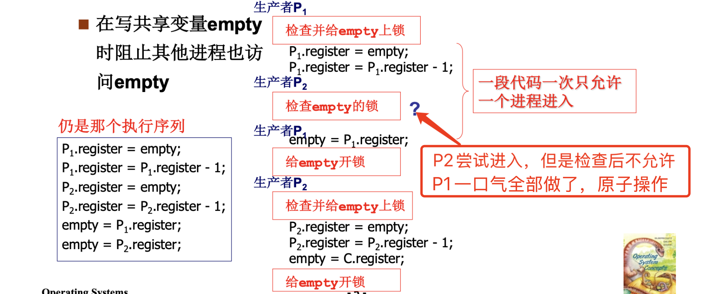
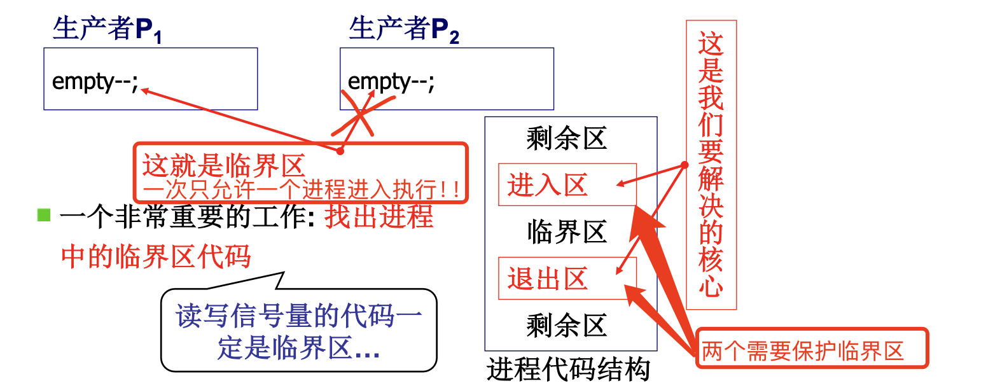
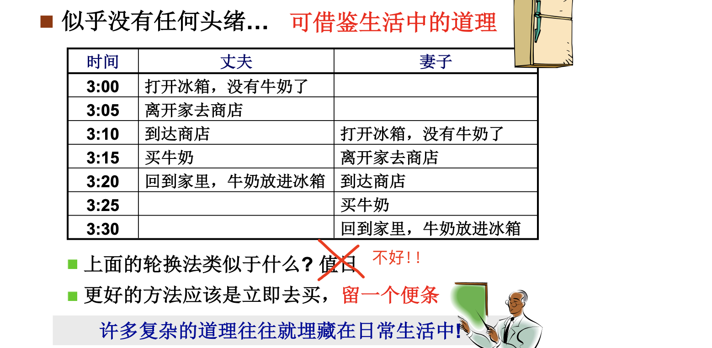
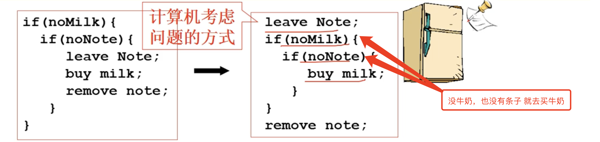
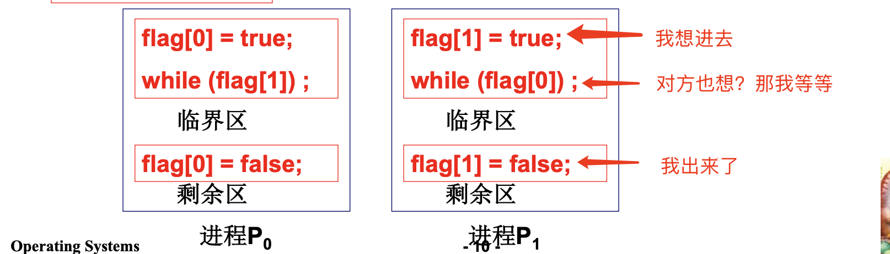

# 📘 2.10 信号量临界区保护 (Critical Section)

> 来源说明：哈工大李治军操作系统课程 L17 | 本节涵盖：竞争条件、临界区定义与保护原则、轮换法、标记法、Peterson算法、面包店算法、关中断法、硬件原子指令法

---

## 🧠 核心概念总览（严格按原文顺序）

> 🔗 **返回知识库主页**：[操作系统笔记主页](./README.md)
- [*知识点1: 竞争条件（Race Condition）*](#id1)
- [*知识点2: 临界区（Critical Section）定义*](#id2)
- [*知识点3: 临界区保护原则*](#id3)
- [*知识点4: 轮换法（Turn）*](#id4)
- [*知识点5: 标记法（Flag）与失败分析*](#id5)
- [*知识点6: 非对称标记法*](#id6)
- [*知识点7: Peterson算法*](#id7)
- [*知识点8: 面包店算法（多进程）*](#id8)
- [*知识点9: 关中断法（cli/sti）*](#id9)
- [*知识点10: 硬件原子指令法（TestAndSet）*](#id10)

---

<a id="id1"></a>
## ✅ 知识点1: 竞争条件（Race Condition）

**单纯只有信号量实际上也是无法正常工作的...**

- 什么是信号量? **通过对这个量的访问和修改，让大家有序推进**。
- 哪里还有问题吗? -- `semaphore` 变量的值一定要正确！
- 当多个进程**并发操作共享数据**（如信号量的`value`）时，由于调度顺序的不确定性，就可能产生 `semaphore` 的值错误。这种与调度有关的共享数据语义错误称为**竞争条件(Race Condition)**。

- **经典场景——信号量`empty--`的汇编展开**：

   ```
   register = empty;
   register = register - 1;
   empty = register;
   ```

- 两个生产者P1、P2并发执行`P(empty)`（即`empty--`）：

   | 步骤 | P1 | P2 | 结果 |
   |:---|:---|:---|:---|
   | 1 | `P1.reg = empty;` (如= -1) | — | |
   | 2 | `P1.reg = P1.reg - 1;` (= -2) | — | |
   | 3 | — | `P2.reg = empty;` (仍= -1) | **读到旧值！** |
   | 4 | — | `P2.reg = P2.reg - 1;` (= -2) | |
   | 5 | `empty = P1.reg;` (= -2) | — | |
   | 6 | — | `empty = P2.reg;` (= -2) | **覆盖！** |

   **预期结果**：两个P操作后`empty`应减2，从-1变为-3
   **实际结果**：`empty = -2`，**只减了1**！信号量语义被破坏。

- **竞争条件的特征**：
  - 错误由多个进程**并发操作共享数据**引起
  - 错误和**调度顺序**有关，**难于发现和调试**

> ⚠️ **关键警告**：竞争条件不是每次都会出现！它依赖特定的调度时序，是"时序相关bug"，极难复现和调试。
> 💡 **理解技巧**：想象两个人同时修改同一张Excel表格——如果都不锁定，后保存的人会覆盖前一个人的修改。


---

<a id="id2"></a>
## ✅ 知识点2: 临界区（Critical Section）定义

**直观想法**：那我们在写共享变量 `empty` 时阻止其他进程访问 `empty` 不就行了？-- 这就是临界区本质！
- **原子操作**(atomic operation)："不可中断的操作"（要么全做完，要么全不做）
   

- **临界区(Critical Section)**：一次只允许一个进程进入的该进程的那一段代码。
   - **核心任务**：**找出进程中的临界区代码**
      - 读写信号量的代码一定是临界区
      - 访问任何共享变量的代码都可能是临界区
   > ⚠️ **关键区分**：临界区是**代码段**，不是数据。强调的是"这段代码一次只能一个进程执行"。

- **进程代码结构**：



> 💡 **理解技巧**：临界区像"单人厕所"——任何人都可以进，但同一时间只能进一个。


---

<a id="id3"></a>
## ✅ 知识点3: 临界区保护原则

好的临界区保护机制必须同时满足三条原则：

1. **互斥进入(Mutual Exclusion)**：如果一个进程在临界区中执行，则其他进程不允许进入
   - 这是**最基本**的要求

2. **有空让进(Progress)**：若干进程要求进入空闲临界区时，应尽快使一个进程进入
   - 临界区空闲时不能不让别人进

3. **有限等待(Bounded Waiting)**：从进程发出进入请求到允许进入，不能无限等待
   - 不能"饿死"某个进程

> ⚠️ **关键区分**：这三条原则是层层递进的——互斥是底线，有空让进保证效率，有限等待保证公平。


---

<a id="id4"></a>
## ✅ 知识点4: 轮换法（Turn）

**那现在准备工作都有了，我们看看实际怎么做？**

- **思想**：用一个共享变量`turn`记录"轮到谁"，类似值日表。

   ```c
   // 进程 P0
   while (turn != 0) ;   // 轮到我了吗？
   临界区
   turn = 1;             // 轮到P1
   剩余区
   ```

   ```c
   // 进程 P1
   while (turn != 1) ;   // 轮到我了吗？
   临界区
   turn = 0;             // 轮到P0
   剩余区
   ```

   - **检验**：
      - ✅ **互斥进入**：满足。`turn`只有一个值，只有一个进程能通过`while`。
      - ❌ **有空让进**：**不满足**！P0完成后必须等P1进入一次后才能再次进入，即使P1不在临界区。如果P1不想进（在剩余区睡觉），P0也进不了。
      - ❌ **有限等待**：不满足，存在无限等待可能。

> ⚠️ **关键警告**：轮换法像"值日表"——今天轮到你，即使你不干活，别人也不能替你。这是最大的缺陷。


---

<a id="id5"></a>
## ✅ 知识点5: 标记法（Flag）与失败分析

**如何解决这两个缺点呢？找找生活中的例子 !**
   - **夫妻买牛奶问题类比**：
   
   

- **标记法思想**：每个进程设置一个"标记"(`flag`)表示自己"想进入"，然后检查对方是否也想进。类似于"买牛奶问题"中的"留便条"。

   


- **失败场景——"同时举手"**：
   | 步骤 | P0 | P1 | 结果 |
   |:---|:---|:---|:---|
   | 1 | `flag[0] = true;` | — | |
   | 2 | — | `flag[1] = true;` | |
   | 3 | `while(flag[1])` → true, 阻塞 | — | |
   | 4 | — | `while(flag[0])` → true, 阻塞 | |
   | — | — | — | **死锁！双方无限等待** |
   - ❌ **有空让进**：**不满足**！


> ⚠️ **关键警告**：标记法的问题在于**"同时设置标记"**——双方都举手，然后双方都等对方先走，死锁。


---

<a id="id6"></a>
## ✅ 知识点6: 非对称标记法

**再度思考解决之道！**

- **思想**：让两个进程**不对称**——一个"勤劳"，一个"懒惰"；或者一个"谦让"，一个"优先"。避免双方同时阻塞。

- **丈夫（勤劳者A）**：
   ```c
   leave note A;                      // 留便条A
   while (note B) { do nothing; }    // 等妻子便条消失
   if (noMilk) { buy milk; }         // 没牛奶才买
   remove note A;                     // 收回便条
   ```

- **妻子（懒惰者B）**：
   ```c
   leave note B;                      // 留便条B
   if (noNote A) {                   // 检查丈夫没留便条
      if(noMilk){ buy milk; }
   }
   remove note B;                     // 收回便条
   ```

- **关键**：**选择一个进程进入，另一个进程循环等待**。


> ⚠️ **关键区分**：非对称标记法能工作，但它只适用于**两个进程**，且需要人为指定优先级。
> 💡 **理解技巧**：一个"主动等"，一个"被动看"—— asymmetric 才能打破对称死锁。
> 🔄 **知识关联**：非对称标记是Peterson算法的思想前奏。


---

<a id="id7"></a>
## ✅ 知识点7: Peterson算法


**Peterson算法**：结合了**标记**和**轮转**两种思想，是**双进程**临界区问题的经典软件解法。

- Peterson算法的精髓是"先举手，后谦让"——双方都先声明意图（flag），然后都让对方先（turn），最终由"后谦让者"决定胜负。

   ```c
   // 进程 P0
   flag[0] = true;       // 我想进
   turn = 1;             // 轮到P1（谦让）
   while (flag[1] && turn == 1) ;  // P1想进 且 轮到P1 → 我等
   临界区
   flag[0] = false;      // 我不想进了
   剩余区
   ```

   ```c
   // 进程 P1
   flag[1] = true;       // 我想进
   turn = 0;             // 轮到P0（谦让）
   while (flag[0] && turn == 0) ;  // P0想进 且 轮到P0 → 我等
   临界区
   flag[1] = false;      // 我不想进了
   剩余区
   ```

- **正确性验证**：

   1. **互斥进入** ✅：假设P0和P1同时在临界区，则`flag[0]=flag[1]=true`，且`turn`同时等于0和1，**矛盾**！

   2. **有空让进** ✅：
      - 两人同时举手时，turn 被后写的人覆盖，后写的人等于"最后说让给你"，所以自己得等；先写的人反而条件不满足，先进去。
      - 相比 turn 算法，Peterson 加了 flag 表达意愿，对方不想进时条件直接失败，立刻放行，不会死等。
   3. **有限等待** ✅：先进去的人一定会出来并放下 flag，后谦让的人立刻就能进，不存在永远轮不到的情况


> ⚠️ **关键警告**：Peterson算法**只适用于两个进程**。多进程情况需要面包店算法。
> ⚠️ **关键技巧**：`turn`变量的设置是"谦让"——先举手说"我想进"，然后把优先权让给对方。如果对方也想进且轮到他，自己等；否则自己进。


---

<a id="id8"></a>
## ✅ 知识点8: 面包店算法（多进程）

**两个进程的问题解决了，那多个怎么办？**

- **面包店算法(Bakery Algorithm)**：解决**多进程**临界区问题的软件解法，仍是标记和轮转的结合。
   - **如何轮转**：每个进程获得一个**序号**，序号最小的先进入
   - **如何标记**：进程离开时序号为0，不为0的序号即标记

   **类比**：面包店取号——每个客户进店拿一个号码，号码最小的先服务；号码相同时，名字（编号）靠前的先服务。

- **代码**：

   ```c
   // 进程 Pi (i = 0, 1, ..., n-1)
   choosing[i] = true;
   num[i] = max(num[0], num[1], ..., num[n-1]) + 1;  // 取最大号+1
   choosing[i] = false;

   for (j = 0; j < n; j++) {
      while (choosing[j]) ;                          // 等j取号完毕
      while ((num[j] != 0) &&                       // j想进 且
            ((num[j], j) < (num[i], i)));          // j的号更小（字典序）
   }

   临界区
   num[i] = 0;  // 出临界区，序号归0
   剩余区
   ```
   - 想象你去面包店买面包，门口有个取号机：

      1. **想进门先取号** — `choosing[i] = true` 表示"我正在取号别打扰我"，取完当前最大的号加 1，然后 `choosing[i] = false`。
      2. **等前面的人** — 进门之前扫一眼所有人：如果有人还在取号（`choosing[j] == true`），你就等着；如果有人取了号且号比你小（或者号一样但 PID 比你小），你也等着。
      3. **号最小的人进** — 等所有号比你小的人都进去了，轮到你了，进临界区。
      4. **买完走人** — `num[i] = 0`，表示"我不买了"，后面的人继续按号进。

      **为什么有效？** 取号时 `choosing` 保证不会两个人拿到一样的号；如果号撞了，PID 小的字典序更小，先进去；每个人最终都会拿到一个唯一的号，号小的总会先被服务，所以不会有人饿死。

      > ⚠️ **一句话：面包店算法就是"取号排队，号小先进，同号看 PID"，保证多进程互斥且不会饿死。**
      > ⚠️ **关键警告**：`choosing[]`数组不能省！如果没有`choosing`，进程正在取号时可能被其他进程读到不完整的号，导致比较出错。
      > ⚠️ **关键区分**：序号比较是**字典序**`(num, id)`——先比`num`，相等时比进程编号`id`。

- **正确性验证**：

   1. **互斥进入** ✅：$P_i$在临界区内，$P_k$试图进入。一定有`(num[i], i) < (num[k], k)`，Pk在第二个`while`循环等待。

   2. **有空让进**：当其他进程都不想进临界区（`num[j] == 0`）时，当前进程取号后检查条件直接全部失败，立刻就能进去，不会因为"轮流"或"固定顺序"被卡在外面。

   3. **有限等待**：进程取号后，任何后来取号的进程号码一定比它大，只会等它而不会抢它；而它只需要等那些**已经取号且号码比它小**的进程，最多等 **n-1** 个，这些进程终究会出来并清号，所以它最多等一轮就能进，不会饿死。

> 🔄 **知识关联**：面包店算法是Peterson算法向多进程的推广，是**纯软件**解法中最通用的。

---

<a id="id9"></a>
## ✅ 知识点9: 关中断法（`cli/sti`）

**这些方法都太复杂了，有没有什么简单的方法 ...**

- **思想**：临界区只允许一个进程进入，另一个进程要进入必须**被调度**。如果阻止调度，就能阻止其他进程进入临界区。
- **方法**：在临界区前**关中断**，临界区后**开中断**。

   ```c
   cli();        // Clear Interrupt，关中断
   临界区
   sti();        // Set Interrupt，开中断
   剩余区
   ```

   - **`cli()`**：关闭中断，CPU不再响应时钟中断（不能被抢占）
   - **`sti()`**：开启中断，恢复正常调度

- **局限性**：
   - ✅ 单CPU：有效。进程在临界区内不会被抢占。
   - ❌ **多CPU（多核）**：**无效**！关中断只影响当前CPU，其他CPU上的进程仍可进入临界区。

> ⚠️ **关键警告**：关中断是**特权操作**，用户态程序不能直接使用。且关中断时间过长会影响系统响应（如I/O、时钟）。
> 💡 **理解技巧**：关中断像"把自己关在房间里"——别人进不来，但前提是"只有一个房间"。多核就是"多个房间"了。
> 🔄 **知识关联**：关中断是OS内核中常用的原子保护手段（如修改就绪队列）。


---

<a id="id10"></a>
## ✅ 知识点10: 硬件原子指令法（`TestAndSet`）

**基于这一点我们再次提出另一个解决办法 ...**

- **思想**：用**硬件保证原子性**的指令来实现锁，不需要软件算法的复杂逻辑。
   - **原子性**："读-改-写"三步由硬件一次执行完毕，不可分割。

- **TestAndSet指令**：

   ```c
   boolean TestAndSet(boolean &x) {    //这里的x就是mutex
      boolean rv = x;                  // 保存旧值
      x = true;                        // 设为true（上锁）
      return rv;                       // 返回旧值
   }
   ```
   - 锁（`mutex`）：在计算机硬件中，只有变量，`mutex` 也不例外
      - 每次进入前都得检查一下 `mutex` 这个值
      - 相当于信号量为1的 semaphore，但是区别在于 `mutex` 是**硬件层面的原子指令**

   >💡 **理解技巧**：TestAndSet像"抢椅子游戏"——大家同时去抢，硬件保证只有一个人抢到，其他人站着等。

- **用TestAndSet实现临界区**：

   ```c
   while (TestAndSet(&lock)) ;   // 如果lock原来是true（已锁），循环等
   临界区
   lock = false;                 // 解锁
   剩余区
   ```

- **执行分析**：
   - 初始`lock = false`
   - 第一个进程：`TestAndSet(&lock)`返回`false`，退出`while`，进入临界区（同时`lock`被设为`true`）
   - 第二个进程：`TestAndSet(&lock)`返回`true`，`while`条件成立，循环等待
   - 第一个进程出临界区：`lock = false`
   - 第二个进程再次`TestAndSet(&lock)`返回`false`，进入临界区

> ⚠️ **关键警告**：TestAndSet的`while`循环是**忙等待(Busy Waiting)**，会浪费CPU。但实现简单，且**多CPU也有效**！
> ⚠️ **关键区分**：TestAndSet是**硬件支持的原子操作**，不依赖中断屏蔽，因此多核环境下依然有效。
> 🔄 **知识关联**：现代CPU的`xchg`、`cmpxchg`等指令都是TestAndSet的进化版，是操作系统互斥锁的底层实现。


---

## 🔑 核心要点总结

1. **竞争条件的本质**：多进程并发访问共享数据 + 调度顺序不确定 → 结果不可预期。
2. **临界区**：访问共享数据的那段代码，一次只允许一个进程进入。
3. **三条保护原则**：互斥进入（底线）、有空让进（效率）、有限等待（公平）。
4. **轮换法**：满足互斥，但**不满足有空让进**（值日表问题）。
5. **标记法**：满足互斥，但**可能死锁**（同时举手问题）。
6. **Peterson算法**：标记+轮转结合，**双进程**的完美软件解法，满足全部三条原则。
7. **面包店算法**：Peterson算法的多进程推广，取号排队，满足全部三条原则。
8. **关中断法**：单CPU有效，**多CPU无效**；且影响系统响应，用户态不可用。
9. **硬件原子指令法**：`TestAndSet`由硬件保证原子性，**多CPU有效**，现代OS互斥锁的底层基础。

---
