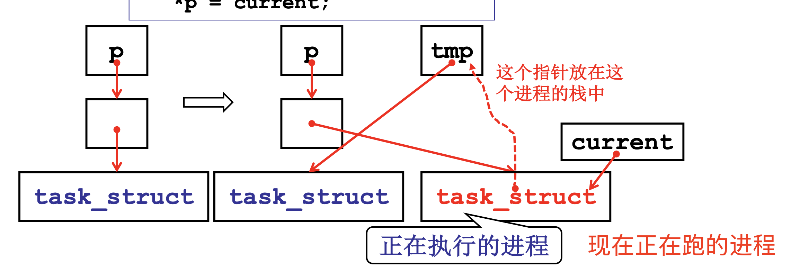
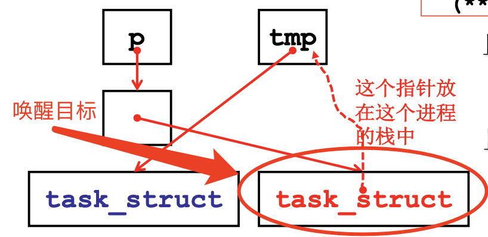

# 📘 2.11 信号量的代码实现 (Coding Semaphore)

> 来源说明：哈工大李治军操作系统课程 L18 | 本节涵盖：信号量数据结构、系统调用实现、Linux 0.11 sleep_on 队列与唤醒机制


## 🧠 核心概念总览（严格按原文顺序）


> 🔗 **返回知识库主页**：[操作系统笔记主页](./README.md)
- [*知识点1: 生产者代码与信号量使用模式*](#id1)
- [*知识点2: 信号量表 `semtable` 的数据结构*](#id2)
- [*知识点3: `sys_sem_open` 系统调用实现*](#id3)
- [*知识点4: `sys_sem_wait` 系统调用实现*](#id4)
- [*知识点5: Linux 0.11 中的同步示例：`bread`*](#id5)
- [*知识点6:`lock_buffer` 函数与睡眠机制*](#id6)
- [*知识点7: `sleep_on` 函数的核心实现*](#id7)
- [*知识点8: 磁盘中断处理 `read_intr`*](#id9)
- [*知识点9: `end_request` 与 `unlock_buffer`*](#id10)
- [*知识点10: `wake_up` 函数实现*](#id11)
- [*知识点11: `sleep_on` 的唤醒延续机制*](#id12)
- [*知识点12: `while(lock)` 的问题分析*](#id13)

---

<a id="id1"></a>
## ✅ 知识点1: 生产者代码与信号量使用模式

**现在我们从理论走进实际...**
- 从"纸上的 PV 操作"到"实际可运行的代码"，需要封装成系统调用
- 生产者 `Producer(item)` 的代码框架：
  - 先 `P(empty)` —— 申请空缓冲区
  - 生产数据写入缓冲区
  - 再 `V(full)` —— 释放满缓冲区
- `main()` 函数中：
  - `(1) sd = sem_open("empty")` —— 用户态程序 `producer.c` / `sem.c` 调用，进入内核
  - `(2) for(i=1 to 5)` 循环中调用 `sem_wait(sd)` 和 `write(fd, &i, 4)`

> ⚠️ **关键区分**：用户态的 `sem_open`、`sem_wait` 是库函数，最终会陷入内核执行 `sys_` 开头的系统调用
> 📋 **术语提醒**：`sem_open()` 对应创建/打开信号量，`sem_wait()` 对应 `P` 操作

---

<a id="id2"></a>
## ✅ 知识点2: 信号量表 `semtable` 的数据结构

**我们需要一个semaphore有一个value，和PCB队列能让多个进程都看到 -- 那就需要这个semaphore数据结构在内核**
- 内核中需要维护一个全局的信号量表，用于管理所有信号量
- `semtable` 的定义：
  ```c
  typedef struct {
      char name[20];        // 信号量名称，用于标识
      int value;            // 信号量的值
      task_struct * queue;  // 阻塞队列（等待该信号量的进程链表）
  } semtable[20];
  ```
  - `semtable` 是一个大小为 20 的数组，每个元素包含：
    - `name[20]`：信号量的名字字符串
    - `value`：信号量的当前值
    - `queue`：指向 `task_struct` 的指针，构成阻塞队列


> ⚠️ **关键区分**：这里的 `queue` 是单链表指针，不是队列数据结构本身——它指向链表头
> 💡 **理解技巧**：把 `semtable` 想象成"信号量仓库的货架"，每个格子放一个信号量的全部信息
> 🔄 **知识关联**：`task_struct * queue` 后续会通过 `sleep_on` 机制隐式形成链表


---

<a id="id3"></a>
## ✅ 知识点3: `sys_sem_open` 系统调用实现

**通过 `sem_open` 函数调用系统调用函数**
- `sys_sem_open(char *name)` 的功能：
  - 在 `semtable` 中寻找 `name` 匹配的信号量
  - **没找到** → 创建一个新的信号量项
  - **找到了** → 返回对应的下标（数组索引）
- 返回值 `sd`（semaphore descriptor）是信号量描述符，后续 `sem_wait` / `sem_post` 用它定位信号量

  ```c
  sys_sem_open(char *name)
  {
      // 在 semtable 中寻找 name 对上的;
      // 没找到则创建;
      // 返回对应的下标;
  }
  ```
> ⚠️ **关键区分**：`sem_open` 返回的是数组下标，不是指针——这是为了用户态/内核态隔离
> 💡 **理解技巧**：类似文件描述符 `fd` 的设计哲学——用一个整数句柄屏蔽底层细节


---

<a id="id4"></a>
## ✅ 知识点4: `sys_sem_wait` 系统调用实现

**接下来生产者 `P(empty)` 就需要调用 `sem_wait(sd)`**
- **示例**：
  
- `sem_wait(sd)` 需要去内核调用 `sys_sem_wait`
- `sys_sem_wait(int sd)` 对应 `P` 操作的系统调用实现

  ```c
  sys_sem_wait(int sd){
      cli();                          // 关中断，原子操作保护
      if(semtable[sd].value-- < 0){   // 信号量减1，判断是否需要阻塞
          // 设置自己为阻塞;
          // 将自己加入 semtable[sd].queue 中;
          schedule();                 // 让出CPU，调度其他进程
      }
      sti();                          // 开中断
  }
  ```
  - 核心逻辑：
    1. `cli()` —— 关中断，保证操作原子性
    2. `semtable[sd].value--` —— 信号量值减 1
    3. **判断**：如果减量后的值 `< 0`：
        - 设置当前进程为阻塞状态
        - 将当前进程加入 `semtable[sd].queue` 阻塞队列
        - 调用 `schedule()` 触发调度，切换到其他进程
          > `cli()` 后时钟中断进不来，但 schedule() 是显式函数调用，不需要中断触发，直接切任务就行
    4. `sti()` —— 开中断

> ⚠️ **关键警告**：`cli()` 和 `sti()` 必须成对出现！关中断期间不能执行任何可能睡眠的操作（除了最后的 `schedule()`）
> 📋 **术语提醒**：`cli()` = Clear Interrupt，x86 关中断指令；`sti()` = Set Interrupt，开中断指令
> 💡 **理解技巧**：信号量的值 `value` 含义：
  >   - `value > 0`：可用资源数量
  >   - `value = 0`：刚好用完，再来一个就阻塞
  >   - `value < 0`：绝对值 = 阻塞队列中的进程数


---

<a id="id5"></a>
## ✅ 知识点5: Linux 0.11 中的同步示例：`bread`

**linux内部是否用过这种同步呢？ -- 有！**
- `bread(dev, block)` —— Buffer Read，从磁盘块读取数据到缓冲区
- 这是操作系统中 **I/O 同步** 的典型场景：
  - 申请一段内存缓冲区
  - 启动磁盘读操作（异步的）
  - 当前进程需要等待磁盘读完才能继续
  ```c
  bread(int dev, int block){
      struct buffer_head * bh;    // 申请一段空闲缓冲
      ll_rw_block(READ, bh);      // 发起磁盘读，后续讲
      wait_on_buffer(bh);         // 等待磁盘读完（会睡眠）
      // 读磁盘块
      // 启动磁盘读以后睡眠，等待磁盘读完由磁盘中断将其唤醒，也是一种同步
  }
  ```
  - 代码流程：
    1. `ll_rw_block(READ, bh)` —— 发起磁盘读请求
    2. `wait_on_buffer(bh)` —— 等待缓冲区就绪（睡眠等待）
        - `bh` 这个缓冲区带着一个信号量变量
  - **本质**：启动磁盘读后睡眠，等待磁盘读完由磁盘中断将其唤醒——也是一种同步

> ⚠️ **关键区分**：磁盘 I/O 是异步发起的，但进程通过 `wait_on_buffer` 实现了"同步等待"
> 💡 **理解技巧**：就像点外卖——下单是瞬间完成的（异步），但你得等送到才能吃（同步等待）


---

<a id="id6"></a>
## ✅ 知识点6: `lock_buffer` 函数与睡眠机制

**缓冲区 `bh` 定义了一个信号量 `b_lock`**
- `lock_buffer(buffer_head *bh)` 用于获取缓冲区锁
- 如果缓冲区已被锁定（`bh->b_lock == 1`），当前进程需要睡眠等待

  ```c
  lock_buffer(buffer_head *bh)
  {
      cli();
      while(bh->b_lock)
          ...                         
          sleep_on(&bh->b_wait);      // 在缓冲区等待队列上睡眠
      bh->b_lock = 1;                 // 获得锁
      sti();
  }
  ```
  - 代码逻辑：
    1. `cli()` —— 关中断，保护临界区 `b_block`
    2. `while(bh->b_lock)` —— 检查锁状态
    3. 如果已被锁 → `sleep_on(&bh->b_wait)` —— 在缓冲区的等待队列上睡眠
    4. `bh->b_lock = 1` —— 获得锁
    5. `sti()` —— 开中断

> ⚠️ **关键警告**：课件中 `while(bh->b_lock)` 这里使用的是 `while` 做的，区别于 `sys_sem_wait` 使用 `if` -- 了解了 `sleep_on` 机制就知道为什么用 `while` 了


---

<a id="id7"></a>
## ✅ 知识点7: `sleep_on` 函数的核心实现

**`sleep_on` 是整个 Linux 0.11 睡眠/唤醒机制的核心函数**

- 参数 `p` 是一个 **指向 `task_struct` 指针的指针**（即 `task_struct **`）

  ```c
  void sleep_on(struct task_struct **p){
      struct task_struct *tmp;
      tmp = *p;                           // 保存原来的队列头
      *p = current;                       // 当前进程成为新的队列头
      current->state = TASK_UNINTERRUPTIBLE;  // 不可中断睡眠
      schedule();                         // 我这里睡眠了，切到别的进程去执行
      if (tmp)
          tmp->state = 0;                 // 唤醒队列中的下一个进程！
  }
  ```
  - 核心逻辑：
    1. `tmp = *p` —— 将 `tmp` 指向下一个进程 `task_struct`/`pcb`（也就是 `p` 传入进来的）
    2. `*p = current` —— 将 `*p` 指向当前运行的 `task_struct`/`pcb`
        - 而当前 `tmp` 存在**当前进程 `current` 的内核栈上**。
        - 切走切回靠 `TSS` 恢复内核栈数据，内核栈上自然保留数据包括 `tmp`，故实现链接
        - 所以 当前进程 `pcb` 又可以指向下一个进程 `pcb`
        - `*p`（队列头）→ `current`（最后来的，队首）→ `tmp`（前一个）→ 下一个进程 `pcb` → ... → NULL
    
    > ⚠️ **关键警告**：这个队列是"隐式的"——它没有显式的 `next` 指针字段，而是通过 **栈帧链** 连接
    > ⚠️ **关键约束**：进程不能随意退出内核态！如果进程退出，`tmp` 所在的栈帧被销毁，队列就断了
    > 📋 **术语提醒**：这个设计被称为 **"隐式栈队列"** 或 **"栈上链表"(stack-based linked list)**
    > ⚠️ **关键警告**：`tmp` 是局部变量，存储在 **当前进程的栈中**——这是"隐蔽队列"的核心设计
    > 📋 **术语提醒**：`current` 是全局变量，指向当前正在运行的进程

    3. `current->state = TASK_UNINTERRUPTIBLE` —— 设置当前进程为不可中断睡眠
    4. `schedule()` —— 调用调度器，切换进程
    5. `if (tmp) tmp->state = 0` —— 唤醒链中的下一个进程（这是隐藏的秘密！）

> ⚠️ **关键区分**：`TASK_UNINTERRUPTIBLE` vs `TASK_INTERRUPTIBLE`——不可中断睡眠不会被信号唤醒
> 💡 **理解技巧**：把 `sleep_on` 想象成"插队"——新来的进程站在队首，把原来的队首"藏在口袋里"（栈里）


---

<a id="id9"></a>
## ✅ 知识点9: 磁盘中断处理 `read_intr`

**那么如何去唤醒队列中进程？**
- 当磁盘读完数据后，会产生 **磁盘中断**
  ```c
  static void read_intr(void){
      ...
      end_request(1);     // 通知请求完成，参数1表示成功
  }
  ```

  - `read_intr()` 是磁盘中断处理函数（读操作完成时调用）
  - 中断处理流程：
    1. 读取磁盘数据到缓冲区
    2. 调用 `end_request(1)` —— 通知请求处理完成（参数 1 表示成功）
  - **关键点**：中断处理程序运行在中断上下文，不能睡眠，只能快速处理


> ⚠️ **关键区分**：`read_intr` 是中断处理程序，不是普通函数——它在中断上下文中运行
> 💡 **理解技巧**：中断处理就像"快递到了按门铃"——门铃响了你得去开门（处理中断），但不能在门铃响的时候倒头大睡
> 🔄 **知识关联**：中断 → `end_request` → `unlock_buffer` → `wake_up` —— 形成完整的唤醒链


---

<a id="id10"></a>
## ✅ 知识点9: `end_request` 与 `unlock_buffer`

**然后深入调用 `end_request()` 和 `unlock_buffer`**
- `end_request(int uptodate)` —— 结束一个块设备请求
  - 参数 `uptodate`：1 表示成功，0 表示失败
  - 内部调用 `unlock_buffer(CURRENT->bh)` 解锁缓冲区
- `unlock_buffer(struct buffer_head * bh)` —— 解锁缓冲区
  - `bh->b_lock = 0` —— 清除锁标志，解锁
  - `wake_up(&bh->b_wait)` —— 唤醒等待该缓冲区的所有进程

  ```c
  end_request(int uptodate){
      ...
      unlock_buffer(CURRENT->bh);
  }

  unlock_buffer(struct buffer_head * bh){
      bh->b_lock = 0;             // 清锁
      wake_up(&bh->b_wait);       // 唤醒等待队列
  }
  ```

> ⚠️ **关键区分**：`CURRENT` 是全局变量，指向当前正在处理 I/O 请求的进程——不一定是发起请求的进程
> ⚠️ **关键警告**：`bh->b_lock = 0` 必须在 `wake_up` 之前——否则被唤醒的进程可能马上又看到锁被占
> 💡 **理解技巧**：`unlock_buffer` 就是"开锁放人"——先开锁，再喊醒排队的人


---

<a id="id11"></a>
## ✅ 知识点10: `wake_up` 函数实现

**最后再开始真正的叫醒进程流程!!!**
- `wake_up(struct task_struct **p)` —— 唤醒等待队列上的进程
- **核心逻辑**：
  
  1. 检查 `p` 和 `*p` 是否有效
  2. `(**p).state = 0` —— 将队列头的进程状态设为 `0`（`TASK_RUNNING`，可运行）
      > 📋 **术语提醒**：`state = 0` 在 Linux 0.11 中表示 `TASK_RUNNING`；`TASK_RUNNING` = 0, `TASK_INTERRUPTIBLE` = 1, `TASK_UNINTERRUPTIBLE` = 2
  3. `*p = NULL` —— 清空队列头指针
- **注意**：`wake_up` 只唤醒队列头的 **一个进程**，不是唤醒全部

  ```c
  wake_up(struct task_struct **p){
      if (p && *p) {          // 检查指针有效性
          (**p).state = 0;    // 设置队首进程为可运行状态
          *p = NULL;          // 清空队列头
      }
  }
  ```

> ⚠️ **关键警告**：`wake_up` 只唤醒一个进程（队首）！
> ⚠️ **关键区分**：`state = 0` 对应 `TASK_RUNNING`（可运行），不是立即运行——进程进入就绪队列等待调度


---

<a id="id12"></a>
## ✅ 知识点11: `sleep_on` 的唤醒延续机制

**一个进程被唤醒之后，他回从哪里开始执行呢？-- 从上一次停止执行切出去的地方...**
- `sleep_on` 的最后三行是唤醒链的关键：
  ```c
  ...
  schedule();         //上一次是从这里切出去的，那么这次就要从这里开始跑
  if (tmp)            //检查 tmp 是否指向下一个进程的有效 pcb 
      tmp->state = 0; //唤醒"藏在我栈里"的下一个进程
  ```
  
- 唤醒过程（级联唤醒）：
  1. 进程 C 被 `wake_up` 唤醒，`state = 0`
  2. C 被调度执行，从 `schedule()` 返回
  3. C 执行 `if (tmp_C) tmp_C->state = 0` —— 唤醒 B
  4. B 被调度执行，从 `schedule()` 返回
  5. B 执行 `if (tmp_B) tmp_B->state = 0` —— 唤醒 A
  6. A 被调度执行……
- **本质**：唤醒像多米诺骨牌一样逐个传递——这就是 **级联唤醒(cascade wake-up)**


> ⚠️ **关键警告**：级联唤醒的顺序是 **LIFO（后进先出）**——最后睡的进程最先被唤醒，但是全唤醒后需要 `schedule` 来决定到底谁去执行(优先级问题)...
> ⚠️ **关键约束**：如果中间某个进程被信号中断或异常退出，级联链可能断裂


---

<a id="id13"></a>
## ✅ 知识点12: `while(lock)` 的问题分析

**回到之前的问题：这里就解释了为什么使用的时 `while` 进行 `sleep_on`**
- 回到 `lock_buffer` 中的 `while(bh->b_lock)`：
  ```c
  lock_buffer(buffer_head *bh)
  {
      cli();
      while(bh->b_lock)
          ???
          sleep_on(&bh->b_wait);
      bh->b_lock = 1;
      sti();
  }
  ```
- **问题**：`sleep_on` 函数为什么需要使用 `while` 循环呢？
- **答案**：实现级联唤醒
- **原因分析**：
  - 进程被 `wake_up` 唤醒后，`state = 0`，进入就绪队列
  - 被调度执行后，从 `schedule()` 返回
  - 然后执行 `if (tmp) tmp->state = 0` —— 唤醒下一个
  - 接着回到 `lock_buffer` 的 `while(bh->b_lock)` 判断
  - 此时 `bh->b_lock` 可能 **已经被别的进程重新设为 0**！
  - 那么这个进程就可以执行拿到 `b_lock` 并将其设为 1
  - 其他进程又继续再 `while` 循环中等待
- **关键洞察**：`sleep_on` 返回后，必须 **重新检查条件**——这是经典的 **"醒来后再判断"** 模式

> ⚠️ **关键警告**：不能用 `if(bh->b_lock)` 必须用 `while(bh->b_lock)`！因为唤醒后条件可能又不满足了（别的进程抢到了锁）
> ⚠️ **关键区分**：这是操作系统经典的 **Mesa 语义**（醒来后再检查）
> 💡 **理解技巧**：就像排队上厕所——你被人叫醒说"空出来了"，但走到门口发现又有人进去了，所以得继续等


---

## 🔑 核心要点总结

1. **信号量系统调用三件套**：`sem_open`（创建/打开）、`sem_wait`（P操作）、`sem_post`（V操作）——`sem_wait` 用 `cli/sti` 保护临界区
2. **Linux 0.11 的睡眠机制精髓**：`sleep_on` 用进程内核栈上的局部变量 `tmp` 隐式构造链表，无需额外内存分配
3. **级联唤醒链**：`wake_up` 只唤醒队首，后面的进程靠 `sleep_on` 最后的 `tmp->state = 0` 逐个传递唤醒
4. **Mesa 语义实践**：`lock_buffer` 中用 `while(lock)` 而非 `if(lock)`——被唤醒后必须重新检查条件
5. **中断到唤醒的完整链路**：磁盘读完 → `read_intr` → `end_request` → `unlock_buffer` → `wake_up` → 进程被唤醒

---

## 📌 考试速记版

- **关键机制**：`sleep_on` 隐式队列 = 进程栈上的 `tmp` 变量形成链表；`wake_up` 级联唤醒 = 逐个传递 `state = 0`
- **易混淆概念对比**：

| 特性 | `sleep_on` 队列 | 普通链表队列 |
|------|----------------|-------------|
| 存储位置 | 进程内核栈 | 堆/全局区 |
| `next` 指针 | 隐式（`tmp` 变量） | 显式结构体字段 |
| 唤醒顺序 | LIFO（栈语义） | FIFO（队列语义） |
| 内存分配 | 无（用栈帧） | 需要动态分配 |
| 可靠性 | 进程不能随意退出内核 | 更稳定 |

- **常见考试陷阱**：
  - `sys_sem_wait` 中 `value-- < 0` 是**先减后判**，不是先判后减！
  - `sleep_on` 的 `tmp` 存在**当前进程的栈中**，不是全局变量！
  - `wake_up` 只唤醒**一个进程**（队首），不是全部唤醒！
  - `while(lock)` 不能写成 `if(lock)`——这是 Mesa 语义的要求！

**记忆口诀**：
> 信号量表存内核，P减V加原子行；
> sleep_on 隐式链，tmp藏栈妙无穷；
> wake_up 唤一个，级联传递 Domino；
> while 检查莫用 if，Mesa 语义保正确！
