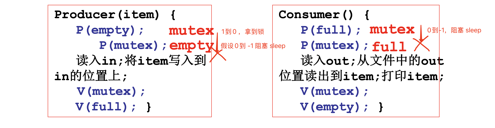
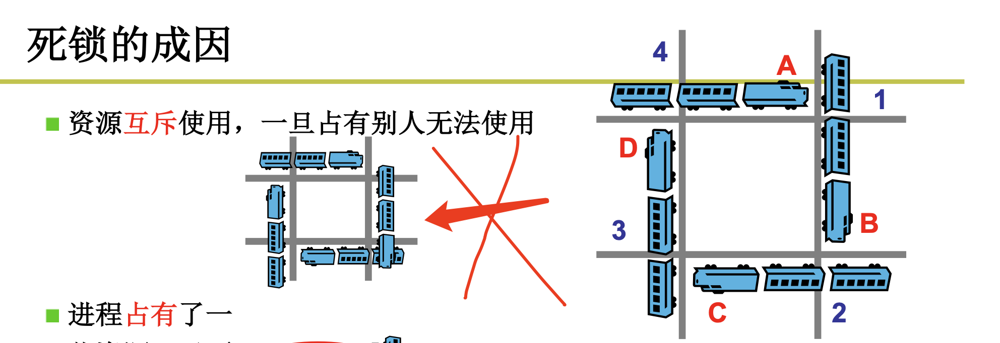
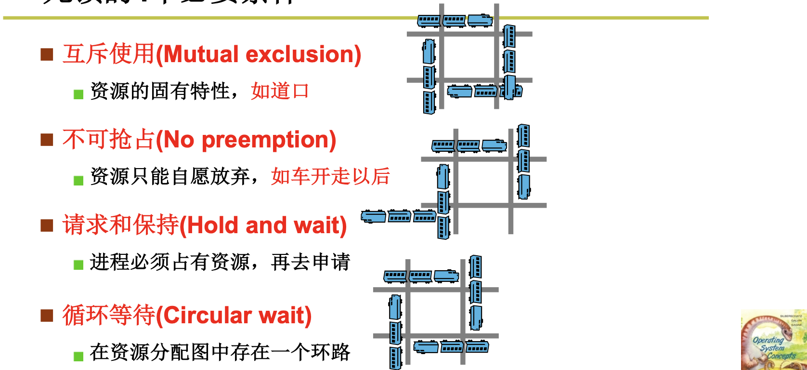
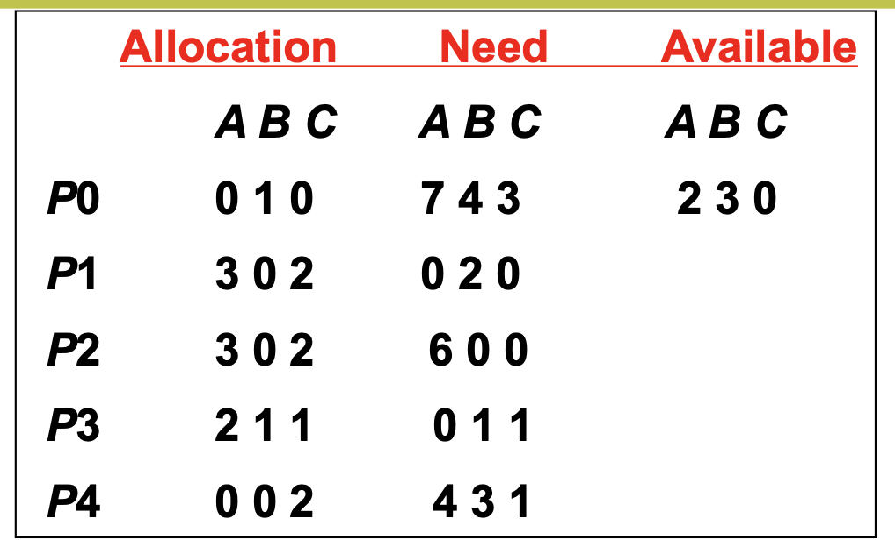

# 📘 2.12 死锁处理 (Deadlock Handling)

> 来源说明：哈工大李治军操作系统课程 L19 | 本节涵盖：死锁成因、四种处理策略及银行家算法核心机制

---

## 🧠 核心概念总览（严格按原文顺序）

- [*知识点1: 死锁引入与生产者-消费者错误示例*](#id1)
- [*知识点2: 死锁的成因与四个必要条件*](#id2)
- [*知识点3: 死锁处理方法概述*](#id3)
- [*知识点4: 死锁预防——一次性申请所有资源*](#id4)
- [*知识点5: 死锁预防——资源按序申请*](#id5)
- [*知识点6: 死锁避免——判断此次请求是否引起死锁?*](#id6)
- [*知识点7: 银行家算法之数据结构定义*](#id7)
- [*知识点8: 银行家算法之核心算法与实例*](#id8)
- [*知识点9: 银行家算法之资源请求处理*](#id9)
- [*知识点10: 死锁检测与恢复*](#id10)
- [*知识点11: 死锁忽略*](#id11)

---

<a id="id1"></a>
## ✅ 知识点1: 死锁引入与生产者-消费者错误示例

**生产者消费者模型的信号量接发就会造成死锁现象...**
- 对生产者-消费者信号量解法的反复琢磨是无穷无尽的
- **死锁(`Deadlock`)**：多个进程由于互相等待对方持有的资源而造成的谁都无法执行的情况
- 错误根源：**申请资源的顺序不当**
  
  - 生产者先 `p(mutex)` 再 `empty()`
  - 消费者先 `p(mutex)` 再 `full()`
- **死锁场景**：消费者持有 `mutex` 等待 `empty`，生产者持有 `empty` 等待 `mutex`，但 `full` 和 `empty` 的释放又依赖于对方释放 `mutex`，然而现在 `mutex` 又在生产者手里

> 💡 **理解技巧**：死锁就像两个人过桥，各走到一半，面对面堵在桥上，谁也无法后退
> 📋 **术语提醒**：`P()` 操作是请求资源，`V()` 操作是释放资源

---

<a id="id2"></a>
## ✅ 知识点2: 死锁的成因与四个必要条件

**那么这种现象是因为什么呢？**
- **三个核心成因（资源分配图视角）**：
  1. **资源互斥使用**：一旦占有，别人无法使用（类比：道口）
  2. **占有且等待**：进程占有一些资源不释放，再去申请其他资源
  3. **环路等待**：各自占有的资源和互相申请的资源形成环路（类比：1-2-3-4 循环）
  

- 死锁形成需要同时满足四个条件，缺一不可



>💡 **理解技巧**：把死锁想象成四人打牌，每个人都等着上家出牌，形成闭环，游戏卡住


---

<a id="id3"></a>
## ✅ 知识点3: 死锁处理方法概述

**围绕这几点问题，我们进行处理 ...**
- 操作系统中处理死锁的四种经典策略

  | 方法 | 核心思想 | 类比 |
  |:---|:---|:---|
  | **死锁预防** | 破坏死锁出现的条件 | "no smoking"，预防火灾 |
  | **死锁避免** | 检测每个资源请求，如果造成死锁就拒绝 | 检测到煤气超标时，自动切断电源 |
  | **死锁检测+恢复** | 检测到死锁出现时，让一些进程回滚，让出资源 | 发现火灾时，立刻拿起灭火器 |
  | **死锁忽略** | 就好像没有出现死锁一样 | 在太阳上可以对火灾全然不顾 |


>⚠️ **关键区分**：预防是"不让发生"，避免是"走一步看一步"，检测是"出了问题再修"，忽略是"假装没事"
>🔄 **知识关联**：实际系统中，Linux/Windows 都选择死锁忽略——后续会解释原因

---

<a id="id4"></a>
## ✅ 知识点4: 死锁预防——一次性申请所有资源

**先来看看第一种方法...**
- **做法**：在进程执行前，**一次性申请所有需要的资源，不会占有资源再去申请其它资源**
- **效果**：破坏"请求和保持"(`Hold and wait`) 条件

**缺点**
- **缺点1**：需要**预知未来**，编程困难——进程运行前要知道全程需要什么资源
- **缺点2**：许多资源分配后很长时间后才使用，**资源利用率低**


---

<a id="id5"></a>
## ✅ 知识点5: 死锁预防——资源按序申请

**另外一种方法...**
- **做法**：对资源类型进行**全局排序**，资源申请必须按序号递增顺序进行
- **效果**：破坏"循环等待"(`Circular wait`) 条件——不可能出现环路

**缺点**
- 仍然造成**资源浪费**
- 进程可能需要先申请后期才用的资源，提前占用

---

<a id="id6"></a>
## ✅ 知识点6: 死锁避免——判断此次请求是否引起死锁?

**另外一种方法...**
- **安全状态**(`Safe State`)：如果系统中的所有进程存在一个可完成的执行序列 $P_1, ..., P_n$，则称系统处于安全状态
- **安全序列**(`Safe Sequence`)：上述执行序列 $P_1, ..., P_n$
- **核心思想**：都能执行完成当然就不死锁——存在一个让所有进程都顺利跑完的路线图


> ⚠️ **关键区分**：安全状态**一定不死锁**，但不死锁**不一定安全**（安全是更强的条件）
> 💡 **理解技巧**：安全序列就像解谜游戏的通关顺序——按这个顺序走，所有角色都能活下来
> 🔄 **知识关联**：这是死锁避免的核心——不是禁止危险，而是确保始终走在"安全"的路径上


---

<a id="id7"></a>
## ✅ 知识点7: 银行家算法之数据结构定义

**死锁避免的经典算法...**
- 银行家算法(`Banker's Algorithm`) 由 Dijkstra 提出，模拟银行贷款的分配策略

- 核心数据结构定义：

  | 变量 | 类型 | 含义 |
  |:---|:---|:---|
  | `Available[1..m]` | `int[]` | 每种资源剩余数量 |
  | `Allocation[1..n,1..m]` | `int[][]` | 已分配资源数量 |
  | `Need[1..n,1..m]` | `int[][]` | 进程还需的各种资源数量 |
  | `Work[1..m]` | `int[]` | 工作向量（算法执行中的可用资源） |
  | `Finish[1..n]` | `bool[]` | 进程是否结束 |

- 关系恒等式：$Need[i][j] = Max[i][j] - Allocation[i][j]$

> ⚠️ **关键区分**：`Need` 是"还需要多少"，`Allocation` 是"已经拿到多少"，`Available` 是"系统还剩多少"


---

<a id="id8"></a>
## ✅ 知识点8: 银行家算法之核心算法与实例

**看看具体算法什么样的...**
- 核心思想：不断寻找可以完成的进程，模拟释放其资源，更新可用资源池
- 银行家算法伪代码：
  ```c
  // 初始化
  Work = Available;
  Finish[1..n] = false;

  while(true) {
      for(i = 1; i <= n; i++) {
          if(Finish[i] == false && Need[i] <= Work) { //判断一下work能不能满足
              Work = Work + Allocation[i];  // 释放该进程占用的资源
              Finish[i] = true;             // 标记为已完成
              break;                        // 重新开始扫描
          }
      }
      // 如果没有找到可完成的进程，跳出循环
      else {
          goto end;
      }
  }

  End:
  for(i = 1; i <= n; i++)
      if(Finish[i] == false)
          return "deadlock";  // 存在死锁
  ```
- **时间复杂度**：$T(n) = O(mn^2)$

- **经典实例**：找安全序列

  | 进程 | Allocation (A B C) | Need (A B C) | Available (A B C) |
  |:---|:---|:---|:---|
  | $P_0$ | 0 1 0 | 7 4 3 | 3 3 2 |
  | $P_1$ | 2 0 0 | 1 2 2 | |
  | $P_2$ | 3 0 2 | 6 0 0 | |
  | $P_3$ | 2 1 1 | 0 1 1 | |
  | $P_4$ | 0 0 2 | 4 3 1 | |

  - **安全序列求解**：
    1. Work=[3,3,2], $P_1$ Need=[1,2,2] $\leq$ Work $\rightarrow$ Work=[5,3,2]
    2. Work=[5,3,2], $P_3$ Need=[0,1,1] $\leq$ Work $\rightarrow$ Work=[7,4,3]
    3. Work=[7,4,3], $P_2$ Need=[6,0,0] $\leq$ Work $\rightarrow$ Work=[10,4,5]
    4. Work=[10,4,5], $P_4$ Need=[4,3,1] $\leq$ Work $\rightarrow$ Work=[10,4,7]
    5. Work=[10,4,7], $P_0$ Need=[7,4,3] $\leq$ Work $\rightarrow$ Work=[10,5,7]
  - **安全序列**：$\langle P_1, P_3, P_2, P_4, P_0 \rangle$

> 📋 **术语提醒**：时间复杂度 $O(mn^2)$ 中，$m$=资源种类数，$n$=进程数——效率问题是实际系统不采用的原因

---

<a id="id9"></a>
## ✅ 知识点9: 银行家算法之资源请求处理

**假装分配...**
- 当进程 $P_i$ 发出资源请求 `Request[i]` 时：
  1. **假装分配**：试探性地分配资源，更新各矩阵
  2. **安全性检查**：运行银行家算法判断新状态是否安全
  3. **决策**：安全则真正分配，不安全则拒绝请求

- 场景：$P_0$ 申请 $(0, 2, 0)$
  - **初始状态**：
    
  - **步骤1：假装分配后的状态** $P_0$ 申请 $(0, 2, 0)$

    | 进程 | Allocation (A B C) | Need (A B C) | Available (A B C) |
    |:---|:---|:---|:---|
    | $P_0$ | **0 3 0** | **7 2 3** | **2 1 0** |
    | $P_1$ | 2 0 0 | 1 2 2 | |
    | $P_2$ | 3 0 2 | 6 0 0 | |
    | $P_3$ | 2 1 1 | 0 1 1 | |
    | $P_4$ | 0 0 2 | 4 3 1 | |

  - **步骤2：安全性检查**
    - Work = [2, 1, 0]
    - $P_0$: Need=[7,2,3] > Work ✗
    - $P_1$: Need=[1,2,2] > Work（B: 2 > 1）✗
    - $P_2$: Need=[6,0,0] > Work ✗
    - $P_3$: Need=[0,1,1] > Work（C: 1 > 0）✗
    - $P_4$: Need=[4,3,1] > Work ✗

  - **结果**：$P_0, P_1, P_2, P_3, P_4$ 一个也没法执行，**死锁进程组**
- **结论**：此次申请被拒绝，$P_0$ 必须等待

> ⚠️ **关键区分**："假装分配"不是真的分配，是模拟推演；只有推演通过才执行真实分配
> 🔄 **知识关联**：每次资源请求都要 $O(mn^2)$ 的复杂度，这是银行家算法在实际系统中难以采用的主要原因


---

<a id="id10"></a>
## ✅ 知识点10: 死锁检测与恢复

**理论**
- **基本原因**：每次申请都执行银行家算法 $O(mn^2)$ 效率太低，改为**发现问题再处理**
- **检测时机**：定时检测 / 或发现资源利用率低时检测

**教材示例/公式**
- 检测算法（与银行家算法类似）：
  ```c
  Finish[1..n] = false;

  // 初始化：没有分配资源的进程直接标记为完成
  if(Allocation[i] == 0)
      Finish[i] = true;

  // ... 和 Banker 算法完全一样

  // 检测死锁进程
  for(i = 1; i <= n; i++)
      if(Finish[i] == false)
          deadlock = deadlock + {i};
  ```

- **恢复难题**：

| 问题 | 说明 |
|:---|:---|
| **选择哪些进程回滚？** | 优先级？占用资源多的？运行时间短的？ |
| **如何实现回滚？** | 那些已经修改的文件怎么办？——状态恢复极其困难 |

**注意点**
- ⚠️ **关键区分**：检测算法只是告诉"有哪些进程死锁了"，但"怎么办"是更大的难题
- 💡 **理解技巧**：这就像体检能查出病，但治疗方案可能很复杂，有些"病"治了反而更糟
- 🔄 **知识关联**：数据库中的事务回滚有日志支持，但通用进程的回滚没有这种基础设施
- 📋 **术语提醒**：`Rollback` 在 OS 中比数据库中困难得多——没有 `undo log`

---

<a id="id11"></a>
## ✅ 知识点11: 死锁忽略

**理论**
- **引出原因**：

| 方法 | 问题 |
|:---|:---|
| 死锁预防 | 引入太多不合理因素 |
| 死锁避免 | 每次申请都执行银行家算法 $O(mn^2)$，效率太低 |
| 死锁检测+恢复 | 恢复很不容易，进程造成的改变很难恢复 |

- **实际应用**：**大多数非专门的操作系统都用它**——UNIX, Linux, Windows
- **核心原因**：
  1. 死锁出现不是确定的（小概率事件）
  2. 可以用**重启**来处理死锁
  3. PC 重启造成的影响小

- **选择题要点**：
  - 死锁忽略的处理代价**最小** ✓
  - 死锁可以用重启来解决，PC 重启造成的影响小 ✓
  - 死锁预防让编程变得困难 ✓
  - **"PC 机上死锁概率比其他机器低"** ✗——这是不正确的说法

**注意点**
- ⚠️ **关键区分**：死锁忽略不是"解决了死锁"，而是"选择不解决"——成本收益的权衡
- 💡 **理解技巧**：就像人不会为了防止车祸而不出门——概率低、后果可控，就选择承受风险
- 🔄 **知识关联**：这是工程思维的体现——完美方案不存在时，选择"足够好"的方案
- 📋 **术语提醒**：`Deadlock Ignorance` = `Ostrich Algorithm`（鸵鸟算法）——把头埋进沙子里假装看不见

---

## 🔑 核心要点总结

1. **死锁四条件**：互斥、不可抢占、请求和保持、循环等待——**缺一不可**
2. **预防策略**：破坏条件（一次性申请 / 按序申请），但代价高、不实用
3. **银行家算法**：核心找安全序列，时间复杂度 $O(mn^2)$——理论完美、实践受限
4. **资源请求处理**：先"假装分配"再安全性检查——安全则通过，不安全则拒绝
5. **实际选择**：通用 OS（Windows/Linux）采用**死锁忽略**，因死锁概率低且重启代价小

## 📌 考试速记版

- **关键机制**：银行家算法 = 找安全序列；死锁检测 = 标记未分配进程先 Finish=true
- **易混淆概念对比**：

| 策略 | 时机 | 代价 | 实用性 |
|:---|:---|:---|:---|
| 预防 | 运行前 | 资源利用率低 | 差 |
| 避免 | 每次请求 | $O(mn^2)$ | 较差 |
| 检测+恢复 | 定时 | 回滚困难 | 一般 |
| 忽略 | 从不 | 重启 | **最佳（通用OS）** |

- **常见考试陷阱**：
  - 安全状态 $\Rightarrow$ 不死锁，但不死锁 $\\nRightarrow$ 安全
  - 银行家算法每次请求都要跑一遍 $O(mn^2)$
  - 死锁忽略不是因为"PC 死锁概率低"，而是因为"重启代价小"

**记忆口诀**："四条件缺一不可，银行家算安全路，通用系统装鸵鸟，重启一下全恢复"
