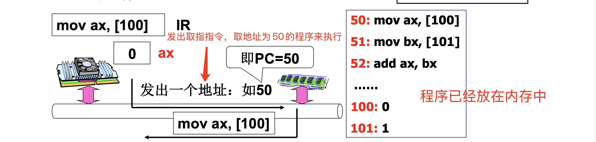
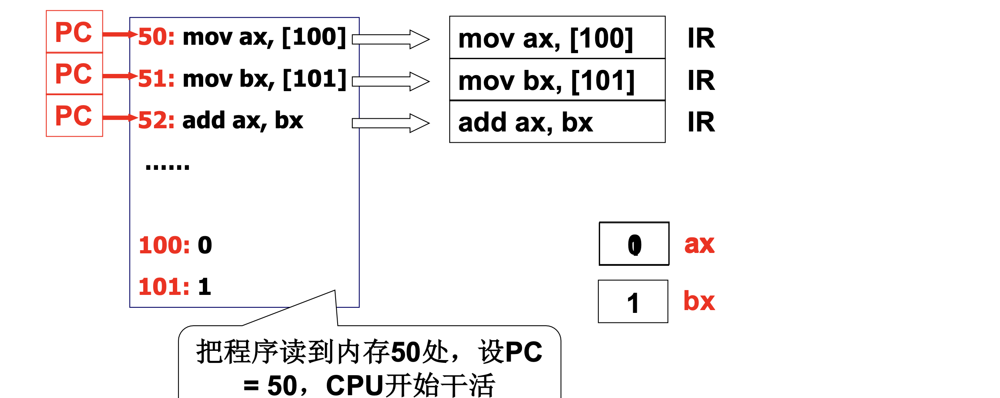
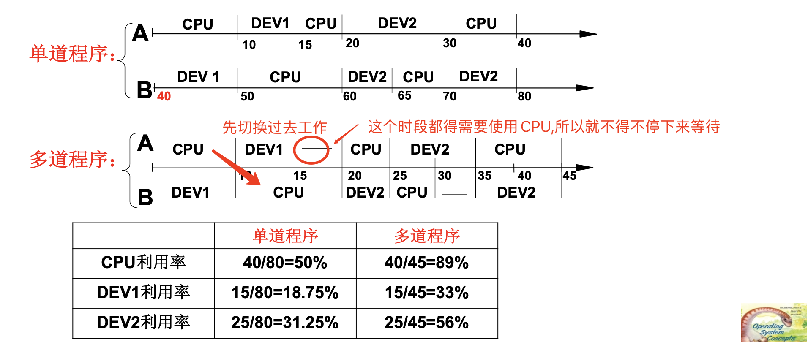
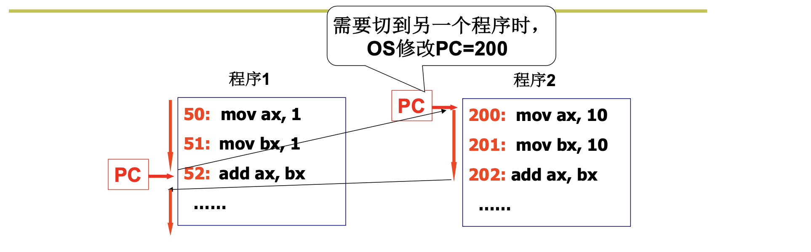
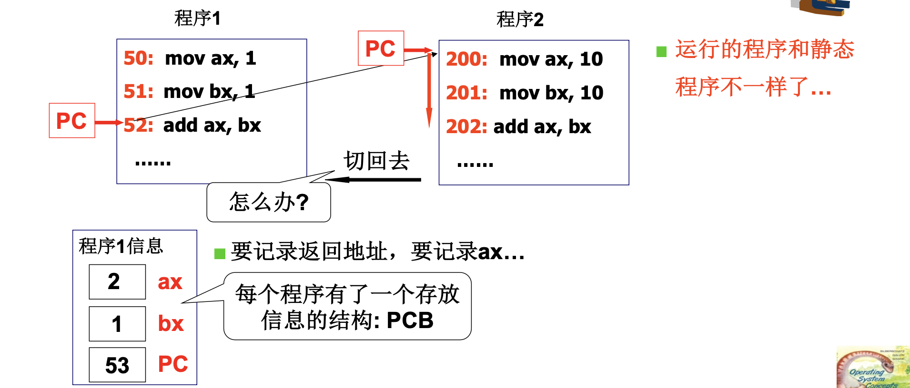

# 📘 2.1 CPU 管理的直观想法 (Intuitive Ideas of CPU Management)

> 来源说明：哈工大李治军《操作系统》课程 L8 | 本节涵盖：CPU 工作原理、多道程序并发执行、进程概念的引入

---

## 🧠 核心概念总览（严格按原文顺序）

> 🔗 **返回知识库主页**：[操作系统笔记主页](./README.md)

- [*知识点1: CPU 的工作原理——取指执行*](#id1)
- [*知识点2: 管理 CPU 的最直观方法*](#id2)
- [*知识点3: I/O 等待暴露 CPU 利用率问题*](#id3)
- [*知识点4: 多道程序与交替执行*](#id4)
- [*知识点5: 并发——一个 CPU 上交替执行多个程序*](#id5)
- [*知识点6: 切换时需要保存的信息——不仅仅是 PC*](#id6)
- [*知识点7: PCB 与进程概念的引入*](#id7)

---

<a id="id1"></a>
## ✅ 知识点1: CPU 的工作原理——取指执行

**管理CPU，先要使用CPU ...**
- CPU 上电以后的核心行为：**自动的取指—执行**
- 示例指令序列：
  
- CPU 执行流程：
  1. `PC = 50` → 取出指令 `mov ax, [100]` → 执行 → ax = 0
  2. `PC = 51` → 取出指令 `mov bx, [101]` → 执行 → bx = 1
  3. `PC = 52` → 取出指令 `add ax, bx` → 执行 → ax = 1
- 关键部件：**`PC(Program Counter)`** — 程序计数器，指向下一条要执行的指令地址
  > 📋 **术语提醒**：`PC(Program Counter)` — 也叫指令指针 `IP(Instruction Pointer)`
- CPU 工作的本质：取出 PC 指向的指令，执行，然后 PC 自动递增，循环往复
  > ⚠️ **关键区分**：CPU 的"自动取指执行"是硬件层面的行为，不需要操作系统干预
> 💡 **理解技巧**：把 CPU 想象成一个"自动搬砖机"——只要告诉它从哪里开始（PC 初值），它就会一直按顺序取指令、执行、往前走


---

<a id="id2"></a>
## ✅ 知识点2: 管理 CPU 的最直观方法

**CPU怎么才能工作起来呢？**
- 最直观的方法：**设好 PC 初值就完事！**
- 具体步骤：
  1. 把程序读到内存（如 50 处）
  2. 设 `PC = 50`
  3. CPU 开始自动取指执行
- 这是**单道程序**的执行方式——一个程序从头执行到尾，CPU 独占


> 🔄 **知识关联**：L2 揭开钢琴的盖子 — CPU 开机时 `CS=0xFFFF, IP=0x0000` 就是设置 PC 初值的过程

---

<a id="id3"></a>
## ✅ 知识点3: I/O 等待暴露 CPU 利用率问题

**你是否能发现有什么问题？**
- 示例程序（含 I/O 操作）：
  ```c
  int main(int argc, char* argv[])
  {
    int i, to, *fp, sum = 0;
    to = atoi(argv[1]);
    for(i=1; i<=to; i++)
    {
      sum = sum + i;
      fprintf(fp, "%d", sum);  // 文件输出 = I/O 操作
    }
  }
  ```
- 问题分析：
  - 若`fprintf` 用一条其他计算语句代替如`sum`：执行时间约为 $0.015 \times 10^7$ 单位
    
  - 实际的 `fprintf`（磁盘 I/O）执行时间约为 $0.859 \times 10^3$ 单位
    
  - 速度比：**$5.7 \times 10^5 : 1$** — CPU 计算比磁盘 I/O 快约 57 万倍！
- **问题本质**：**I/O 操作时 CPU 在空等 — 磁盘读写期间，CPU 无事可做，利用率极低**
  - > ⚠️ **关键区分**：CPU 计算速度 vs I/O 速度的巨大差异，是操作系统需要管理 CPU 的根本原因
  - CPU是电路工作速度快，IO需要访问磁盘驱动机械设备磁臂速度慢
> 🔄 **知识关联**：L1 什么是操作系统 — OS 的核心价值之一就是"高效使用硬件"，避免 CPU 空转


---

<a id="id4"></a>
## ✅ 知识点4: 多道程序与交替执行

**问题怎么解决呢？**
- 解决方案：`多道程序(Multi-programming)` — 内存中同时存放多个程序，共享 CPU 时间：
  
- 单道程序 vs 多道程序对比：
  

- 核心思想：当程序 A 进行 I/O（等待磁盘）时，切换到程序 B 执行计算，CPU 不再空等

> ⚠️ **关键区分**：多道程序不是"同时执行"（一个 CPU 不能真正同时跑两个程序），而是**交替执行**


---

<a id="id5"></a>
## ✅ 知识点5: 并发——一个 CPU 上交替执行多个程序

**解决思路**
- **并发(Concurrency)**：一个 CPU 上交替地执行多个程序
- 示例：程序 1 和程序 2 在内存中交替执行
  
- 切换机制：当需要切换到另一个程序时，**操作系统修改 PC = 200**
- 操作系统控制 CPU 在多个程序之间"跳来跳去"，实现并发效果


> ⚠️ **关键区分**：`并发(Concurrency)` 是**交替执行**（一个 CPU 上快速切换），不是`并行(Parallelism)`（多个 CPU 同时执行）


---

<a id="id6"></a>
## ✅ 知识点6: 切换时需要保存的信息——不仅仅是 PC

**具体如何实现的？**
- 问题：当程序 1 执行到一半被切走时，除了 PC，还需要保存什么？
  
- 当切回程序 1 时，需要恢复：
  - `PC` 的值（回到上次断点）
  - `ax` 的值（累加结果）
  - `bx` 的值（临时数据）
  - 所有其他寄存器的值
- 结论：仅仅保存 PC 不够，需要保存**完整的程序运行状态**


> ⚠️ **关键区分**：程序 1 被切走时，必须保存所有寄存器状态；切回来时，必须恢复所有状态——否则程序执行会出错

> 📋 **术语提醒**：`上下文(Context)` — 程序运行时的完整状态，包括所有寄存器值、PC、程序状态字等

---

<a id="id7"></a>
## ✅ 知识点7: PCB 与进程概念的引入

**此时引入关键概念！**
- 核心发现：**运行的程序和静态程序不一样！**
  - 进程有开始、有结束，程序没有
  - 进程需要记录 `ax, bx, ...`，程序不用
  - 进程会走走停停，走停对程序无意义
- **进程(Process)** 的定义：**进行（执行）中的程序**
  - 程序 + 所有运行时的不一样 = 进程
  - 所有的不一样都表现在 PCB 中
  - > ⚠️ **关键区分**：`进程` 不是 `程序` — 程序是静态代码（存在磁盘上的文件），进程是动态执行实例（在内存中运行，有状态）
- 所有"不一样"都需要描述和保存 → 需要一个**数据结构**来存放这些信息
- **`PCB(Process Control Block)`** — 进程控制块：每个程序对应一个存放信息的结构


  - > 📋 **术语提醒**：`PCB(Process Control Block)` / `进程控制块` — 操作系统管理进程的核心数据结构，包含寄存器状态、PC、内存信息、打开文件等

- **总结：所以，多个进程运行就是管理CPU的核心策略!**

---

## 🔑 核心要点总结

1. **CPU 工作原理是自动取指执行** — 设好 PC 初值，CPU 自动循环取指令、执行、PC++
2. **单道程序的问题** — I/O 等待时 CPU 空转（CPU 比 I/O 快约 57 万倍），利用率极低
3. **多道程序/并发** — 多个程序交替执行，I/O 等待时切换程序，CPU 利用率从 50% 提升到 89%
4. **切换需要保存完整上下文** — 不仅仅是 PC，还有 ax、bx 等所有寄存器状态
5. **进程概念的诞生** — 运行的程序 ≠ 静态程序，需要 PCB 来记录运行时的所有状态

---