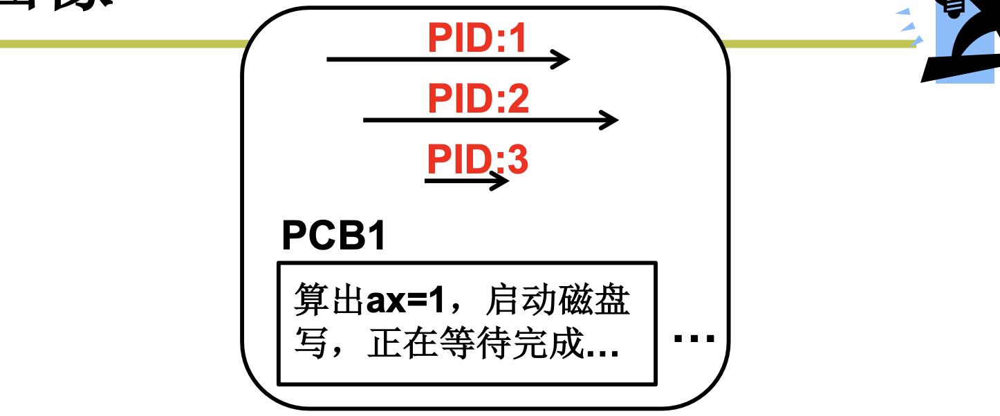

# 📘 2.2 多进程图像 (Multiple Processes)

> 来源说明：哈工大李治军《操作系统》课程 L9 | 本节涵盖：多进程组织（PCB+状态+队列）、进程调度与切换、内存地址空间分离、进程同步与合作

---

## 🧠 核心概念总览（严格按原文顺序）

> 🔗 **返回知识库主页**：[操作系统笔记主页](./README.md)
- [*知识点1: 多进程图像的组织与全貌*](#id1)
- [*知识点2: 多进程图像从启动到关机*](#id2)
- [*知识点3: 多进程的组织——PCB + 状态 + 队列*](#id3)
- [*知识点4: 多进程如何交替——调度与切换*](#id4)
- [*知识点5: 多进程如何影响——内存地址空间分离*](#id5)
- [*知识点6: 多进程如何合作——生产者-消费者与同步*](#id6)
- [*知识点7: 多进程图像的整体脉络*](#id7)

---

<a id="id1"></a>
## ✅ 知识点1: 多进程图像的组织与全貌

**操作系统里面的多进程图像长什么样子？**
- 如何使用 CPU？
  - 让程序执行起来
- 如何充分利用 CPU？
  - **启动多个程序，交替执行**
- 启动了的程序就是**进程**，所以是**多个进程推进**
- 操作系统只需要把这些进程记录好、按照合理的次序推进（分配资源、进行调度）——这就是**多进程图像**
  - > ⚠️ **关键区分**：多进程图像不是"同时运行多个程序"，而是"多个进程在系统中交替推进"

  - > 📋 **术语提醒**：`多进程图像(Multiple Process Image)` — 操作系统中同时存在多个进程、交替推进的整体图景
- 多进程图像的本质：系统中同时存在多个进程，操作系统负责管理它们的生命周期和调度
  


---

<a id="id2"></a>
## ✅ 知识点2: 多进程图像从启动到关机

**多进程图像如何开始的？**
- 多进程图像从启动开始到关机结束：
  1. `main` 中的 `fork()` 创建了第 1 个进程（1 号进程）
      ```c 
      if(!fork()){init();}
      ```
  2. `init` 执行了 `shell`（Windows 桌面）
  3. `shell` 再启动其他进程
      ```c
      int main(int argc, char * argv[])
      {
        while(1) {
          scanf("%s", cmd);
          if(!fork()) {exec(cmd);}
          wait();
        }
      }
      ```
    - > ⚠️ **关键区分**：`fork()` 创建新进程，`exec()` 在新进程中执行新程序，`wait()` 等待子进程结束——这是 shell 的"三件套"
- 执行流程：
  - 1 号进程启动 → 执行用户的命令 → 1 号创造执行这个命令的进程
  - 命令执行完成 → 本进程结束
  - 最后关机，所有进程结束
- 核心逻辑：一个命令启动一个进程，返回 shell 再启动其他进程，循环往复
  - >💡 **理解技巧**：shell 就像一个"无限循环的任务派发器"——不断接收命令，fork 出进程执行，等待结束，再接收下一个命令
  


> 🔄 **知识关联**：1.4 操作系统接口 — shell 是用户与操作系统交互的主要接口
> 📋 **术语提醒**：`1 号进程` — 系统的第一个用户进程，由内核在启动时创建，是所有其他进程的祖先

---

<a id="id3"></a>
## ✅ 知识点3: 多进程的组织——PCB + 状态 + 队列

**理论**
- 多进程的组织方式：**`PCB + 状态 + 队列`**
- 操作系统中有三种类型的进程：
  1. **有一个进程在执行** — 占用 CPU
  2. **有一些进程等待执行** — 在就绪队列中
  3. **有一些进程在等待某事件** — 在磁盘等待队列等事件队列中
- **进程状态图**：

```
新建态 → 就绪态 → 运行态 → 终止态
                ↓       ↓
              阻塞态 ←——
```

- 状态转换：
  - 运行 → 等待（阻塞）：等待 I/O 完成
  - 运行 → 就绪：时间片用完，被调度器剥夺 CPU
  - 就绪 → 运行：调度器选中该进程执行
- `PCB(Process Control Block)` — 用来记录进程信息的数据结构，贯穿操作系统始终

**注意点**
- ⚠️ **关键区分**：进程状态图描述了进程从创建到结束的完整生命周期，是理解操作系统进程管理的窗口
- 💡 **理解技巧**：进程状态就像人的状态——"工作中"（运行）、"排队等"（就绪）、"等快递"（阻塞）、"刚出生"（新建）、"退休了"（终止）
- 🔄 **知识关联**：L8 CPU管理的直观想法 — PCB 的引入是为了保存进程切换时的完整上下文
- 📋 **术语提醒**：`就绪态(Ready)` — 进程已准备好执行，等待分配 CPU；`阻塞态(Blocked/Waiting)` — 进程等待某事件（如 I/O 完成），不能执行

---

<a id="id4"></a>
## ✅ 知识点4: 多进程如何交替——调度与切换

**理论**
- 多进程交替的三个部分：
  1. **队列操作** — 将当前进程放入合适的队列
  2. **调度** — 从就绪队列中选择下一个执行的进程
  3. **切换** — 保存当前进程上下文，恢复新进程上下文

- 队列操作示例：
  ```c
  // 当前进程启动磁盘读写，进入阻塞态
  pCur.state = 'W';              // 状态设为等待
  将 pCur 放到 DiskWaitQueue;   // 放入磁盘等待队列
  schedule();                    // 调用调度器
  ```

- 调度函数示例：
  ```c
  schedule()
  {
    pNew = getNext(ReadyQueue);  // 从就绪队列取下一个进程
    switch_to(pCur, pNew);       // 切换到新进程
  }
  ```

- 切换函数示例（上下文切换）：
  ```c
  switch_to(pCur, pNew)
  {
    // 保存当前进程状态到 pCur 的 PCB
    pCur.ax = CPU.ax;
    pCur.bx = CPU.bx;
    ...
    pCur.cs = CPU.cs;
    pCur.retpc = CPU.pc;
    
    // 从新进程 PCB 恢复状态到 CPU
    CPU.ax = pNew.ax;
    CPU.bx = pNew.bx;
    ...
    CPU.cs = pNew.cs;
    CPU.retpc = pNew.pc;
  }
  ```

- 调度策略讨论：
  - `Priority`（优先级）—— 可能会使某些进程饥饿（低优先级进程永远得不到执行）
  - `FIFO`（先进先出）—— 显然是公平的策略，但没有考虑进程执行任务的紧急程度

**注意点**
- ⚠️ **关键区分**：调度是"选谁执行"，切换是"换执行者"——两个操作紧密配合但概念不同
- 💡 **理解技巧**：调度像"选班干部"（选谁），切换像"交接班"（换人时的交接手续）
- 🔄 **知识关联**：L8 CPU管理的直观想法 — 切换需要保存完整上下文（PC + 所有寄存器），不仅仅是 PC
- 📋 **术语提醒**：`上下文切换(Context Switch)` — 保存当前进程状态、恢复新进程状态的完整过程；`饥饿(Starvation)` — 进程长期得不到调度的现象

---

<a id="id5"></a>
## ✅ 知识点5: 多进程如何影响——内存地址空间分离

**理论**
- 问题：多个进程同时在内存中会出现什么问题？
  ```
  进程 1 代码：
  mov ax, 10100b
  mov [100], ax
  
  进程 2 代码：
  100: 00101
  ```
  - 进程 1 写入地址 100，会覆盖进程 2 的数据！
- 解决办法：**限制对地址 100 的读写** — 多进程的地址空间分离
- 内存管理核心机制：**映射表**
  - 进程 1 的 `mov [100], ax` → 通过映射表 → 实际写入物理地址 `780`（进程 1 的数据区）
  - 进程 2 的 `mov [100], ax` → 通过映射表 → 实际写入物理地址 `1260`（进程 2 的数据区）
- 结果：进程 1 根本访问不到其他进程的内容 — 进程 1 的映射表将访问限制在进程 1 范围内

**进程地址空间图示：**

| 进程 1 | 进程 2 |
|:-----|:------|
| 100: 1（映射到物理地址 780） | 100: 0（映射到物理地址 1260） |
| Stack Heap Data Code（0000-ffff） | Stack Heap Data Code（0000-ffff） |
| 进程 1 映射表 → 780 | 进程 2 映射表 → 1260 |

- 核心结论：**进程管理连带内存管理形成多进程图像** — 每个进程有自己的虚拟地址空间，互不干扰

**注意点**
- ⚠️ **关键区分**：进程看到的"地址 100"是虚拟地址，经过映射表转换后变成不同的物理地址——这就是虚拟内存的核心思想
- 💡 **理解技巧**：映射表就像"快递分拣系统"——每个进程有自己的"地址编码系统"（虚拟地址），分拣系统（映射表）把它们分配到不同的仓库货架（物理地址）
- 🔄 **知识关联**：L7 回顾和计划 — 内存管理的核心抽象是"虚拟地址"，通过 `*p = 7` 使用
- 📋 **术语提醒**：`地址空间(Address Space)` — 进程可以访问的虚拟地址范围；`映射表(Mapping Table)` — 虚拟地址到物理地址的转换表（即页表）

---

<a id="id6"></a>
## ✅ 知识点6: 多进程如何合作——生产者-消费者与同步

**理论**
- 进程合作的典型场景：打印工作
  1. 应用程序提交打印任务
  2. 打印任务被放进打印队列
  3. 打印进程从队列中取出任务
  4. 打印进程控制打印机打印
- 进程合作的核心问题：多个进程共享数据时，如何正确访问？

**生产者-消费者实例：**
```c
#define BUFFER_SIZE 10
typedef struct { . . . } item;
item buffer[BUFFER_SIZE];
int in = out = counter = 0;  // 共享数据

// 生产者进程
while (true) {
  while(counter == BUFFER_SIZE);  // 缓冲区满则等待
  buffer[in] = item;
  in = (in + 1) % BUFFER_SIZE;
  counter++;
}

// 消费者进程
while (true) {
  while(counter == 0);              // 缓冲区空则等待
  item = buffer[out];
  out = (out + 1) % BUFFER_SIZE;
  counter--;
}
```

**Counter 问题的竞争条件：**
- 两个合作的进程都要修改 `counter`：
  ```
  初始情况：counter = 5
  
  生产者 P：                    消费者 C：
  P.register = counter;         C.register = counter;
  P.register = P.register + 1;  C.register = C.register - 1;
  counter = P.register;         counter = C.register;
  ```
- 可能的执行序列（交错执行）：
  ```
  P.register = counter;         // P.register = 5
  P.register = P.register + 1;    // P.register = 6
  C.register = counter;           // C.register = 5
  C.register = C.register - 1;    // C.register = 4
  counter = P.register;           // counter = 6
  counter = C.register;           // counter = 4
  ```
  - 结果：`counter = 4`，但正确的应该是 `5 + 1 - 1 = 5`
  - 问题原因：两个进程同时读写共享变量，没有互斥保护

**进程同步解决方案——上锁机制：**
- 写 counter 时阻断其他进程访问 counter
- 执行序列：
  ```
  生产者 P：
  P.register = counter;
  P.register = P.register + 1;
  给 counter 上锁
  counter = P.register;
  给 counter 开锁
  
  消费者 C：
  检查 counter 锁
  C.register = counter;
  C.register = C.register - 1;
  给 counter 上锁
  counter = C.register;
  给 counter 开锁
  ```
- 核心：**合理的推进顺序** — 进程同步的本质是控制进程执行的先后顺序，确保共享数据的正确性

**注意点**
- ⚠️ **关键区分**：`竞争条件(Race Condition)` — 多个进程同时访问共享数据，结果取决于执行顺序；`同步(Synchronization)` — 控制进程执行顺序，避免竞争条件
- 💡 **理解技巧**：counter 问题就像"两个人同时修改同一个账本"——如果不先锁上门（上锁），一个人写的时候另一个人也在写，数据就会错乱
- 🔄 **知识关联**：L4 操作系统接口 — 用户通过系统调用访问共享资源，内核负责同步管理
- 📋 **术语提醒**：`临界区(Critical Section)` — 访问共享资源的代码段，需要互斥执行；`互斥(Mutual Exclusion)` — 同一时间只有一个进程可以进入临界区

---

<a id="id7"></a>
## ✅ 知识点7: 多进程图像的整体脉络

**理论**
- 多进程图像是操作系统的核心，贯穿以下所有内容：
  1. **读写 PCB** — OS 中最重要的结构，贯穿始终
  2. **操作寄存器完成切换**（L10, L11, L12）— 上下文切换的具体实现
  3. **进程同步与合作**（L16, L17）— 生产者-消费者、信号量、管程
  4. **地址映射**（L20）— 虚拟地址到物理地址的转换机制
  5. **调度程序**（L13, L14）— 进程调度算法的具体实现
- 如何形成多进程图像？
  - 用 PCB 记录进程信息
  - 用状态图描述进程生命周期
  - 用队列组织进程
  - 用调度算法选择进程
  - 用切换机制保存/恢复上下文
  - 用地址映射隔离进程空间
  - 用同步机制保证合作正确

**注意点**
- ⚠️ **关键区分**：多进程图像不是孤立的概念，而是操作系统多个模块（CPU管理、内存管理、文件管理）协同工作的结果
- 💡 **理解技巧**：多进程图像就像"一场交响乐"——PCB 是乐谱，调度是指挥，切换是换演奏者，内存映射是隔音板，同步是节拍器
- 🔄 **知识关联**：L7 回顾和计划 — CPU 管理的学习路线就是围绕"进程"展开的
- 📋 **术语提醒**：多进程图像的四大支柱：组织（PCB+队列）、调度（算法）、切换（上下文）、同步（合作）

---

## 🔑 核心要点总结

1. **多进程图像的核心**：系统中同时存在多个进程，操作系统用 PCB+状态+队列管理它们
2. **进程生命周期**：从 1 号进程 fork 开始，到关机结束，经历新建→就绪→运行→阻塞→终止的状态转换
3. **进程交替 = 队列操作 + 调度 + 切换**：调度选进程，切换保存/恢复上下文
4. **内存地址空间分离**：每个进程有独立的虚拟地址空间，通过映射表隔离，互不干扰
5. **进程合作需要同步**：共享数据时用上锁机制，保证临界区互斥，避免竞争条件

## 📌 考试速记版

- **关键机制**：
  - 进程状态转换：新建→就绪→运行→阻塞→终止
  - 上下文切换：保存当前 PCB → 恢复新 PCB
  - 地址映射：虚拟地址 → 映射表 → 物理地址
  - 进程同步：上锁 → 进入临界区 → 开锁

- **易混淆概念对比**：

| 概念 | 含义 | 作用 |
|:-----|:-----|:-----|
| 调度 | 从就绪队列选进程 | 决定谁先执行 |
| 切换 | 保存/恢复上下文 | 换人执行 |
| 竞争条件 | 多进程同时访问共享数据 | 需要同步解决 |
| 临界区 | 访问共享数据的代码段 | 需要互斥保护 |
| 虚拟地址 | 进程看到的地址 | 隔离进程空间 |
| 物理地址 | 内存条上的真实地址 | 实际存储数据 |

- **常见考试陷阱**：
  - ❌ 认为 "counter++ 是一条原子指令" → ✅ `counter++` 分解为"读→改→写"三步，可能被打断
  - ❌ 认为 "虚拟地址直接访问物理内存" → ✅ 必须经过映射表转换
  - ❌ 认为 "调度就是切换" → ✅ 调度是"选人"，切换是"换人"

**记忆口诀**：
> "多进程图像四根柱：PCB 队列管组织，调度切换管交替，映射隔离管内存，同步上锁管合作；counter++ 三步走，上锁保护不能漏！"

---

> 🔗 **返回本章导航**：[第1章 操作系统基础](./README.md)
> 🔗 **返回课程主页**：[操作系统 (Operating Systems)](../README.md)
