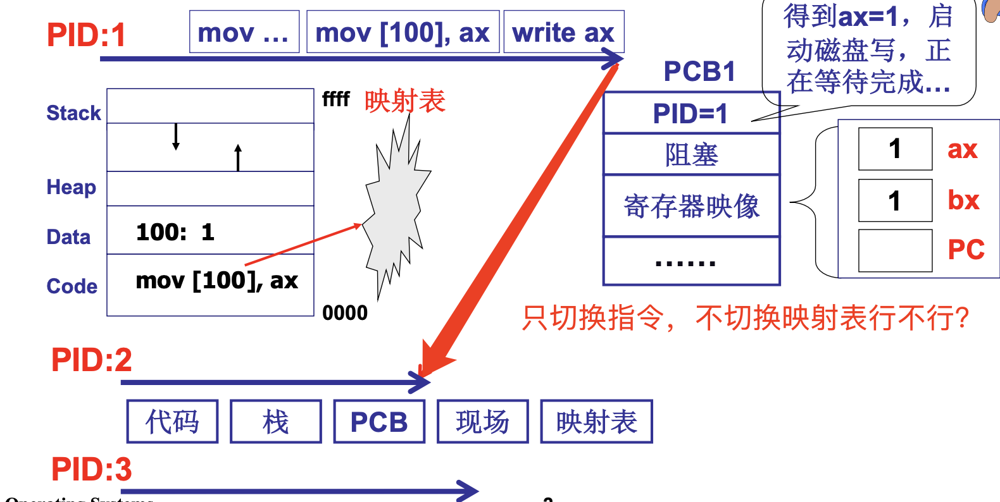
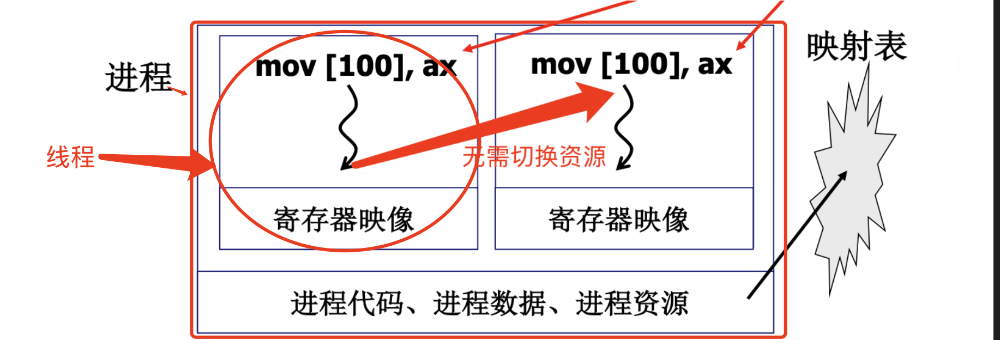
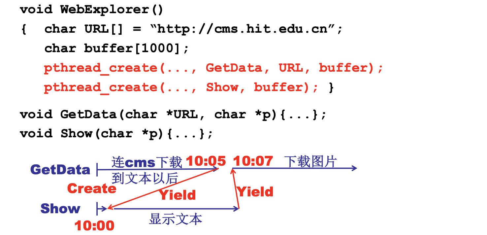
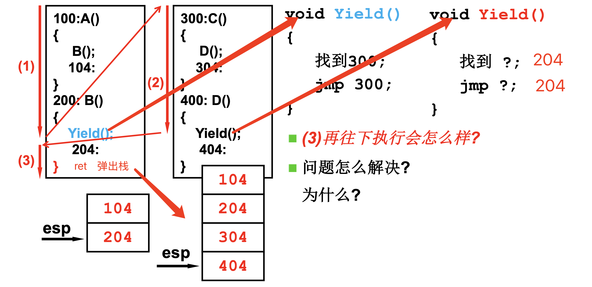
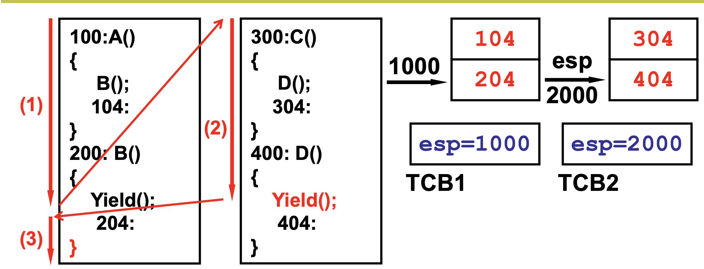
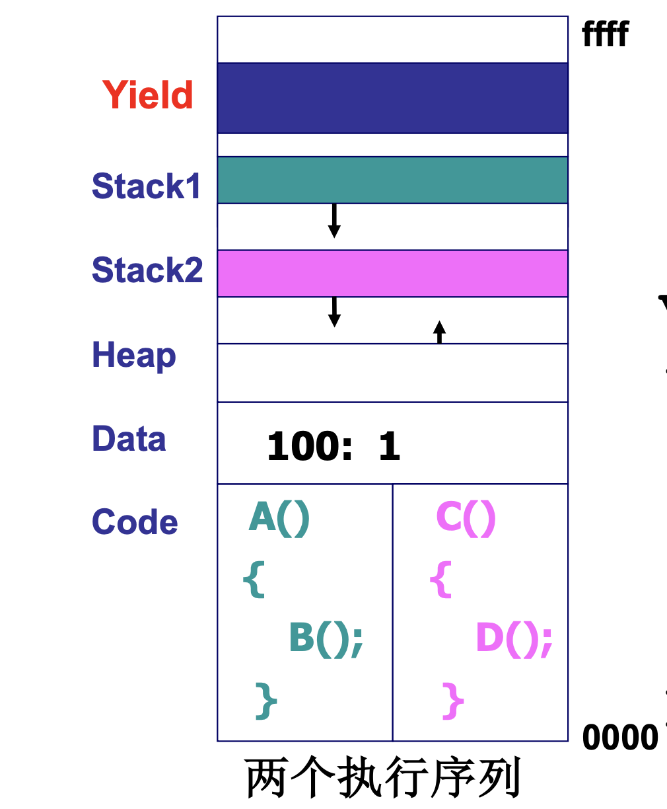
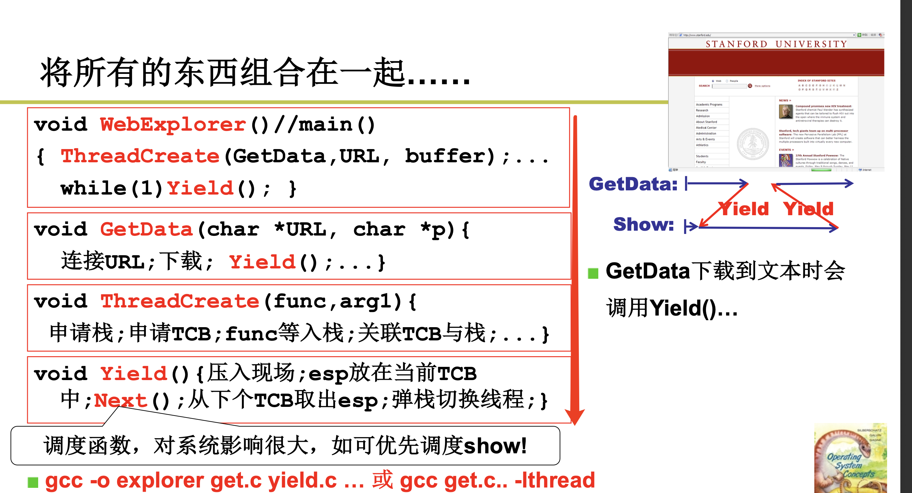
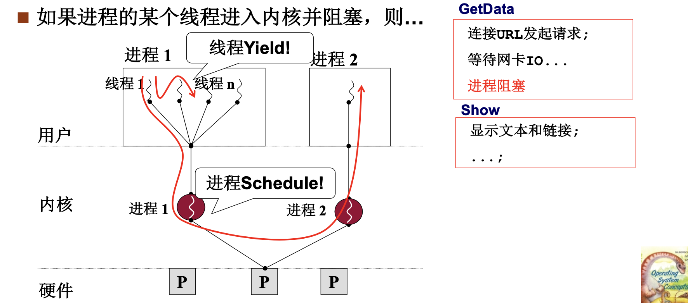
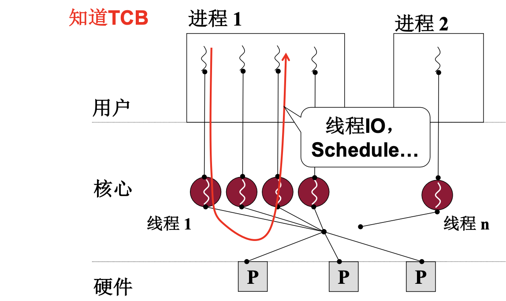

# 📘 2.3 用户级线程 (User-Level Threads)

> 来源说明：哈工大李治军《操作系统》课程 L10 | 本节涵盖：线程概念的引入、用户级线程实现（Yield/Create/TCB/栈）、用户级线程与核心级线程的对比

---

## 🧠 核心概念总览（严格按原文顺序）

> 🔗 **返回知识库主页**：[操作系统笔记主页](./README.md)
- [*知识点1: 多进程是操作系统的基本图像*](#id1)
- [*知识点2: 线程 = 资源不动 + 切换指令序列*](#id2)
- [*知识点3: 多个执行序列 + 一个地址空间的实用性*](#id3)
- [*知识点4: `Yield`，`Create`——用户级线程切换与创建*](#id4)
- [*知识点5: 两个执行序列与一个栈的问题*](#id5)
- [*知识点6: 从一个栈到两个栈——TCB + 栈切换*](#id6)
- [*知识点7: 两个线程的样子：两个 TCB、两个栈、切换的 PC 在栈中*](#id7)
- [*知识点8: ThreadCreate 的核心实现*](#id8)
- [*知识点9: 用户级线程的致命缺陷——内核阻塞*](#id9)
- [*知识点10: 核心级线程的对比*](#id10)

---

<a id="id1"></a>
## ✅ 知识点1: 多进程是操作系统的基本图像

**先回顾一下进程，再讲线程**
- 操作系统通过 PCB 管理多个进程，每个进程有独立的地址空间（映射表）、寄存器映像、代码和数据
- 当进程阻塞时（如启动磁盘写），整个进程都要等待，CPU 切换到其他进程
- **进程切换时需要保存/恢复完整上下文（PCB），代价较大!!!**
- 实例：能不能只让指令变而映射表等资源不变？
  


---

<a id="id2"></a>
## ✅ 知识点2: 线程 = 资源不动 + 切换指令序列

**这个问题正需要线程来解决...**
- 核心思想：**进程 = 资源 + 指令执行序列**
  - > 📋 **术语提醒**：`线程(Thread)` — 进程内的一条执行路径，共享进程资源，拥有独立的寄存器和栈
- 线程的本质：**将资源和指令执行分开** — 资源不动（映射表不变），只切换指令执行序列（PC 指针变）
- 线程的定义：**保留了并发的优点，避免了进程切换代价**
  
- **线程 vs 进程**：
  - 进程切换：切换映射表、寄存器映像、代码、数据、资源 → **代价大**
  - 线程切换：映射表不变，只改变 PC 指针 → **代价小**

> ⚠️ **关键区分**：线程不是"轻量级进程"的笼统说法，而是"资源不动、只切换执行序列"的具体机制


---

<a id="id3"></a>
## ✅ 知识点3: 多个执行序列 + 一个地址空间的实用性

**这样做在实际中有何价值？**
- 实用场景：**网页浏览器**
  - 一个线程用来从服务器接收数据
  - 一个线程用来处理图片（如解压缩）
  - 一个线程用来显示文本
  - 一个线程用来显示图片
  
- 资源共享：
  - 接收数据放在地址 100 处，显示时要读——所有线程共享同一个地址空间
  - 所有文本、图片都显示在一个屏幕上——需要共享显示资源


> ⚠️ **关键区分**：线程之间共享进程的资源（地址空间、打开的文件、全局变量），但拥有独立的执行路径
> 📋 **术语提醒**：`共享地址空间(Shared Address Space)` — 同一进程内的所有线程共享相同的虚拟地址空间

---

<a id="id4"></a>
## ✅ 知识点4: `Yield`，`Create`——用户级线程切换与创建

**如何理解`Create`和`Yield`是关键**
- `Yield()` — 用户级线程切换的核心函数
- Yield 的本质：**从一个执行序列跳到另一个执行序列**
- `Create` 和 `Yield` 的关系：
  - **`Create`** — 制造出第一次切换时应该的样子（初始化 TCB 和栈）
  - **`Yield`** — 实际执行切换操作
  - 样子弄明白了，剩下的就是写程序实现这个样子


> ⚠️ **关键区分**：Yield 是用户级线程切换的关键，由用户程序调用，不是操作系统内核完成的
> 📋 **术语提醒**：`Yield` — 主动让出 CPU，切换到另一个线程执行；用户级线程切换完全在用户空间完成

---

<a id="id5"></a>
## ✅ 知识点5: 两个执行序列与一个栈的问题

**来看看实例...**
- 问题：两个执行序列共用一个栈时，返回地址会混乱
- 示例：
  
  > `call` **压入返回地址（下一条指令的地址）**，`ret` **弹出当前栈顶（ESP 指向）的地址并跳过去执行**，两者配对使用
- 执行过程：
  1. `100:A()` 执行 → call `B()` → 压入返回地址 `104` → 跳到 `200:B()`
  2. `200:B()` 执行 → 遇到 `Yield()` → 保存继续地址 `204` → 跳到 `300:C()`
  3. `300:C()` 执行 → call `D()` → 压入返回地址 `304` → 跳到 `400:D()`
  4. `400:D()` 执行 → 遇到 `Yield()` → 压入返回地址 `404` → 跳到 `204`
  5. 执行遇到 `}` → `ret` → 弹出顶栈并跳到 `404`
- **问题**：跳回后是 `404` 又在没有 `Yield` 情况跑到别人线程去了，但我们想让其返回到 `204` ——返回地址混乱！
- **分析原因**：一个栈无法区分不同线程的返回地址，导致"栈污染"
  - >📋 **术语提醒**：`栈污染(Stack Corruption)` — **多个执行序列共用一个栈**导致返回地址等数据错乱
  - >💡 **理解技巧**：两个线程共用一个栈，就像两个人共用一本笔记本——A写的笔记被B覆盖了，回来找的时候全乱了


---

<a id="id6"></a>
## ✅ 知识点6: 从一个栈到两个栈——TCB + 栈切换

**解决办法！！**
- 解决方案：**每个线程有自己的栈**
- `Yield` 需要切换栈：
  ```c
  void Yield() {
    TCB1.esp = esp;          // 保存当前栈指针到 TCB1
    esp = TCB2.esp;          // 切换到线程2的栈
    jmp 204;                 // 跳到线程2的恢复点
  }
  ```
    - `esp` 为 cpu 中的装载**当前栈指针的物理寄存器**
    - `TCB (Thread Control Block)` 是一个全局结构，线程控制块，保存对应线程的栈指针、寄存器等状态
- > 💡 **理解技巧**：两个栈就像"两个人各用一本笔记本"——A的笔记在A的本子上，B的笔记在B的本子上，互不干扰
- 栈切换的过程：
  
  1. 当前线程（线程1）在地址 `1000` 的栈上运行
  2. `Yield` 时，保存 `esp` 到 `TCB1.esp`
  3. 从 `TCB2` 取出 `esp=2000`，切换到线程2的栈
  4. 在线程2的栈上继续执行
- **结果**：`Yield()`跳转到 `204` 执行，完成后又跳到 `204` 再执行一次 -- **问题**：`204` 执行了两次
- **问题修正**：`204` 是调用 `Yield()` 才压栈的返回地址，应该去掉 `jmp 204` 否则跳转不回弹出栈道，多此一举
- `Yield()`修正后：
  ```c
  void Yield() {
    TCB1.esp = esp;          // 保存当前栈指针到 TCB1
    esp = TCB2.esp;          // 切换到线程2的栈
  }
  ```

>⚠️ **关键区分**：切换栈时必须保存当前栈指针（esp）到 TCB，恢复时从 TCB 取出新的 esp
> 🔄 **知识关联**：L9 多进程图像 — PCB 保存进程上下文，TCB 保存线程上下文（更轻量）

---

<a id="id7"></a>
## ✅ 知识点7: 两个线程的样子：两个 TCB、两个栈、切换的 PC 在栈中

**现在就是整个线程及结构的样子...**
- 两个线程的完整结构：
  - **两个 TCB** — 分别保存两个线程的状态
  - **两个栈** — 每个线程有自己的栈（Stack1、Stack2）
  - **共享的地址空间** — 共享 Heap、Data、Code
  - **切换的 PC 在栈中** — 返回地址保存在各自的栈中
- 线程切换时：
  1. 保存当前 `esp` 到当前 `TCB`
  2. 从下一个 `TCB` 取出 `esp`
  3. 弹栈恢复 `PC`，继续执行

**图示：**



> 📋 **术语提醒**：`用户级线程(User-Level Thread)` — 线程的创建、切换、调度完全在用户空间完成，内核不知道线程的存在

---

<a id="id8"></a>
## ✅ 知识点8: ThreadCreate 的核心实现

**懂了  `Yield`，那么 `Create` 就好理解了...**
- `ThreadCreate(A)` — 创建线程的核心逻辑：
  1. 申请一个栈（`malloc`）
  2. 申请一个 `TCB`（`malloc`）
  3. 将入口函数 A 的地址压入栈与这个新创建的线程关联
  4. 设置 `TCB.esp` 指向栈顶
- 代码示例：
  ```c
  void ThreadCreate(A) {
    TCB *tcb = malloc(sizeof(TCB));
    void *stack = malloc(4096);     // 申请4KB栈空间
    *stack = A;                      // 入口函数地址入栈
    tcb.esp = stack;                // TCB记录栈指针
  }
  ```

- 完整的浏览器线程示例：
  

> ⚠️ **关键区分**：ThreadCreate 是在用户空间完成的，不需要进入内核 ——这是用户级线程的核心特征
> 📋 **术语提醒**：`ThreadCreate` — 用户级线程创建函数，在用户空间完成；`Next()` — 调度函数，决定下一个执行哪个线程

---

<a id="id9"></a>
## ✅ 知识点9: 用户级线程的致命缺陷——内核阻塞

**这里谈及的都是用户级线程，而不是内核级...**
- 用户级线程的核心特征：**`Yield` 是用户程序**，操作系统内核不知道线程的存在
- **致命缺陷**：如果进程的某个线程进入内核并阻塞（如发起 I/O 请求等待网卡），则**整个进程阻塞**
- 原因：
  - 内核只认识进程，不认识线程
  - 一个线程发起系统调用进入内核阻塞
  - 内核将整个进程标记为阻塞状态
  - 进程内的其他线程也无法执行
- 示例：浏览器中 GetData 线程发起网络请求等待 I/O，Show 线程也无法运行

**图示：**



> ⚠️ **关键区分**：用户级线程的阻塞问题是"内核看不到线程"导致的 —— 内核的调度单位是进程，不是线程


---

<a id="id10"></a>
## ✅ 知识点10: 核心级线程的对比

**内核级线程和用户级线程可不一样...**
- 核心级线程（内核级线程）：`ThreadCreate` 是系统调用，会进入内核
- 内核知道 TCB，线程的调度由内核完成
- 线程 I/O 阻塞时，**内核可以调度同一进程的其他线程执行**
  
- 用户级线程 vs 核心级线程对比：

  | 特性 | 用户级线程 | 核心级线程 |
  |:-----|:----------|:----------|
  | ThreadCreate | 用户空间函数 | 系统调用 |
  | `Yield` | 用户程序可见 | 用户不可见，由系统通过`Schedule`决定调度点 |
  | 切换开销 | 小（用户空间） | 大（需要进入内核） |
  | 阻塞影响 | 一个线程阻塞，整个进程阻塞 | 一个线程阻塞，其他线程可运行 |
  | 内核可见性 | 内核不知道线程存在 | 内核知道并管理线程 |
  | 实现方式 | 用户库（如 `pthread`） | 操作系统内核支持 |

- 编译对比：
  - 用户级线程：`gcc -o explorer get.c yield.c`
  - 核心级线程：`gcc -o explorer explorer.c -lthread`（使用线程库）


> ⚠️ **关键区分**：用户级线程切换快但阻塞问题严重，核心级线程切换慢但可以独立调度
> 📋 **术语提醒**：`核心级线程(Kernel-Level Thread)` — 线程的创建、切换、调度由操作系统内核完成；`pthread` — POSIX 线程库，支持用户级和核心级线程

---

## 🔑 核心要点总结

1. **线程的本质**：进程 = 资源 + 指令执行序列，线程 = 资源不动 + 只切换指令序列
2. **用户级线程三要素**：两个 TCB、两个栈、切换的 PC 在栈中
3. **Yield 是核心**：用户级线程切换完全在用户空间完成，通过切换栈指针（esp）实现
4. **ThreadCreate 的核心**：申请栈 + 申请 TCB + 入口函数入栈 + 关联 TCB 与栈
5. **用户级线程的致命缺陷**：一个线程进入内核阻塞，整个进程都阻塞（内核不知道线程存在）
6. **核心级线程的优势**：内核知道线程，可以独立调度，一个线程阻塞不影响其他线程

---