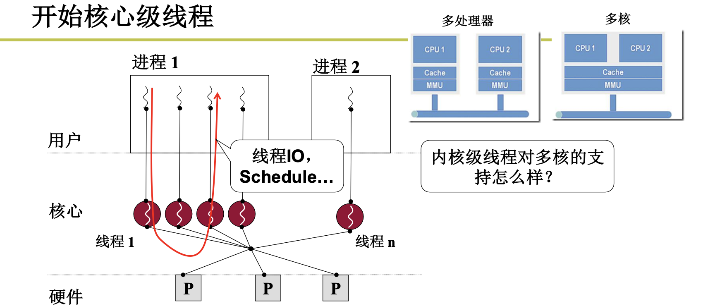
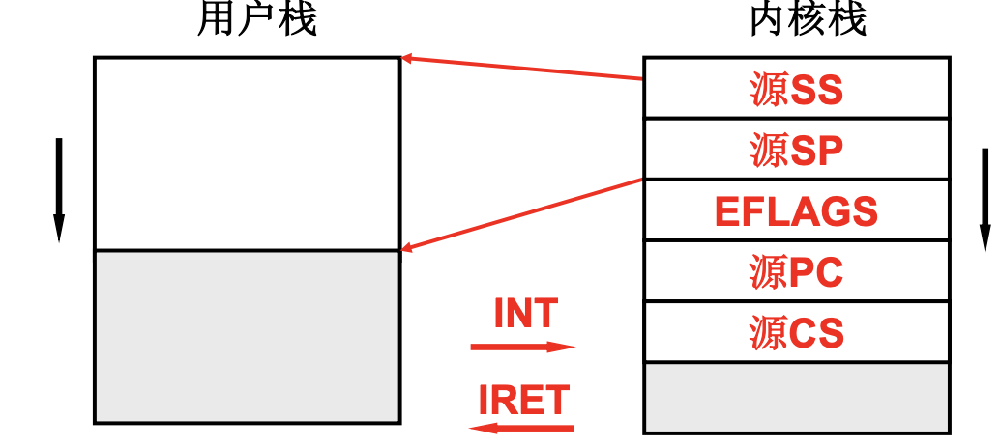
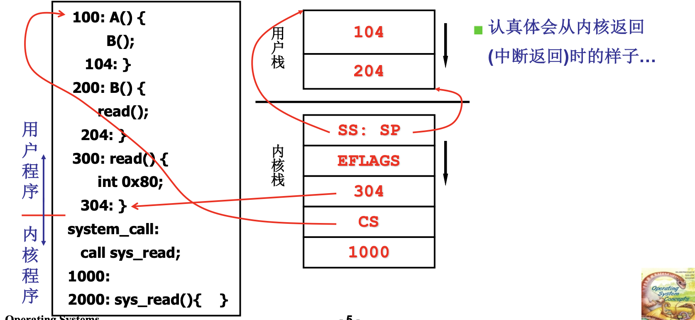
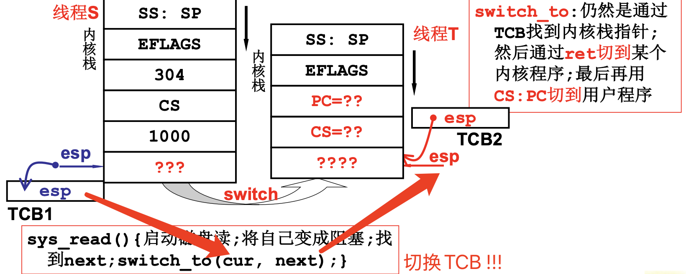
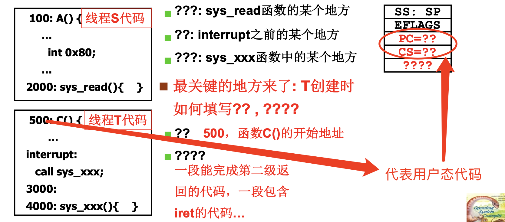
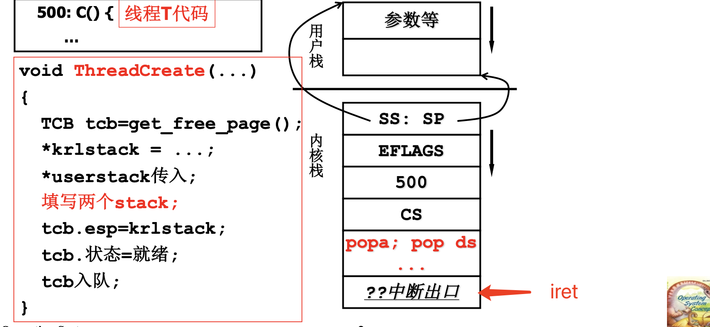

# 📘 L11 内核级线程 (Kernel Threads)

> 来源说明：哈工大李治军《操作系统》课程 L11 | 本节涵盖：内核级线程与用户级线程的本质区别、用户栈/内核栈的关联机制、内核线程切换的五段论、ThreadCreate实现、两级线程对比

---

## 🧠 核心概念总览（严格按原文顺序）

- [*知识点1: 内核级线程与用户级线程的本质区别*](#id1)
- [*知识点2: 用户栈与内核栈的关联——中断切换机制*](#id2)
- [*知识点3: 系统调用中的栈切换过程——`A()/B()/read()`示例*](#id3)
- [*知识点4: 内核中的切换——`switch_to`的基本思路*](#id4)
- [*知识点5: 内核栈切换的"问号"问题——TCB与栈的关系*](#id5)
- [*知识点6: 内核线程switch_to的五段论*](#id6)
- [*知识点7: ThreadCreate的实现机制*](#id7)
- [*知识点8: 用户级线程与核心级线程的对比*](#id8)

---

<a id="id1"></a>
## ✅ 知识点1: 内核级线程与用户级线程的本质区别

**为什么我们需要内核级线程呢？**

- **多核对内核级线程的支持**：多线程到内核里面才能充分利用起多核心
  - **多核心 VS 多处理器**：多处理器使用的是**不同 CPU核心 + 不同的缓存(cache) + 不同的内存映射(MMU)**，而多核只是使用了**不同 CPU核心，其他都是共用的**
  - 多核支持不同的内核线程跑在不同的 CPU 上，因此为了充分利用多核架构，内核线程是必须的
  
- 内核级线程(`Kernel Threads`)的核心特征：**`ThreadCreate`是系统调用**，由内核管理`TCB`，由内核负责切换线程
- 与用户级线程的关键差异：
  - 用户级线程：`ThreadCreate`是用户态函数，用户自己管理TCB，用户态完成切换
  - 核心级线程：`ThreadCreate`是系统调用，内核管理TCB，内核态完成切换
  - **内核级线程需要两套栈：因为内核线程需要有用户栈 + 内核栈**
    - 用户栈：执行用户态代码，进行函数调用
    - 内核栈：执行内核态代码，进行中断处理和线程切换
    - 现在一个 `TCB` 关联一套栈


---

<a id="id2"></a>
## ✅ 知识点2: 用户栈与内核栈的关联——中断切换机制

**这两套栈有什么关联??**
- **所有中断**（时钟中断、外设中断、`INT`指令）都引起用户栈到内核栈的切换
- 中断发生时，硬件自动完成以下压栈操作（从用户栈切换到内核栈）：
  - 保存源`SS`（用户栈段寄存器）
  - 保存源`SP`（用户栈指针寄存器）
  - 保存`EFLAGS`（标志寄存器）
  - 保存源`PC`（程序计数器/返回地址）
  - 保存源`CS`（代码段寄存器）
- 中断返回(`IRET`)时，硬件自动从内核栈弹出上述寄存器，恢复用户态执行
- **用户栈和内核栈之间的关联**：通过中断/系统调用建立——进入内核时保存用户栈上下文到内核栈，返回时恢复

**图示**



> ⚠️ **关键区分**：中断切换是硬件自动完成的，不是软件代码手动压栈——操作系统"又一次被硬件帮助了"


---

<a id="id3"></a>
## ✅ 知识点3: 系统调用中的栈切换过程——A()/B()/read()示例

**来看一个例子如何切换的 ...**
- 用户程序执行流程示例：
  

- **栈的状态变化**：
  1. `100:A()` 执行 → call `B()` → 压入返回地址 `104` → 跳到 `200:B()`
  2. `200:B()` 执行 → 遇到 `read()` → 保存继续地址 `204` → 跳到 `300:read()`
  3. `300:read()` 执行 → `int 0x80`触发系统调用，进入内核 → 自动建立内核栈
  4. 内核栈保存`EFLAGS`、`SS:SP`、`CS`(代码段选择子)、`PC=304`(下一条要执行指令的地址)、`1000` 
  5. 跳到 `1000` 执行内核代码 → 等执行完弹出后，回到`304`执行


---

<a id="id4"></a>
## ✅ 知识点4: 内核中的切换——`switch_to`的基本思路

**启动内核代码中的磁盘读会引起阻塞 + 调度!!!**
- 内核级线程切换发生在内核态，典型场景：
  
- `switch_to(cur, next)`的核心操作：
  - 通过`TCB`找到内核栈指针
  - 然后通过`ret`切到某个内核程序
  - 最后再用`CS:PC`切到用户程序

- 内核级线程切换需要处理两套栈的切换：内核栈切换（TCB级别）+ 用户栈恢复（IRET级别）

> ⚠️ **关键区分**：内核级线程切换不是直接跳转到用户代码，而是先在内核栈间切换，再通过 IRET 中断返回 "间接" 回到用户态
> 💡 **理解技巧**：`switch_to`像"内核世界的交通调度员"——它不直接送你到目的地，而是把你放到正确的"内核轨道"上，再由IRET送你出站


---

<a id="id5"></a>
## ✅ 知识点5: 内核栈切换的"问号"问题——TCB与栈的关系

**那么这个几个?代表的是什么**
  
- **三个关键问号**需要回答：
  - `?? = 500`：函数`C()`的开始地址（用户态入口）
  - `????`：一段能完成第二级返回的代码，一段包含`iret`的代码
  - `??? = sys_xxx`函数中的某个地方，可能有IO操作，需要这个时段切到另一个线程先执行
- **内核级线程的本质**：每个线程有两个栈（用户栈+内核栈），TCB关联内核栈，内核栈关联用户栈
- **内核级线程的切换流程就可大致明了**：
  1. 线程S 建立起用户栈 → **遇到中断** → 进入到内核栈并两栈关联起来形成一套
  2. 线程S在函数中遇到`switch_to` → 通过 线程S的 `TCB` 切换到 线程T的 `TCB` → 线程S的 TCB 对应有线程T的内核栈
  3. 线程T遇到 `iret` → 通过`PC`，`CS`切回到线程T的用户栈

---

<a id="id6"></a>
## ✅ 知识点6: 内核线程`switch_to`的五段论

**切换的具体方法 ...**
内核级线程切换的完整过程分为五个阶段：

- **第一段：中断入口（进入切换）**
  ```
  push ds; ... pusha;     // 保存所有用户态寄存器
  mov ds, 内核段号; ...    // 切换到内核数据段
  call 中断处理            // 进入内核中断处理程序
  ```

- **第二段：中断处理（引发切换）**
  ```
  启动磁盘读或时钟中断;     // 触发阻塞
  schedule();           // 调度算法选择下一个线程
  }                     // ret

  schedule: next=..;    //调度到下一个线程
  call switch_to; 
  }                     //ret
  ```

- **第三段：switch_to（内核栈切换——第一级切换）**
  ```
  TCB[cur].esp = %esp;      // 保存当前线程的内核栈指针
  %esp = TCB[next].esp;     // 加载下一个线程的内核栈指针
  ret                       // 从新线程的内核栈返回
  ```

- **第四段：中断出口（第二级切换）**
  ```
  popa; ...; pop ds; iret   // 恢复寄存器，IRET返回用户态
  ```


- **第五段：S、T非同一进程的地址切换（如果需要）**
  - 如果切换的两个线程**属于不同进程**，首先要切换地址映射表
  ```
  TCB[cur].ldtr = %ldtr
  %ldtr = TCB[next].ldtr    // 切换内存管理相关的段/页表
  ```


---

<a id="id7"></a>
## ✅ 知识点7: ThreadCreate的实现机制

**内核级切换明白了，创建也就显而易见**
- 内核级线程`ThreadCreate`需要初始化两个栈（用户栈+内核栈）和TCB：
  ```
  void ThreadCreate(...) {
    TCB tcb = get_free_page();   // 申请一页内存做TCB
    *krlstack = ...;             // 初始化内核栈
    *userstack = 传入;            // 初始化用户栈
    填写两个stack;                 // 建立一套用户+内核栈道
    tcb.esp = krlstack;           // TCB指向内核栈顶
    tcb.状态 = 就绪;               // 设置线程状态
    tcb入队;                      // 加入就绪队列
  }
  ```
- 内核栈的初始化布局（模拟中断现场）：


- **核心思想**：新线程的内核栈被"伪造"成好像它曾经执行到`sys_xxx`中、被`schedule()`选中切换出去的样子


---

<a id="id8"></a>
## ✅ 知识点8: 用户级线程与核心级线程的对比

**理论**
| 特性 | 用户级线程 | 核心级线程 | 用户+核心级 |
|------|-----------|-----------|-----------|
| **并发度** | 低 | 高 | 高 |
| **代价** | 小 | 大 | 中 |
| **内核改动** | 无 | 大 | 大 |
| **实现模型** | 用户态库实现 | 内核直接支持 | 混合模型 |
| **用户灵活性** | 大 | 小 | 大 |
| **利用多核** | 差 | 好 | 好 |

- **用户级线程优势**：切换快（不用进内核）、用户可自定义调度策略、实现简单
- **用户级线程劣势**：阻塞系统调用会阻塞整个进程、无法利用多核
- **核心级线程优势**：真正的并行（多核支持）、阻塞不影响其他线程、内核统一调度
- **核心级线程劣势**：切换代价大（需进出内核）、内核实现复杂、用户无法定制调度
- **混合模型**（如Linux的NPTL）：结合两者优点，用户态线程映射到内核线程

**注意点**
- ⚠️ **关键区分**："并发度"差异的根源——用户级线程一个进程的所有线程共享一个内核调度实体，核心级线程每个线程都是独立调度实体
- 💡 **理解技巧**：用户级线程像"单线程进程里玩多任务"，核心级线程像"真正的多车道并行"
- 🔄 **知识关联**：L10 用户级线程 — 用户级线程的Yield切换只需改TCB和栈指针，核心级线程的switch_to要走五段论

---

## 🔑 核心要点总结

1. **内核级线程的本质**：ThreadCreate是系统调用，内核管理TCB，内核负责切换——这是与用户级线程最根本的区别
2. **两套栈机制**：内核级线程需要用户栈+内核栈，通过中断/系统调用建立关联，TCB指向内核栈
3. **五段论切换**：中断入口→中断处理(schedule)→switch_to(内核栈切换)→中断出口(IRET返回用户态)，跨进程时还要切换地址映射
4. **ThreadCreate的核心**：伪造中断现场——新线程的内核栈被初始化成好像曾经进入过内核的样子
5. **对比结论**：用户级线程灵活但无法利用多核，核心级线程能真正并行但代价大，实际系统多采用混合模型

## 📌 考试速记版

- **关键机制**：内核级线程切换 = 用户栈(函数调用) + 内核栈(中断现场) + TCB(内核栈指针) + IRET(返回用户态)
- **五段论口诀**：入中断→做决策→换栈针→出中断→回用户
- **易混淆概念对比**：
  - 用户级Yield：纯用户态，改TCB+esp即可
  - 核心级switch_to：进内核，保存/恢复两套栈
- **常见考试陷阱**：
  - 线程切换不切换映射表（同进程内），进程切换才切换映射表
  - 内核级线程的"阻塞"只阻塞当前线程，不会阻塞整个进程

**记忆口诀**：内核线程两手抓，用户栈上跑代码，内核栈里存现场，TCB指着内核耍，五段切换稳到家！
