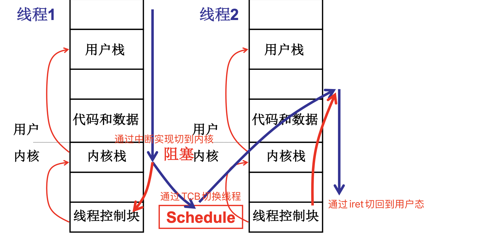
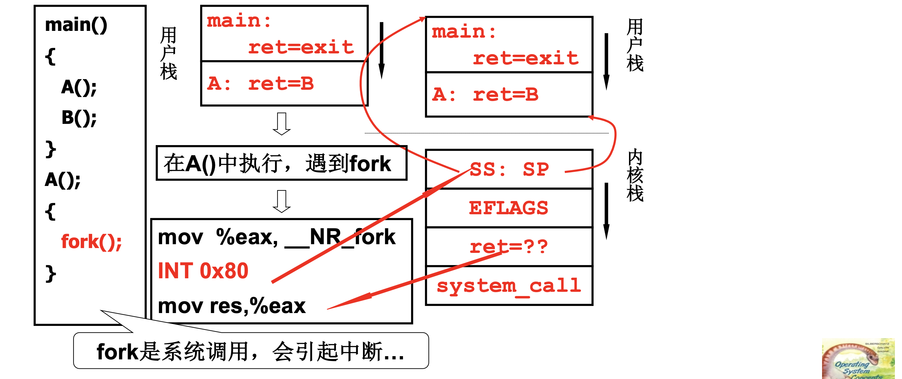
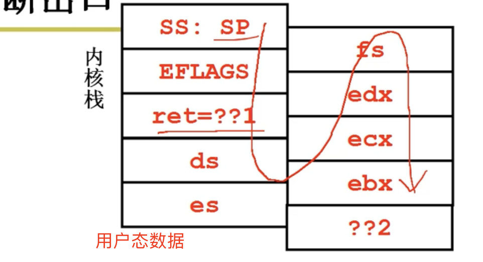
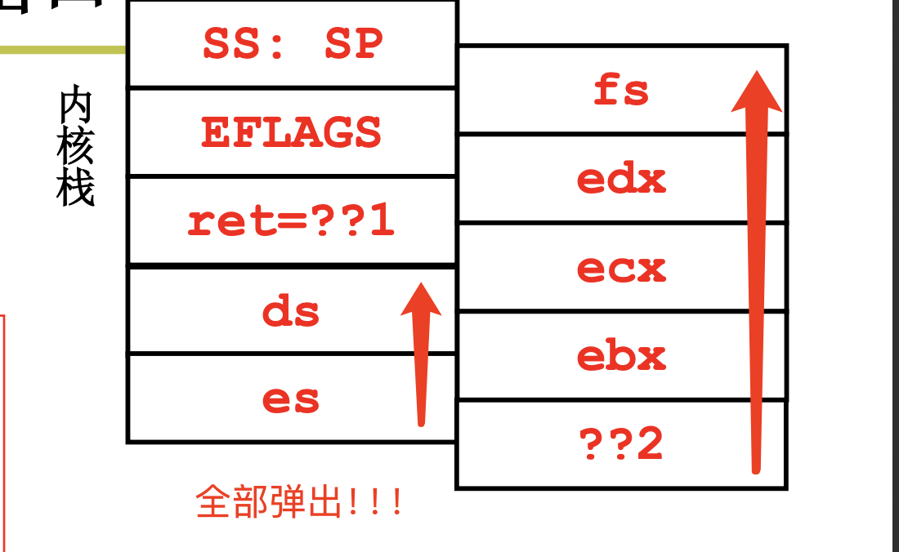
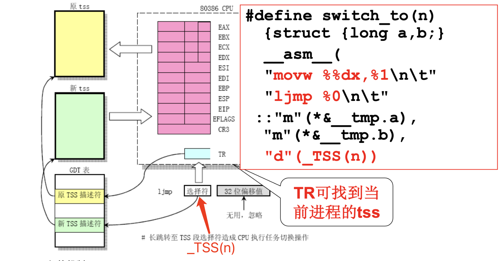
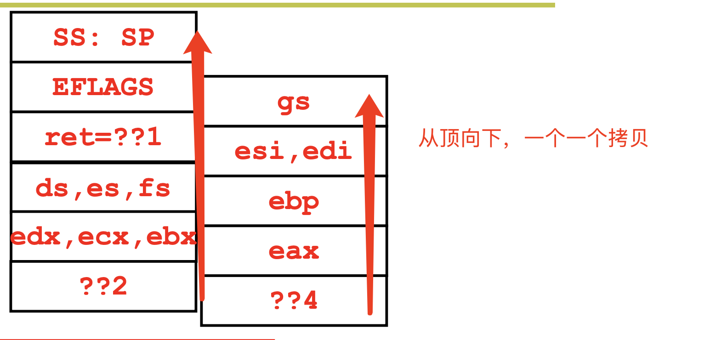
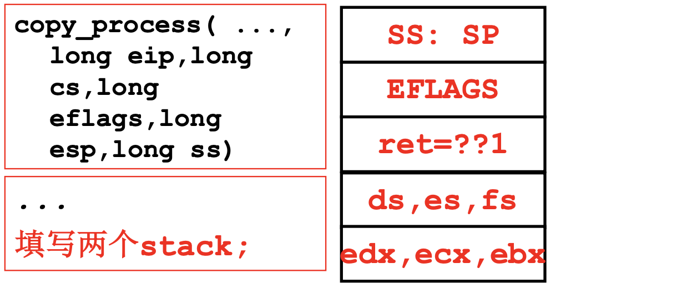

# 📘 L12 核心级线程实现 (Kernel Thread Implementation)

> 来源说明：哈工大李治军《操作系统》课程 L12 | 本节涵盖：内核级线程的两套栈结构、fork/exec系统调用中的线程创建与切换、Linux 0.11 内核栈切换机制、copy_process 实现细节、ThreadCreate 与 exec 的关联

---

## 🧠 核心概念总览（严格按原文顺序）

> 🔗 **返回知识库主页**：[操作系统笔记主页](./README.md)
- [*知识点1: 内核级线程的两套栈结构*](#id1)
- [*知识点2: 从进入内核开始——`fork`系统调用的中断入口*](#id2)
- [*知识点3: 切换五段论中的中断入口与中断出口*](#id3)
- [*知识点4: `schedule` 函数与中断返回流程*](#id4)
- [*知识点5: `switch_to` 实现——基于 TSS 的线程切换*](#id5)
- [*知识点6: `copy_process` 函数——创建线程于内核栈*](#id6)
- [*知识点7: `copy_process` 后续 -- 填写寄存器与 TSS*](#id7)
- [*知识点8: `fork` 返回机制——父子进程的不同路径*](#id8)
- [*知识点9: `exec` 系统调用——加载新程序执行*](#id9)
- [*知识点10: 线程切换的栈结构总结与 TCB 关联*](#id10)

---

<a id="id1"></a>
## ✅ 知识点1: 内核级线程的两套栈结构

**再回顾一下内核级线程实现 ...**
- 内核级线程(`Kernel Threads`)的核心特征：**每个线程拥有两套栈**
  - **用户栈**(`User Stack`)：执行用户态代码，进行用户态函数调用
  - **内核栈**(`Kernel Stack`)：执行内核态代码，进行中断处理和线程调度与切换
- 线程结构包含：
  
- **TCB 与栈的关联**：TCB 关联内核栈，内核栈通过保存的 `SS:SP` 关联用户栈
- **阻塞后切换线程**：在 线程1 执行中，遇到阻塞如时间片到时，本线程1 无法继续被允许执行，就需要立马切换线程


> ⚠️ **关键区分**：用户级线程只有用户栈，内核级线程必须同时拥有用户栈和内核栈——这是内核能独立调度线程的前提

---

<a id="id2"></a>
## ✅ 知识点2: 从进入内核开始——fork系统调用的中断入口

**故事起点**：某个中断开始，触发进入内核
- 用户程序示意：
  
  - **栈结构变化**（fork 调用时）：
    - 用户栈（父进程）：执行 `main` 并**压入返回地址 `exit`** → 遇到 `A()` → **压入返回地址 B** → 遇到`fork()`
    - 内核栈：
      1. `fork()` → `mov %eax, __NR_fork` 将系统调用号放入 `eax` → `INT 0x80` 触发中断，进入内核
      2. `INT 0x80` 触发进行时 → 保存 `EFLAGS`、`SS:SP`，把 int 0x80 下一条指令的地址压入内核栈作为返回地址（也就是压入啦`CS`和`PC`）
          - > 因为在执行 `int 0x80` 的时候 `PC` 就是指向的其下一条
          - > 下一条就是 `mov res, %eax` — 表示从中断返回，获取返回值
      3. `INT 0x80` 触发后 → 执行对应`0x80` 的中断处理函数 `system_call` → 压入调用 `system_call` 的信息 → 执行 `system_call`

> 💡 **理解技巧**：`INT 0x80` 像"按下服务铃"——CPU 自动保存现场、切换到内核态，就像服务员自动记录你的需求


---

<a id="id3"></a>
## ✅ 知识点3: 切换五段论中的中断入口与中断出口

**`system_call`到底要干什么呢???**
1. **系统调用门初始化**：
    ```c
    void sched_init(void) {
        set_system_gate(0x80, &system_call);
    }
    ```
2. **中断入口代码**(`_system_call`)：
    ```asm
    _system_call:
        push %ds..%fs        ; 压栈段寄存器
        pushl %edx...        ; 压栈通用寄存器
        call sys_fork        ; 调用系统调用处理函数
        pushl %eax           ; 保存返回值并压栈，防止后续调度/恢复现场把eax 里的值覆盖，先压栈存着，返回前再弹回来
        ...
    ```
    - 将用户态的数据全部也压入栈保存用户态运行状态，因为这个时候 `ds`，`fs`等都是保存的用户态数据
    - **中断入口栈布局**：
      
3. **调度检查与中断出口(`_system_call`)**：
    ```asm
      ...
        movl _current, %eax       ; 将当前进程状态赋eax ，_current就是PCB
        cmpl $0, state(%eax)      ; 检查当前进程状态PCB 是否为0 
        jne reschedule            ; 状态非0则调度，因为非0代表阻塞
        cmpl $0, counter(%eax)    ; 检查时间片
        je reschedule             ; 时间片用完则调度
        ret_from_sys_call:        ; 中断返回代码iret将内核态拉回到用户态

    reschedule:
        pushl $ret_from_sys_call    ; 将返回地址压栈
        jmp _schedule               ; 跳转到调度函数
    ```
    - `reschedule` 调度完成后最终还要 `ret` 弹出回到 `ret_from_sys_call` 执行 `IRET`
    - `IRET` 一执行，内核态就会回到用户态
    - > ⚠️`pushl $ret_from_sys_call` 是"预置返程票"

> ⚠️ **关键区分**：`reschedule` 在 `ret_from_sys_call` 之前——如果进程需要调度，会先走 `schedule()`，之后再返回


---

<a id="id4"></a>
## ✅ 知识点4: `schedule` 函数与中断返回流程

**那么既然如此，如何进行中断返回和`schedule`?**

1. **schedule 函数**：
    ```c
    void schedule(void) {
        next = i;                   ; 选择下一个进程
        switch_to(next);            ; 切换到选中的进程
    }
    ```
2. **中断返回代码**(`ret_from_sys_call`)：
    ```asm
    ret_from_sys_call:
        popl %eax           ; 恢复返回值
        popl %ebx           ; 恢复寄存器
        ...
        pop %fs             ; 恢复段寄存器
        iret                ; 重要！返回用户态
    ```
    - 前面存了什么，现在就按倒序恢复什么；`iret` 是最后一步，把 CPU 自动压的现场也弹回去，回到用户态
  

- **返回到 `int 0x80` 后面执行**：`mov res, %eax`，`res` 的值由 `fork` 的返回值决定


> ⚠️ **关键区分**：`iret` 是核心指令——从内核栈弹出 `EFLAGS`、`CS`、`PC`，完成从内核态到用户态的切换


---

<a id="id5"></a>
## ✅ 知识点5: `switch_to` 实现——基于 TSS 的线程切换

**接下来就要看看 `TCB` 如何切换了**
- **Linux 0.11 使用 TSS 切换线程**：
  - 通过 `TR` 寄存器可找到当前进程的 TSS(`Task State Segment`)
  - TSS 中保存了线程的所有寄存器状态
  - 现在的linux都不使用TSS了
- **`switch_to` 宏定义**：
  
- **TSS 切换机制**：
  - **寻找 TSS 机制**：
    - TR 是一种专门存放 选择符/选择子的寄存器
    - 通过选择符 → 找到TSS描述符（类似指针） → 找到 TSS （一个TSS包含所有寄存器信息）
    - 通过 `_TSS(n)` 找到要切换到的选择符
  - **切换流程**：
    1. `ljmp` 是长跳转指令，跳到 GDT 里的 TSS 描述符
    2. CPU 自动将当前所有寄存器状态保存到当前 TSS
    3. CPU 自动从目标 TSS 加载所有寄存器状态 → 从寄存器中找到 `esp` 寄存器
    4. 从而完成线程切换
- **TSS 寻找机制问题**：`ljmp` 非常复杂，不能指令流水，无法充分利用现在硬件能力
- **也可以用栈切换**：TSS实际上就是TCB的子段，TSS 中的信息可以写到内核栈中，通过栈切换实现同样效果

> 💡 **理解技巧**：TSS 像"全自动行李托运"——CPU 看见 `ljmp` 到 TSS，自动把当前"行李"（寄存器）打包，再自动取出下一站的"行李"


---

<a id="id6"></a>
## ✅ 知识点6: `copy_process` 函数——创建线程于内核栈

**既然切换清楚了，那么创建线程也不难理解了 ...**

- **`sys_fork` 创建线程需调用 `copy_process`**：
  ```asm
  _sys_fork:
      push %gs; pushl %esi ...    ; 继续压栈（从 sys_fork 开始）
      pushl %eax
      call _copy_process          ; 拷贝父进程作为创建
      addl $20, %esp
      ret
  ```

- **`copy_process` 函数签名**（接收中断压栈的所有寄存器）：
  ```c
  int copy_process(int nr, long ebp, long edi, long esi, long gs, long none,
                  long ebx, long ecx, long edx, long fs, long es, long ds,
                  long eip, long cs, long eflags, long esp, long ss)
  ```
  - 创建子线程其实就是拷贝父线程栈作为子线程的参数，因为C 函数执行其实就是在调栈中参数，所以栈至关重要
  - 从栈顶一直到底复制
  
  >⚠️ Linux 0.11 只有进程没有线程；现代内核里 `copy_process` 是共用的，通过 `clone` 标志位决定共享哪些资源，从而区分进程还是线程

- **`copy_process` 中的栈创建（函数体）**：
  ```c
  p = (struct task_struct *) get_free_page();  // 申请一页内存空间

  p->tss.esp0 = PAGE_SIZE + (long) p;         // 创建内核栈（栈顶在页末）
  p->tss.ss0 = 0x10;                           // 把 0x10（内核数据段选择子）赋给 ss0

  p->tss.ss = ss & 0xffff;                     // 创建用户栈（和父进程共用）
  p->tss.esp = esp;                            // 用户栈指针（继承父进程）
  ...
  ```
  - `get_free_page()` 申请一页内存，同时存放 TCB 和内核栈
    - 这是 Linux 0.11 的经典内存复用设计
    - 绝不能使用`malloc`，因为这是用户态代码，然而现在在内核中必须使用内核代码
  - **创建流程**：
    1. 申请一页内存给新进程当控制块 TCB（`task_struct`）
    2. `esp0` 指向这页的高地址端作为**内核栈顶**（栈向下长）
    3. `ss0` 告诉 CPU：新进程进内核态时，内核栈用内核数据段；
    4. 用户栈直接复制父进程的 `ss/esp`
        - `esp`和`ss`都来自父进程，故子进程直接**关联**父进程的用户栈
    5. 进内核时 CPU 自动切到 `esp0`，回用户态时恢复 `esp`
  - >⚠️ 注意：TSS 存的是"指针"（比如 esp0 指向哪里），但 esp0 指向的那块地方必须是实际能写数据的内存
  - >⚠️ 注意：所以这一页是 TCB，TSS 只是 TCB 里的一个字段；页尾还兼作内核栈
  - **内存布局**（一页内存）：
    
    - 在 Linux 0.11 里，`task_struct` 里嵌了一个 `tss` 结构，这个 **TSS 就是进程的完整现场快照**
    - `copy_process` 把 `esp0`（内核栈顶）、`ss0`（内核数据段）、`esp`（用户栈）、`ss`（用户栈段）、`eip`、`cs` 全填进 `p->tss`，相当于**一次性把 TCB 里的寄存器现场布置好了**。
- **流程总结**：
  1. 申请内存空间（一页）
  2. 创建 TCB（`task_struct`）
  3. 创建内核栈（内核态使用）
  4. 创建/关联用户栈（用户态使用）
  5. 填入两个栈
      - 主要将 `eip` 压入，但现在都压入到了 TSS 里了，所以不用做，初始化好 TSS 就可以了
  6. esp关联栈与TCB


> 🔄 **知识关联**：2.4 内核级线程 — `ThreadCreate` 需要初始化 TCB、内核栈、用户栈，此处 `copy_process` 是内核级线程创建的核心实现

---

<a id="id7"></a>
## ✅ 知识点7: `copy_process` 后续 -- 填写寄存器与 TSS

**`copy_process`的后续作业**：
- 初始化寄存器进入 TSS
  ```c
  ...
  p->tss.eip = eip;               ; 将用户态 PC 放入 TSS，这里 eip 正好是执行完中断的下一句话
  p->tss.cs = cs & 0xffff;        ; 将代码段放入 TSS

  p->tss.eax = 0;                 ; 子进程 fork 返回 0
  p->tss.ecx = ecx;               ; 复制其他寄存器值
  ...                             ; 复制所有通用寄存器

  p->tss.ldt = _LDT(nr);          ; 设置局部描述符表
    ```
- **GDT 表项设置**（内存管理切换准备）：
  ```c
  set_tss_desc(gdt + (nr << 1) + FIRST_TSS_ENTRY, &(p->tss));
  set_ldt_desc(gdt + (nr << 1) + FIRST_LDT_ENTRY, &(p->ldt));
  ```
  >⚠️ **关键区分**：`p->tss.eax = 0` 是子进程 `fork` 返回 0 的关键——父进程返回子进程 PID，子进程返回 0
- **设置进程状态**：
  ```c
  p->state = TASK_RUNNING;        ; 设置为就绪状态
  ```
- **TSS 结构（`copy_process` 接收的参数全部压入）**：
  
  - **linux 0.11 里 TSS 就是进程的完整寄存器容器，初始化好 TSS 就等于把内核栈、用户栈、执行地址全装进了 TCB，切换时硬件自动恢复，不用手动压栈。**

  > **⚠️ 注意**：仔细体会 TSS 将要承担的作用——**线程切换时 CPU 通过 TSS 自动加载所有寄存器**
  > **📖 理解技巧**：TSS 像"线程的身份证+行李清单"——所有寄存器状态、栈指针、段选择子都记录在内，切换时"拎包入住"


---

<a id="id8"></a>
## ✅ 知识点8: `fork` 返回机制——父子进程的不同路径

**理论**
- **用户程序中的 fork**：
```c
int main(int argc, char * argv[]) {
    while(1) {
        scanf("%s", cmd);
        if(!fork()) {            // 子进程返回 0，进入此分支
            exec(cmd);           // 子进程执行新程序
        }
        wait(0);                 // 父进程等待子进程
    }
}
```
- **fork 返回的两个问题**：
  1. `iret` 前 `%eax` 是什么？——父进程返回子进程 PID，子进程返回 0
  2. 父进程用 `iret` 从核心态到用户态，子进程呢？
- **子进程如何到达 iret？**
  - `copy_process` 中设置了 `p->tss.eip = eip`、`p->tss.cs = cs`、`p->tss.eax = 0`
  - 子进程首次调度时，CPU 从 TSS 加载这些值
  - `ljmp tss` 完成后，子进程的 `%eip` 指向 `int 0x80` 后的 `mov res, %eax`
  - `%eax = 0`，所以 `if(!fork())` 为真，子进程进入 `exec(cmd)`
- **关键**：子进程"假装"从 `int 0x80` 返回，但实际上从未执行过 `int 0x80`

**注意点**
- ⚠️ **关键区分**：子进程的 `fork` 返回路径是"伪造"的——通过 TSS 初始化模拟从系统调用返回，这是内核级线程创建最精妙之处
- 💡 **理解技巧**：子进程像"空降兵"——直接出现在 `int 0x80` 后面的战场上，拿着 `%eax=0` 的"通行证"
- 🔄 **知识关联**：L11 内核级线程 — ThreadCreate 的"伪造中断现场"概念，此处 `fork` 的子进程创建是同样的思想

---

<a id="id9"></a>
## ✅ 知识点9: `exec` 系统调用——加载新程序执行

**理论**
- **exec 的执行流程**：
  - 用户输入 `hello` 命令，`exec(hello)` 加载并执行 `hello` 程序
  - `exec` 是系统调用，同样通过 `INT 0x80` 进入内核
- **exec 系统调用入口**：
```asm
_system_call:
    push %ds .. %fs
    pushl %edx..
    call sys_execve
```
- **sys_execve 调用 do_execve**：
```asm
_sys_execve:
    lea EIP(%esp), %eax       ; 计算 EIP 偏移（EIP = 0x1C）
    pushl %eax
    call _do_execve
```
- **栈偏移量计算**：
```
偏移量标注：
+4   +8   +12  +16  +20  +24  +28  +36  +40
ds   es   edx  ecx  ebx  ...
```
- **do_execve 的核心操作**：
```c
int do_execve(* eip, ...) {
    p += change_ldt(...);     ; 修改局部描述符表
    eip[0] = ex.a_entry;      ; 修改入口地址（新程序入口）
    eip[3] = p;               ; 修改栈指针（新程序栈）
    ...
}
```
- **可执行文件头结构**：
```c
struct exec {
    unsigned long a_magic;     ; 魔数
    unsigned long a_entry;    ; 入口地址（可执行程序入口）
};
```
- **eip 指针计算**：
  - `eip[0] = esp + 0x1C` — 用户态返回地址（PC）
  - `eip[3] = esp + 0x28` — 正好是 SP（用户栈指针）
- 效果：父进程 `fork` 出的子进程，通过 `exec` 替换为全新程序运行

**注意点**
- ⚠️ **关键区分**：`exec` 不创建新进程，而是**替换当前进程**的地址空间和代码——进程 PID 不变，但执行全新程序
- 💡 **理解技巧**：`fork` + `exec` 是 Unix 的"经典组合拳"——`fork` 复制出"空白人形"，`exec` 往里面"注入灵魂"（新程序）
- 🔄 **知识关联**：L5 系统调用的实现 — `execve` 是系统调用号对应的内核处理函数，通过 `INT 0x80` 触发

---

<a id="id10"></a>
## ✅ 知识点10: 线程切换的栈结构总结与 `TCB` 关联

**理论**
- **线程切换栈结构图示**：
```
线程 S：
┌─────────────┐
│   EFLAGS    │
│  内核栈      │
│  SS: SP     │  ← 线程S的内核栈（保存了用户栈地址）
│   304       │
└─────────────┘
     │
     ▼
┌─────────────┐
│   用户栈     │
│   ...       │
│   104       │
└─────────────┘

        switch（调度切换）

线程 T：
┌─────────────┐
│   EFLAGS    │
│  内核栈      │
│  SS: SP     │  ← 线程T的内核栈（保存了用户栈地址）
│  PC=??      │
└─────────────┘
     │
     ▼
┌─────────────┐
│   用户栈     │
│   ...       │
│   204       │
└─────────────┘
```
- **TCB 结构**：
```
esp ──► TCB1 ──► 线程1的内核栈
        TCB2 ──► 线程2的内核栈
```
- 每个线程的内核栈独立，用户栈可以独立（fork）或共享（clone）
- **CS 与切换**：`CS=??` 由 TSS 中的 `cs` 字段决定，切换时自动加载
- 理解 `switch_to` 对应的栈切换——将自己变成计算机，想象寄存器流动
- **ThreadCreate 的目的**：初始化这样一套栈结构（内核栈 + 用户栈 + TCB 关联）

**注意点**
- ⚠️ **关键区分**：线程切换只切换寄存器上下文（两套栈），不切换地址映射表（同进程内）；进程切换才切换映射表
- 💡 **理解技巧**：想象自己是 CPU——`switch_to` 时你从线程 S 的内核栈"跳"到线程 T 的内核栈，然后 `iret` 时从线程 T 的内核栈"飞"到线程 T 的用户栈
- 🔄 **知识关联**：L11 内核级线程 — 五段论完整流程，L9 多进程图像 — 进程切换与线程切换的区别

---

## 🔑 核心要点总结

1. **内核级线程的两套栈**：用户栈（跑用户代码）+ 内核栈（跑内核代码），TCB 指向内核栈，内核栈保存用户栈地址
2. **fork 系统调用流程**：`INT 0x80` → 中断入口保存寄存器 → `sys_fork` → `copy_process` → 创建 TCB+内核栈+关联用户栈 → 子进程通过 TSS 初始化"伪造"返回
3. **copy_process 核心**：`get_free_page()` 申请一页内存同时存放 TCB 和内核栈，初始化 TSS 所有字段，设置 `eax=0` 使子进程返回 0
4. **exec 系统调用**：`do_execve` 修改用户态返回地址（`eip[0]`）和栈指针（`eip[3]`），将当前进程替换为新程序执行
5. **线程切换机制**：基于 TSS 的 `ljmp` 切换——CPU 硬件自动保存/加载寄存器，完成两套栈的切换

## 📌 考试速记版

- **关键机制**：`fork` = `copy_process`（创建 TCB+内核栈）+ TSS 初始化（伪造返回）；`exec` = `do_execve`（修改入口地址和栈指针）
- **栈结构口诀**：中断压栈 EFLAGS→SS→SP→CS→PC，内核栈从下往上建，用户栈地址藏其间
- **易混淆概念对比**：
  - `fork`：创建新进程，复制父进程地址空间（或写时复制），父子各有一个返回
  - `exec`：不创建新进程，替换当前进程地址空间和代码，PID 不变
- **常见考试陷阱**：
  - `fork` 子进程从 `int 0x80` 后返回，但 `eax=0`（不是从 `main` 重新执行）
  - `exec` 修改的是内核栈中保存的用户态返回地址，不是直接跳转到用户代码
  - Linux 0.11 用 TSS 切换而非纯栈切换（后续版本改用栈切换优化）

**记忆口诀**：fork复制内核栈，exec替换程序码，TSS切换寄存器，两套栈间来回跨，iret回用户态，线程切换稳如架！
