# 📘 2.6 操作系统的那棵树 (The Tree of OS)

> 来源说明：哈工大李治军《操作系统》课程 L13 | 本节涵盖：操作系统核心机制的总回顾——从CPU运转到进程/线程管理，从用户级线程到内核级线程，从fork到exec，以"树"的视角串联操作系统全貌

---

## 🧠 核心概念总览（严格按原文顺序）

- [*知识点1: 操作系统之树——全局视角*](#id1)
- [*知识点2: CPU运转的基础——程序执行与PC指针*](#id2)
- [*知识点3: CPU没有好好运转——I/O阻塞问题*](#id3)
- [*知识点4: 多道程序交替执行——CPU高效运转的关键*](#id4)
- [*知识点5: 栈切换基础——从A跳到B的函数调用机制*](#id5)
- [*知识点6: 一个栈 + `Yield` 的混乱——用户级线程的困境*](#id6)
- [*知识点7: 两个栈+两个 `TCB` ——用户级线程的解决之道*](#id7)
- [*知识点8: 从用户态到内核态——为什么必须引入内核*](#id8)
- [*知识点9: 内核栈切换——核心级线程的完整机制*](#id9)
- [*知识点10: 从用户代码到内核实现—— `fork` 的完整故事*](#id10)
- [*知识点11: `copy_process` ——创建PCB与内核栈*](#id11)
- [*知识点12: `fork` 返回后的进程图景——A/B进程并行就绪*](#id12)

---

<a id="id1"></a>
## ✅ 知识点1: 操作系统之树——全局视角

**操作系统是一棵庞大的树，代码结构层次清晰**

- 操作系统课程的核心目标：不是记忆所有代码，而是**点燃思维**——理解操作系统背后的设计思想
- 本节课从"树"的根部（CPU运转）出发，逐层向上生长，串联所有已学机制


---

<a id="id2"></a>
## ✅ 知识点2: CPU运转的基础——程序执行与PC指针

**从最底层开始...**
- **CPU运转的本质**：执行指令序列，PC（程序计数器/Program Counter）指向下一条指令
- 示例指令序列：
    ```
    50: mov ax, [100]
    51: mov bx, [101]
    52: add ax, bx
    ……
    100: 0
    101: 1
    ```
    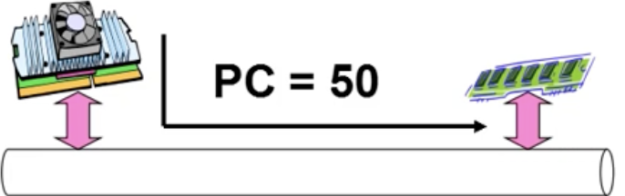
- **PC = 50**：CPU从地址50开始，逐条取指令、执行、PC自动递增
- 内存中同时存放指令和数据——**冯·诺依曼体系结构**的基础
- 这是操作系统管理CPU的最底层：让CPU不断有指令可执行


---

<a id="id3"></a>
## ✅ 知识点3: CPU没有好好运转——I/O阻塞问题

**这个时候遇到问题了...**
- 示例程序（计算1+2+...+n并输出）：
    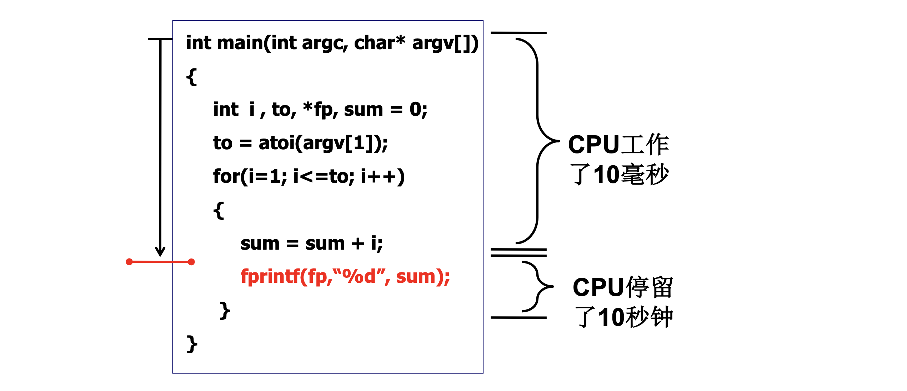

- **问题核心**：CPU在等I/O时**空闲等待**，没有好好运转
- 操作系统要解决的根本问题：**让CPU在等I/O时去干别的**

> ⚠️ **关键区分**：CPU速度 vs I/O速度差距巨大——CPU纳秒级，磁盘毫秒级，相差百万倍，这就是多道程序设计的物理基础


---

<a id="id4"></a>
## ✅ 知识点4: 多道程序交替执行——CPU高效运转的关键

**如何解决这个问题呢？**
- **解决方案**：多个程序交替执行，一个程序等I/O时切换到另一个程序
- 示例：程序1和程序2交替执行
    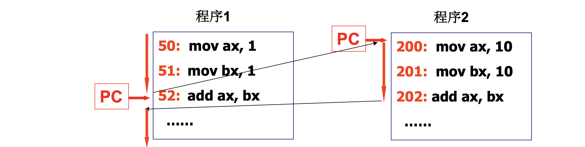
- **两个PC交替执行**：程序1执行一段时间 → 切到程序2 → 程序2执行一段时间 → 切回程序1
- **关键问题**：如何切换？保存/恢复现场——这是进程/线程切换的起源
- 操作系统作为"管理者"：决定什么时候切、切到谁、怎么保存状态

> ⚠️ **关键区分**：多道程序**不是真正并行**（单CPU时），而是**交替并发**——通过快速切换制造"同时运行"的错觉


---

<a id="id5"></a>
## ✅ 知识点5: 栈切换基础——从A跳到B的函数调用机制

**那这是如何做到的呢？ - 使用栈！**
- 栈调用本质：**Push PC, Pop PC**——通过栈保存和恢复返回地址
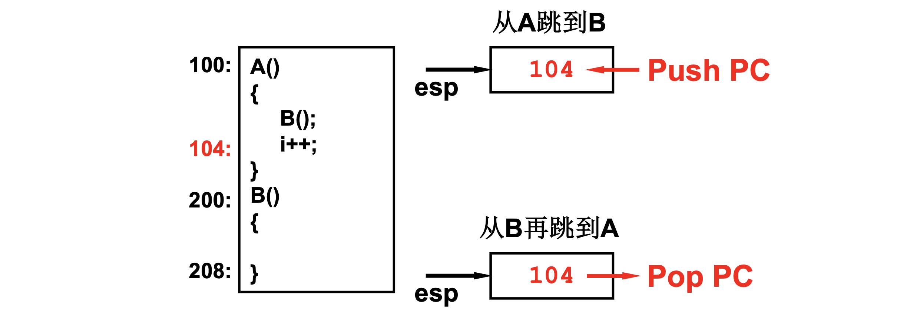

- **从A跳到B，再从B回到A**——靠栈保存的返回地址实现
- 这是**用户态**的栈切换基础，也是用户级线程切换的起点


---

<a id="id6"></a>
## ✅ 知识点6: 一个栈+ `Yield` 的混乱——用户级线程的困境

**可是这个时候又遇到问题了...**
- 四个函数交替执行的例子：
    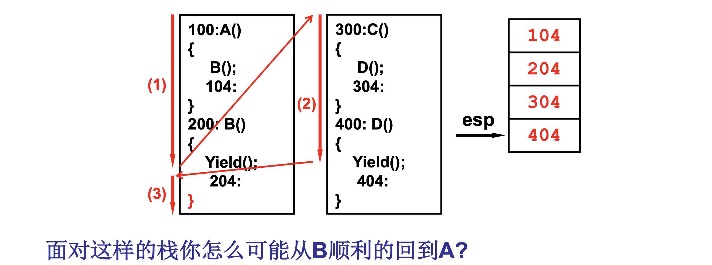
- **致命问题**：面对这样的栈，如何从B顺利回到A？
  - 栈里有104(A→B返回)、204(B→Yield返回)、304(C→D返回)、404(D→Yield返回)
  - 完全混在一起，无法正确返回！
- **结论**：一个栈无法支撑多个线程的交替执行——需要独立的栈空间


> 💡 **理解技巧**：一个栈像一条单行道——A→B→C→D都挤在一条路上，回头时找不到自己的入口。多个栈像多条独立车道，各走各的


---

<a id="id7"></a>
## ✅ 知识点7: 两个栈+两个TCB——用户级线程的解决之道

**两个栈，问题得以解决**
- **`Yield()`功能**：找到下一个 `TCB` → 找到新的栈 → 切换到新的栈
- **两个独立的栈**：
    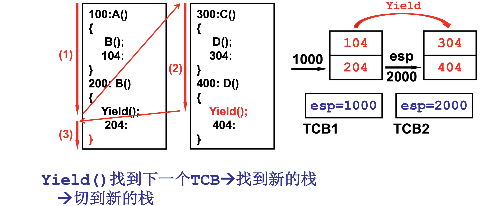

- **切换过程**：`Yield()` 保存当前 `TCB` 的 `esp` → 找到下一个 `TCB` → 加载新 `TCB` 的 `esp` → 新线程继续执行
- **用户级线程的核心**：用户态管理TCB，用户态切换栈，不涉及内核
- **局限**：阻塞系统调用（如 `read` ）会阻塞整个进程，无法利用多核


---

<a id="id8"></a>
## ✅ 知识点8: 从用户态到内核态——为什么必须引入内核

**又一个问题来了，内核怎么办？**
- **用户态与内核态的区分**：
    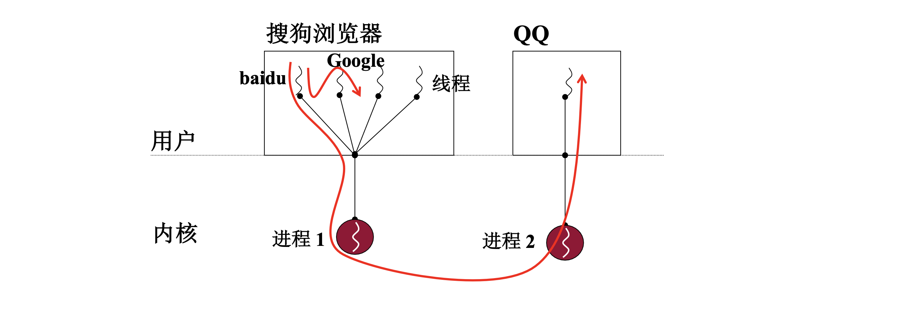
- **用户态**：普通应用程序运行——浏览器、QQ、用户程序
- **内核态**：操作系统核心运行——进程管理、内存管理、设备驱动
- **为什么必须引入内核？**
  1. **特权指令保护**：只有内核能执行I/O操作、修改页表、切换进程
  2. **资源统一管理**：内核统一分配CPU、内存、磁盘，防止用户程序互相干扰
  3. **中断处理**：时钟中断、I/O中断必须由内核处理
  4. **多核支持**：只有内核能调度不同CPU核心上的线程
- **结论**：用户级线程不够——需要内核级线程（核心级线程）


---

<a id="id9"></a>
## ✅ 知识点9: 内核栈切换——核心级线程的完整机制

**引入内核栈后的线程切换**

- **切换过程**：
    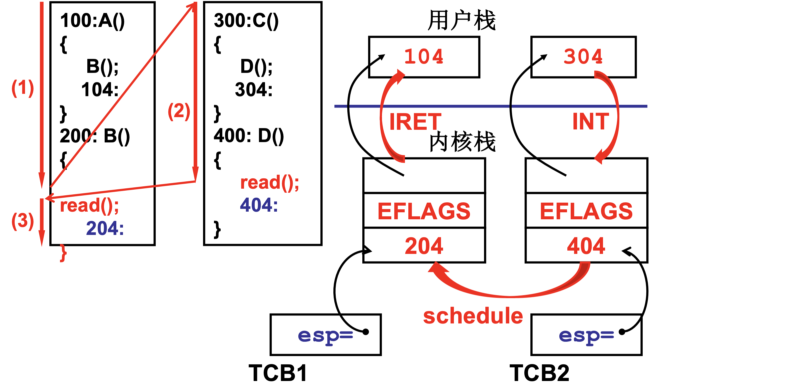
- **关键指令序列**：
  - `INT` — 中断进入，从用户态切换到内核态，硬件自动压栈
  - `schedule` — 调度算法选择下一个线程
  - `IRET` — 中断返回，从内核态回到用户态，硬件自动弹栈
- 内核级线程切换：TCB → 内核栈 → 用户栈（通过IRET恢复）

> ⚠️ **关键区分**：用户级线程切换只改一个esp（用户栈），核心级线程切换要改**两个esp**（内核栈+用户栈通过IRET恢复）


---

<a id="id10"></a>
## ✅ 知识点10: 从用户代码到内核实现—— `fork` 的完整故事

**如何实际实现呢？**
- **例如：实现交替在屏幕打印出A，B**：
    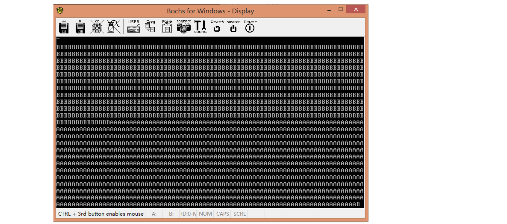
- **用户代码示例（`AB.c`）**：
    ```c
    main() {
        if(!fork()){while(1)printf("A");}
        if(!fork()){while(1)printf("B");}
        wait();
    }
    ```
- **`AB.c` 转汇编**：
    ```c
    main(){
        mov __NR_fork, %eax
        int 0x80                ; fork进入内核执行
    100: mov %eax, res
        cmpl res, 0             ; 将返回值与0比较
        jne 208                 ; 不等于跳到208执行
    200: printf("A")            ; 等于的话执行打印
        jmp 200
    208: ...
    304: wait()
    }
    ```
- **`INT 0x80` 进入内核过程**：
        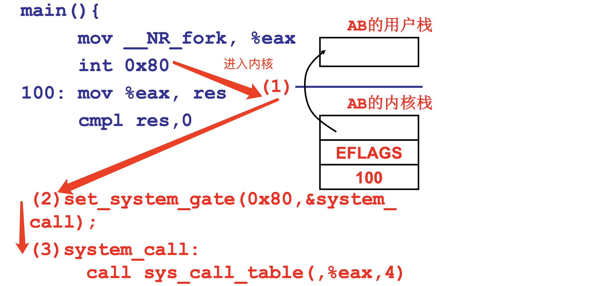
- **`sys_call_table` 调用 `sys_fork`**：
    ```asm
    sys_fork:
        pushl ...
        call copy_process        ; 进入到copy_process
        ret
    ```


> 💡 **理解技巧**：`int 0x80` 像"医院挂号处"——不管看什么病（`fork、read、exec`），都要先挂号（`int 0x80`），再由分诊台（`sys_call_table`）分配到具体科室（`sys_fork、sys_read`）
> 🔄 **知识关联**：L5 系统调用的实现 — `int 0x80` + `system_call` + `sys_call_table` 的系统调用处理链路

---

<a id="id11"></a>
## ✅ 知识点11: `copy_process` —— 创建PCB与内核栈

**关键！！！深入到 `copy_process` 执行**
- **`copy_process` 函数**（创建新进程/线程的核心）：
```c
copy_process(...long eip, ...){
    p = (PCB *)get_free_page();     // 申请一页内存做PCB
    p -> tss.esp0 = p + 4k;         // 内核栈顶（一页末尾）
    p -> tss.esp = esp;              // 用户栈指针（继承父进程）
    p -> tss.eax = 0;                // fork返回0，子进程标志
    p -> tss.eip = eip;              // 用户态PC（入口地址）
    ...
}
```
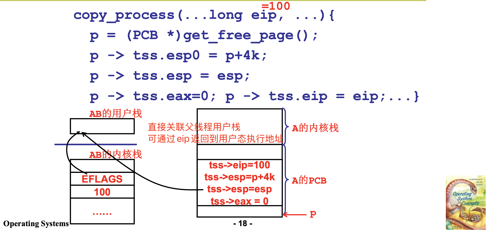
- 子进程"伪造"了中断返回现场——仿佛它也执行过 `int 0x80`

> ⚠️ **关键区分**：`p->tss.eax = 0` 是**子进程fork返回0**的关键——**父进程返回子进程PID，子进程返回0**，从此分道扬镳
> 💡 **理解技巧**：`copy_process` 像"复制档案+改身份证号"——复制父进程的所有状态（寄存器、栈），但把返回值（eax）改成0，让子进程走不同的分支


---

<a id="id12"></a>
## ✅ 知识点12: `fork` 返回后的进程图景——A/B进程并行就绪

**理论**
- **返回链**（理解调用栈）：
    ```
    copy_process(){...}  → 父线程ret 到 sys_fork
    sys_fork:             → call copy_process, ret 到 system_call
    system_call:          → call sys_call_table, 检查state/counter
                        → 父线程可能进入 reschedule 调度到子线程去打印 A
                        → iret 回到用户态 int 0x80 后面
    ```
    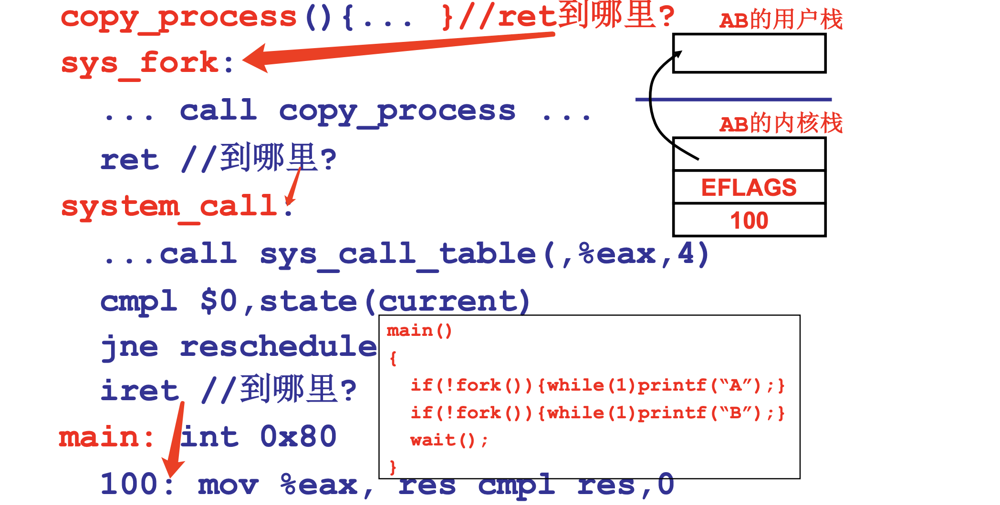
- **AB的PCB - main继续执行**：fork后，父进程继续执行第二个fork
```c
main(){
    又一个 fork;          ; 父进程再次fork
    再一次 int 0x80;      ; 进入内核
    在内核中再产生一个 PCB 和内核栈 ...  ; 创建B进程
}
```
- **系统当前状态**：

| A进程 | B进程 |
|:---|:---|
| A内核栈 | B内核栈 |
| tss->eip=100 | tss->eip=??? |
| tss->esp0=p+4k | tss->esp0=p+4k |
| tss->esp=esp | tss->esp=esp |
| tss->eax = 0 | tss->eax = 0 |
| **A的PCB: p** | **B的PCB: p** |

- **当前运行**：父进程（AB）继续执行，A/B在等待调度
- **就绪队列**：A的PCB, B的PCB — 等待CPU调度执行

**注意点**
- ⚠️ **关键区分**：fork 后**不是三个进程并行**——父进程继续执行，A和B在就绪队列等待被调度。只有父进程执行wait()时，才会等待子进程结束
- 💡 **理解技巧**：fork 像"生双胞胎"——妈妈（父进程）生完A继续生B，然后继续干自己的活（执行wait）。A和B在婴儿床（就绪队列）里等护士（schedule）抱去喂奶（CPU执行）
- 🔄 **知识关联**：L9 多进程图像 — 进程=PCB+栈+代码，fork 创建新进程图像，调度器选择下一个执行的进程

---

## 🔑 核心要点总结

1. **操作系统之树**：从CPU运转（根）→ I/O阻塞问题（干）→ 多道程序交替（枝）→ 用户级线程（叶）→ 内核级线程（果）——层层递进
2. **一个栈的混乱 vs 两个栈的秩序**：用户级线程的致命问题（单栈混用）→ 解决方案（独立栈+TCB）→ 仍需内核（用户级无法突破阻塞和多核限制）
3. **fork 的完整故事**：用户代码 `int 0x80` → `system_call` → `sys_fork` → `copy_process` → 创建PCB+内核栈 → 子进程 `eax=0` → 返回用户态
4. **操作系统设计思想**：不是填满代码，而是点燃思维——理解"为什么需要这些机制"比记忆代码更重要

## 📌 考试速记版

- **关键机制**：CPU→I/O阻塞→多道程序→用户级线程→核心级线程→fork→exec——这是一条层层递进的问题驱动链
- **fork 流程口诀**：int 0x80进内核，system_call分派忙，sys_fork调copy，创建PCB和栈，eax=0子进程，返回用户态各走各
- **易混淆概念对比**：
  - 用户级线程：一个进程内多栈切换，快但无法突破阻塞
  - 核心级线程：两套栈+内核管理，能并行利用多核
  - fork：创建新进程（新地址空间或写时复制）
  - exec：替换当前进程（地址空间不变，代码替换）
- **常见考试陷阱**：
  - fork后父子进程从同一地址返回，但eax不同（父=PID，子=0）
  - 用户级线程的阻塞会阻塞整个进程
  - 核心级线程切换必须进出内核（INT/IRET）

**记忆口诀**：操作系统有棵树，根是CPU干是程，用户线程栈不够，内核栈来补，fork创建PCB，exec换新衣，Linus点燃思维火，Plutarch名言记心底！
