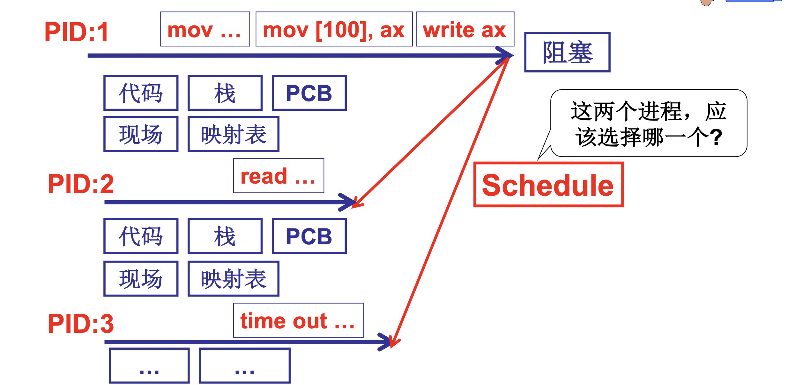
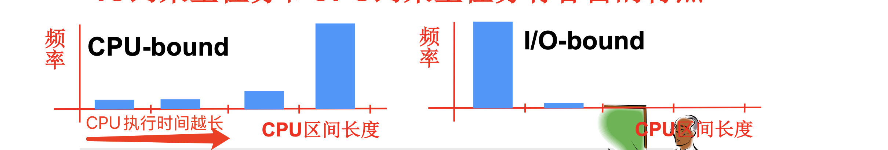
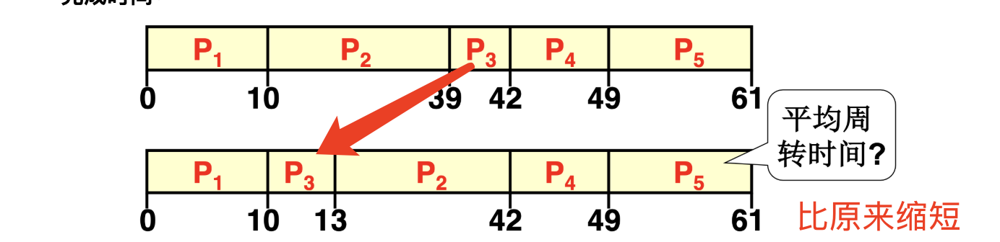

# 📘 2.7 CPU调度策略 (CPU Scheduling)

> 来源说明：哈工大李治军《操作系统》课程 L14 | 本节涵盖：CPU调度算法设计目标、FCFS、SJF、RR、优先级调度、多队列调度，以及吞吐量与响应时间的折中

---

## 🧠 核心概念总览（严格按原文顺序）

> 🔗 **返回知识库主页**：[操作系统笔记主页](./README.md)
- [*知识点1: 多进程图像与CPU调度——调度问题的起源*](#id1)
- [*知识点2: CPU调度(进程调度)的直观想法*](#id2)
- [*知识点3: 调度算法设计目标——让什么更好？*](#id3)
- [*知识点4: 合理调度的本质——折中与综合*](#id4)
- [*知识点5: 各种CPU调度算法总览*](#id5)
- [*知识点6: FCFS 先来先服务——简单有效但不够*](#id6)
- [*知识点7: SJF 短作业优先——缩短周转时间*](#id7)
- [*知识点8: RR 时间片轮转——解决响应时间*](#id8)
- [*知识点9: 响应时间与周转时间同时存在——多队列调度*](#id9)
- [*知识点10: 优先级调度的问题——前台任务阻塞后台*](#id10)
- [*知识点11: 调度算法的现实困境——还有很多问题*](#id11)

---

## ✅ 知识点1: 多进程图像与CPU调度——调度问题的起源

**先来前提回顾...**
- **多进程图像回顾**：系统中存在多个进程（PID:1, PID:2, PID:3...），每个进程有自己的代码、栈、映射表、PCB、现场
- **进程状态转换**：进程在运行、阻塞、就绪之间转换，通过 `time out`（时间片到）或 `read`（I/O阻塞）触发调度

- **核心问题**：当多个进程同时处于就绪状态时，**应该选择哪一个执行？**
  > 💡 **理解技巧**：调度器像"餐厅叫号系统"——客人都坐好了（就绪），服务员（CPU）该叫哪一桌（哪个进程）？
- 调度器（Scheduler）就是解决这个问题的操作系统核心组件

  > ⚠️ **关键区分**：调度发生在**就绪队列**中——只有就绪态的进程才会被调度器考虑，阻塞态进程不会参与调度

---

## ✅ 知识点2: CPU调度(进程调度)的直观想法

**那么我们最想能想到的方法是什么？**

- **直观想法1：FIFO（先来先服务/First In First Out）**——谁先到谁先执行
  - 优点：简单有效，公平
  - 类比：银行、食堂排队
  - **问题1：一个只简单询问业务的人该怎么办？**
  - 如果短任务排在长任务后面，等待时间太长
- **直观想法2：Priority（优先级）**—— 短任务优先

  - **问题2：这人的询问越来越长怎么办？**
    - 降低优先度，排后面去 ...
  - **问题3：如果一个银行业务很长是因为客户需要填写一个很长的表，该怎么办？**
    - 如果优先度太低，对于长任务客户又不公平 ...
  - **还有很多这样的询问…**

> ⚠️ **关键区分**：CPU调度不是简单的"排队"——要考虑任务长度、优先级、响应需求、I/O特性等多个维度

---

## ✅ 知识点3: 调度算法设计目标——让什么更好？

**那么如何让调度算法设计得更好呢？？**
- **面对客户：银行调度算法的设计目标应该是**——用户满意
- **面对进程：CPU调度的目标应该是**——进程满意
- **三个让进程满意的核心指标**：

  | 指标 | 含义 | 目标 |
  |:---|:---|:---|
  | **周转时间（Turnaround Time）** | 从任务进入系统到任务结束的总时间 | 短 |
  | **吞吐量（Throughput）** | 单位时间内完成的任务量 | 高 |
  | **响应时间（Response Time）** | 从操作发生到系统响应的时间 | 短 |
  > 💡 **理解技巧**：周转时间像"从进门到吃完走人"的总时间；吞吐量像"一小时内接待多少桌客人"；响应时间像"点完菜多久上第一道菜"

  - **总原则**：**系统专注于任务执行，又能合理调配任务**
    - **周转时间短** = 任务尽快结束
    - **吞吐量高** = 系统内耗时间少（切换开销小）
    - **响应时间短** = 用户操作尽快得到反馈
    

> ⚠️ **关键区分**：这三个目标**互相矛盾**——追求响应时间需要频繁切换（降低吞吐量），追求吞吐量需要减少切换（牺牲响应时间）

---

## ✅ 知识点4: 合理调度的本质——折中与综合

**如此，折中的设计就非常重要!!!**
- **吞吐量和响应时间之间的矛盾**：
  - 响应时间小 → 切换次数多 → 系统内耗大 → 吞吐量小
  - 折中和综合让操作系统变得复杂，但有效的系统又要求尽量简单
- **前台任务和后台任务的关注点不同**：
  - **前台任务**：关注响应时间（如Word、浏览器）——用户交互型
  - **后台任务**：关注周转时间（如gcc编译、数据处理）——计算密集型
- **I/O约束型任务和CPU约束型任务的特点**：

  | 任务类型 | CPU区间长度 | 频率 | 特点 |
  |:---|:---|:---|:---|
  | CPU-bound（CPU约束型） | 长 | 低 | 长时间计算，很少I/O |
  | I/O-bound（I/O约束型） | 短 | 高 | 频繁I/O，CPU区间短 |
  
  

  - **CPU约束型**：CPU执行时间长，频率低（**后台应用**如编译、科学计算）
  - **I/O约束型**：CPU执行时间短，频率高（**前台应用**如交互式应用、文件操作）

> ⚠️ **关键区分**：**一般来说I/O-bound任务优先级 大于 CPU-bound任务**，因为只有优先执行了IO任务才能尽可能让IO和CPU任务并行起来不至于饥饿
> ⚠️ **设计难题**：折中和综合让操作系统变得复杂，但有效的系统又要求尽量简单…

---

## ✅ 知识点5: 各种CPU调度算法总览

**理论**
- 本课介绍的调度算法：
  1. **FCFS（First Come, First Served）**——先来先服务
  2. **SJF（Shortest Job First）**——短作业优先
  3. **RR（Round Robin）**——时间片轮转
  4. **优先级调度（Priority Scheduling）**——多队列调度
- 每种算法适用于不同场景，没有"完美"算法

**注意点**
- ⚠️ **关键区分**：调度算法没有绝对的好坏——只有"适合不适合当前场景"
- 💡 **理解技巧**：调度算法像"交通工具"——FCFS是公交车（按站停），SJF是快车（短途优先），RR是出租车（轮流接客），优先级是VIP通道
- 🔄 **知识关联**：L14 下节 — 逐一详解每种算法

---

## ✅ 知识点6: FCFS 先来先服务——简单有效但不够

**现在我们来看看最简单的算法 -- FCFS**
- **FCFS（First Come, First Served）**：谁先到达，谁先执行
- **示例**：5个任务，CPU区间（ms）和到达时间：

  | 任务 | CPU区间(ms) | 到达时间 |
  |:---|:---|:---|
  | P1 | 10 | 0.001 |
  | P2 | 29 | 0.002 |
  | P3 | 3 | 0.003 |
  | P4 | 7 | 0.004 |
  | P5 | 12 | 0.005 |

- **调度顺序：P1 → P2 → P3 → P4 → P5**
- **完成时间**：
  
- **平均周转时间**：(10+39+42+49+61) / 5 = **40.2 ms**
- **问题**：短任务P3（3ms）排在了长任务P2（29ms）后面，等待了39ms才完成
  - 因此我们可以将 P3提前到 P2 执行，这样的平均周转时间就变小了，因为 P3 的周转时间由 42 缩短到了13

> ⚠️ **关键区分**：FCFS的致命问题——**护航效应（Convoy Effect）**：长任务前面挡着，后面所有短任务都要等

---

## ✅ 知识点7: SJF 短作业优先——缩短周转时间

**基于以上改进思路，我们又了第二种算法**
- **SJF（Shortest Job First）**：短作业优先，让CPU区间短的任务先执行
- **示例（同样的5个任务）**：
- **调度顺序：P3(3) → P4(7) → P1(10) → P5(12) → P2(29)**
- **完成时间**：P3=3, P4=10, P1=20, P5=32, P2=61
- **平均周转时间**：(3+10+20+32+61) / 5 = **25.2 ms**
- **对比FCFS**：25.2 vs 40.2，**周转时间大幅降低！**
- **数学证明**：
  - 如果调度结果是 p1, p2, ..., pn，则平均周转时间为：
  - `p1 + (p1+p2) + (p1+p2+p3) + ... = Σ(n+1-i)pi`
  - **如果存在 i<j 而 pi>pj，交换 pi, pj 会如何？**——交换后总周转时间减小！
  - 因此，按CPU区间从短到长排序，平均周转时间最小

**注意点**
- ⚠️ **关键区分**：SJF是**最优的周转时间算法**（理论证明），但**不知道任务长度**是致命问题——这是未来的信息
- 💡 **理解技巧**：SJF像"快餐优先"——先服务点汉堡的人，再服务点满汉全席的人，整体翻台率（周转时间）最高
- 🔄 **知识关联**：L14 后续 — 实际系统中用"预测"或"交互反馈"来近似SJF

---

## ✅ 知识点8: RR 时间片轮转——解决响应时间

**理论**
- **RR（Round Robin）**：按时间片轮转调度，每个进程执行一个时间片，然后切换到下一个
- **示例（时间片=10ms）**：
- **调度顺序**：P1(10) → P3(3) → P4(7) → P5(10) → P2(10) → P5(2) → P2(19)
- **完成时间**：P1=10, P3=20, P4=30, P5=52, P2=61
- **平均周转时间**：较高，但**响应时间极好**
- **时间片大小的选择**：
  - 时间片太大：响应时间太长（退化为FCFS）
  - 时间片太小：切换次数多，系统内耗大，吞吐量小
  - **折中**：时间片 10-100ms，切换时间 0.1-1ms（约占1%）
- **如果CPU更快，时间片会怎么样？**
  - CPU更快 → 相同任务执行时间更短 → 可以适当减小时间片 → 响应时间更好，但切换开销占比不变

**注意点**
- ⚠️ **关键区分**：RR适合**交互式任务**（前台），但会牺牲周转时间——不适合批处理（后台）
- 💡 **理解技巧**：RR像"圆桌吃饭"——每人夹一筷子（时间片），轮流来，没人等太久，但每人吃完的总时间变长
- 🔄 **知识关联**：L14 下节 — 如何同时满足前台（RR）和后台（SJF）的需求？

---

## ✅ 知识点9: 响应时间与周转时间同时存在——多队列调度

**理论**
- **问题**：Word很关心响应时间，而gcc更关心周转时间，两类任务同时存在怎么办？
- **一个调度算法让多种类型的任务同时都满意，怎么办？**
- **直观想法：多队列调度**
  - 定义**前台任务队列**和**后台任务队列**
  - **前台任务**：用RR调度（保证响应时间）
  - **后台任务**：用SJF调度（保证周转时间）
  - **优先级**：前台任务优先级高，只有前台任务没有时才调度后台任务
- **这就是优先级调度（Priority Scheduling）**

**注意点**
- ⚠️ **关键区分**：多队列调度是"分层服务"——不同客户走不同通道，但会带来新的问题（见下节）
- 💡 **理解技巧**：多队列像"银行VIP系统"——普通客户排一个队（SJF），VIP客户排另一个队（RR），VIP优先，但VIP太多时普通客户永远轮不到
- 🔄 **知识关联**：L14 下节 — 优先级调度会产生什么问题？

---

## ✅ 知识点10: 优先级调度的问题——前台任务阻塞后台

**理论**
- **问题1：如果一直有前台任务…**
  - 后台任务可能一直得不到运行！
  - **故事**：1973年关闭MIT的IBM 7094时，发现有一个进程在1967年提交但一直未运行
  - 原因：前台任务不断到来，后台任务 starvation（饥饿）
- **问题2：后台任务优先级动态升高**
  - 后台任务等待久了，优先级动态升高
  - 但后台任务（用SJF调度）一旦执行，前台的响应时间...
- **问题3：前后台任务都用时间片**
  - 退化为了RR，后台任务的SJF如何体现？
  - 前台任务如何照顾？
- **核心矛盾**：
  - 前台RR + 后台SJF + 前台优先 → 后台饥饿
  - 动态优先级 → 前台响应时间受损
  - 全用RR → 失去SJF的周转时间优势

**注意点**
- ⚠️ **关键区分**：优先级调度的根本困境——**优先级本身导致饥饿**，动态调整又伤害响应时间，没有完美解
- 💡 **理解技巧**：优先级像"VIP通道"——VIP太多时普通客户永远进不来，让VIP等久了又失去VIP意义，两难！
- 🔄 **知识关联**：L14 下节 — 现实的调度算法（如Linux CFS）如何解决这些问题？

---

## ✅ 知识点11: 调度算法的现实困境——还有很多问题

**理论**
- **问题1：我们怎么知道哪些是前台任务，哪些是后台任务？**
  - fork时告诉我们吗？用户不会标记
- **问题2：gcc就一点不需要交互吗？**
  - Ctrl+C按键怎么工作？需要响应中断
- **问题3：word就不会执行一段批处理吗？**
  - Ctrl+F按键？需要快速搜索（计算密集型）
- **问题4：SJF中的短作业优先如何体现？**
  - 如何判断作业的长度？这是未来的信息
- **问题5：实际的调度算法（如Linux CFS）**
  - 完全公平调度器（Completely Fair Scheduler）
  - 不依赖任务长度预测，用"虚拟运行时间"保证公平
  - 自动处理前台/后台、I/O-bound/CPU-bound
- **结论**：调度算法的设计是一个**持续的优化问题**，没有终极答案

**注意点**
- ⚠️ **关键区分**：现实系统（如Linux）不直接用SJF或固定优先级，而是用更复杂的**公平调度**（CFS）+ **动态优先级**（nice值）综合机制
- 💡 **理解技巧**：调度算法像"交通系统"——简单规则（红绿灯）不够用，要加动态调节（潮汐车道）、智能信号（AI调度）、应急通道（实时优先级），但永远有新问题
- 🔄 **知识关联**：操作系统进阶 — Linux CFS、实时调度（RTOS）、多核调度等更深入内容

---

## 🔑 核心要点总结

1. **调度问题起源**：多进程就绪队列 → 选择哪个执行？
2. **三个核心目标**：周转时间（短）、吞吐量（高）、响应时间（短）——三者矛盾
3. **FCFS**：简单但护航效应严重
4. **SJF**：最优周转时间，但无法预知任务长度
5. **RR**：响应时间好，但牺牲周转时间，时间片选择是关键
6. **多队列/优先级**：分层服务，但导致后台饥饿
7. **现实困境**：任务类型混杂、未来信息未知、公平与效率的矛盾
8. **Linux CFS**：用虚拟运行时间替代固定优先级，追求"完全公平"

## 📌 考试速记版

- **调度算法对比表**：

| 算法 | 核心思想 | 优点 | 缺点 | 适用场景 |
|:---|:---|:---|:---|:---|
| FCFS | 先来先服务 | 简单公平 | 护航效应 | 批处理 |
| SJF | 短作业优先 | 周转时间最优 | 无法预知长度 | 理论最优 |
| RR | 时间片轮转 | 响应时间好 | 切换开销大 | 交互式 |
| 优先级 | 多队列分层 | 兼顾前后台 | 饥饿问题 | 混合负载 |

- **关键矛盾**：响应时间 vs 吞吐量（切换次数）、前台 vs 后台（关注点不同）、CPU-bound vs I/O-bound（CPU区间长度）
- **饥饿（Starvation）**：低优先级任务永远得不到执行——优先级调度的固有问题
- **SJF最优性证明**：如果存在 i<j 且 pi>pj，交换后总周转时间减小 → 按从小到大排序最优
- **时间片选择**：10-100ms，切换时间0.1-1ms（约1%），CPU更快可减小时间片

**记忆口诀**：调度算法三目标，周转吞吐响应忙，FCFS简单护航差，SJF最优难预知，RR轮转响应好，优先级分层防饥饿，多队列前台RR后台SJF，Linux CFS虚拟时间求公平！
