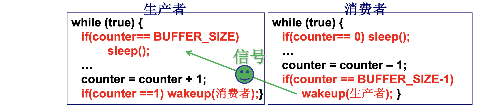

# 📘 L16 进程同步与信号量 (Processes Synchronization and Semaphore)

> 来源说明：哈工大李治军操作系统课程 L16 | 本节涵盖：进程合作场景、信号量机制、P/V操作、生产者-消费者问题的信号量解法

---

## 🧠 核心概念总览（严格按原文顺序）

> 🔗 **返回知识库主页**：[操作系统笔记主页](./README.md)
- [*知识点1: 进程合作与同步需求*](#id1)
- [*知识点2: 生产者-消费者实例*](#id2)
- [*知识点3: 信号机制的引入与局限*](#id3)
- [*知识点4: 从信号到信号量*](#id4)
- [*知识点5: 信号量的定义与P/V操作*](#id5)
- [*知识点6: 信号量解生产者-消费者问题*](#id6)

---

<a id="id1"></a>
## ✅ 知识点1: 进程合作与同步需求

多个进程为了完成同一个任务需要协同工作，这种协作称为**进程合作(Process Cooperation)**。

- **司机与售票员实例**：
  - 司机进程：`启动车辆 → 正常运行 → 到站停车` (循环)
  - 售票员进程：`关门 → 售票 → 开门` (循环)
  - **约束**：售票员关门后司机才能启动；司机到站停车后售票员才能开门
  - 因此在司机启动车辆前需要等待售票员关门的信号！

- **打印队列实例**：
  - 用户进程将文档放入打印队列，打印进程从队列取出文档打印
  - 共享变量：`in`（下一个可放入位置）、`out`（下一个可取出位置）
  - **问题**：如果进程间完全不知道对方存在，可能产生错误（如向满队列写入、从空队列读取）

- **核心需求**：进程只要共享资源（文件、内存、设备）就必须合作，**需要一种机制让进程"走走停停"，保证多进程合作合理有序 -- 这就是进程同步！**

> ⚠️ **关键区分**：进程合作 ≠ 进程通信。合作强调的是**执行顺序的协调**，而非数据交换。


---

<a id="id2"></a>
## ✅ 知识点2: 生产者-消费者实例

**生产者-消费者问题**(Producer-Consumer Problem)是进程同步的经典模型：
- **生产者**：向缓冲区放入数据
- **消费者**：从缓冲区取出数据
- **共享数据**：`buffer[]`、`in`、`out`、`counter`
- **工作流**：为了共同完成一个任务，一些进程工作到一定程度需要阻塞停下来等待信号，等待其他进程工作到一定程度产生一个信号发过去

**代码实例**
- **公共数据区域**

  ```c
  #define BUFFER_SIZE 10
  typedef struct { ... } item;
  item buffer[BUFFER_SIZE];
  int in = out = counter = 0;  // 共享数据
  ```

- **生产者进程**：
  ```c
  while (true) {
    while(counter == BUFFER_SIZE) ;  // 缓冲区满，生产者需要停下来等待
    buffer[in] = item;
    in = (in + 1) % BUFFER_SIZE;
    counter++; //发信号让消费者走
  }
  ```

- **消费者进程**：
  ```c
  while (true) {
    while(counter == 0) ;  // 缓冲区空，消费者需要停
    item = buffer[out];
    out = (out + 1) % BUFFER_SIZE;
    counter--; //发信号让生产者走 
  }
  ```

- **注意**：这些都是**用户态程序**！

> ⚠️ **关键警告**：上述代码使用`忙等待(Busy Waiting)`（`while`空循环），会浪费CPU资源。
> 💡 **理解技巧**：`counter`是核心同步变量——生产者看"满不满"，消费者看"空不空"。
> 🔄 **知识关联**：这种基于共享变量的解法存在`竞争条件(Race Condition)`隐患，`counter++`和`counter--`不是原子操作。


---

<a id="id3"></a>
## ✅ 知识点3: 信号机制的引入与局限


为解决忙等待问题，引入**信号机制(Signal Mechanism)**——让进程在条件不满足时`睡眠(Sleep)`，条件满足时被`唤醒(Wakeup)`：



- **信号机制的致命缺陷——"丢失唤醒"问题**：

  场景：缓冲区满，`counter == BUFFER_SIZE`
  1. 生产者P1放入item，发现满，`sleep()`
  2. **又一个生产者P2**放入item，发现满，`sleep()` ← P2也睡了！
  3. 消费者C执行1次循环，`counter == BUFFER_SIZE-1`，发信号`wakeup(P1)`，P1唤醒
  4. 消费者C再执行1次循环，`counter == BUFFER_SIZE-2`，**P2不能被唤醒**
  5. **结果**：P2永远沉睡，即使缓冲区后来有空位！

  **根本原因**：`sleep()`和`wakeup()`无法记录**有多少个进程在等待**。

> ⚠️ **关键警告**：信号机制的最大缺陷是**丢失唤醒(Lost Wakeup)**，导致进程永久阻塞。
> 🔄 **知识关联**：这正是从"信号"进化到"信号量"的核心动机。


---

<a id="id4"></a>
## ✅ 知识点4: 从信号到信号量

能记录"有2个进程在等待"就可以了——这就是**信号量**(Semaphore)的核心思想：

- 不只是等待信号、发信号（对应`sleep`和`wakeup`）
- 还应该能**记录一些信息**
  > ⚠️ **关键区分**：信号量不是简单的"有/无"标志，而是能记录**资源计数和等待队列**的复合结构。
- **信号量工作过程推演**：

  | 步骤 | 操作 | sem值 | 含义 |
  |:---|:---|:---|:---|
  | 初始 | — | 0 | 初始值（设为0方便理解等待场景） |
  | (1) | P1 sleep | sem = -1 | 1个进程等待 |
  | (2) | P2 sleep | sem = -2 | 2个进程等待 |
  | (3) | wakeup P1 | sem = -1 | 还剩1个等待 |
  | (4) | wakeup P2 | sem = 0 | 没有等待，资源刚好用完 |
  | (5) | C继续执行 | sem = 1 | 多出1个资源，我有一个空闲缓冲去等待进程来到 |
  | (6) | P3执行 | sem = 0 | P3直接使用，无需等待 |

- **核心洞察：通过信号量来决定唤醒**
  - `sem < 0`：**绝对值** = 等待该资源的进程数
  - `sem == 0`：资源刚好用完，无等待
  - `sem > 0`：还有`sem`个资源可用，`sem`个进程来到无需等待直接可用

> 🔄 **知识关联**：信号量的引入直接解决了信号机制"丢失唤醒"的问题，解决了合理的走走停停的问题。


---

<a id="id5"></a>
## ✅ 知识点5: 信号量的定义与P/V操作

**如此信号量`semaphore`如何实现...**

- **信号量**：1965年由荷兰学者**Dijkstra**提出的一种特殊整型变量，**量**用来记录，**信号**用来`sleep`和`wakeup`。

  ```c
  struct semaphore {
    int value;      // 记录资源个数
    PCB *queue;     // 记录等待在该信号量上的进程队列
  };
  ```

- **P操作**（消费资源，Proberen = test）：
  ```c
  P(semaphore s) {
    s.value--;
    if(s.value < 0) {
      sleep(s.queue);  // 将当前进程加入等待队列，阻塞
    }
  }
  ```

- **V操作**（产生资源，Verhogen = increment）：
  ```c
  V(semaphore s) {
    s.value++;
    if(s.value <= 0) {
      wakeup(s.queue);  // 从等待队列唤醒一个进程
    }
  }
  ```

- **P/V操作的核心语义**：
  - `P(s)`：申请一个资源。有资源则直接用（`value > 0`）；没资源则排队（`value <= 0`）
  - `V(s)`：释放一个资源。如果有进程在等（`value < 0`），唤醒一个；否则资源数+1


> ⚠️ **关键区分**：`V`操作后`value <= 0`才唤醒（不是`< 0`），因为`V`是先`value++`，如果原来是负数，加1后仍`<= 0`说明还有进程在等。
> 🔄 **知识关联**：`PCB *queue`将信号量与进程管理直接联系起来——阻塞的进程挂在`semaphore`的队列上。


---

<a id="id6"></a>
## ✅ 知识点6: 信号量解生产者-消费者问题

**利用 `semaphore` 来解决之前的同步问题**

- 使用三个信号量来解决生产者-消费者问题：

  | 信号量 | 初始值 | 含义 |
  |:---|:---|:---|
  | `full` | 0 | 缓冲区中已填充的槽位数 |
  | `empty` | BUFFER_SIZE | 缓冲区中空槽位数 |
  | `mutex` | 1 | 互斥访问缓冲区的锁 |

- **为什么要用`mutex`？**
  - `mutex`保证**互斥**（同一时刻只有一个进程操作共享缓冲区数据）
  - 所以通过设置初始值为 1 来只允许一个进程在内部
  - 通过 P(mutex)，V(mutex)来进出于共享缓冲区

- **共享缓冲区**：
  ```c
  int fd = open("buffer.txt");
  write(fd, 0, sizeof(int));   // 写 in
  write(fd, 0, sizeof(int));   // 写 out
  ```

- **根据需求定义信号量**

  ```c
  semaphore full = 0;
  semaphore empty = BUFFER_SIZE;
  semaphore mutex = 1;
  ```

- **生产者**：
  ```c
  Producer(item) {
    P(empty);     // 等一个空槽位
    P(mutex);     // 申请进入临界区
    读入 in;
    将 item 写入到 in 的位置上;
    V(mutex);     // 退出临界区
    V(full);      // 增加一个已填充槽位
  }
  ```
  - 当缓冲区满的时候，生产者需要停等，因此我们需要一个值 `empty` 为 `0` 的时候表达缓冲区满
  - 通过 `P(empty)` 来使用减少空位并测试现在 `empty` 是否等于0，也就是是否满了 
  - 对应的我们就要在**消费者**那边通过 `V(empty)` 增加空闲缓冲区个数 `empty`
- **消费者**：
  ```c
  Consumer() {
    P(full);      // 等一个有数据的槽位
    P(mutex);     // 申请进入临界区
    读入 out;
    从文件中的 out 位置读出到 item;
    打印 item;
    V(mutex);     // 退出临界区
    V(empty);     // 释放一个空槽位
  }
  ```
  -  当缓冲区空的时候，消费者需要停等，因此我们需要一个值 `full` 为 `0` 的时候表达缓冲区空
  - 通过 `P(full)` 来消费内容，如果没有则阻塞
  - 对应的**生产者**需要通过 `V(full)` 来生成出内容增加 `full`

> ⚠️ **关键区分**：`full`和`empty`是**同步信号量**（协调执行顺序），`mutex`是**互斥信号量**（保护临界区），二者缺一不可。
> ⚠️ **关键警告**：**P操作的顺序不能换！** 必须先`P(full)`/`P(empty)`，再`P(mutex)`。如果先`P(mutex)`再`P(full)`，当缓冲区为空时，消费者持有锁却被阻塞，生产者无法获得锁放入数据——**死锁(Deadlock)**！
> 🔄 **知识关联**：`mutex = 1`的信号量又称为`二元信号量(Binary Semaphore)`，功能上等价于`锁(Lock)`。


---

## 🔑 核心要点总结

1. **进程同步的本质**：让多进程"走走停停"，按合理顺序推进，避免竞争和错误。
2. **信号机制的缺陷**：`sleep`/`wakeup`无法记录等待进程数，导致**丢失唤醒**问题。
3. **信号量的核心**：用一个整型变量`value`记录资源数和等待数，配合`PCB队列`管理阻塞进程。
4. **P/V操作**：`P`申请资源（`value--`，负则睡），`V`释放资源（`value++`，非正则唤醒）。
5. **生产者-消费者的标准解法**：`full`+`empty`管同步，`mutex`管互斥，且**必须先P同步信号量，再P互斥信号量**。
6. **信号量初值的意义**：`sem > 0`表示可用资源数；`sem = 0`表示资源刚好用完；`sem < 0`绝对值表示等待进程数。

---

## 📌 考试速记版

- **信号量值的三态解读**：
  - $> 0$：剩余可用资源数
  - $= 0$：资源刚好用完
  - $< 0$：**绝对值** = 等待进程数

- **P/V操作伪代码**：
  ```
  P(s): s.value--；if(s.value < 0) sleep(s.queue)
  V(s): s.value++；if(s.value <= 0) wakeup(s.queue)
  ```

- **易混淆概念对比**：
  | | 信号(Signal) | 信号量(Semaphore) |
  |:---|:---|:---|
  | 记录等待数 | ❌ 不能 | ✅ 能（value<0时） |
  | 唤醒丢失 | ❌ 会 | ✅ 不会 |
  | 数据结构 | 无 | `struct {int value; PCB* queue;}` |
  | 操作 | `sleep()`/`wakeup()` | `P()`/`V()` |

- **常见考试陷阱**：
  - ❌ P操作顺序错误：先`P(mutex)`后`P(empty)` → **死锁**
  - ❌ V操作不需要配对的P（V总是安全的，P才需要检查）
  - ❌ 混淆`sem=2`的含义：是"2个资源可用"，不是"2个进程等待"

**记忆口诀**：P减V加，负数排队，V后非正唤醒一个，先同步后互斥不死锁。
