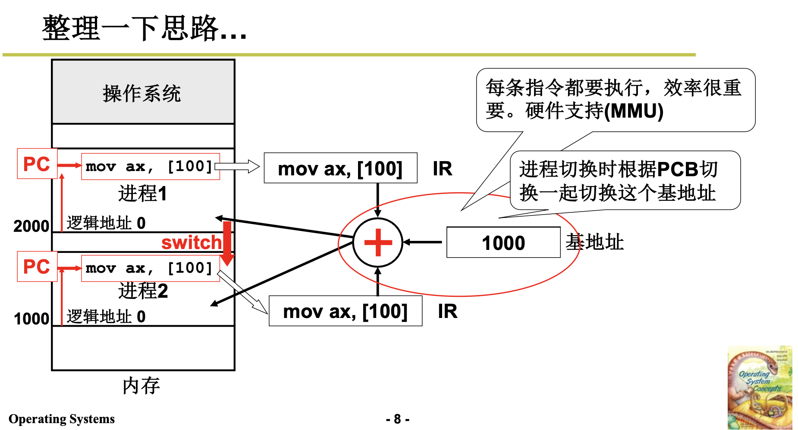
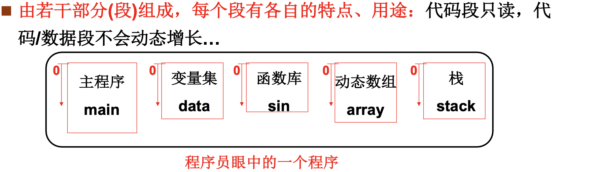
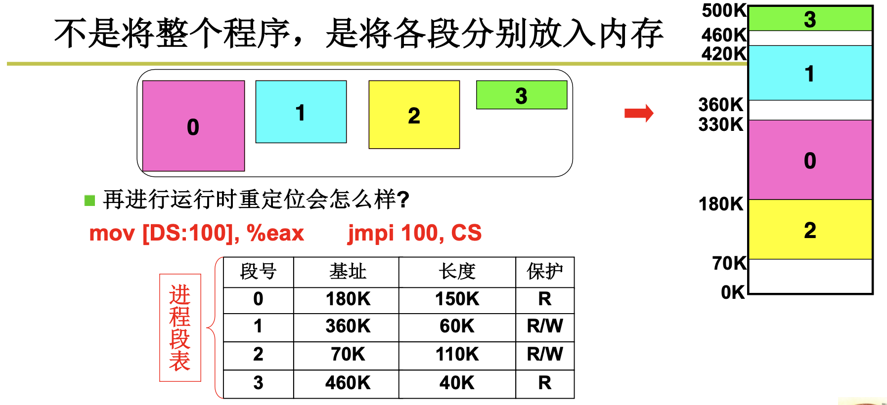
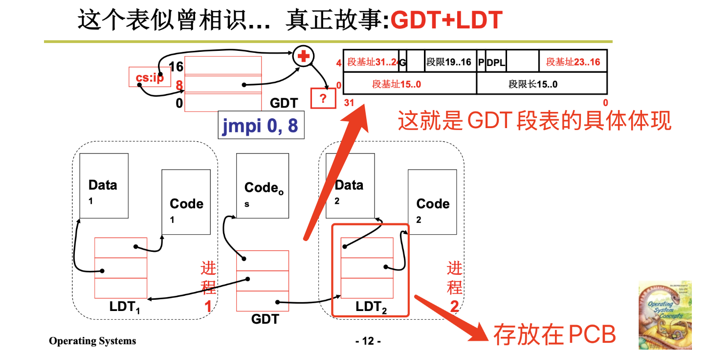

# 📘 3.1 内存使用与分段 (Memory Usage and Segmentation)

> 来源说明：哈工大李治军操作系统课程 L20 | 本节涵盖：程序重定位机制、运行时地址翻译、分段内存管理及 x86 分段实现

---

## 🧠 核心概念总览（严格按原文顺序）

> 🔗 **返回知识库主页**：[操作系统笔记主页](./README.md)
- [*知识点1: 内存使用核心问题与冯·诺依曼架构*](#id1)
- [*知识点2: 重定位——编译时与载入时*](#id2)
- [*知识点3: 交换机制与运行时重定位的引入*](#id3)
- [*知识点4: 运行时重定位与基地址机制*](#id4)
- [*知识点5: 多进程地址翻译*](#id5)
- [*知识点6: 分段机制引入——程序的自然结构*](#id6)
- [*知识点7: 段表机制与分段地址翻译*](#id7)
- [*知识点8: GDT与LDT——x86分段实现*](#id8)


---

<a id="id1"></a>
## ✅ 知识点1: 内存使用核心问题与冯·诺依曼架构

**依然从计算机如何工作开始**
- **核心问题**：如何让内存用起来？
- **冯·诺依曼架构**基本工作方式：
  - **存储器（内存）**：存储指令和数据
  - **运算器、控制器**：执行运算和控制
  - **IP/PC**：指向下一条要执行的指令
  - **IR**：存放当前执行的指令
- **基本执行循环**：取指 → 执行 → 取指 → 执行 → ...（无限循环）
- **内存使用的核心思想**：**将程序放到内存中，PC 指向开始地址**
  


> 📋 **术语提醒**：`IP` = `PC`，不同架构叫法不同，x86 叫 `EIP`/`RIP`

---

<a id="id2"></a>
## ✅ 知识点2: 重定位——编译时与载入时

**那就首先让程序进入到内存...**

- **核心问题**：程序中的地址是**相对地址（逻辑地址）**，加载到不同**物理位置**后地址不再正确
  1. 现在我们将 `main` 函数编译为汇编放置在磁盘
  2. 现在我们要将函数 `main` 加载到内存中执行
  3.  `_main` 的调用相对地址偏移量为 40，可以按照相同地址原封不动地放入内存 
  4. 但实际上这些内存地址早被占用，实际行不通，应该是找一块空闲内存放入
  5. 这个时候相对地址就是错误的了
  

- **解决办法 -- 重定位**(`Relocation`)：修改程序中的地址（相对地址 → 绝对地址）

- **编译示例**
  - 程序加载到地址 0：`_main` 偏移为 40，`call 40` 正确
  - 程序加载到地址 1000：
  

- **重定位时机对比**

  | 重定位时机 | 机制 | 特点 | 局限性 |
  |:---|:---|:---|:---|
  | **编译时重定位** | 编译阶段确定绝对地址 | 简单直接 | 程序只能放在内存**固定位置** |
  | **载入时重定位** | 加载时由加载器修改地址 | 灵活选择加载位置 | 一旦载入内存就**不能移动** |

> 🔄 **知识关联**：这两种重定位都不支持**运行时移动**，而程序运行中确实需要移动（交换）


---

<a id="id3"></a>
## ✅ 知识点3: 交换机制与运行时重定位的引入

**然而这两种重定位依然不够...**
- **核心问题**：内存容量有限，一些内存中的进程长期不用就是浪费内存！因此**程序载入后还需要移动！**
- **解决办法 -- 交换**(`Swap`) 机制：进程在内存与磁盘之间动态调度
  - 目的：充分利用内存，支持多道程序
  - 场景：进程睡眠时换出到磁盘，需要运行时换入内存

- 交换过程示意：
  

- **关键结论**：**程序载入后仍应该是可重定位的！**
> 📋 **术语提醒**：`Swap In` = 换入（磁盘→内存）；`Swap Out` = 换出（内存→磁盘）

---

<a id="id4"></a>
## ✅ 知识点4: 运行时重定位与基地址机制

**重定位的最佳时机 -- 运行时重定位！**
- **运行时重定位**(`Runtime Relocation`)：在运行每条指令时才完成重定位——**最合适的重定位时机**
- **核心机制**：基地址(`Base`)——每个进程有各自的基地址，存放在 **PCB** 中
- **地址翻译公式**：
  $$物理地址 = base（基地址）+ offset（偏移量/逻辑地址）$$

- 逻辑地址空间 → 物理内存映射：
  
  - 执行指令时的关键步骤：
    1. 找到一块空闲内存，将程序放入并找到这块内存 `base` 地址将其赋给本进程 `pcb`
    2. 取指令 `mov [300], 0`
    3. 从 `pcb` 取出该进程的 **`base`** 值
    3. 计算：物理地址 = base + 300
    4. 访问物理内存地址


> ⚠️ **关键区分**：运行时重定位的 base 值存在 PCB 中，不是程序代码的一部分
> 🔄 **知识关联**：进程切换时必须切换 base 值，否则进程会访问到别人的内存


---

<a id="id5"></a>
## ✅ 知识点5: 多进程地址翻译

**整理一下整个思路...**
- **效率问题**：每条指令都要地址翻译，纯软件太慢
- **硬件支持**：MMU(`Memory Management Unit`，内存管理单元)——硬件自动完成地址翻译
- **核心寄存器**：
  - **base 寄存器**：存放当前进程的基地址
  - **limit 寄存器**：界限寄存器，检查地址是否越界（保护）

- 多进程地址翻译场景：
  

> ⚠️ **关键区分**：MMU 是硬件，base/limit 是寄存器，PCB 是内存中的数据结构
> 💡 **理解技巧**：MMU 就像自动翻译机——CPU 说"我要 100 号房间"，MMU 自动加 base 变成"实际房间号"


---

<a id="id6"></a>
## ✅ 知识点6: 分段机制引入——程序的自然结构

**关键质疑**：是将整个程序一起载入内存中吗？
- **程序员眼中的程序结构**：
  
  | 段 | 特点 | 用途 |
  |:---|:---|:---|
  | **代码段（.text）** | **只读**、不会动态增长 | 存放程序指令 |
  | **数据段（.data）** | **可读写**、大小固定 | 全局变量、静态变量 |
  | **栈段（stack）** | 动态增长、向下扩展 | 局部变量、函数调用 |
  | **堆段（heap）** | 动态增长、向上扩展 | 动态内存分配 |
  | **函数库** | 只读、可共享 | 共享库代码 |

- **分段定位方式**：`<段号, 段内偏移>`
  - 示例：`mov [es:bx], ax` —— `es` 段寄存器，`bx` 段内偏移
- **核心优势**：
  - **符合用户观点：用户可独立考虑每个段（分治）**
  - **各司其职**：每个段都有各自的用途，特点（可读，可读写等）
  - **更为高效**：当申请内存不够用而移动到更大内存的话，就不用将所有段一起移动到新内存，就移动不够用的段即可


> ⚠️ **关键区分**：分段是程序的逻辑组织，不是物理内存的组织——各段在物理内存中可以不相邻


---

<a id="id7"></a>
## ✅ 知识点7: 段表机制与分段地址翻译

**那么一段一段如何放入内存呢？**
- **核心思想**：**不是将整个程序，是将各段分别放入内存**
- **段表**(`Segment Table`)：每个进程一张，记录各段基址、限长、保护属性
  - 现在每段就要有一个基值

- 物理内存布局：
  

- 问题：假设DS=1，CS=0，上面两条指令运行时重定位成什么?：
  ```asm
  mov [DS:100], %eax   ; DS=1 → 段1基址=360K → 物理地址=360K+100=360100
  jmpi 100, CS         ; CS=0 → 段0基址=180K → 物理地址=180K+100=180100
  ```

> ⚠️ **关键区分**：段号不是直接加到偏移上，而是通过段表查找到基址再加——多了一次间接访问
> 📋 **术语提醒**：`DS` = 数据段寄存器；`CS` = 代码段寄存器；`SS` = 栈段寄存器

---

<a id="id8"></a>
## ✅ 知识点8: GDT与LDT——x86分段实现

**这时候就可以回答曾经的疑问了**
- **GDT**(`Global Descriptor Table`，全局描述符表)：系统级段描述符表，所有进程共享
- **LDT**(`Local Descriptor Table`，局部描述符表)：进程级段描述符表，每个进程私有
- **GDT和LDT之间的互动**：
  - GDT 就可以视为 OS 这个级别的段表， 而 LDT 就是进程级别的段表
  - GDT 里存着"每个进程的 LDT 在哪"的指针，LDT 里存着"这个进程自己的每个段从哪开始"的指针；CPU 先查 GDT 找到 LDT，再查 LDT 找到具体段
  > ⚠️ **关键区分**：GDT 只有一个，LDT 每个进程一个；通过段选择子的 TI 位决定查哪个表
  > 🔄 **知识关联**：LDT 的基地址本身也存储在 GDT 中，形成两级查找
- GDT/LDT 结构：
  
  - **GDT 里既有 OS 内核的代码段/数据段，也有每个进程的 TSS 和 LDT 描述符**


- `jmpi 0,8` 的奥秘：
  `jmpi 0,8` 中 根据 `8` 这个 CS 找到GDT表中的基值，然后跳到**段内偏移 0** 的位置执行。


> 📋 **术语提醒**：`Selector` = 选择子（不是段基址！是表的索引）；`Descriptor` = 描述符（8字节，含基址/限长/属性）

---

## 🔑 核心要点总结

1. **重定位三时机**：编译时（固定位置）→ 载入时（可换位置但不可移动）→ **运行时**（最优，支持交换）
2. **运行时重定位核心**：`物理地址 = base + offset`，base 存于 PCB，MMU 硬件加速翻译
3. **分段动机**：程序自然分为代码/数据/栈/堆，各段独立管理、独立保护、独立增长
4. **段表翻译**：`<段号:偏移>` → 查段表得基址 → 物理地址 = 基址 + 偏移
5. **x86 实现**：GDT（全局）+ LDT（局部）+ 段选择子（索引+TI+RPL）+ 段描述符（8字节）

---