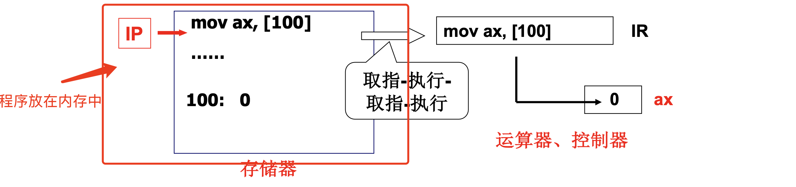
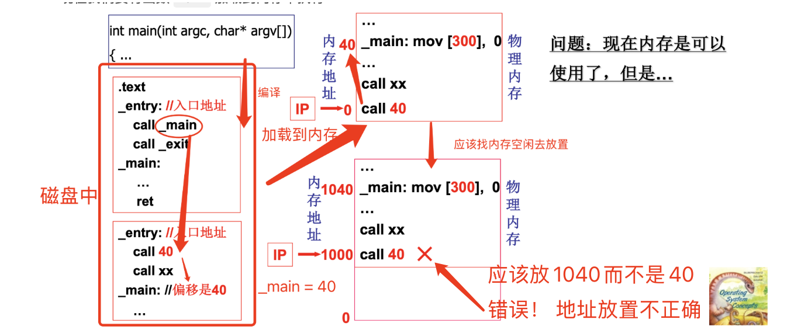
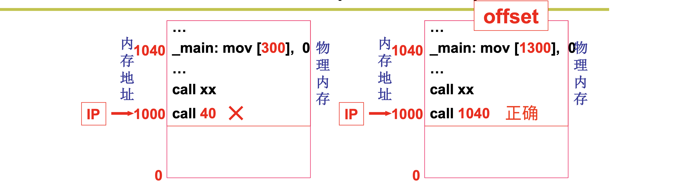
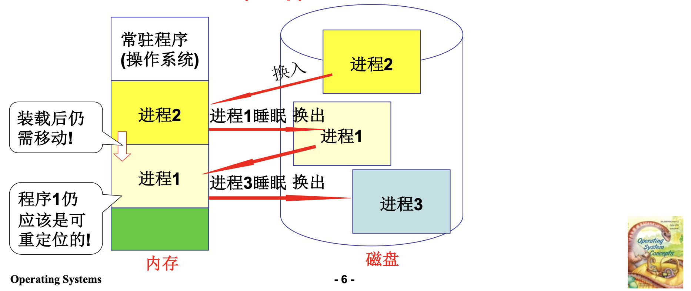
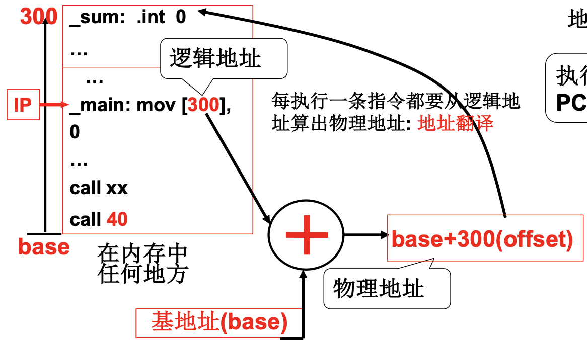

# 📘 3.1 内存使用与分段 (Memory Usage and Segmentation)

> 来源说明：哈工大李治军操作系统课程 L20 | 本节涵盖：程序重定位机制、运行时地址翻译、分段内存管理及 x86 分段实现

---

## 🧠 核心概念总览（严格按原文顺序）

- [*知识点1: 内存使用核心问题与冯·诺依曼架构*](#id1)
- [*知识点2: 重定位——编译时与载入时*](#id2)
- [*知识点3: 交换机制与运行时重定位的引入*](#id3)
- [*知识点4: 运行时重定位与基地址机制*](#id4)
- [*知识点5: MMU硬件支持与地址翻译*](#id5)
- [*知识点6: 分段机制引入——程序的自然结构*](#id6)
- [*知识点7: 段表机制与分段地址翻译*](#id7)
- [*知识点8: GDT与LDT——x86分段实现*](#id8)
- [*知识点9: 特权级保护机制*](#id9)
- [*知识点10: 分段的优势与外部碎片问题*](#id10)
- [*知识点11: x86架构中的分段与Linux策略*](#id11)

---

<a id="id1"></a>
## ✅ 知识点1: 内存使用核心问题与冯·诺依曼架构

**依然从计算机如何工作开始**
- **核心问题**：如何让内存用起来？
- **冯·诺依曼架构**基本工作方式：
  - **存储器（内存）**：存储指令和数据
  - **运算器、控制器**：执行运算和控制
  - **IP/PC**：指向下一条要执行的指令
  - **IR**：存放当前执行的指令
- **基本执行循环**：取指 → 执行 → 取指 → 执行 → ...（无限循环）
- **内存使用的核心思想**：**将程序放到内存中，PC 指向开始地址**
  


> 📋 **术语提醒**：`IP` = `PC`，不同架构叫法不同，x86 叫 `EIP`/`RIP`

---

<a id="id2"></a>
## ✅ 知识点2: 重定位——编译时与载入时

**那就首先让程序进入到内存...**

- **核心问题**：程序中的地址是**相对地址（逻辑地址）**，加载到不同**物理位置**后地址不再正确
  1. 现在我们将 `main` 函数编译为汇编放置在磁盘
  2. 现在我们要将函数 `main` 加载到内存中执行
  3.  `_main` 的调用相对地址偏移量为 40，可以按照相同地址原封不动地放入内存 
  4. 但实际上这些内存地址早被占用，实际行不通，应该是找一块空闲内存放入
  5. 这个时候相对地址就是错误的了
  

- **解决办法 -- 重定位**(`Relocation`)：修改程序中的地址（相对地址 → 绝对地址）

- **编译示例**
  - 程序加载到地址 0：`_main` 偏移为 40，`call 40` 正确
  - 程序加载到地址 1000：
  

- **重定位时机对比**

  | 重定位时机 | 机制 | 特点 | 局限性 |
  |:---|:---|:---|:---|
  | **编译时重定位** | 编译阶段确定绝对地址 | 简单直接 | 程序只能放在内存**固定位置** |
  | **载入时重定位** | 加载时由加载器修改地址 | 灵活选择加载位置 | 一旦载入内存就**不能移动** |

> 🔄 **知识关联**：这两种重定位都不支持**运行时移动**，而程序运行中确实需要移动（交换）


---

<a id="id3"></a>
## ✅ 知识点3: 交换机制与运行时重定位的引入

**然而这两种重定位依然不够...**
- **核心问题**：内存容量有限，一些内存中的进程长期不用就是浪费内存！因此**程序载入后还需要移动！**
- **解决办法 -- 交换**(`Swap`) 机制：进程在内存与磁盘之间动态调度
  - 目的：充分利用内存，支持多道程序
  - 场景：进程睡眠时换出到磁盘，需要运行时换入内存

- 交换过程示意：
  

- **关键结论**：**程序载入后仍应该是可重定位的！**
> 📋 **术语提醒**：`Swap In` = 换入（磁盘→内存）；`Swap Out` = 换出（内存→磁盘）

---

<a id="id4"></a>
## ✅ 知识点4: 运行时重定位与基地址机制

**重定位的最佳时机 -- 运行时重定位！**
- **运行时重定位**(`Runtime Relocation`)：在运行每条指令时才完成重定位——**最合适的重定位时机**
- **核心机制**：基地址(`Base`)——每个进程有各自的基地址，存放在 **PCB** 中
- **地址翻译公式**：
  $$物理地址 = base（基地址）+ offset（偏移量/逻辑地址）$$

- 逻辑地址空间 → 物理内存映射：
  
  - 执行指令时的关键步骤：
    1. 找到一块空闲内存，将程序放入并找到这块内存 `base` 地址将其赋给本进程 `pcb`
    2. 取指令 `mov [300], 0`
    3. 从 `pcb` 取出该进程的 **`base`** 值
    3. 计算：物理地址 = base + 300
    4. 访问物理内存地址


> ⚠️ **关键区分**：运行时重定位的 base 值存在 PCB 中，不是程序代码的一部分
> 🔄 **知识关联**：进程切换时必须切换 base 值，否则进程会访问到别人的内存


---

<a id="id5"></a>
## ✅ 知识点5: MMU硬件支持与地址翻译

**理论**
- **效率问题**：每条指令都要地址翻译，纯软件太慢
- **硬件支持**：MMU(`Memory Management Unit`，内存管理单元)——硬件自动完成地址翻译
- **核心寄存器**：
  - **base 寄存器**：存放当前进程的基地址
  - **limit 寄存器**：界限寄存器，检查地址是否越界（保护）

**教材示例/公式**
- 多进程地址翻译场景：
  ```
  进程1（base=2000）: mov ax,[100] → 物理地址 = 2000+100 = 2100
  进程2（base=1000）: mov ax,[100] → 物理地址 = 1000+100 = 1100
  ```
  - 相同逻辑地址 [100]，因 base 不同映射到不同物理地址！

- 进程切换操作：
  ```
  进程1运行 ──→ switch ──→ 进程2运行
                │
                ▼
          保存进程1的 PCB（含 base=2000）
          恢复进程2的 PCB（含 base=1000）
                │
                ▼
          base 寄存器 ← 进程2的 base
  ```

**注意点**
- ⚠️ **关键区分**：MMU 是硬件，base/limit 是寄存器，PCB 是内存中的数据结构
- 💡 **理解技巧**：MMU 就像自动翻译机——CPU 说"我要 100 号房间"，MMU 自动加 base 变成"实际房间号"
- 🔄 **知识关联**：这是操作系统与硬件协作的经典案例——OS 设置 base，硬件完成翻译
- 📋 **术语提醒**：`MMU` 在现代 CPU 中集成在芯片内部，不是独立设备

---

<a id="id6"></a>
## ✅ 知识点6: 分段机制引入——程序的自然结构

**理论**
- **关键质疑**：是将整个程序一起载入内存中吗？
- **程序员眼中的程序结构**：

| 段 | 特点 | 用途 |
|:---|:---|:---|
| **代码段（.text）** | 只读、不会动态增长 | 存放程序指令 |
| **数据段（.data）** | 读写、大小固定 | 全局变量、静态变量 |
| **栈段（stack）** | 动态增长、向下扩展 | 局部变量、函数调用 |
| **堆段（heap）** | 动态增长、向上扩展 | 动态内存分配 |
| **函数库** | 只读、可共享 | 共享库代码 |

- **分段定位方式**：`<段号, 段内偏移>`
  - 示例：`mov [es:bx], ax` —— `es` 段寄存器，`bx` 段内偏移
- **核心优势**：**符合用户观点：用户可独立考虑每个段（分治）**

**注意点**
- ⚠️ **关键区分**：分段是程序的逻辑组织，不是物理内存的组织——各段在物理内存中可以不相邻
- 💡 **理解技巧**：分段就像把行李分类打包——衣服一包、电子产品一包、文件一包，到酒店后各自放不同抽屉
- 🔄 **知识关联**：分段为后续的保护、共享、动态增长提供了天然的基础
- 📋 **术语提醒**：`Segment` = 段；`Segmentation` = 分段机制；`Offset` = 段内偏移

---

<a id="id7"></a>
## ✅ 知识点7: 段表机制与分段地址翻译

**理论**
- **核心思想**：**不是将整个程序，是将各段分别放入内存**
- **段表**(`Segment Table`)：每个进程一张，记录各段基址、限长、保护属性

**教材示例/公式**
- 段表示例：

| 段号 | 基址（base） | 长度（limit） | 保护（protection） |
|:--:|:----------:|:-----------:|:---------------:|
| 0 | 180K | 150K | R（只读） |
| 1 | 360K | 60K | R/W（读写） |
| 2 | 70K | 110K | R/W（读写） |
| 3 | 460K | 40K | R（只读） |

- 物理内存布局：
  ```
  0K      70K     180K    330K    360K    420K    460K    500K
  ├───────┼───────┼───────┼───────┼───────┼───────┼───────┼──────
  │       │ 段2   │ 段0   │       │ 段1   │       │ 段3   │
  │       │(stack)│(code) │       │(data) │       │(heap) │
  └───────┴───────┴───────┴───────┴───────┴───────┴───────┴──────
  ```

- 地址翻译示例：
  ```asm
  mov [DS:100], %eax   ; DS=1 → 段1基址=360K → 物理地址=360K+100=360100
  jmpi 100, CS         ; CS=0 → 段0基址=180K → 物理地址=180K+100=180100
  ```

**注意点**
- ⚠️ **关键区分**：段号不是直接加到偏移上，而是通过段表查找到基址再加——多了一次间接访问
- 💡 **理解技巧**：段表就像酒店的楼层导览图——段号是楼层号，查表找到楼层起始位置，偏移是房间号
- 🔄 **知识关联**：段表放在 PCB 中或 PCB 指向的内存区域，进程切换时切换段表
- 📋 **术语提醒**：`DS` = 数据段寄存器；`CS` = 代码段寄存器；`SS` = 栈段寄存器

---

<a id="id8"></a>
## ✅ 知识点8: GDT与LDT——x86分段实现

**理论**
- **GDT**(`Global Descriptor Table`，全局描述符表)：系统级段描述符表，所有进程共享
- **LDT**(`Local Descriptor Table`，局部描述符表)：进程级段描述符表，每个进程私有

**教材示例/公式**
- GDT/LDT 结构：
  ```
  GDT（全局描述符表）
  ├── 0号：空描述符（NULL）
  ├── 8号：内核代码段（Code0）
  ├── 16号：内核数据段（Data0）
  ├── LDT1描述符：指向进程1的LDT
  └── LDT2描述符：指向进程2的LDT

  进程1的LDT（LDT1）
  ├── Code1：进程1代码段
  └── Data1：进程1数据段
  ```

- **段选择子**(`Selector`) 格式：
  ```
  | Index (13位) | TI (1位) | RPL (2位) |
  ```
  - `Index`：描述符表中的索引（0~8191）
  - `TI`：0=GDT，1=LDT
  - `RPL`：请求特权级（0~3）

- 示例代码分析：
  ```asm
  jmpi 0, 8        ; 跳转到选择子8，偏移0
  ; 8 = 1000b = 索引1，TI=0(GDT)，RPL=0
  ; 即GDT中第1个有效描述符（内核代码段Code0）
  ```

**注意点**
- ⚠️ **关键区分**：GDT 只有一个，LDT 每个进程一个；通过段选择子的 TI 位决定查哪个表
- 💡 **理解技巧**：GDT 像城市总地图，LDT 像各小区的详细地图——先查总图找到小区，再查小区图找到楼栋
- 🔄 **知识关联**：LDT 的基地址本身也存储在 GDT 中，形成两级查找
- 📋 **术语提醒**：`Selector` = 选择子（不是段基址！是表的索引）；`Descriptor` = 描述符（8字节，含基址/限长/属性）

---

<a id="id9"></a>
## ✅ 知识点9: 特权级保护机制

**理论**
- **x86 四级特权环**：

| Ring | 用途 | 特权 |
|:---|:---|:---|
| Ring 0 | 内核态（操作系统） | 最高 |
| Ring 1 | 设备驱动（传统） | — |
| Ring 2 | 设备驱动（传统） | — |
| Ring 3 | 用户态（应用程序） | 最低 |

- **关键检查规则**：`max(CPL, RPL) ≤ DPL` 才能访问目标段
  - `CPL`(`Current Privilege Level`)：当前特权级（CS 的 RPL）
  - `DPL`(`Descriptor Privilege Level`)：描述符特权级
  - `RPL`(`Requestor Privilege Level`)：请求特权级（选择子中）

**教材示例/公式**
- 调用门(`Call Gate`) 机制：
  ```
  用户程序(Ring 3)          内核代码(Ring 0)
       |                         ↑
       |  int 0x80 / sysenter    |
       | 或 调用门                |
       |------------------------>|
       |                         |
       |  通过TSS找到内核栈       |
       |  保存Ring 3的SS:ESP      |
       |  切换到Ring 0的SS:ESP     |
       |  压栈返回地址             |
       |  执行内核代码             |
       |                         |
       |<------------------------|
       |  iret / sysexit         |
       |  恢复Ring 3的SS:ESP      |
  ```

- 保护类型总结：

| 保护类型 | 机制 | 说明 |
|:---|:---|:---|
| 界限保护 | 段限长 | 偏移 > 段限长 → #GP异常 |
| 特权保护 | CPL/DPL/RPL | 非法访问 → #GP异常 |
| 类型保护 | TYPE字段 | 代码段只读，数据段不可执行 |
| 存在保护 | P位 | P=0 → #NP异常，触发换入 |

**注意点**
- ⚠️ **关键区分**：数据段访问要求 `CPL ≤ DPL`（同级或更高特权才能访问更低特权的数据），代码段跳转要求 `CPL = DPL`（同级跳转）或通过调用门提升特权
- 💡 **理解技巧**：特权级像公司层级——Ring 0 是 CEO，Ring 3 是实习生；CEO 可以看实习生的文件，但实习生不能直接进入 CEO 办公室（需要申请/门铃）
- 🔄 **知识关联**：这是操作系统安全的核心硬件基础——用户态无法直接访问内核内存
- 📋 **术语提醒**：`#GP` = General Protection Fault（通用保护异常）；`#NP` = Segment Not Present（段不存在异常）

---

<a id="id10"></a>
## ✅ 知识点10: 分段的优势与外部碎片问题

**理论**
- **分段的优势**：
  1. **符合程序员直觉**：程序自然分为代码、数据、栈等，每个段独立管理
  2. **保护机制完善**：不同段设置不同权限（代码段只读、数据段读写）
  3. **共享容易**：相同代码段可在多个进程间共享（共享库、内核代码）
  4. **动态增长灵活**：各段独立增长（堆向上、栈向下）

- **分段的本质问题：外部碎片**(`External Fragmentation`)

**教材示例/公式**
- 外部碎片示例：
  ```
  内存初始状态：
  ┌────────┬────────┬────────┬────────┐
  │  空闲   │  进程A  │  空闲   │  进程B  │
  │  100K  │  200K  │  150K  │  100K  │
  └────────┴────────┴────────┴────────┘

  进程A、B退出后：
  ┌────────┬────────┬────────┬────────┐
  │  空闲   │  空闲   │  空闲   │  空闲   │
  │  100K  │  200K  │  150K  │  100K  │
  └────────┴────────┴────────┴────────┘
       ↑ 总空闲 550K，但无法装入 400K 的进程！
  ```
- 解决方案：紧凑(`Compaction`)——移动内存中的程序，但开销巨大

- **分段 vs 分页 对比**：

| 特性 | 分段 | 分页 |
|:---|:---|:---|
| 划分单位 | 可变长（按逻辑意义） | 固定长（4KB） |
| 用户可见性 | 可见（段寄存器） | 透明 |
| 地址空间 | 二维（段:偏移） | 一维（线性地址） |
| 碎片问题 | **外部碎片** | 内部碎片（平均2KB/页） |
| 共享实现 | 容易（按段共享） | 需要额外机制 |
| 保护粒度 | 粗（按段） | 细（按页） |
| 内存利用 | 较差 | **较好** |

**注意点**
- ⚠️ **关键区分**：外部碎片是"总空间够但无法连续分配"，内部碎片是"分配了比需求大的空间导致浪费"
- 💡 **理解技巧**：外部碎片像拼图中缺失的中间块——周围都有但中间空的装不下大件
- 🔄 **知识关联**：外部碎片是分段被分页取代的核心原因——引出下节课的分页机制
- 📋 **术语提醒**：`External Fragmentation` = 外碎片；`Internal Fragmentation` = 内碎片；`Compaction` = 紧凑/压缩

---

<a id="id11"></a>
## ✅ 知识点11: x86架构中的分段与Linux策略

**理论**
- **x86 寄存器组织**：
  - 可见部分（程序员可操作）：CS、DS、SS、ES/FS/GS 段选择子
  - 隐藏部分（CPU 自动加载）：段基地址、段限长、属性（来自段描述符）

- **实模式 vs 保护模式**：

| 模式 | 地址计算 | 特性 |
|:---|:---|:---|
| 实模式 | 物理地址 = 段寄存器 × 16 + 偏移 | 无保护，无分页，20位地址（1MB） |
| 保护模式 | 线性地址 = 段基址 + 偏移 | 有分段、分页、保护机制，32/64位地址 |

- **Linux 中的分段策略**：**尽量减少分段使用，主要依赖分页**

**教材示例/公式**
- Linux 的平坦模式(`Flat Mode`)：
  ```
  用户态：
    CS = 0x23 (用户代码段，基址0，限长4G)
    DS = 0x2B (用户数据段，基址0，限长4G)
    → 逻辑地址 = 线性地址（分段不实际映射）

  内核态：
    CS = 0x10 (内核代码段，基址0，限长4G)
    DS = 0x18 (内核数据段，基址0，限长4G)
  ```
- 四个段描述符基地址都是 0，限长都是 4GB：**分段"退化为"平坦模式**
- 真正地址转换由**分页**完成

- 完整地址翻译流程：
  ```
  逻辑地址 [段选择子:偏移]
       │
       ▼
  查 GDT/LDT → 段描述符
       │
       ▼
  特权检查 + 越界检查
       │
       ▼
  线性地址 = 段基址 + 偏移
       │
       ▼
  分页机制（若开启）→ 物理地址
  ```

**注意点**
- ⚠️ **关键区分**：Linux 没有完全取消分段，而是让分段"失效"（基址=0，限长=4G），因为 x86 架构要求必须启用分段
- 💡 **理解技巧**：Linux 把分段当成"必须经过的收费站"——交了过路费（设置段描述符）但没有任何实际限制（基址0限长4G）
- 🔄 **知识关联**：这是架构兼容性与设计简洁性的权衡——x86 要求分段，Linux 选择最小化其影响
- 📋 **术语提醒**：`Flat Mode` = 平坦模式；保护模式下分段和分页可以共存，Linux 选择"分段平坦 + 分页活跃"

---

## 🔑 核心要点总结

1. **重定位三时机**：编译时（固定位置）→ 载入时（可换位置但不可移动）→ **运行时**（最优，支持交换）
2. **运行时重定位核心**：`物理地址 = base + offset`，base 存于 PCB，MMU 硬件加速翻译
3. **分段动机**：程序自然分为代码/数据/栈/堆，各段独立管理、独立保护、独立增长
4. **段表翻译**：`<段号:偏移>` → 查段表得基址 → 物理地址 = 基址 + 偏移
5. **x86 实现**：GDT（全局）+ LDT（局部）+ 段选择子（索引+TI+RPL）+ 段描述符（8字节）
6. **特权级保护**：`max(CPL,RPL) ≤ DPL`，Ring 0~3 四级环，通过调用门实现特权转换
7. **分段最大问题**：外部碎片 → 总空间够但不连续 → 紧凑开销大 → **引出分页**
8. **Linux 策略**：分段退化为平坦模式（基址=0，限长=4G），真正地址转换由分页完成

## 📌 考试速记版

- **关键机制**：
  - 运行时重定位：`物理地址 = PCB.base + 逻辑地址`
  - 分段翻译：`物理地址 = 段表[段号].base + 偏移`
  - 特权检查：`max(CPL,RPL) ≤ DPL`

- **易混淆概念对比**：

| 概念 | 说明 |
|:---|:---|
| 编译时重定位 | 编译后地址固定，只能放固定位置 |
| 载入时重定位 | 加载器修改地址，载入后不能移动 |
| 运行时重定位 | 执行时硬件翻译，支持交换和移动 |
| 外部碎片 | 总空间够但不连续，分段的本质问题 |
| 内部碎片 | 分配的页比需求大，分页的问题 |

- **常见考试陷阱**：
  - Linux 没有完全取消分段，是让分段"退化为平坦模式"
  - x86 保护模式下，分段和分页是独立的——可以只开分段、只开分页、或两者都开
  - GDT 只有一个，LDT 每个进程一个，LDT 的描述符存放在 GDT 中
  - 段选择子的 TI 位决定查 GDT（0）还是 LDT（1）

**记忆口诀**："程序进内存要重定位，运行时最优配 base；程序分几段各管各，段表查基址加偏移；x86 用 GDT 加 LDT，特权级 Ring 0 是内核；外碎片是分段大敌，Linux 平坦靠分页"
