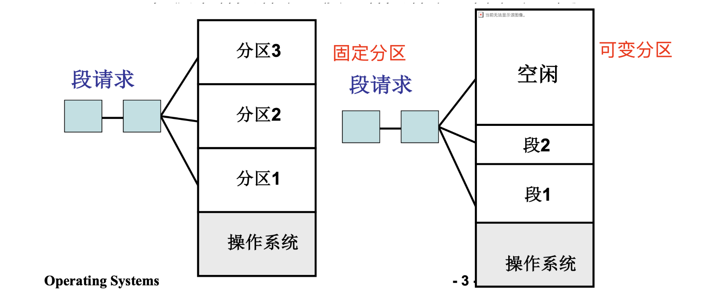
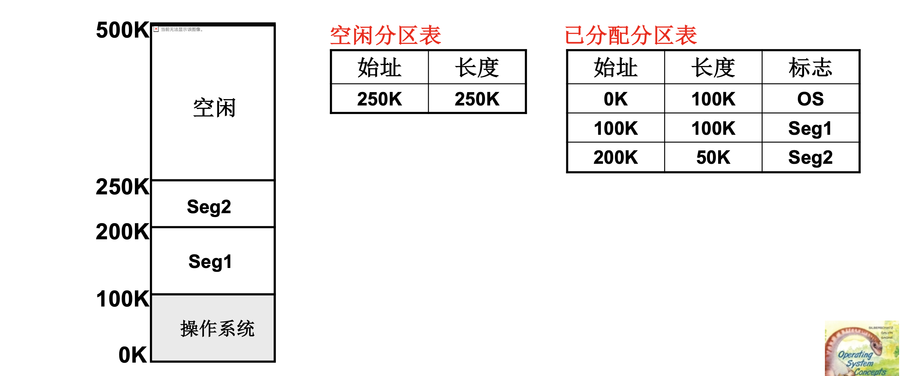
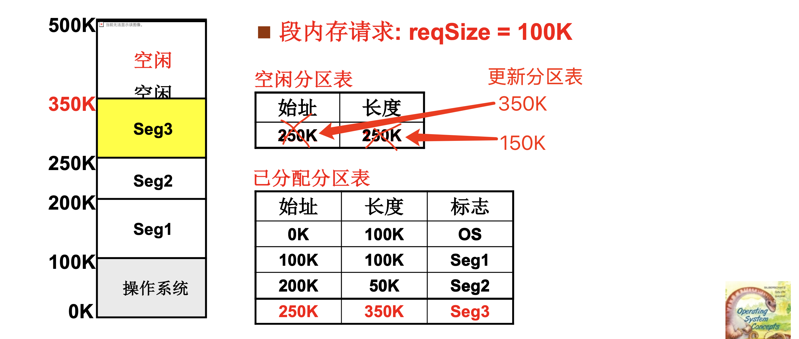
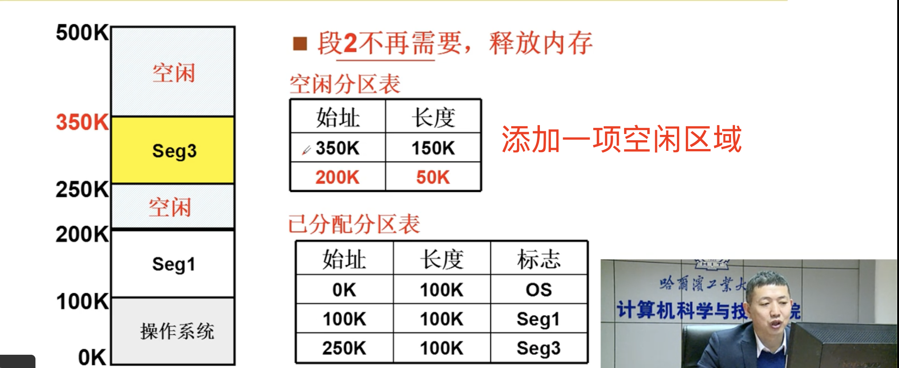

# 📘 3.2 内存分区与分页 (Memory Partition and Paging)

> 来源说明：哈工大李治军《操作系统》课程 L21 | 本节涵盖：连续分配（固定分区、可变分区）→ 离散分配（分页机制）的演进，以及页表、地址翻译、多级页表和 TLB

---

## 🧠 核心概念总览（严格按原文顺序）

> 🔗 **返回知识库主页**：[操作系统笔记主页](./README.md)
- [*知识点1: 内存划分的核心问题*](#id1)
- [*知识点2: 固定分区(Fixed Partition)*](#id2)
- [*知识点3: 可变分区(Variable Partition)与核心数据结构*](#id3)
- [*知识点4: 可变分区的分配过程*](#id4)
- [*知识点5: 可变分区的释放与分区合并*](#id5)
- [*知识点6: 可变分区分配算法：首次/最佳/最差适配*](#id6)
- [*知识点7: 外部碎片(External Fragmentation)与内存紧缩(Memory Compaction)*](#id7)
- [*知识点8: 分页机制引入动机与核心思想*](#id8)
- [*知识点9: 页框(Frame)与页的离散分配*](#id9)
- [*知识点10: 页表(Page Table)数据结构*](#id10)
- [*知识点11: 地址翻译(Address Translation)完整过程*](#id11)
- [*知识点12: 多级页表(Multi-level Page Table)*](#id12)
- [*知识点13: TLB(Translation Lookaside Buffer)快表*](#id13)

---

<a id="id1"></a>
## ✅ 知识点1: 内存划分的核心问题

**如何在内存中找到一段空闲区域...**
- 内存管理的核心问题：**内存怎么割（划分）？**
- 目标：将程序的各个段(Segment)载入到相应的内存分区中
- 从分面包给孩子的类比出发：一堆孩子来吃一个面包，如何合理分配？

> ⚠️ **关键区分**：内存划分的本质是将物理内存空间切分，以容纳多个进程的多个段


---

<a id="id2"></a>
## ✅ 知识点2: 固定分区(Fixed Partition)

**怎么割呢？**
- **方法**：操作系统初始化时将内存等分成 k 个分区(Partition)
- **内存布局**：
  ```
  [分区1: 操作系统] [分区2] [分区3] ... [分区k]
  ```
- **特点**：实现简单，分区大小固定

> ⚠️ **关键区分**：固定分区的致命问题——孩子有大有小，段也有大有小，**需求不一定匹配**
> ⚠️ **关键区分**：如果段很小但分区很大，会造成严重的**内部碎片(Internal Fragmentation)**


---

<a id="id3"></a>
## ✅ 知识点3: 可变分区(Variable Partition)与核心数据结构

**基于上面的问题，我们提出...**
- **方法**：根据段的大小**动态分配**，段需要多少就给多少
- **内存布局**：
  
- **两个核心数据结构**：
  

> ⚠️ **关键区分**：已分配表有"标志"字段记录段名；空闲表只需始址和长度


---

<a id="id4"></a>
## ✅ 知识点4: 可变分区的分配过程

**那么可变分区是如何割的？**
- **场景**：段请求 `reqSize = 100K`，当前空闲分区 `(250K, 250K)`
- **分配步骤**：
  1. 从空闲分区 `(250K, 250K)` 中分割出 `100K` 给 Seg3
  2. 空闲分区更新为 `(350K, 150K)`
- **分配后数据结构**：
  


---

<a id="id5"></a>
## ✅ 知识点5: 可变分区的释放与分区合并

**不仅有使用，还有释放...**
- **场景**：Seg2 释放内存（释放 `200K-250K`，长度 50K）
- **释放前状态**：
  - 已分配：OS(0K,100K), Seg1(100K,100K), Seg3(250K,100K)
  - 空闲：(350K,150K)
- **释放操作**：将 `(200K, 50K)` 加入空闲分区表
- **分区合并(Coalescing)**：检查释放区是否与相邻空闲区相邻，若相邻则合并 (linux 0.11 不支持)

- **释放后空闲分区表（未合并时）**：
  

> ⚠️ **关键区分**：释放不等于合并！需要先加入空闲表，再检查上下邻居是否空闲


---

<a id="id6"></a>
## ✅ 知识点6: 可变分区分配算法：首次/最佳/最差适配

**那么又来了一个段请求，且多个空闲区满足怎么办？**
- **场景**：`reqSize = 40K`，当前空闲分区：`(200K, 50K)`、`(350K, 150K)`

- **三种适配算法对比**：

  | 算法 | 英文名 | 选择分区 | 核心思想 |
  |:---|:---|:---|:---|
  | **首次适配** | First Fit | `(200K, 50K)` | 按地址递增顺序，找到第一个满足要求的 |
  | **最佳适配** | Best Fit | `(200K, 50K)` | 选择满足要求的**最小**分区，最贴近请求大小 |
  | **最差适配** | Worst Fit | `(350K, 150K)` | 选择**最大**的分区，保留大空间给大请求 |
  > ⚠️ **关键区分**：Best Fit 容易产生**外部碎片(External Fragmentation)**——大量无法利用的小空闲块
  > ⚠️ **关键区分**：Worst Fit 的直觉是"把大块的用掉，剩下的小块给小请求"，但实践中效果并不总是最优
  > ⚠️ **关键区分**：Worst Fit/Best Fit 都是 O(n) 算法，因为要扫描一遍，然而First fit是 O(1)

- 3种算法各有特点，按操作系统中内存块的特点选择算法使用
- **选择分析**
  - 场景：段内存请求**很不规则**，有时候很大，有时候很小，哪种算法最好？
  - **答案：最佳适配(Best Fit)**
  - 原因：
    - 最差适配会将本来特别大的分区慢慢蚕食，最后无法容得下很大的内存块需求，首次适配也是
    - 最佳适配能把小请求塞进最小的空闲分区，避免浪费大块内存，从而保留足够的大分区供后续大请求使用
  - ⚠️ **实际**：实际系统并不会使用内存分区进行物理内存分割，而是用**分页，分区是对虚拟内存的处理**


---

<a id="id7"></a>
## ✅ 知识点7: 外部碎片(External Fragmentation)与内存紧缩(Memory Compaction)

**理论**
- **碎片问题实例**：
  - 空闲分区：`(200K, 50K)`、`(350K, 150K)`
  - 总空闲：`50K + 150K = 200K`
  - 请求：`reqSize = 160K`
  - **问题**：总空闲 200K > 160K，但没有一块连续空间 ≥ 160K！

- **解决方案——内存紧缩(Memory Compaction)**：
  - 将已分配段向一端移动，使空闲区合并为一大块
  - 需要**移动段内容**（复制内存）

- **内存紧缩的时间开销**：
  - 复制速度：1M/秒
  - 1G 内存的紧缩时间 = **1000秒 ≈ 17分钟**

**注意点**
- ⚠️ **关键区分**：紧缩开销极大——1G内存要17分钟，系统几乎不可用
- ⚠️ **关键区分**：紧缩还需要**修改基址(Base Address)**——所有被移动段的基址寄存器都要更新
- 💡 **理解技巧**：像收拾散落的拼图碎片——需要把它们聚拢，但"聚拢"本身很费时
- 🔄 **知识关联**：这就是从连续分配走向离散分配（分页）的核心动机！

---

<a id="id8"></a>
## ✅ 知识点8: 分页机制引入动机与核心思想

**理论**
- **核心动机**：解决可变分区导致的**外部碎片**和**内存紧缩开销**问题
- **类比**："让给面包没有谁都不想要的碎末"——把面包切成片，将内存分成**页(Page)**
- **分页(Paging)定义**：针对每个段内存请求，系统**一页一页地分配**
- **关键特性**：
  - 不需要内存紧缩
  - 最大浪费不超过**一页的大小**（页内碎片）

**注意点**
- ⚠️ **关键区分**：分页是**离散分配**——一个段的页可以散布在物理内存的任意页框中，不要求连续
- ⚠️ **关键区分**：页内碎片(Intra-page Fragmentation)最多浪费接近 1 页，但不存在外部碎片
- 💡 **理解技巧**：分页像切面包片——不管谁要多少，都按片给，最后剩的渣（不到一片）就是页内碎片
- 🔄 **知识关联**：分页是连续的"段(segment)"到离散的"页(page)"的质的飞跃

---

<a id="id9"></a>
## ✅ 知识点9: 页框(Frame)与页的离散分配

**理论**
- **页框(Page Frame)**：物理内存被划分为大小相等的固定块
- **页(Page)**：逻辑地址空间被划分为与页框大小相等的块
- **分配方式**：为段的每个页分配一个空闲页框，页框之间**不必相邻**

**教材示例**
- 物理内存页框：页框0、页框1、页框2、页框3、页框4、页框5、页框6、页框7
- 段0的页分配：

| 逻辑页 | 页框 |
|:---|:---|
| 段0：页0 | 页框5 |
| 段0：页1 | 页框3 |
| 段0：页2 | 页框2 |
| 段0：页3 | 页框0 |

**注意点**
- ⚠️ **关键区分**：页框(Frame)是物理内存的块；页(Page)是逻辑地址空间的块。二者大小相等但概念不同
- 💡 **理解技巧**：页框是"停车位"，页是"车"——车停在哪个车位都可以，不需要挨着

---

<a id="id10"></a>
## ✅ 知识点10: 页表(Page Table)数据结构

**理论**
- **页表(Page Table)**：记录每个逻辑页映射到哪个物理页框的数据结构
- **页表项(Page Table Entry, PTE)**通常包含：

| 字段 | 含义 |
|:---|:---|
| 页框号(Frame Number) | 物理页框编号 |
| 存在位(Present Bit) | 该页是否在内存中 |
| 保护位(Protection Bits) | 读(R)/写(W)/执行(X)权限 |
| 修改位(Dirty Bit) | 页是否被修改过 |
| 访问位(Accessed Bit) | 页是否被访问过 |

**教材示例/页表结构**

| 页号 | 页框号 | 保护位 |
|:---|:---|:---|
| 0 | 5 | R（只读） |
| 1 | 1 | R/W（读写） |
| 2 | 3 | R/W（读写） |
| 3 | 6 | R（只读） |

- **页表指针(Page Table Pointer)**：存放在 PCB 中，每个进程有自己的页表

**注意点**
- ⚠️ **关键区分**：每个进程有**独立的页表**——页表是进程地址空间的一部分上下文
- ⚠️ **关键区分**：页表本身也存储在内存中，需要额外的存储开销
- 📋 **术语提醒**：`页框号(Frame Number)` ≠ `页号(Page Number)`，前者是物理地址概念，后者是逻辑地址概念

---

<a id="id11"></a>
## ✅ 知识点11: 地址翻译(Address Translation)完整过程

**理论**
- **逻辑地址(Logical Address)结构**：
  ```
  逻辑地址 = [Page# | Offset]
  ```
  - `Page#`：页号，占高位
  - `Offset`：页内偏移，占低位

- **页面尺寸 = 4K = 4096字节 = $2^{12}$**
  - 偏移占 12 位
  - 示例：`0x2240` → Page# = `0x2`，Offset = `0x240`

**教材示例/地址翻译步骤**
- **指令**：`mov [0x2240], %eax`（写操作）
- **步骤1：分解逻辑地址**
  ```
  0x2240 = 0010 0010 0100 0000 (二进制)
  页面尺寸 4K = 2^12，偏移占低12位
  Page# = 高4位 = 0x2
  Offset = 低12位 = 0x240
  ```
- **步骤2：查页表**
  - 页号 2 → 页框号 3，保护位 R/W
- **步骤3：权限检查**
  - 写操作，保护位为 R/W，允许
- **步骤4：合成物理地址(Physical Address)**
  ```
  物理地址 = (页框号 << 12) | Offset
  物理地址 = (3 << 12) | 0x240 = 0x3000 | 0x240 = 0x3240
  ```
- **结果**：物理地址 = `0x3240`

**注意点**
- ⚠️ **关键区分**：地址翻译的硬件是 **MMU(Memory Management Unit)**，由 CPU 自动完成
- ⚠️ **关键区分**：如果保护位是 R（只读）而执行写操作，会触发**缺页中断(Page Fault)**或**保护异常(Protection Fault)**
- 💡 **理解技巧**：页号查"字典"（页表）找到页框号，然后"拼接"偏移量——像查邮编再拼门牌号
- 🔄 **知识关联**：这正是 L20 中"运行时重定位"的硬件实现！

---

<a id="id12"></a>
## ✅ 知识点12: 多级页表(Multi-level Page Table)

**理论**
- **问题引入**：如果逻辑地址空间很大（如 32 位系统，4GB 空间），页表本身也会很大
  - 4GB / 4K = 1M 页
  - 每个页表项 4 字节 → 页表大小 = 4MB
  - 每个进程都需要一个页表，内存开销巨大！
  - 更关键的是：页表需要**连续存储**，很难找到 4MB 连续空间

- **解决方案——多级页表**：
  - 将页表再分页，形成**页目录(Page Directory)** + **页表(Page Table)** 的两级结构
  - 页目录的每一项指向一个页表

**两级页表地址结构**：
```
逻辑地址 = [页目录号 | 页表号 | 偏移]
```

**地址翻译过程（两级）**：
1. 用页目录号查页目录 → 找到页表基址
2. 用页表号查页表 → 找到页框号
3. 拼接偏移 → 物理地址

**注意点**
- ⚠️ **关键区分**：多级页表的核心优势——**页表不需要全部常驻内存**，只有用到的页表才需要加载
- ⚠️ **关键区分**：多级页表用**时间（多一次查表）换空间（减少页表内存占用）**
- 💡 **理解技巧**：像图书馆的索引系统——先查总目录（页目录）找到书架，再查书架目录（页表）找到书
- 🔄 **知识关联**：x86 架构采用两级页表（页目录 + 页表），64 位系统可能用三级或四级页表

---

<a id="id13"></a>
## ✅ 知识点13: TLB(Translation Lookaside Buffer)快表

**理论**
- **问题**：每次地址翻译都要查页表（一次或多次），页表在内存中，访存速度慢
- **TLB（快表/联想寄存器）**：
  - 位于 CPU 内部的高速缓存(Cache)
  - 缓存最近使用的页表项（页号 → 页框号的映射）
  - 容量小但速度极快（通常 64~1024 项）

**地址翻译流程（含 TLB）**：
1. 先查 TLB：若命中(Hit)，直接得到页框号 → 物理地址
2. 若未命中(Miss)：查页表（内存中）→ 得到页框号 → 物理地址 → 同时将映射存入 TLB

**注意点**
- ⚠️ **关键区分**：TLB 是**硬件实现的缓存**，由 CPU 的 MMU 自动管理，对软件透明
- ⚠️ **关键区分**：TLB 利用**局部性原理(Locality)**——最近访问的页很可能再次访问
- 💡 **理解技巧**：TLB 像"常用地址备忘录"——把最近查过的邮编记下来，下次直接看备忘录，不用翻大电话本
- 📋 **术语提醒**：`TLB Hit` = TLB 命中；`TLB Miss` = TLB 未命中，需要查页表

---

## 🔑 核心要点总结

1. **连续分配 → 离散分配**：固定分区（内部碎片）→ 可变分区（外部碎片+紧缩开销）→ 分页（无外部碎片，仅有页内碎片）
2. **可变分区三大算法**：首次适配(First Fit)、最佳适配(Best Fit)、最差适配(Worst Fit)——Best Fit 易碎，Worst Fit 适合不规则请求
3. **分页核心**：逻辑页(Page)映射到物理页框(Frame)，通过页表实现离散分配，无需紧缩
4. **地址翻译链路**：逻辑地址 → [Page# | Offset] → 查页表得页框号 → (页框号 << 页内位数) | Offset = 物理地址
5. **页表项关键位**：页框号、存在位、保护位、修改位、访问位
6. **多级页表**：用时间换空间，解决大页表连续存储问题；x86 采用两级（页目录+页表）
7. **TLB**：页表的高速缓存，利用局部性加速地址翻译，对软件透明

## 📌 考试速记版

- **关键机制对比表**：

| 分配方式 | 碎片类型 | 是否需要紧缩 | 分配粒度 |
|:---|:---|:---|:---|
| 固定分区 | 内部碎片 | 否 | 分区 |
| 可变分区 | 外部碎片 | 是（开销极大） | 按需 |
| 分页 | 页内碎片 | 否 | 页（固定大小） |

- **地址翻译公式**：
  - `Page# = 逻辑地址 >> 页内位数`
  - `Offset = 逻辑地址 & (页面大小 - 1)`
  - `物理地址 = (页框号 << 页内位数) | Offset`

- **易混淆概念对比**：

| 概念 | 页(Page) | 页框(Frame) | 页表项(PTE) |
|:---|:---|:---|:---|
| 所在空间 | 逻辑地址空间 | 物理内存 | 内存中的页表 |
| 大小 | 固定（如4K） | 与页相等 | 通常4字节 |
| 作用 | 逻辑划分 | 物理存储单元 | 记录映射关系 |

- **常见考试陷阱**：
  - ❌ 分页没有碎片（错！有页内碎片，没有外部碎片）
  - ❌ 页表在寄存器中（错！页表在内存中，TLB 才是寄存器/缓存）
  - ❌ 多级页表更快（错！更慢，但省空间）

**记忆口诀**：分区固定易浪费，可变适配算法配，碎片太多要紧缩，分页离散最干脆，页表映射逻辑到物理，TLB快表省时间，多级页表省空间！
