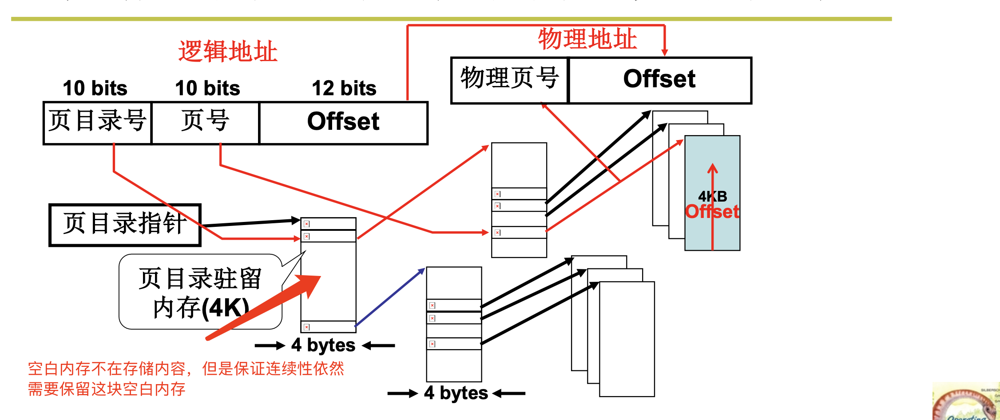
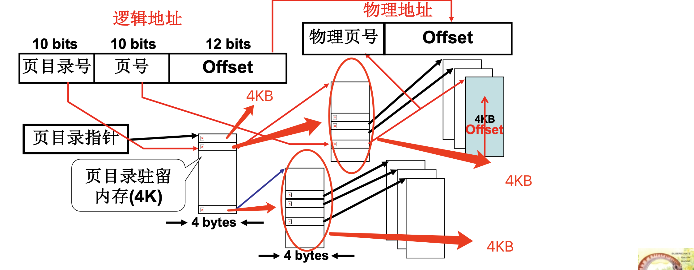
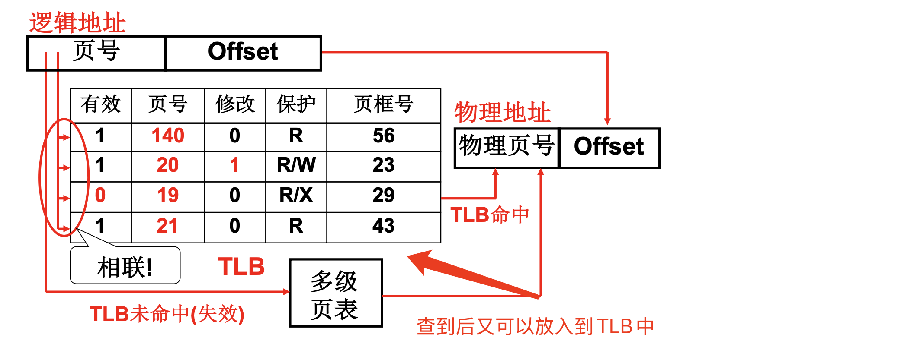
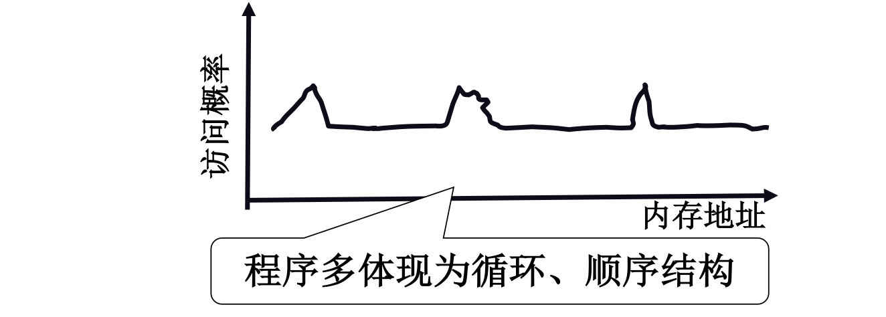

# 📘 3.3 多级页表和快表 (Multilevel Paging and TLB)

> 来源说明：哈工大李治军操作系统课程 L22 | 本节涵盖：页表过大的问题、多级页表结构、TLB快表机制与局部性原理

---

## 🧠 核心概念总览（严格按原文顺序）

> 🔗 **返回知识库主页**：[操作系统笔记主页](./README.md)
- [*知识点1: 页表大小的核心矛盾*](#id1)
- [*知识点2: 页表放置问题与有效位*](#id2)
- [*知识点3: 尝试1——只存放用到的页*](#id3)
- [*知识点4: 尝试2——多级页表结构*](#id4)
- [*知识点5: 多级页表的空间效率分析*](#id5)
- [*知识点6: TLB（转换检测缓冲区/快表）引入*](#id6)
- [*知识点7: TLB性能分析——有效访问时间EAT*](#id7)
- [*知识点8: TLB有效性的原理——局部性*](#id8)

---

## ✅ 知识点1: 页表大小的核心矛盾

**分页会出现什么问题呢？**
- 为了提高内存空间利用率，`页(Page)`应该小
- 但是页小了，`页表(Page Table)`就大了——这是**核心矛盾**
- 每个进程都需要维护自己的页表，页表项记录逻辑页到物理页框的映射关系
- 页表示例结构：
  
> ⚠️ **关键矛盾**：页小 → 页表大；页大 → 内部碎片多。这是内存管理的基本权衡。

---

## ✅ 知识点2: 页表放置问题与有效位

**问题出在页表...**
- 页面尺寸通常为 **4K(4KB)**
- 32位地址空间中，可寻址空间为 $2^{32} = 4G$
- 页面数量为：$2^{32} / 2^{12} = 2^{20}$ 个页面
- 每个页表项占4字节，总页表大小为：$2^{20} \times 4B = 4MB$
- 系统中并发10个进程，就需要 **40MB** 内存来存放页表
- 实际观察：**大部分逻辑地址根本不会用到32位**，总空间 $[0, 4G]$ 中很多区域是空的

> ⚠️ **关键数据**：32位地址 + 4K页面 = **4MB页表/进程**，这是必须记住的量化结论

---

## ✅ 知识点3: 尝试1——只存放用到的页

**试试如何解决这个问题**
- **想法**：用到的逻辑页才有页表项，不用的页不分配页表项
- **问题**：由于页表中的页号不连续，就需要比较、查找
  - 若采用折半查找：$\log(2^{20}) = 20$ 次**内存访问**
  - 每次地址转换需要20次**内存访问**，**效率极低**
- **结论**：为了防止效率低下，必须让页号连续但是32位地址空间 + 4K页面 + 页号必须连续 → $2^{20}$ 个页表项 → 大页表占用内存，造成浪费
- **关键问题**：既要**连续**又要让页表**占用内存少**，怎么办？

> ⚠️ **关键结论**：页号必须连续是页表设计的核心约束，破坏连续性会导致查找开销剧增

---

## ✅ 知识点4: 尝试2——多级页表结构

**怎么办呢？**
- 用书的章目录和节目录来类比思考...
- **结构**：`页目录表(Page Directory)`（章）+ `页表(Page Table)`（节）
- 32位逻辑地址划分为三级：
  | 页目录号 | 页号 | Offset（偏移）|
  |:---:|:---|:---|
  | 10 bits | 10 bits | 12 bits |

  > ⚠️ **关键划分**：10 + 10 + 12 = 32位，这是32位系统的经典划分方式

- **地址转换过程**：
  
  1. `页目录指针`（4 bytes）→ 找到页目录项
  2. 页目录项 → 找到页表
  3. 页表项（4 bytes）+ Offset → 物理地址
  - 对于当前进程我们只需要存储需要用的内容，用不到直接留白
  > 💡 **理解技巧**：就像查书——先看章目录（页目录号），找到对应的章；再看节目录（页号），找到具体的节；最后看页内偏移（Offset），找到具体字的位置

- **页目录表与页表的关系**
  - 页目录表中的每个项指向一个页表
  - 页表中的每个项指向一个物理页框
  - 只有被用到的页目录项才会分配对应的页表

---

## ✅ 知识点5: 多级页表的空间效率分析

**分析一下效率...**
- 页目录驻留内存：4KB
- 每一个页目录项指向 $2^{10}$ 个页
  - $2^{10}$ 个目录项 × 4字节地址 = 4K
  
  - 根据上图（3个页目录使用的情况下），可计算：
    - `页表占用总空间 = 页目录表(4KB) + 3 x 页表(4KB) = 16KB`
    - **16KB << 4MB**（传统页表空间内存）
- 因此若只用到少量页表，实际占用的页表空间远小于传统页表所占用的 **4MB**

- **空间对比**

  | 方案 | 空间占用 |
  |:---|:---|
  | 单级页表 | 4MB（固定） |
  | 多级页表 | 页目录4K + 实际用到的页表（通常 << 4M） |

- **新问题**：多级页表提高了空间效率，但在时间上？
  - 每多增加一级页表就要多增加一次访问

> ⚠️ **关键结论**：多级页表用**时间换空间**，地址转换需要多次内存访问
> 🔄 **知识关联**：时间开销的增加，直接引出了TLB的解决方案

---

## ✅ 知识点6: TLB（转换检测缓冲区/快表）引入

**多级页表增加了访存的次数，尤其是64位系统，怎么办？**
- `TLB(Translation Lookaside Buffer)`，又称`快表`
- 是一组**相联快速存储(Associative Memory)**，本质是**寄存器**
- 位于CPU内部，访问速度远快于内存
  > 💡 **理解技巧**：TLB就像一个"常用地址快捷方式"文件夹——你经常访问的地址直接放在手边，不用翻大部头

- **TLB表项结构**
  

- **TLB工作方式**
  - **TLB命中(Hit)**：页号在TLB中找到页框号，直接由 **TLB硬件** 完成地址转换 → **只需1次内存访问**
  - **TLB未命中/失效(Miss)**：页号不在TLB中 → 走多级页表完成地址转换 → **需要多次内存访问**

- **关键特性：相联存储**
  - 相联存储是**按内容寻址**，而非按地址寻址
  - 可以同时比较所有表项的页号字段，实现并行查找
  - 查找速度与表项数量无关（在容量范围内）

> ⚠️ **关键区分**：TLB是**寄存器**，不是内存；相联存储是硬件并行比较，不是软件遍历

---

## ✅ 知识点7: TLB性能分析——有效访问时间EAT

**这个方法真的能提高性能吗？**
- **有效访问时间(Effective Access Time, EAT)** 公式：

$$EAT = HitR \times (TLB + MA) + (1 - HitR) \times (TLB + 2MA)$$

> ⚠️ **关键数据**：TLB命中时 = TLB时间 + 1次内存访问；未命中时 = TLB时间 + 2次内存访问（查页目录+查页表）

- 其中：
  - $HitR$ = TLB命中率
  - $TLB$ = TLB访问时间
  - $MA$ = 内存访问时间(Memory Access)
  - $EAT$ = 有效访问时间(Effective Access Time)

- **计算示例1（高命中率）**
  - 假设：$HitR = 98\%$，$TLB = 20ns$，$MA = 100ns$
  - $EAT = 0.98 \times (20 + 100) + 0.02 \times (20 + 200)$
  - $EAT = 0.98 \times 120 + 0.02 \times 220$
  - $EAT = 117.6 + 4.4 = 122ns$

- **计算示例2（低命中率）**
  - 假设：$HitR = 10\%$，$TLB = 20ns$，$MA = 100ns$
  - $EAT = 0.10 \times (20 + 100) + 0.90 \times (20 + 200)$
  - $EAT = 0.10 \times 120 + 0.90 \times 220$
  - $EAT = 12 + 198 = 210ns$

- **结论**
  - 要想真正实现"近似访存1次"，**TLB的命中率应该很高**
  - TLB越大越好，但TLB很贵，通常只有 **[64, 1024]** 项

> 💡 **理解技巧**：命中率从98%降到10%，EAT从122ns飙到210ns——这就是为什么要拼命提高TLB命中率

---

## ✅ 知识点8: TLB有效性的原理——局部性

**现在有一个问题...**
- 核心问题：相比 $2^{20}$ 个页，TLB只有64-1024项，为什么TLB就能起作用？
- **答案**：程序的地址访问存在**局部性(Locality)**

- **局部性类型**
  1. **空间局部性(Locality in Space)**：如果访问了某个地址，很可能很快访问其附近的地址
  2. **时间局部性(Temporal Locality)**：如果访问了某个地址，很可能很快再次访问该地址

- **程序特征**
  - 程序多体现为**循环(直接在某段循环)**、**顺序结构(一跳一跳执行)** → 程序存在时间和空间的局部性

- **地址访问概率分布特征**
    
  - 特征：某些地址区间访问概率显著高于其他区间（非均匀分布）

> ⚠️ **设计原则**：计算机系统设计时应该充分利用这一局部性
> ⚠️ **核心原理**：TLB有效的根本原因是**局部性**，不是魔法——程序的访问模式天然就"扎堆"
> 🔄 **知识关联**：局部性原理也是`Cache`设计的理论基础，Cache和TLB本质上解决的是同一类问题

---

## 🔑 核心要点总结

1. **页表核心矛盾**：页小 → 利用率高，但页表大；32位系统单级页表占4MB/进程
2. **多级页表**：用10+10+12位划分，将4MB压缩到约16K，但增加访存次数
3. **TLB机制**：用相联寄存器缓存最近使用的页表项，命中时只需1次内存访问
4. **EAT公式**：$EAT = HitR \times (TLB + MA) + (1 - HitR) \times (TLB + 2MA)$，命中率是关键
5. **局部性原理**：程序访问具有空间局部性和时间局部性，这是TLB有效性的根本原因

---
