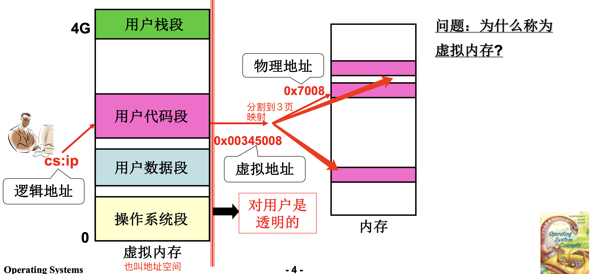
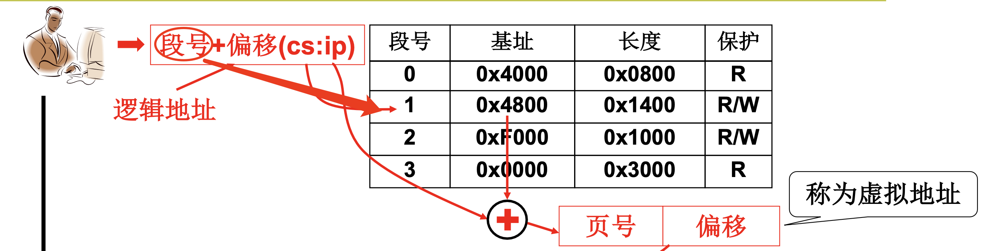
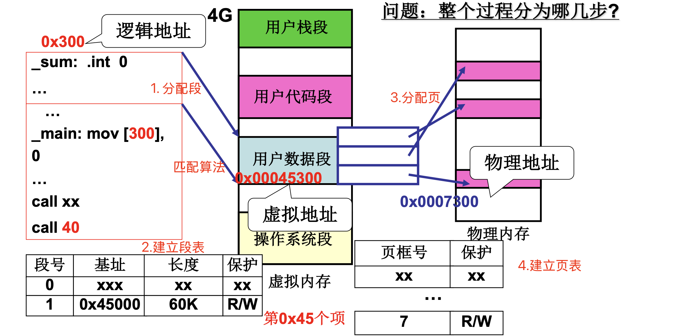
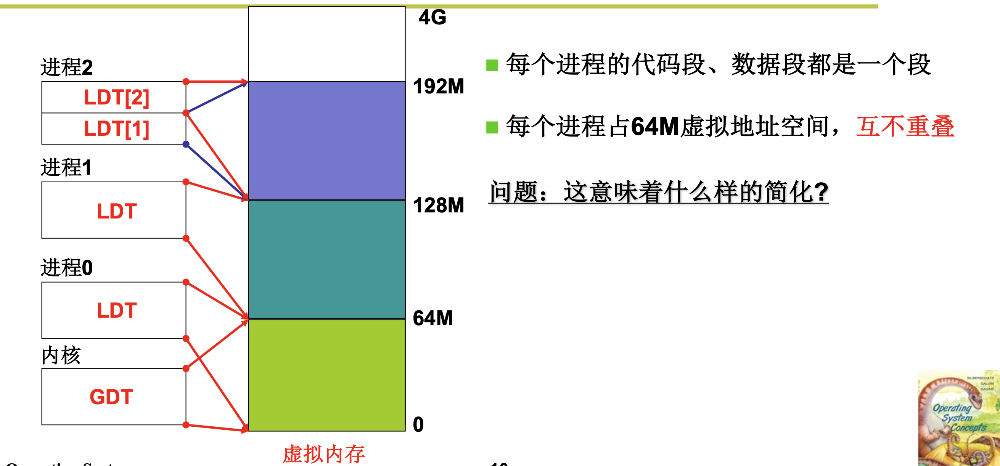
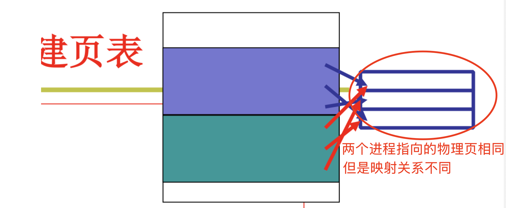
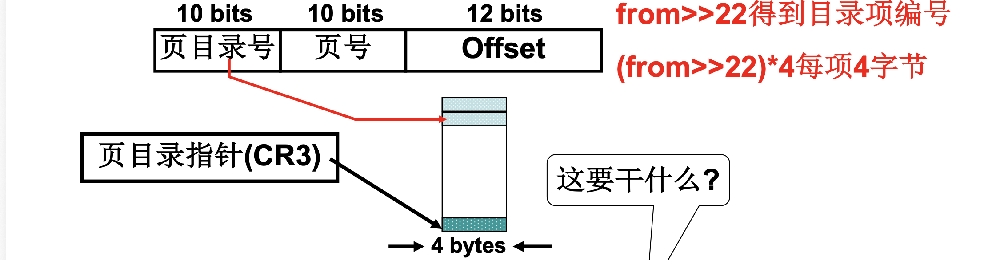
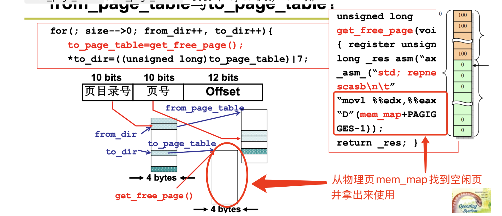
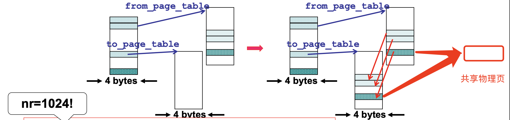
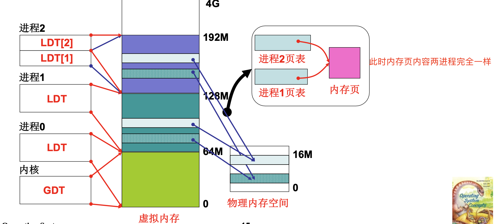
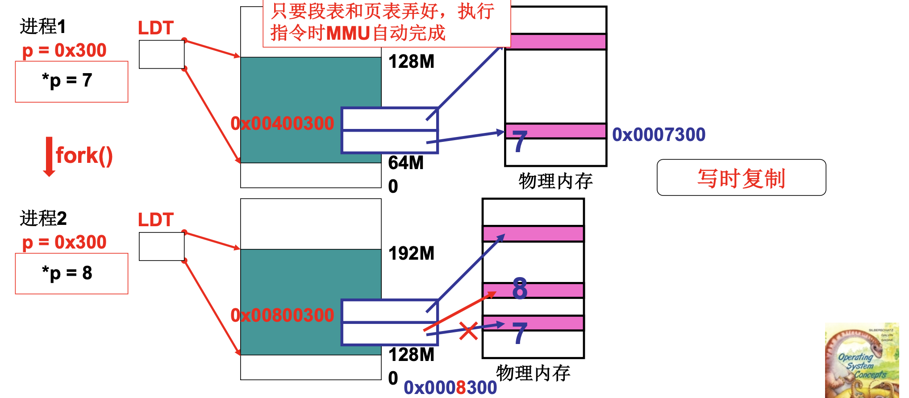

# 📘 3.4 段页结合的实际内存管理 (Segmentation & Paging)

> 来源说明：哈工大李治军操作系统课程 L23 | 本节涵盖：段页结合的动机与架构、两级地址转换、Linux 0.11 fork内存分配机制、写时复制(COW)原理

---

## 🧠 核心概念总览（严格按原文顺序）

> 🔗 **返回知识库主页**：[操作系统笔记主页](./README.md)
- [*知识点1: 段页结合的核心动机*](#id1)
- [*知识点2: 段页同时存在的架构*](#id2)
- [*知识点3: 段页同时存在时的重定位（地址翻译）*](#id3)
- [*知识点4: 内存管理的故事起点—— `fork()`*](#id4)
- [*知识点5: `copy_mem` 函数——建立段表*](#id6)
- [*知识点6: 进程虚拟地址空间布局*](#id7)
- [*知识点7: `copy_page_tables` 函数——建立页表*](#id8)
- [*知识点8: 页目录项地址计算*](#id9)
- [*知识点9: 页表项的建立与 `get_free_page`*](#id10)
- [*知识点10: 写时复制（Copy-On-Write）机制*](#id11)
- [*知识点11: 虚拟内存与物理内存的全貌*](#id12)
- [*知识点12: `fork()` 写时复制的实际效果*](#id13)

---

<a id="id1"></a>
## ✅ 知识点1: 段页结合的核心动机

**段页结合是什么...**
- 程序员希望用**段(Segment)**：面向用户/编程，符合程序的逻辑结构（代码段、数据段、栈段）
- 物理内存希望用**页(Page)**：面向硬件，便于内存分配和管理
- 所以操作系统采用**段页结合(Segmentation & Paging)** 的方式
- **页机制对用户是透明的**，用户编程时仍按段来组织代码


> 💡 **理解技巧**：段是"程序员看到的房子结构"（客厅、卧室、厨房），页是"建筑工人实际砌的砖块"（每块砖一样大）


---

<a id="id2"></a>
## ✅ 知识点2: 段页同时存在的架构

**看看段页结合的大致结构什么样子的...**
- 完整的地址转换链：
  
- 页机制对用户**透明**——用户感知不到页的存在
- **虚拟内存**：程序员使用的地址（虚拟地址）不是物理内存的真实地址，需要经过转换
> ⚠️ **关键链路**：逻辑地址 →（段表）→ 虚拟地址 →（页表）→ 物理地址，必须经过**两次转换**


---

<a id="id3"></a>
## ✅ 知识点3: 段页同时存在时的重定位（地址翻译）

**那么程序如何在这个架构下跑起来呢？**
- 尽管有了架构，但是为了跑起来程序，我们还要知道如何将程序放入内存的 
- 这个就需要通过**重定位**（地址翻译）来找到物理内存并放入程序
- **地址翻译过程**：
  1. **段表结构：逻辑地址（段号 + 偏移 (cs:ip) ） → 虚拟地址（页号 + 偏移）**
      - 段表查到基址后，先把基址和段内偏移（EIP）相加，得到线性地址（虚拟地址），然后直接按位拆分：
        `线性地址 = 页号 + 段内偏移`
      - 拆页号和偏移（以 4KB 页面为例）:

        | 部分     | 怎么算             | 为什么                      |
        | ------ | --------------- | ------------------------ |
        | **偏移** | 线性地址的低 **12 位** | 4KB = 2¹²，页内地址需要 12 位    |
        | **页号** | 线性地址的高 **20 位** | 32 位地址 - 12 位偏移 = 20 位页号 |
      >⚠️ **关键计算**：虚拟地址 → 页号 + 偏移，页号查页表得页框号，页框号 + 偏移 = 物理地址

  

  2. **页表结构：虚拟地址（页号 + 偏移） → 物理地址（物理页框号 + 偏移）**
  
    

> 💡 **理解技巧**：段表解决"你在哪个区域"，页表解决"你在区域内的哪一页"


---

<a id="id4"></a>
## ✅ 知识点4: 内存管理的故事起点——fork()

**内存如何管理？回到故事开始...**
- 内存管理核心就是**内存分配**，从程序放入内存、使用内存运行开始...
  1. **分配段、建段表；分配页、建页表**
    
  2. 进程开始使用内存
- 如何程序载入到内存？

- 起点：从进程 `fork()` 中的内存分配开始
- 代码位置：`linux/kernel/fork.c`
  - `copy_process` 函数调用链：
    ```
    fork() → sys_fork → copy_process → copy_mem(nr, p)
    ```

  - **`copy_process` 中的关键调用**：
    ```c
    int copy_process(int nr, long ebp,...)
    {
        ...
        copy_mem(nr, p);   // 核心：建立新进程的段表和页表
        ...
    }
    ```


> ⚠️ **关键入口**：`copy_mem()` 是理解Linux内存分配的核心函数
> 💡 **理解技巧**：fork创建新进程时，父进程已有的内存布局要复制给子进程——这就是`copy_mem`干的事


---

<a id="id6"></a>
## ✅ 知识点5: `copy_mem` 函数——建立段表

**那我们来看看 `copy_mem` 做了什么神秘的事...**
- `copy_mem` 是 `fork` 时建立新进程内存映射的核心函数
- **功能：为新进程分配虚拟地址空间、建立段表（LDT）**
- **代码**：
  ```c
  int copy_mem(int nr, task_struct *p)
  {
      unsigned long new_data_base;
      new_data_base = nr * 0x4000000;   // 64M * nr
      set_base(p->ldt[1], new_data_base);   // 代码段基址
      set_base(p->ldt[2], new_data_base);   // 数据段基址
      // 分配虚存、建段表
      ...
  }
  ```

- **主要任务**：
  - `p` 是**进程**的 `task_struct`， `pcb`
  - `nr` 是进程号（0, 1, 2, ...）
  - `0x4000000` = 64M，每个进程分配 **64M** 虚拟地址空间
  - `p->ldt[1]` = 代码段描述符，`p->ldt[2]` = 数据段描述符，两个描述符指向虚拟地址的基址
  - 进程切换跟着 **LDT** 切换——LDT是每个进程的局部描述符表


> ⚠️ **关键设计**：代码段和数据段共享同一个基址——简化设计，代码和数据在同一个64M空间内
> 💡 **理解技巧**：就像给员工分配工位——员工0坐0-64号位置，员工1坐64-128号位置，互不干扰


---

<a id="id7"></a>
## ✅ 知识点6: 进程虚拟地址空间布局

**看看在计算机中长什么样子...**
- Linux 0.11 中各进程的虚拟内存布局：
  

- linux 0.11 设计特点：
  - 每个进程占 **64M** 虚拟地址空间
  - 各进程虚拟空间**互不重叠**
  - 每个进程的代码段、数据段都是一个段

- **思考问题**：这意味着什么样的简化？
  - 答案：不需要复杂的虚拟地址冲突处理，进程号直接决定虚拟地址基址

> 🔄 **知识关联**：这种简化设计是Linux 0.11早期版本的特征，现代Linux使用更复杂的虚拟内存管理（VMA）

---

<a id="id8"></a>
## ✅ 知识点7: `copy_page_tables` 函数——建立页表

**接下来干什么呢？**
- `copy_mem` 中调用 `copy_page_tables` 来复制/建立页表
- 代码：
  ```c
  int copy_mem(int nr, task_struct *p)
  {
      unsigned long old_data_base;
      old_data_base = get_base(current->ldt[2]);
      copy_page_tables(old_data_base, new_data_base, data_limit);
      ...
  }
  ```
  > 📋 **术语提醒**：`current` = 当前运行进程的task_struct指针；`get_base()` = 获取段基址

- `copy_page_tables` 函数签名：

  ```c
  int copy_page_tables(unsigned long from, unsigned long to, long size)
  ```

- 参数含义：
  - `from` = 父进程虚拟地址基址（源）
  - `to` = 子进程虚拟地址基址（目标）
  - `size` = 要复制的内存大小
- **主要任务**：
  1. 获取父进程数据段基址
  2. 新建立子进程页表，并将父进程页表内容复制给子进程
  3. 然后子进程建立新的映射关系以实现写时复制共享物理页
  
- **fork 出来的子进程本来就是父进程的"克隆"，数据初始应该一模一样，所以共享物理页在那一刻是对的。**

  - 但为了防止后续写入互相干扰，内核会把这些共享页标记为**只读**。之后：
    - 如果父子都只是**读** → 继续共享同一块物理页，没问题
    - 如果谁想**写** → 触发缺页异常，内核立刻分配**新物理页**，把原数据复制过去，修改页表指向新页，然后让写入继续
    - 这就是**写时复制（COW）**：fork 时共享，写入时分离。

> **⚠️ 一句话：fork 瞬间共享是因为数据本该一样；页表项标成只读后，谁写入谁触发缺页，内核单独给它复制新页，互不干扰。**
> ⚠️ **关键调用链**：`copy_mem` 先建段表，再调 `copy_page_tables` 建页表——两步缺一不可


---

<a id="id9"></a>
## ✅ 知识点8: 页目录项地址计算

**简略看看 `copy_page_tables` 做了什么...**
- `copy_page_tables` 中的关键代码：

  ```c
  int copy_page_tables(unsigned long from, unsigned long to, long size)
  {
      from_dir = (unsigned long *)((from>>20)&0xffc); //父进程页目录号
      to_dir = (unsigned long *)((to>>20)&0xffc); //子进程页目录号
      size = (unsigned long)(size+0x3fffff)>>22;
      for(; size-->0; from_dir++, to_dir++){
          from_page_table = (0xfffff000 & *from_dir);
          to_page_table = get_free_page();
          // 分配内存、建页表
      }
  }
  ```

- **32位虚拟地址格式**：
  

- **地址计算解析**：
  - `from>>22` 得到目录项编号（取高10位）
  - `(from>>22)*4` 每项4字节，得到字节偏移
    - 页目录是数组，每项 4 字节宽，乘 4 是把"第几项"换算成"从基址偏移多少字节"，否则找错位置
    - 例如：第一项在字节0， 第二项在字节4， 第三项在字节8 ...
  - `(from>>20)&0xffc` 等价于 `(from>>22)*4`，即**页目录项地址**
    - `>>20` 后再 `&0xffc`（111111111100）= 清除低2位，保证4字节对齐
- **CR3**：页目录指针寄存器，指向当前页目录表

> ⚠️ **关键数据**：`size = (size+0x3fffff)>>22` 是向上取整到页目录项数量（每个页目录项管4M）
> 💡 **理解技巧**：`&0xfffff000` 是取出页目录项中的页表地址（高20位），低12位是标志位


---

<a id="id10"></a>
## ✅ 知识点9: 页表项的建立与 `get_free_page`

**准备好页目录项，那就要开始拷贝了...**

- 页表项建立代码：

  ```c
  for(; size-->0; from_dir++, to_dir++){
      from_page_table = (0xfffff000 & *from_dir);
      to_page_table = get_free_page(); 
      // 分配一页物理内存存放页表
      // 分配内存、建页表
      *to_dir = ((unsigned long)to_page_table) | 7;  // 写入页目录项
      ...
  }
  ```
  - **主要任务**：
    - `from_page_table`：**从父进程页目录里"抠"出页表地址**。 `0xfffff000` 是个掩码，把页目录项的低 12 位标志位抹掉，剩下高 20 位就是父进程那张页表在内存里的起始地址。
    - `to_page_table`：**给子进程申请新页框**，`get_free_page()` 申请一页空白内存当子进程的页表
    - `*to_dir = ((unsigned long)to_page_table) | 7;`：**页表并挂到页目录上**，写进子进程的页目录项，让子进程有了自己的页表"骨架"
    > 💡 **理解技巧**：`get_free_page()` 就像在停车场找空位——扫描mem_map数组，找到标记为空闲的位置
    > ⚠️ **关键操作**：`*to_dir = to_page_table | 7` —— `|7` 设置页目录项标志位（存在位+读写位+用户位）

- 内存布局：
  - `from_dir` / `to_dir`：页目录项（4 bytes每项）
  - `from_page_table` / `to_page_table`：页表（4 bytes每项，1024项）
  

    > 📋 **术语提醒**：`mem_map[]` = 物理页框使用计数数组；`PAGING_PAGES` = 总页框数

---

<a id="id11"></a>
## ✅ 知识点10: 写时复制（Copy-On-Write）机制

**最后拷贝每一个页...**
- 页表项复制的核心代码：

  ```c
  for(; nr-->0; from_page_table++, to_page_table++){
      this_page = *from_page_table;       // 复制父进程页表项
      this_page &= ~2;                    // 只读（清除R/W位，bit1=0）
      *to_page_table = this_page;         // 写入子进程页表
      *from_page_table = this_page;       // 修改父进程页表（也设为只读）
      this_page -= LOW_MEM;
      this_page >>= 12;
      mem_map[this_page]++;               // 引用计数增加
  }
  ```
- **主要任务：把父进程的页表项复制给子进程，同时把父子双方的页表项都改成"只读"，然后给共享的物理页打个标记（引用计数 +1），记录现在有几个人在用这块内存**
  - 关键参数：`nr = 1024`（一个页表1024项）
  
  > ⚠️ **关键代码**：`this_page &= ~2` 是写时复制的核心——清除R/W位（bit1），将页设为只读


- **写时复制（Copy-On-Write, COW）机制**
  1. **fork时**：父子进程共享物理页框——页表项指向**同一物理页**
  2. **设置只读**：将父子双方的页表项都设为**只读(Read-Only)**
  3. **引用计数**：`mem_map[this_page]++` 记录共享该物理页的进程数
  4. **写入时**：任一进程尝试写入只读页 → 触发**缺页异常(Page Fault)**
  5. **异常处理**：分配新物理页，复制内容，更新页表项为可读写

- **COW的优势**
  - 避免fork时大量复制物理内存——大部分页可能根本不会被修改
  - 只有真正被写入的页才会复制——**惰性复制(Lazy Copy)**

> ⚠️ **关键区分**：页目录表 + 页表 并不会因为时复制停止父子进程的共享
> ⚠️ **关键设计**：父子**双方**都设为只读——因为不知道谁会先写


---

<a id="id12"></a>
## ✅ 知识点11: 虚拟内存与物理内存的全貌

**最后内存中的全貌 ...**
- **16M物理内存**空间布局：
  

- 关键关系：
  - 多个进程的虚拟页可以映射到**不同**的物理页框（正常情况）
  - `fork` 后父子进程的虚拟页可以映射到**相同**的物理页框（COW共享）

> ⚠️ **关键图景**：虚拟内存是"每个进程看到的地图"，物理内存是"实际的地球"——地图可以重叠，但地球是唯一的
> 💡 **理解技巧**：想象多个VR玩家（进程）在同一物理房间（物理内存）里——每个人看到的虚拟世界（虚拟内存）可以重叠，但实际的碰撞检测（物理地址）是唯一的

---

<a id="id13"></a>
## ✅ 知识点12: `fork()` 写时复制的实际效果

**程序放入到内存后，要如何运行这个程序...**
- **场景1：父进程 `*p = 7`**
  - 进程1虚拟地址：`0x00400300` → 物理地址：`0x0007300`
  - 物理页 `0x0007300` 的值：7

- **场景2：fork后子进程 `*p = 8`（写时复制触发）**
  - 进程2虚拟地址：`0x00800300` → 物理地址：`0x0008300`（**新分配**）
  - 原物理页 `0x0007300` 仍保持7（父进程继续使用）

- **核心机制总结**
  1. `fork()` 时：段表和页表弄好，父子**共享**物理页
  2. 执行指令时：**MMU自动完成**地址翻译（硬件自动查段表+页表）
  3. 写操作时：触发写时复制，分配新物理页，复制内容
  


> 只要段表和页表弄好，执行指令时 MMU 自动完成读写内存
> ⚠️ **关键结论**：MMU是硬件——一旦页表建立好，地址转换完全由硬件自动完成，不需要操作系统干预
> ⚠️ **关键现象**：fork后父子虚拟地址不同（`0x00400300` vs `0x00800300`），但初始指向同一物理页——COW让这成为可能


---

## 🔑 核心要点总结

1. **段页结合动机**：段面向用户（编程）、页面向硬件（物理内存），页机制对用户透明
2. **两级地址转换**：逻辑地址 →（段表）→ 虚拟地址 →（页表）→ 物理地址
3. **Linux 0.11内存分配**：`copy_mem()` 建段表（每个进程64M，LDT）→ `copy_page_tables()` 建页表
4. **页目录项计算**：`(addr>>20)&0xffc` 计算页目录项地址，页目录号占高10位
5. **写时复制COW**：fork时共享物理页（双方设只读），写入时触发缺页再复制——惰性复制策略

---
