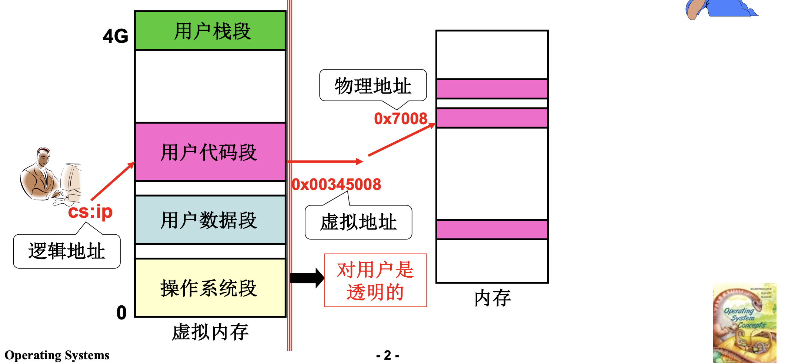
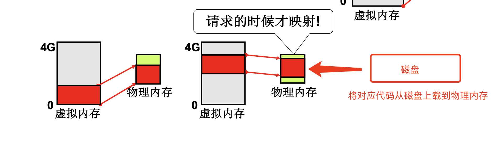
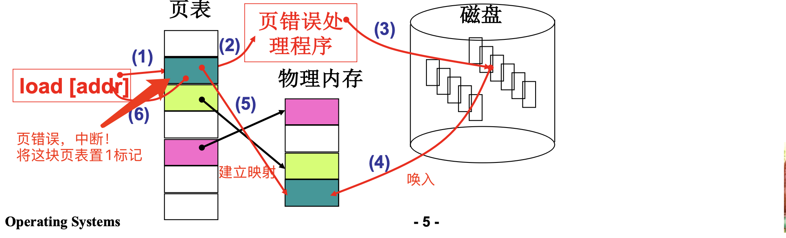
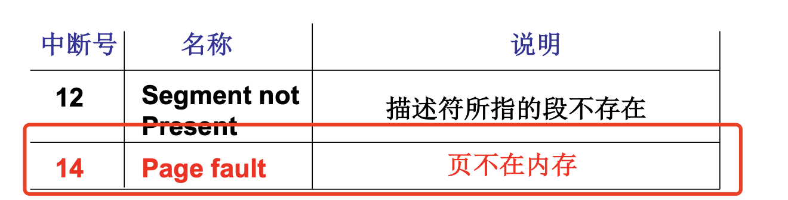

# 📘 3.5 请求调页内存换入 (Swap In)

> 来源说明：哈工大李治军操作系统 L24 | 本节涵盖：虚拟内存的请求调页机制——用换入/换出实现"大内存"效果

---

## 🧠 核心概念总览（严格按原文顺序）

> 🔗 **返回知识库主页**：[操作系统笔记主页](./README.md)
- [*知识点1: 虚拟内存的用户视角*](#id1)
- [*知识点2: 用换入换出实现大内存*](#id2)
- [*知识点3: 请求调页的执行流程*](#id3)
- [*知识点4: 请求调页 vs 请求调段*](#id4)
- [*知识点5: 缺页中断 Page Fault*](#id5)
- [*知识点6: 中断处理入口 `page.s`*](#id6)
- [*知识点7: 缺页处理 `do_no_page`*](#id7)
- [*知识点8: 建立页表映射 `put_page`*](#id8)

---

<a id="id1"></a>
## ✅ 知识点1: 虚拟内存的用户视角

**进入前，再让我们复习一下虚拟内存全景...**
- 用户看到 **4GB 连续规整"内存"**(`Virtual Memory`)，可随意使用（如 `char *p; p = 3G`）
- 实际通过**段表**(`Segment Table`)+**页表**(`Page Table`)映射到物理内存(`Physical Memory`)
- 映射过程**对用户完全透明**，必须映射否则不能用

**图示**
    

> ⚠️ **关键区分**：用户眼里的"内存"是虚拟的，实际物理内存可能只有 1G


---

<a id="id2"></a>
## ✅ 知识点2: 用换入换出实现大内存

**左边4G，右边1G怎么办?**
- **核心思想**：物理内存 1G，虚拟内存 4G，**用的时候才映射**
    - 访问 `0G-1G` 时，将代码从磁盘唤上物理内存，映射这部分到虚拟内存；
    - 再访问 `3G-4G` 时，换出旧的回磁盘，映射新的
- **关键结论**：请求的时候才映射！惰性加载(`Lazy Loading`)，内存利用率最大化

- **图示**


> ⚠️ **关键区分**：换入(`Swap In`) vs 换出(`Swap Out`)——换入是从磁盘到内存，换出是从内存到磁盘


---

<a id="id3"></a>
## ✅ 知识点3: 请求调页的执行流程

**怎么实现的呢？**
- **请求调页**(`Demand Paging`)：访问时才建立虚拟地址到物理地址的映射
    
- 执行流程 6 步：`load [addr]` → 页错误(Page Fault) → 中断处理 → 从磁盘读取页面到内存 → 更新页表建立映射 → 继续执行指令
    
- MMU 发现找不到页映射后会报告页错误
- PC 具有每次指令执行完自动 PC+1 的特征，因此一般中断执行完回来直接跳到 中断的下一跳指令执行
- 但是MMU具有一个特性：如果是页错误促发的中断可以让PC原地不动，中断回来后执行当前指令
- 避免了跳过当前这条调用 `load[addr]` 的源指令未执行的问题！


> ⚠️ **关键区分**：页表结构包含页框号+保护位，未映射项标记为"无"

---

<a id="id4"></a>
## ✅ 知识点4: 请求调页 vs 请求调段

**为什么是请求调页而不是请求调段？**
- **请求调页**(`Demand Paging`)粒度为**页**(`Page`)，大小 4KB
- **请求调段**(`Demand Segmentation`)粒度为**段**(`Segment`)，大小不固定可能很大，但会带来外部碎片和加载粒度过粗的问题
- 答案：**请求调页的粒度更细，更能提高内存效率**


    | 选项 | 内容 | 正误 |
    |:---|:---|:---|
    | A | 请求调页对用户更透明 | ✗ |
    | B | 用户程序需要因为请求调段而重写 | ✗ |
    | **C** | **请求调页的粒度更细，更能提高内存效率** | **✓** |
    | D | 请求调段不工作在内核态 | ✗ |

> ⚠️ **关键区分**：页级粒度(4KB) vs 段级粒度(可能很大)

---

<a id="id5"></a>
## ✅ 知识点5: 缺页中断 Page Fault

**一个实际系统的请求调页的故事从哪里开始？**
- **缺页中断**(`Page Fault`)是请求调页的触发点
- 中断号 **14**(`Page fault`)：页不在内存时触发
    

- **代码**：
    ```c
    void trap_init(void)
    {
        set_trap_gate(14, &page_fault);  // 14号中断 → page_fault处理程序
    }

    #define set_trap_gate(n, addr) \
        _set_gate(&idt[n], 15, 0, addr);
    ```


---

<a id="id6"></a>
## ✅ 知识点6: 中断处理入口 `page.s`

**缺页中断开始压栈各种数据**
- `page.s` 是 Linux 0.11 中页故障中断的汇编入口
- 功能：保存现场 → 读取 CR2 获取缺页地址 → 测试错误码 P 位 → 分发到不同处理函数
- P=0 调用 `do_no_page`（缺页处理）；P=1 调用 `do_wp_page`（写保护处理）

- **代码**：
    ```asm
    .globl _page_fault
    _page_fault:
        xchgl %eax,(%esp)      // 交换eax和栈顶（错误码）
        pushl %ecx
        pushl %edx
        push %ds
        push %es
        push %fs
        
        movl $0x10, %edx       // 设置内核数据段
        mov %dx, %ds
        mov %dx, %es
        mov %dx, %fs
        
        movl %cr2, %edx        // CR2 保存页错误线性地址
        pushl %edx             // 压入页错误线性地址（参数）
        pushl %eax             // 压入错误码（参数）
        
        testl $1, %eax         // 测试错误码的 P 位（存在位）
        jne 1f                 // P=1 → 写保护错误，跳转
        call _do_no_page       // P=0 → 缺页处理
        jmp 2f
    1:  call _do_wp_page       // 写保护处理
    2:  add $8, %esp           // 清理参数
        pop %fs
        pop %es
        pop %ds
        pop %edx
        pop %ecx
        pop %eax
        iret                   // 中断返回
    ```
- **主要任务**：
    - `xchgl %eax,(%esp)` 将错误码压入到栈中
    - `movl %cr2, %edx` 用 CR2 保存页错误线性地址
    - `pushl %edx` 压入页错误线性地址参数
    - `pushl %eax` 压入错误码参数
    - 让后续调用函数 `_do_no_page`，`_do_wp_page`知道出现什么错误了，哪里出现了缺页中断了


> ⚠️ **关键区分**：`xchgl %eax,(%esp)` 是获取错误码的关键指令——错误码由硬件自动压栈
> 💡 **理解技巧**：中断处理就像"救火流程"——先保护现场、再判明原因、再分类处理


---

<a id="id7"></a>
## ✅ 知识点7: 缺页处理 `do_no_page`

**接下来便可以做 `do_no_page` 了**
- **`do_no_page` 负责处理缺页**：找到页号地址 → 判断是否为代码/数据段 → 分配物理页 → 从磁盘读入 → 建立映射
- 如果不是代码/数据段（如堆、栈），调用 `get_empty_page` 分配空白页

- **代码**: 
    ```c
    // linux/mm/memory.c
    void do_no_page(unsigned long error_code, unsigned long address)
    {
        address &= 0xfffff000;      // 页面对齐（取页起始地址）
        tmp = address - current->start_code;  // 计算在可执行文件中的偏移
        
        if(!current->executable || tmp >= current->end_data) {
            get_empty_page(address);    // 不是代码/数据段，分配空白页
            return;
        }
        
        page = get_free_page();         // 申请空闲物理页
        bread_page(page, current->executable->i_dev, nr);  // 从磁盘读入页面
        put_page(page, address);        // 建立页表映射
    }

    // 辅助函数：分配空白页
    void get_empty_page(unsigned long address)
    {
        unsigned long tmp = get_free_page();
        put_page(tmp, address);
    }
    ```
- 主要任务：
    - `address &= 0xfffff000;`：`&0xfffff000` 是取出页目录项中的页表地址，因为保留了高20位，就是虚拟页号
    - `bread_page`：到磁盘读入文件 

> ⚠️ **关键区分**：`current->executable` 表示进程的可执行文件，`start_code`/`end_data` 标记代码/数据段边界
> 💡 **理解技巧**：就像搬家——先确定要住哪间房（对齐），再看是自带家具（代码/数据）还是空房（堆栈）
> 📋 **术语提醒**：`do_no_page(缺页处理函数)`、`bread_page(磁盘读页)`、`get_free_page(申请空闲页)`

---

<a id="id8"></a>
## ✅ 知识点8: 建立页表映射 `put_page`

**接下来就是最后一步...**
- `put_page` 是建立虚拟地址到物理页映射的核心函数
- 流程：计算页目录项 → 检查页表是否存在 → 不存在则新建页表 → 设置页表项
- 位运算：高10位找页目录，中间10位找页表，低12位为页内偏移

**教材示例/公式**
```c
// linux/mm/memory.c
unsigned long put_page(unsigned long page,    // 物理页地址
                       unsigned long address)  // 虚拟地址
{
    unsigned long tmp, *page_table;
    
    // 计算页目录项地址：取 address 高10位 × 4（每项4字节）
    page_table = (unsigned long *)((address >> 20) & 0xffc);
    
    if((*page_table) & 1)           // 页目录项存在位 P=1？
        // 页表已存在，提取页表基址（高20位）
        page_table = (unsigned long *)(0xfffff000 & *page_table);
    else {
        // 页表不存在，新建页表
        tmp = get_free_page();      // 申请一页作为新页表
        *page_table = tmp | 7;      // 设置页目录项：存在|P=1、R/W=1、U/S=1
        page_table = (unsigned long *)tmp;
    }
    
    // 设置页表项：address 中间10位作为索引
    page_table[(address >> 12) & 0x3ff] = page | 7;
    
    return page;
}
```

**关键位运算解析**：

| 运算 | 作用 |
|:---|:---|
| `(address >> 20) & 0xffc` | 提取页目录索引（高10位），×4 得字节偏移 |
| `0xfffff000 & *page_table` | 提取页表基址（高20位），低12位为属性位 |
| `page \| 7` | 设置页表项属性：P=1（存在）、R/W=1（可读写）、U/S=1（用户态） |
| `(address >> 12) & 0x3ff` | 提取页表索引（中间10位） |

**注意点**
- ⚠️ **关键区分**：页目录项(`PDE`) vs 页表项(`PTE`)——PDE 指向页表，PTE 指向物理页
- 💡 **理解技巧**：页表是"地址的地址"——就像图书馆的索引卡，先查目录再查具体位置
- 🔄 **知识关联**：与 L21 内存分页的二级页表结构、L22 多级页表和快表直接衔接
- 📋 **术语提醒**：`put_page(建立页表映射)`、`PDE(页目录项)`、`PTE(页表项)`、`P/R/W/U/S(页属性位)`

---

## 🔑 核心要点总结

1. **虚拟内存的本质**：给用户 4G "大饼"，实际按需映射到物理内存，对用户完全透明
2. **请求调页的核心**：用的时候才映射，缺页时触发 14 号中断，中断处理程序负责从磁盘读入并建立映射
3. **三段代码分工**：`page.s`(保存现场+分发) → `do_no_page`(分配+读盘) → `put_page`(建页表映射)
4. **为什么用页不用段**：页级粒度(4KB)更细，内存效率更高，减少浪费
5. **位运算是关键**：高10位找页目录，中间10位找页表，低12位是偏移，`| 7` 设置属性位


---