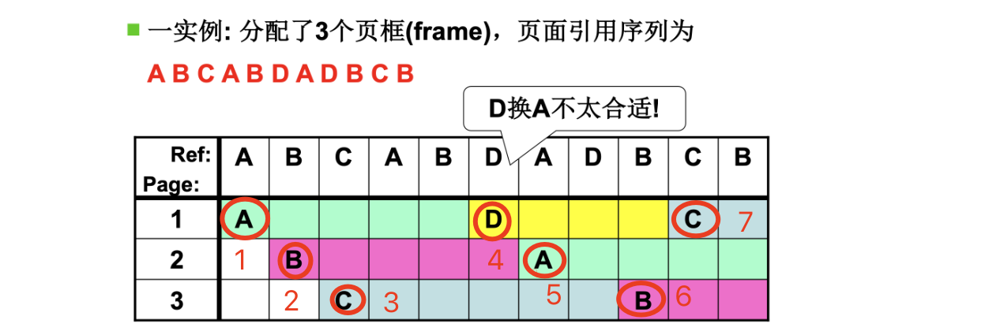
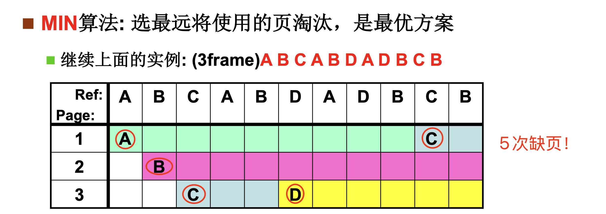
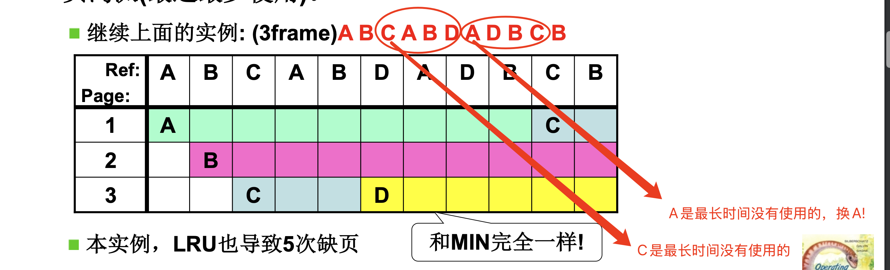
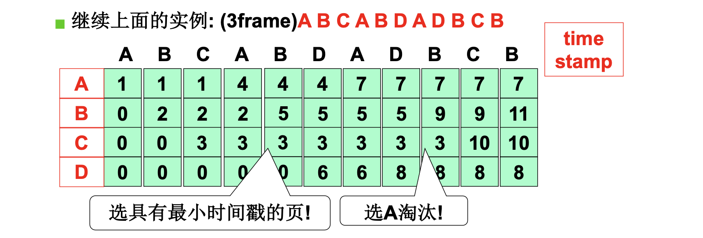
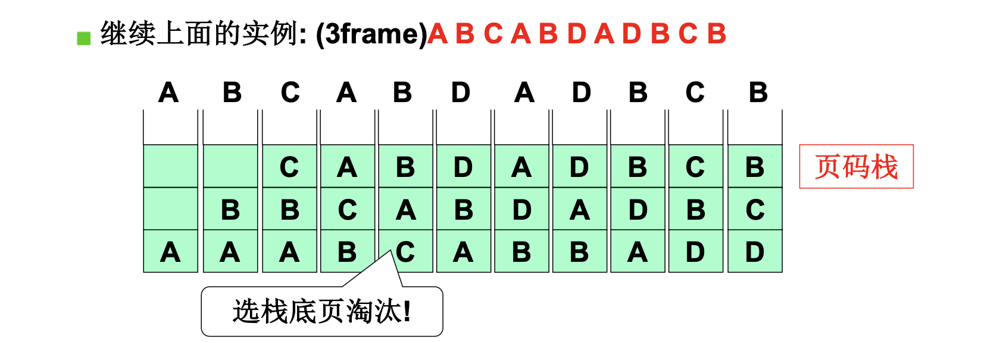
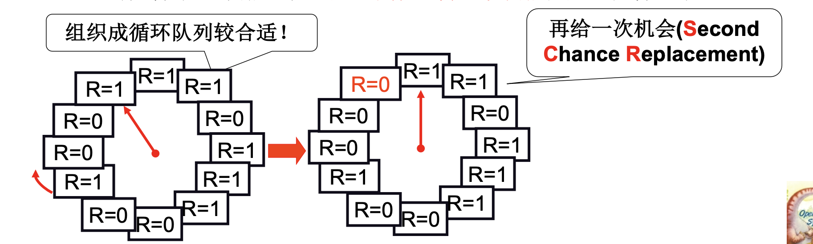
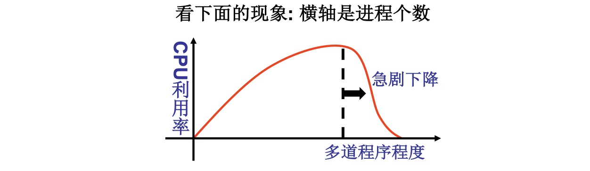

# 📘 3.6 内存换出 (Swap Out)

> 来源说明：哈工大李治军操作系统 L25 | 本节涵盖：页面置换算法（FIFO、MIN、LRU）及近似实现、Clock 算法、页框分配与颠簸现象

---

## 🧠 核心概念总览（严格按原文顺序）

> 🔗 **返回知识库主页**：[操作系统笔记主页](./README.md)
- [*知识点1: 换出的必要性*](#id1)
- [*知识点2: FIFO 页面置换算法*](#id2)
- [*知识点3: MIN 最优页面置换算法*](#id3)
- [*知识点4: LRU 最近最少使用算法*](#id4)
- [*知识点5: LRU 准确实现——时间戳法*](#id5)
- [*知识点6: LRU 准确实现——页码栈法*](#id6)
- [*知识点7: LRU 近似实现——Clock 算法（SCR）*](#id7)
- [*知识点8: Clock 算法的改进——双指针时钟*](#id8)
- [*知识点9: 页框分配与颠簸现象*](#id9)
- [*知识点10: 完整页换入换出流程*](#id10)

---

<a id="id1"></a>
## ✅ 知识点1: 换出的必要性

**有换入就要有换出！！**
- `get_free_page()` 不能总是获得新页，**物理内存是有限的**
- 需要**选择一页淘汰**，将其**换出**(`Swap Out`)到磁盘，腾出页框(`Frame`)
- 核心问题：**选择哪一页淘汰？**

- **代码**：
    ```c
    page = get_free_page();
    bread_page(page, current->executable->i_dev, nr);
    // 当 get_free_page() 必须换出页面, 但是到底选哪一页呢
    ```


---

<a id="id2"></a>
## ✅ 知识点2: FIFO 页面置换算法

**最容易想到的一种想法...**
- **FIFO**(`First-In First-Out`)：最先进入内存的页面最先被淘汰
- 最容易想到，但性能不佳——刚换入的页可能马上又要使用

- **图示**：
    

- **评价**：**D 换 A 不太合适**——A 刚被使用过，不应该被淘汰！
- **评价标准**：**缺页次数**；本实例，FIFO导致7次缺页


> ⚠️ **关键问题**：FIFO 可能把刚换入的页马上换出，导致**Belady 异常**（分配的页面数增多但缺页率反而提高的异常现象）


---

<a id="id3"></a>
## ✅ 知识点3: MIN 最优页面置换算法

**基于现有问题，我们继续解决...**
- **MIN** 算法：选择**最远将使用**的页面淘汰，是**理论最优方案**
- 缺点：需要**预知未来**——知道每个页面下次使用的时间

- **图示**：
    

- **结论**：MIN 导致 **5 次缺页**，优于 FIFO 的 7 次

> ⚠️ **关键区分**：MIN 是理论最优，但**不可实现**——需要知道未来引用序列


---

<a id="id4"></a>
## ✅ 知识点4: LRU 最近最少使用算法

**基于现有问题，我们再想想办法...**
- **LRU**(`Least Recently Used`)：选择**最近最长一段时间没有使用**的页面淘汰
- 核心思想：**用过去的历史预测将来**——最近不用的，将来可能也不用

- **图示**
    


**结论**：LRU 也导致 **5 次缺页**，与 MIN 一样！

> ⚠️ **关键区分**：LRU 是**近似 MIN** 的实用算法，基于"局部性原理"(`Principle of Locality`)

---

<a id="id5"></a>
## ✅ 知识点5: LRU 准确实现——时间戳法

**想法有了，如何实现呢？**
- 每页维护一个**时间戳**(`Time Stamp`)，记录最近一次访问时间
- 淘汰时选择**时间戳最小**的页

- **图示**：
    
- **结论**：软件实现非常简单，但是这个是在内核中实现！实际非常困难！
> ⚠️ **关键问题**：每次地址访问都需要修改时间戳，需维护全局时钟，需找到最小值——**实现代价较大**


---

<a id="id6"></a>
## ✅ 知识点6: LRU 准确实现——页码栈法

**这个问题如何解决呢？**
- 维护一个**页码栈**(`Page Stack`)，栈顶是最近访问的页，栈底是最久未访问的页
- 淘汰时选择**栈底页**

- **图示**
    
- **结论**：
    - 每次地址访问都需要修改栈，实现代价仍然较大，**LRU准确实现用的少**
    - 两种准确实现都代价高，因此实际使用**近似实现**

> ⚠️ **关键问题**：每次地址访问都需要修改栈（移动元素，修改约 10 次栈指针）——**实现代价仍然较大**
> 💡 **理解技巧**：页码栈就像把最近看的书放在最上面，最久没看的沉到底——每次都要搬书


---

<a id="id7"></a>
## ✅ 知识点7: LRU 近似实现——Clock 算法（SCR）

**那么近似实现是如何做的？**
- 每个页表项加一个**引用位**(`Reference Bit, R`) —— 每次访问一页时，硬件自动设置（**代价小**）
- 选择淘汰页时：扫描 R 位，**R=1** 时清 **0** 并继续扫描；**R=0** 时淘汰该页
- 组织成**循环队列**，使用一个指针(`hand`)扫描——称为 **Clock 算法**(`Clock Algorithm`)/(`Second Chance Replacement Algorithm`)

- **教材示例/公式**
    

- **工作流程：**

    1. **环形结构**：所有页框围成一个圈，配一个顺时针转的 **hand 指针**；每个页框自带一个 **R 位**（Reference bit，1 = 最近被用过，0 = 没被用过）。

    2. **命中不动针**：CPU 访问的页已在内存 → 直接把该页 **R 置 1**（标记"刚用过"），**hand 指针不转**。

    3. **缺页才转针**：访问的页不在内存 → hand 从当前位置开始顺时针扫：
        - 遇到 **R = 1**：清成 **0**（给第二次机会），继续转；
        - 遇到 **R = 0**：直接 **swap out** 该页，装入新页，R 置 1，`hand`指向下一页。

    4. **最坏情况**：如果转完一圈全是 1，hand 会把沿途全部清 0，回到起点时该页已经是 0，直接淘汰它。

    5. **本质**：用 **1 个 bit + 一个指针** 模拟 LRU——R=0 意味着"从上次 hand 路过到现在都没人碰过"，即最久未用。

- hand 指针本质：
    - 遇到 R=0 → 淘汰该页，因为在转了一圈回来你还是0，就是没被访问过 → 最近没有被使用过


> 💡 **理解技巧**：Clock 就像宿舍检查——每间房贴个标签（R=1 表示"刚用过"），检查时把标签撕了（R=0），下次没标签的就搬走 swap out 
> 🔄 **知识关联**：用硬件引用位降低实现代价，是近似 LRU 的经典方案


---

<a id="id8"></a>
## ✅ 知识点8: Clock 算法的改进——双指针时钟

**那么你能发现现在这个算法的问题吗？**
- **Clock 的问题**：如果缺页很少 → 就很少转动指针将1置为0 → 所有页的 R=1，`hand` 扫描一圈后回到起点 → hand scan一圈后淘汰当前页，将调入页插入hand位置，hand前移一位 → **退化为 FIFO**！
- **原因**：
    - clock 算法通过**一段时间没有被使用**来近似**最近最少使用**
    - 然而如果缺页少内存大的话，clock 算法表达的最近太长了，因此没办法表达最近的意思，
    - 记录了太长的历史信息 —— 记录信息没有价值了

- **改进方案：定时清除 `R` 位 -- 双指针时钟**
    - **快指针**：用来**清除 R 位**，移动速度**快**——定期刷新历史记录，不管是否缺页都在转圈清 R 位，快指针由定时中断（如时钟 tick）定期推动
    - **慢指针**：用来**选择淘汰页**，移动速度**慢**——真正淘汰页面，只在缺页时才启动找 R=0 的页

- **图示**：
    


> 💡 **理解技巧**：快指针就像定期清理——把旧标签都撕了；慢指针就像真正淘汰——没标签的搬走


---

<a id="id9"></a>
## ✅ 知识点9: 页框分配与颠簸现象

**还有一个问题没有解决 -- 到底给进程分配多少个页框呢？**
- 需要给每个进程分配**页框**(`Frame`)数量
- **分配太多** → 请求调页的高效利用失去意义
- **分配太少** → **颠簸**(`Thrashing`)现象
    - 进程增多 → 每个进程的页框减少 → 缺页率增大
    - **缺页率增大到一定程度 → 进程总等待调页 → CPU 利用率降低**
    - 进程进一步增多 → 缺页率更大 → 恶性循环

- **图示**：
    

- **分配过多不好，过少也不好，那到底分配几个合适呢？** -- **工作集算法（Working Set）**

    1. **它是什么**：记录进程**最近 Δ 时间内访问过的页面集合**，这个集合就叫"工作集"。

    2. **它解决啥问题**：回答"**该给这个进程分配多少页框**"——给少了会卡（抖动），给多了浪费内存。

    3. **怎么工作**：OS 定期扫描，**只保留工作集里的页面在内存**；不在集合里的页（很久没被访问的）直接踢出去。

    4. **核心依据**：程序有**局部性**——最近用过的页接下来大概率还会用，很久没用的页大概率不需要了。

    5. **一句话总结**：就像你复习时只把**最近 1 小时内翻过的书**摊在桌上，其他的收进书柜，桌子大小刚好够你最近要看的。


---

<a id="id10"></a>
## ✅ 知识点10: 完整页换入换出流程

**理论**
- 完整的内存管理流程：磁盘 → 页表 → 物理内存 → 换入换出
- `swap 分区`用于存放换出的页面
- `swap out` 时调用 `bwrite` 写磁盘；`swap in` 时从 swap 分区读取

**教材示例/公式**
```
┌─────────┐     ┌─────────┐     ┌─────────┐
│  磁盘   │     │  页表   │     │ 物理内存 │
└────┬────┘     └────┬────┘     └────┬────┘
     │               │               │
     │               │    load [addr]│
     │               │◄──────────────┘
     │               │       i (缺页中断)
     │               │    do_no_page
     │               │       ↓
     │               │    访问缺页
     │               │       ↓
     │◄──────────────┴──── bread ────┐
     │        swap分区               │
     │               ↑               │
     │               │    get_free_page
     │               │               ↓
     │               │◄───────── put_page
     │               │               │
     │               │    重新执行    │
     │               │◄──────────────┘
     │               │
     │    ┌─────────┴─────────┐
     │    │                   │
     │  swap out           swap in
     │    │                   ↑
     └────┼───────────────────┘
          │    swap分区管理
          │
     ┌────┴────┐
     │ bwrite  │  ← swap out：将页面写到 swap 分区
     │         │
     │ swap in │  ← swap分区管理：读取换入页面
     └─────────┘
```

**注意点**
- ⚠️ **关键区分**：`swap 分区`是磁盘上专门用于页面换入换出的区域，不同于普通文件系统
- 💡 **理解技巧**：swap 分区就像"临时仓库"——搬出去的东西暂时放这里，需要时再搬回来
- 🔄 **知识关联**：与 L24 请求调页内存换入的流程图直接衔接，形成完整闭环
- 📋 **术语提醒**：`Swap Partition(swap分区)`、`bwrite(块写)`、`swap in/out(换入换出)`

---

## 🔑 核心要点总结

1. **换出的必要性**：物理内存有限，`get_free_page()` 失败时必须淘汰页面换出到磁盘
2. **页面置换算法对比**：FIFO(7次缺页) → MIN(5次，理论最优) → LRU(5次，近似最优)
3. **LRU 实现代价**：时间戳法、页码栈法准确但代价大，实际使用近似实现
4. **Clock 算法**：引用位 R=1 清 0 继续扫描，R=0 淘汰；缺页少时退化为 FIFO
5. **双指针改进**：快指针清 R 位，慢指针淘汰，避免记录太长历史
6. **颠簸现象**：页框分配太少导致缺页率过高，CPU 利用率急剧下降
7. **完整流程**：缺页 → 找空闲页（无则换出）→ 从磁盘读入 → 更新页表 → 继续执行

---