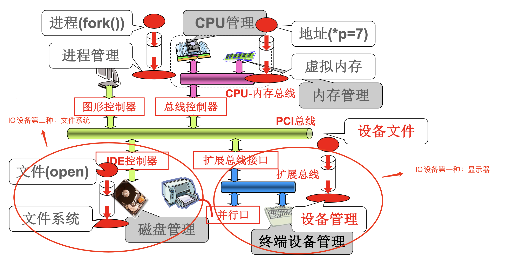
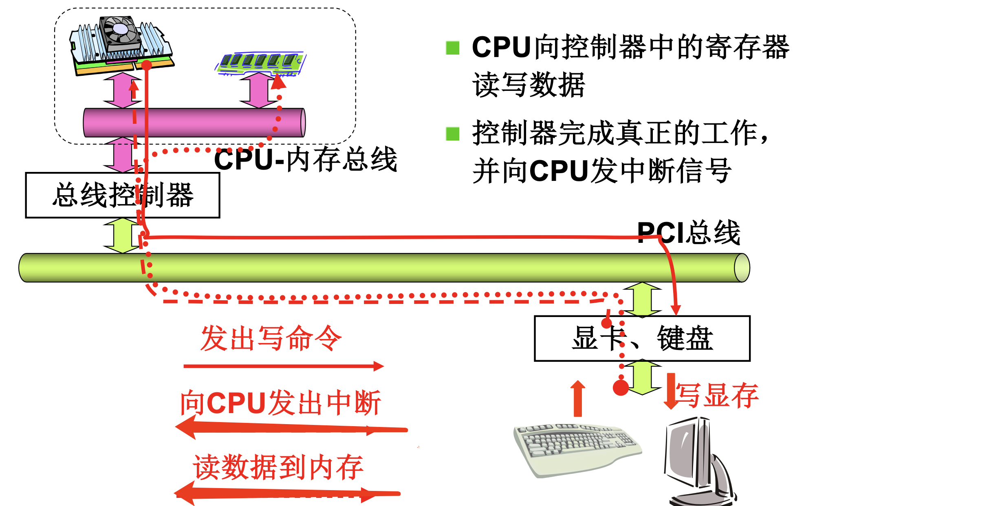
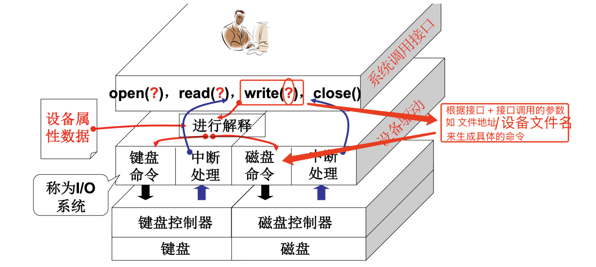
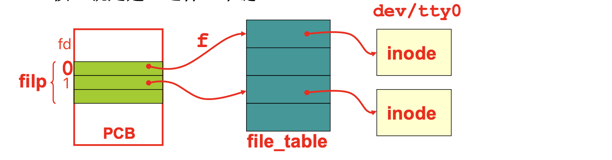

# 📘 L26 I/O 与显示器 (I/O and Display)

> 来源说明：哈工大李治军操作系统课程 L26 | 本节涵盖：从 `printf` 到屏幕显示的完整 I/O 调用链、设备文件抽象、显存映射机制

---

## 🧠 核心概念总览（严格按原文顺序）

> 🔗 **返回知识库主页**：[操作系统笔记主页](./README.md)
- [*知识点1: 操作系统管理的四大资源*](#id1)
- [*知识点2: CPU 与外设交互的五步机制*](#id2)
- [*知识点3: 文件视图——统一设备接口*](#id3)
- [*知识点4: `printf` 的库层展开与 `sys_write` 入口*](#id4)
- [*知识点5: `fd=1` 的 `filp` 来源—— `fork` 继承链*](#id5)
- [*知识点6: `open` 系统调用与文件描述符链*](#id6)
- [*知识点7: `sys_write` 到字符设备分发*](#id7)
- [*知识点8: `crw_table` 设备函数跳转表*](#id8)
- [*知识点9: `tty_write` 队列缓冲机制*](#id9)
- [*知识点10: `tty_struct` 与 `con_write` 显存写入*](#id10)
- [*知识点11: 显存地址与 `pos` 指针管理*](#id11)
- [*知识点12: 字符属性字节格式*](#id12)
- [*知识点13: `printf` 完整调用链总结*](#id13)

---

<a id="id1"></a>
## ✅ 知识点1: 操作系统管理的四大资源

**我们先继续看看这个整个计算机...**
- 操作系统管理计算机系统的四大核心资源，每种资源对应特定的管理模块和用户接口：

    | 管理模块 | 对应操作/概念 | 用户接口 |
    |---------|------------|---------|
    | `CPU管理` | 进程管理(`Process Management`) | 进程 (`fork()`) |
    | `内存管理` | 地址映射(`Address Mapping`) | 地址 (`*p=7`) |
    | `磁盘管理` | 文件系统(`File System`) | 文件 (`open`) |
    | `终端设备管理` | 设备管理(`Device Management`) | 设备文件 |

    

---

<a id="id2"></a>
## ✅ 知识点2: CPU 与外设交互的五步机制

**具体IO设备是如何交互的呢？**
- CPU 与外设交互遵循标准的4步流程：
    1. **CPU 写命令到控制器寄存器**：CPU 向**控制器**下达指令（写入控制寄存器）
    2. **控制器驱动外设执行**：控制器翻译命令，驱动**外设硬件**（如显卡芯片、键盘电路）独立工作，不占用 CPU
    3. **控制器向 CPU 发中断**：外设任务完成后，由**控制器**通知 CPU 操作完成
    4. **读数据到内存**：数据从控制器/外设搬运到内存（可由 DMA 完成）
    

- **三层关系**：CPU ↔ **控制器（含寄存器）** ↔ **外设硬件**
  - **外设**：物理设备本身（显卡、键盘）
  - **控制器**：外设内的芯片/电路，负责协议翻译和时序控制
  - **寄存器**：控制器内部的存储单元，是 CPU 与外设交互的**唯一接口**

- **核心要点**：CPU 只与控制器中的寄存器交互；控制器负责驱动外设并回传中断；真正工作由外设硬件完成。


---

<a id="id3"></a>
## ✅ 知识点3: 文件视图——统一设备接口

**那么问题来了...**
- **核心问题**："向设备控制器的寄存器写不就可以了吗？"
  - 问题所在：需要查寄存器地址、内容的格式和语义……每个设备都不同
- **操作系统解决方案**：提供**简单视图 — 文件视图**(`File View`)，方便用户使用

- **统一设备接口示例**
    ```c
    int fd = open("/dev/xxx");
    for (int i = 0; i < 10; i++) {
        write(fd, i, sizeof(int));
    }
    close(fd);
    ```

- **两大核心设计原则**

    | 原则 | 说明 |
    |-----|------|
    | **(1) 统一接口** | 不论什么设备都是 `open`, `read`, `write`, `close` |
    | **(2) 设备文件区分** | 不同的设备对应不同的设备文件 (`/dev/xxx`) |

    >📋 **术语提醒**：`设备文件`(`Device File`)是 Linux 中设备的抽象表示，位于 `/dev/` 目录下
    >💡 **理解技巧**：把不同硬件"伪装"成文件，用户用同一套 `open/read/write/close` 操作所有设备

- **I/O 系统架构**：
    !


> ⚠️ **关键区分**：文件视图是**操作系统两大视图之一**（另一为进程地址空间视图）


---

<a id="id4"></a>
## ✅ 知识点4: `printf` 的库层展开与 `sys_write` 入口

**概念有了，那么故事从哪里开始？ -- 开始给显示器输出**
- `printf`：`printf(“Host Name: %s”, name);` 库展开过程：
  1. 先创建缓存 `buf`
  2. 将格式化输出都写到 `buf`
  3. 然后再调用 `write(1, buf, …)`（**`fd=1` 为标准输出**）
  4. 进入系统然后进行系统调用 `sys_write`

- **系统调用入口：`sys_write`**

- 文件位置：`linux/fs/read_write.c`
    ```c
    int sys_write(unsigned int fd, char *buf, int count)
    {
        struct file* file;
        file = current->filp[fd];
        inode = file->f_inode;
        // fd 是找到 file 这个文件的索引!
        // current 不陌生吧，进程带动整个系统的视图
        // file 的目的是得到 inode，显示器信息应该就在这里
        ...
    }
    ```

- **关键概念**

    | 概念 | 说明 |
    |-----|------|
    | `fd` | 找到 `file` 的索引 |
    | `current` | 当前进程 PCB，**进程带动整个系统的视图** |
    | `file` 的目的 | 得到 `inode`，显示器信息在 `inode` 中 |

> ⚠️ **关键区分**：`fd` 只是数组索引，`current->filp[fd]` 才是真正的 `file` 结构指针
> 🔄 **知识关联**：`current` 指向当前进程 PCB，这是 Linux 0.11 中进程管理的核心设计
> 📋 **术语提醒**：`inode`(`Index Node`) 存储文件的元数据信息，包括设备类型、设备号等

---

<a id="id5"></a>
## ✅ 知识点5: `fd=1` 的 `filp` 来源—— `fork` 继承链

**那么 `filp[1]` 对应的文件是什么? 从哪里来呢？**
- **核心结论**：因为是被 `current` 指向，所以是从 **`fork`** 中来
- **进程拷贝 `fork` 机制：`copy_process`**
    ```c
    int copy_process(...) {
        *p = *current;  // 拷贝整个 PCB
        for (i=0; i<NR_OPEN; i++)
            if ((f=p->filp[i])) 
                f->f_count++;  // 文件引用计数+1
    }
    ```
- **主要任务**：
    1. **复制 PCB**：把当前进程（父进程）的完整进程控制块（`current`）拷贝给新进程（`p`），让子进程继承父进程的寄存器、内存空间等执行上下文。
    2. **共享已打开文件**：遍历子进程的**已打开文件指针数组**（`filp[]`），对每个**已打开的文件对象**引用计数（`f_count`）加 1，标记子进程也共享此文件，防止父进程关闭时文件被提前释放（类似`shared_ptr`）

- **问题：显然是拷贝来的，那么这些文件是谁一开始打开的？**
    - **所有用户进程都是 1 号进程的后代；而 1 号是 0 号直接创建的**，那我们看看 1 号进程如何创建的

- **1 号进程的初始化链**：

    ```c
    void main(void) {
        if(!fork()) {  // 创建子进程
            init();   // 子进程执行 init
        }
    }

    void init(void) {
        open("dev/tty0", O_RDWR, 0);  // 打开终端，fd=0（标准输入）
        dup(0);      // 复制 fd=0 到 fd=1（标准输出）
        dup(0);      // 复制 fd=0 到 fd=2（标准错误）
        execve("/bin/sh", argv, envp);  // 执行 shell
    }
    ```
- **主要任务**：
    1. **初始化标准 IO**：打开一个名为 `dev/tty0` 的文件，并 `dup(0)` 拷贝两份

        - `tty0`（`fd=0`） 就是当前虚拟终端，并通过 `dup(0)` 复制出 `fd=1`（标准输出）和 `fd=2`（标准错误），让 `stdin/stdout/stderr` 都指向同一个终端。
        - 就是"当前亮着的那个黑屏终端"

    2. **启动用户态 Shell**：`execve("/bin/sh")`系统从此进入交互式命令行环境。

> ⚠️ **关键区分**：`dup(0)` 是复制文件描述符，不是复制文件内容——两个 fd 指向同一个 `file` 结构


---

<a id="id6"></a>
## ✅ 知识点6: `open` 系统调用与文件描述符链

**那么怎么打开的呢？调用 `sys_open` ...**
- **系统调用入口：`sys_open`**

- 文件位置：`linux/fs/open.c`

    ```c
    int sys_open(const char* filename, int flag)
    {
        i = open_namei(filename, flag, &inode);  // 解析目录，找到 inode!
        current->filp[fd] = f;    // 第一个空闲的 fd
        f->f_mode = inode->i_mode;
        f->f_inode = inode;
        f->f_count = 1;
        return fd;
    }
    ```
- **主要任务**：
    1. **解析文件路径**：`open_namei` 根据文件名读入 `inode`（文件元数据）。

    2. **分配 fd 并建立映射**：根据文件名找到文件，在进程里登记一下并分配一个编号（fd），以后用户就拿这个编号来读写文件。

- **核心机制：建立文件描述符链**
    

- **关键操作步骤**

    | 步骤 | 操作 | 说明 |
    |-----|------|------|
    | 1 | `open_namei()` | 解析目录，找到 `inode` |
    | 2 | 分配空闲 `fd` | 找到第一个空闲的文件描述符 |
    | 3 | 建立 `filp[fd]=f` | 连接 PCB 到文件表 |
    | 4 | 设置 `f->f_inode=inode` | 连接文件表到 inode |
    | 5 | 设置 `f->f_count=1` | 引用计数初始化 |

- 做以上这些都是在干什么？：`Open` 将目标文件 `inode` 读入， 之后的 `write` 对这个 `inode` 进行操作

> 📋 **术语提醒**：`file_table[]` 是系统级文件表，是系统级的文件实体仓库 而 `filp[]` 是进程级打开文件指针数组

---

<a id="id7"></a>
## ✅ 知识点7: `sys_write` 到字符设备分发

**`inode` 有了，就可以 `write` 了**
- **`sys_write` 继续执行**

- 文件位置：`linux/fs/read_write.c`

    ```c
    int sys_write(unsigned int fd, char *buf, int cnt)
    {   
        ...
        inode = file->f_inode;
        if (S_ISCHR(inode->i_mode))  // 判断是否为字符设备
            return rw_char(WRITE, inode->i_zone[0], buf, cnt);
        ...
    }
    ```
- **主要任务**：
    1. 判断`/dev/tty0` 的 `inode` 中的信息是**字符设备**(`Character Device`)，`S_ISCHR` 判断为真
    2. `inode->i_zone[0]` 存储**设备号**(`Device Number`)

- **转到字符设备读写：`rw_char`**

- 文件位置：`linux/fs/char_dev.c`

    ```c
    int rw_char(int rw, int dev, char *buf, int cnt)
    {
        crw_ptr call_addr = crw_table[MAJOR(dev)];  // 通过主设备号查表
        call_addr(rw, dev, buf, cnt);  // 调用具体设备函数
        ...
    }
    ```
- 主要任务：
    - 使用 设备号 ，通过 `crw_table` 函数指针表 找到对应的处理函数

> ⚠️ **关键区分**：`S_ISCHR` vs `S_ISBLK`——字符设备(`Character Device`)逐字符处理，块设备(`Block Device`)按块处理
> 💡 **理解技巧**：`MAJOR(dev)` 提取主设备号，用于在 `crw_table` 中查找对应的设备处理函数


---

<a id="id8"></a>
## ✅ 知识点8: `crw_table` 设备函数跳转表

**那么再来看看这个表是个啥**
- **字符设备读写表：`crw_table`**

```c
static crw_ptr crw_table[] = {..., rw_ttyx, ...};

typedef (*crw_ptr)(int rw, unsigned minor, char *buf, int count);
```

- `/dev/tty0` 对应**第 4 个**条目 → `rw_ttyx`

**转到 rw_ttyx**

```c
static int rw_ttyx(int rw, unsigned minor, char *buf, int count)
{
    return ((rw==READ) ? tty_read(minor, buf) : tty_write(minor, buf));
}
```

**核心猜测**：输出就是放入队列！

**注意点**
- ⚠️ **关键区分**：`crw_table` 是**函数指针数组**（跳转表），根据主设备号索引到具体的设备处理函数
- 💡 **理解技巧**：这是典型的"多态"实现——用函数指针表实现不同设备的统一调用接口
- 📋 **术语提醒**：`crw_ptr` 是函数指针类型定义，指向 `int ()(int, unsigned, char*, int)` 签名的函数

---

<a id="id9"></a>
## ✅ 知识点9: tty_write 队列缓冲机制

**理论**
- **核心函数：tty_write**

文件位置：`linux/kernel/tty_io.c`

```c
int tty_write(unsigned channel, char *buf, int nr)
{
    struct tty_struct *tty;
    tty = channel + tty_table;  // 找到对应 tty 结构
    sleep_if_full(&tty->write_q);  // 如果写队列满则睡眠
    ...
}
```

- **tty_write 完整逻辑**

```c
int tty_write(unsigned channel, char *buf, int nr)
{
    ...
    char c, *b = buf;
    while (nr > 0 && !FULL(tty->write_q)) {  // 有数据且队列未满
        c = get_fs_byte(b);  // 从用户缓存区读! (fs段)
        
        if (c == '\\r') {  // 回车符处理
            PUTCH(13, tty->write_q);
            continue;
        }
        
        if (O_LCUC(tty))  // 小写转大写选项
            c = toupper(c);
        
        b++; nr--;
        PUTCH(c, tty->write_q);  // 放入写队列
    }  // 输出完事或写队列满!
    
    tty->write(tty);  // 调用具体写函数
}
```

**关键概念**

| 概念 | 说明 |
|-----|------|
| `get_fs_byte(b)` | 从**用户缓存区**读（fs 段） |
| `tty->write_q` | TTY 写队列(`Write Queue`) |
| `PUTCH(c, tty->write_q)` | 将字符放入队列 |
| `tty->write(tty)` | 真正的开始输出到屏幕 |

**注意点**
- ⚠️ **关键区分**：`get_fs_byte()` 从用户态地址空间(fs 段)读取，内核态与用户态地址空间隔离
- 💡 **理解技巧**：队列缓冲的作用是解耦——`tty_write` 只管往队列里放，`tty->write` 负责从队列取并输出
- 🔄 **知识关联**：这与生产者-消费者模型完全一致——用户进程是生产者，控制台驱动是消费者

---

<a id="id10"></a>
## ✅ 知识点10: tty_struct 与 con_write 显存写入

**理论**
- **tty_struct 结构定义**

文件位置：`include/linux/tty.h`

```c
struct tty_struct {
    void (*write)(struct tty_struct *tty);  // 写函数指针
    struct tty_queue read_q, write_q;       // 读写队列
};
```

- **tty_table 初始化**

```c
struct tty_struct tty_table[] = {
    { con_write, {0,0,0,0,""}, {0,0,0,0,""} },  // 控制台 tty
    {}, ...
};
```

- **关键跳转**：到了 `con_write`，真正写显示器！

文件位置：`linux/kernel/chr_drv/console.c`

```c
void con_write(struct tty_struct *tty)
{
    GETCH(tty->write_q, c);  // 从写队列取字符
    
    if (c > 31 && c < 127) {  // 可打印字符
        __asm__(
            "movb _attr, %%ah\\n\\t"   // 属性字节→AH
            "movw %%ax, %1\\n\\t"      // AX→显存
            :: "a"(c), "m"(*(short*)pos)
            : "ax"
        );
        pos += 2;  // 移动到下一个字符位置
    }
}
```

**注意点**
- ⚠️ **关键区分**：`tty_struct.write` 是**函数指针**，指向具体的设备写函数（这里是 `con_write`）
- 💡 **理解技巧**：这种设计实现了"多态"——不同的 tty 设备可以有不同的 `write` 实现，但接口统一
- 📋 **术语提醒**：`con_write` = Console Write，控制台写函数，直接操作显存

---

<a id="id11"></a>
## ✅ 知识点11: 显存地址与 pos 指针管理

**理论**
- **PC/AT 机内存区域图**

| 地址范围 | 用途 |
|---------|------|
| `0x00000` | 常规内存起始 |
| `0xA0000` | 显存起始（单色） |
| `0xB8000` | **CGA 彩色显存起始** |
| `0xC0000` | VGA ROM BIOS |
| `0x100000` | 扩展内存 |

- **`pos` 指向显存**
  - `pos = 0xB8000`（CGA 彩色文本模式）
  - 显示核心秘密：**完成显示中最核心的秘密就是 `mov pos, c`**

- **con_init 初始化**

```c
void con_init(void)
{
    gotoxy(ORIG_X, ORIG_Y);  // 设置初始光标位置
}

static inline void gotoxy()
{
    pos = origin + y * video_size_row + (x << 1);
}
```

- **初始光标位置（从 BIOS 获取）**

| 宏定义 | 地址 | 含义 |
|-------|------|------|
| `ORIG_X` | `(*(unsigned char*)0x90000)` | 初始光标列号 |
| `ORIG_Y` | `(*(unsigned char*)0x90001)` | 初始光标行号 |

- **`pos += 2` 的原因**：屏幕上的一个字符在显存中除了**字符本身**还应该有**字符的属性**（如颜色等）

**注意点**
- ⚠️ **关键区分**：CGA 彩色文本模式显存起始于 `0xB8000`，不是 `0xA0000`（后者是单色/图形模式）
- 💡 **理解技巧**：`pos` 是全局变量，始终指向当前光标位置的显存地址；`pos += 2` 因为每个字符占 2 字节（字符 + 属性）
- 📋 **术语提醒**：`origin` 是显存起始地址，`video_size_row` 是每行字节数

---

<a id="id12"></a>
## ✅ 知识点12: 字符属性字节格式

**理论**
- **CGA 彩色图形适配器**(`Color Graphics Adapter`)标准
  - 显存地址范围：`0xb8000` ~ `0xbc000`

**字符属性字节格式（8 位）**

| 位 | 名称 | 含义 |
|---|------|------|
| D7 | BL | 闪烁 (`Blink`) |
| D6 | R | 背景色-红 (`Background Red`) |
| D5 | G | 背景色-绿 (`Background Green`) |
| D4 | B | 背景色-蓝 (`Background Blue`) |
| D3 | I | 高亮度 (`Intensity`) |
| D2 | R | 前景色-红 (`Foreground Red`) |
| D1 | G | 前景色-绿 (`Foreground Green`) |
| D0 | B | 前景色-蓝 (`Foreground Blue`) |

**属性分组**：
- **高 4 位**（D7-D4）：背景色（BL R G B）
- **低 4 位**（D3-D0）：高亮度 + 前景色（I R G B）

**默认属性设置**

```c
static unsigned char attr = 0x07;  // 0000 0111
```

- 解析：`0x07` = 背景黑（`000`）+ 前景白（`111`）= **黑底白字！**

**内联汇编写显存**

```c
__asm__(
    "movb _attr, %%ah\\n\\t"   // AH = 属性字节 (0x07)
    "movw %%ax, %1\\n\\t"      // AX = 属性:字符 → 显存[pos]
    :: "a"(c), "m"(*(short*)pos)  // 输入: AL=字符, 内存操作数=pos
    : "ax"                   // 破坏描述: AX 被修改
);
```

- 注意：`%1` 对应 `"m"(*(short*)pos)`，即显存地址；`AX` 中 `AH=属性, AL=字符`

**注意点**
- ⚠️ **关键区分**：`movw %%ax, %1` 一次写入 2 字节——低字节是字符，高字节是属性
- 💡 **理解技巧**：颜色编码是 RGB 三原色，加 Intensity 控制亮度，共 16 种前景色、8 种背景色
- 🔄 **知识关联**：这与计算机图形学中的调色板、像素格式完全同源

---

<a id="id13"></a>
## ✅ 知识点13: printf 完整调用链总结

**理论**
- **完整调用链流程**

```
库函数(printf)
    ↓ [用户态：格式化输出到 buf]
系统调用(write)
    ↓ [内核态：进入 sys_write]
read_write.c: sys_write()
    ↓ [fd=1, 找到 file 和 inode]
    ↓ [S_ISCHR 判断为字符设备]
char_dev.c: rw_char()
    ↓ [crw_table[MAJOR(dev)] 查表]
    ↓ [调用 rw_ttyx]
tty_io.c: tty_write()
    ↓ [将字符放入 write_q 队列]
    ↓ [tty->write(tty) 调用具体写函数]
console.c: con_write()
    ↓ [从 write_q 取字符]
    ↓ [movw %%ax, pos 写显存]
显存
    ↓ [硬件自动扫描显示]
屏幕输出
```

**各层文件对应**

| 层级 | 文件 | 函数 | 作用 |
|-----|------|------|------|
| 库层 | - | `printf` | 格式化，创建 buf |
| 系统调用层 | `linux/fs/read_write.c` | `sys_write` | 入口分发 |
| 字符设备层 | `linux/fs/char_dev.c` | `rw_char` | 设备类型分发 |
| TTY 设备层 | `linux/kernel/tty_io.c` | `tty_write` | 队列缓冲 |
| 控制台层 | `linux/kernel/chr_drv/console.c` | `con_write` | 写显存 |
| 硬件层 | - | `mov pos, c` | 实际显示 |

**注意点**
- ⚠️ **关键区分**：整个过程经历了**两次抽象跳转**——文件视图抽象（统一接口）+ 设备类型抽象（函数指针表）
- 💡 **理解技巧**：记牢两条链：① PCB → filp → file → inode → 设备号 ② crw_table → rw_ttyx → tty_write → con_write → 显存
- 🔄 **知识关联**：这是操作系统**设备管理**的完整实现，体现了"分层抽象"的核心设计思想

---

## 🔑 核心要点总结

1. **文件视图**是操作系统设备管理的核心抽象——所有设备统一用 `open/read/write/close` 访问，通过不同设备文件区分硬件
2. **printf → 屏幕**经历了 6 个层次：库层 → 系统调用层 → 文件系统层 → 字符设备层 → TTY 层 → 控制台层，最终 `mov` 到显存
3. **设备号 + crw_table** 实现了字符设备的多态分发——主设备号索引函数指针表，调用具体设备处理函数
4. **队列缓冲**（`write_q`）解耦了生产者（用户进程）和消费者（控制台驱动），实现异步 I/O
5. **显存映射**是最底层的显示机制——CGA 文本模式从 `0xB8000` 开始，每个字符占 2 字节（字符 + 属性），`pos` 指针管理光标位置
---