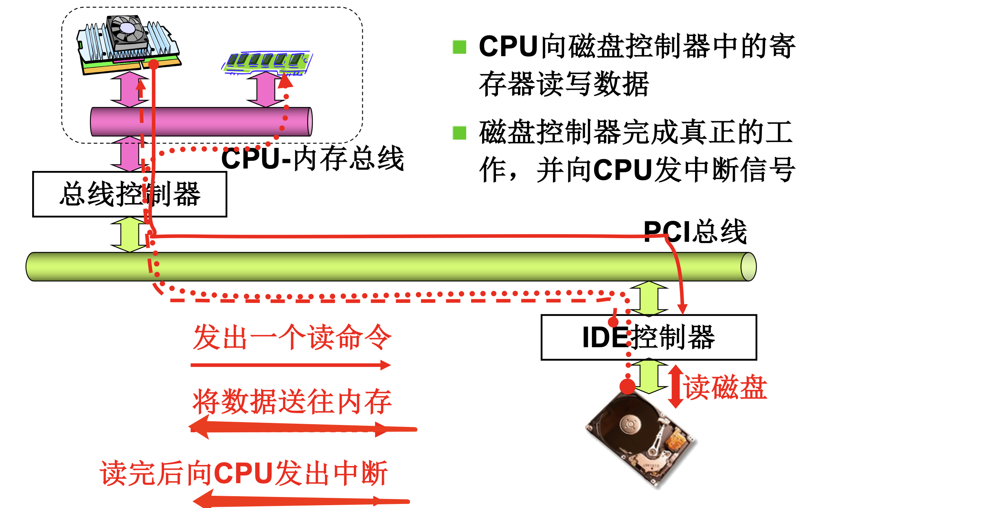
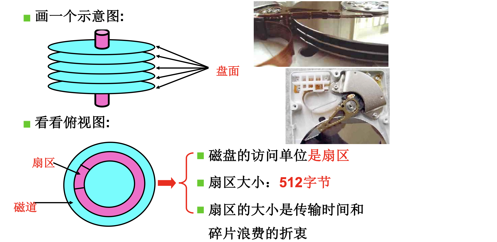
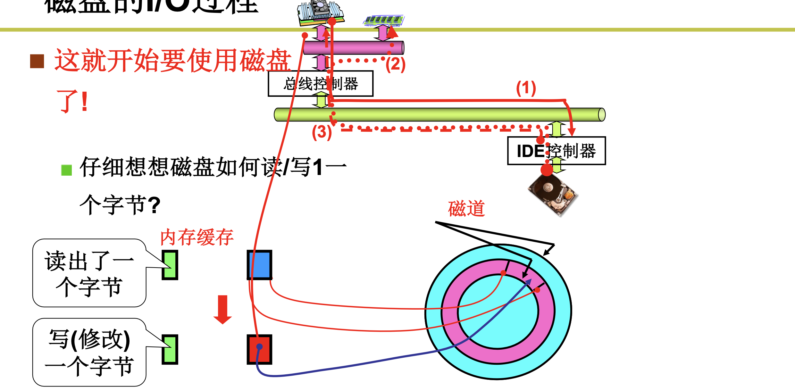
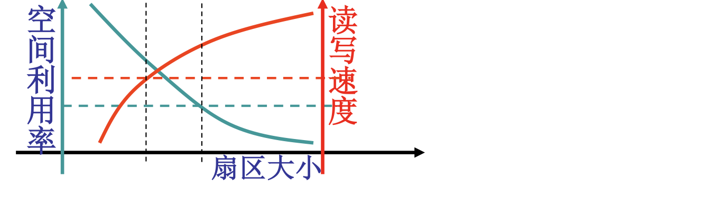
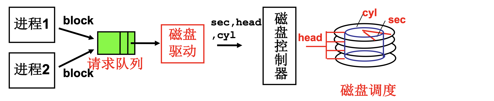

# 📘 4.3 生磁盘的使用 (Raw Disk Usage)

> 来源说明：哈工大李治军操作系统课程 L28 | 本节涵盖：磁盘 I/O 硬件机制、CHS 物理寻址、盘块抽象、磁盘调度算法（FCFS/SSTF/SCAN/C-SCAN）、Linux 0.11 请求队列实现

---

## 🧠 核心概念总览（严格按原文顺序）

> 🔗 **返回知识库主页**：[操作系统笔记主页](./README.md)
- [*知识点1: 磁盘 I/O 硬件结构与中端机制*](#id1)
- [*知识点2: 磁盘物理结构*](#id2)
- [*知识点3: 磁盘 I/O 四阶段与访问时间公式*](#id3)
- [*知识点4: CHS 直接访问与端口编程*](#id4)
- [*知识点5: 第一层抽象——从 block 到 CHS*](#id5)
- [*知识点6: 扇区号计算与盘块设计*](#id6)
- [*知识点7: Linux 0.11 中的盘块处理与 CHS 转换*](#id7)
- [*知识点8: 第二层抽象——多进程队列与磁盘调度目标*](#id8)
- [*知识点9: FCFS 磁盘调度算法*](#id9)
- [*知识点10: SSTF 磁盘调度算法*](#id10)
- [*知识点11: SCAN 磁盘调度算法*](#id11)
- [*知识点12: C-SCAN 磁盘调度算法（电梯算法）*](#id12)
- [*知识点13: Linux 0.11 请求队列实现*](#id13)
- [*知识点14: 生磁盘使用完整流程（六步）*](#id14)

---

<a id="id1"></a>
## ✅ 知识点1: 磁盘 I/O 硬件结构与中端机制

**先从架构说起...**
- 磁盘 I/O 硬件架构涉及：
    
- **读磁盘过程**：
  1. CPU 向磁盘控制器中的**寄存器**读写数据
  2. 磁盘控制器完成真正的工作
  3. 读完后向 CPU 发出**中断**(`Interrupt`)
  4. 将数据送往内存


---

<a id="id2"></a>
## ✅ 知识点2: 磁盘物理结构

**磁盘长什么样子呢?**
- **磁道**(`Track`)：同心圆轨道
- **扇区**(`Sector`)：磁道上的弧形片段，磁盘访问的**基本单位**
    - **扇区大小：512 字节**
    - 扇区大小的设计考量：**传输时间和碎片浪费的折衷**
- **盘面**(`Platter` / `Side`)：磁盘的一个表面
- **柱面**(`Cylinder`) = 同一半径下所有盘面的磁道集合——是多个盘面的并行概念



---

<a id="id3"></a>
## ✅ 知识点3: 磁盘 I/O 四阶段与访问时间公式

**磁盘的IO过程...**
- **磁盘读写一个字节的完整过程**（三步）：
  1. 控制器操作（CPU 下发命令）
  2. **寻道：移动磁头到目标磁道上** + **旋转：旋转到目标扇区上**（机械运动）
  3. 和内存缓存进行读写交互

- **磁盘 I/O 过程总结**：控制器 → 寻道 → 旋转 → 传输或接收数据！
    

- **磁盘访问时间公式**
    > **磁盘访问时间 = 写入控制器时间 + 寻道时间 + 旋转时间 + 传输时间**

- **典型时间量级**

    | 时间组成 | 典型值 | 性质 |
    |---------|--------|------|
    | 写入控制器时间 | （可忽略）| 电子操作 |
    | 寻道时间 | 12ms ~ 8ms | **机械操作，最耗时** |
    | 旋转时间 | 7200 转/分钟：半周约 4ms | 机械操作 |
    | 传输时间 | 50M/秒，约 0.3ms | 电子操作 |

> ⚠️ **关键区分**：**寻道时间是主要矛盾**——机械臂移动是最慢环节，磁盘调度的核心目标就是减少寻道


---

<a id="id4"></a>
## ✅ 知识点4: CHS 直接访问与端口编程

**结构知道了，看看如何使用...**
- **最直接的使用磁盘**：通过向磁盘控制器标明 CHS（柱面 `Cylinder`、磁头 `Head`、扇区 `Sector`）磁盘自动直接访问
    
- **写操作示例**

    ```c
    void do_hd_request(void) {
        ...
        hd_out(dev, nsect, sec, head, cyl, WIN_WRITE, ...);
        port_write(HD_DATA, CURRENT->buffer, 256); // 写入 256 字(512 字节)
    }
    ```
- 主要任务：
    1. CPU 先通过 `hd_out` 向硬盘控制器发送**写命令**和**磁盘参数** -- 告诉硬盘"我要往哪写"
    2. 随后通过 `port_write` 将内存缓冲区中的 512 字节数据直接写入硬盘数据端口。
    > 📋 **术语提醒**：`WIN_WRITE` 是写命令码，`port_write` 通过 DMA 或 PIO 方式传输数据
- **核心代码（Linux 0.11 风格）**

    ```c
    void hd_out(drive, nsect, sec, head, cyl, cmd...) {
        port = HD_DATA;        // 数据寄存器端口(0x1f0)
        outb_p(nsect, ++port); // 写入扇区数
        outb_p(sect, ++port);  // 写入起始扇区
        outb_p(cyl, ++port);   // 写入柱面低 8 位
        outb_port(cyl>>8, ++port); // 写入柱面高 8 位
        outb_p(0xA0|(drive<<4)|head, ++port); // 驱动器+磁头
        outb_p(cmd, ++port);   // 写入命令
    }
    ```
- **主要任务**：
    1. CPU 通过 I/O 端口（0x1f0 起）依次向硬盘控制器写入磁盘操作参数（扇区数、柱面、磁头、驱动器）和命令，启动磁盘读写。


- **关键参数**：`sec`, `head`, `cyl`（扇区、磁头、柱面）

    > ⚠️ **关键区分**：`hd_out` 是**底层端口操作**——直接向 IDE 控制器的寄存器写命令，这是操作系统最原始的磁盘控制方式
    > 💡 **理解技巧**：`0x1f0` 是 IDE 主通道的数据端口，向后续端口依次写入参数


---

<a id="id5"></a>
## ✅ 知识点5: 第一层抽象——从 block 到 CHS

**有没有办法将上述操作封装为接口，方便使用呢？ -- 第一层抽象**
- **架构层次**

    

- **第一层抽象接口 -- 磁盘驱动的职责**：从 **`block`（盘块号）** 计算出 **`cyl`, `head`, `sec`（CHS）**
    -  **输入**：一维地址 → **输出**：三维地址 

- **核心问题**
    1. **如何编址？**
    2. **为什么这样编址？**

- **编址优化目标**
    - **关键特性**：`block` 相邻的盘块也可以放在相邻的 CHS 方便快速读出
    - **原因**：
        - **寻道时间占磁盘访问时间最大**
        - 相邻盘块位于同一磁道或邻近磁道，**减少寻道时间**


> ⚠️ **关键区分**：`block` 是逻辑概念（操作系统视角），`CHS` 是物理概念（硬件视角）——磁盘驱动负责二者映射
> 💡 **理解技巧**：编址顺序的设计目标就是**空间局部性**——相邻逻辑块尽量物理相邻，减少磁头移动

---

<a id="id6"></a>
## ✅ 知识点6: 扇区号计算与盘块设计

**为了达到上面的目标，如何设计磁盘读写流程呢？**

- **磁盘读写流程**：
    
    
    1. 顺时针依次读写扇区
    2. 当读写完第6个扇区后又回到0号扇区
    3. 换到0号扇区**正下方投影**的盘面上继续读写，也就是7号扇区
    4. 依次类推，知道这个柱面读完后再换到下一个柱面
- **为什么这样工作？**：
    - 一个磁臂上有多个磁头，读完一个盘面的磁道后就不用挪动磁头，直接换**正下方投影**的盘面对应磁道读写
    - 这样工作，尽可能减少了磁头的移动，也就是减少寻道时间

    
- **根据工作方式，得到 CHS 到 LBA 线性扇区号 的转换公式**：
    - **线性扇区号： `LBA = C × (Heads × Sectors) + H × Sectors + S`**
    - **`S = block % Sectors`**（取余）
    - **`H = (block / Sectors) % Heads`**
    - **`C = block / (Heads × Sectors)`**
        - `C` = 柱面号，`H` = 磁头号，`S` = 扇区号
        - `Heads` = 每柱面磁头数，`Sectors` = 每磁道扇区数
    > ⚠️ 公式相当于将一个多维卷轴摊平为一维编号

- **从扇区到盘块（Block）**
    - 扇区大小固定（512 字节）
    - 操作系统可以**每次读/写连续的几个扇区**（称为**盘块**）
    > ⚠️ **关键区分**：盘块是**软件层面的读写单位**，扇区是**硬件层面的物理单位**——盘块 ≥ 扇区

- **盘块大小权衡**
    - 磁盘访问时间中，传输时间小到足以忽略不计，所以在寻道+旋转时间都一样的情况下，读写的盘块大小决定了速度
    -  磁盘访问时间总计：约 10ms

        | 盘块大小 | 空间利用率 | 读写速度 |
        |---------|-----------|---------|
        | 每次读写 1K | 碎片 0.5K | 100K/秒 |
        | 每次读写 1M | 碎片 0.5M | 约 40M/秒 |
    - 由于扇区是最小单位所以如果要读取某扇区就要全部读完，故存在空间碎片

- **关键观察**
    
    - **盘块越大 → 碎片浪费越大，但读写速度越高（分摊寻道/旋转时间）**
    > 💡 **理解技巧**：盘块大小的权衡本质是"空间换时间"——大块减少 I/O 次数（每次 I/O 都有 10ms 开销），但增加内部碎片
- **回到最初的问题：block 如何解释出CHS？**
    - **用户给盘块号 → OS 自动算（×每盘块扇区数）得 LBA → 再转 CHS → 发给磁盘控制器**
---

<a id="id7"></a>
## ✅ 知识点7: Linux 0.11 中的盘块处理与 CHS 转换

**了解了原理，我们来看看代码实现...**
- **`make_request` 函数：**

    ```c
    static void make_request() {
        struct request *req;
        req = request + NR_REQUEST;
        req->sector = bh->b_blocknr << 1;  // 盘块号→扇区号（×2，因盘块=2扇区）
        add_request(major + blk_dev, req);
    }
    ```
- **主要任务**：
    2. **将盘块号转成 LBA 扇区号**，填入请求结构体
    2. 将该 I/O 请求加入对应块设备的请求队列，等待磁盘调度程序统一调度处理

- **`do_hd_request` 函数：CHS 转换与输出**

    ```c
    void do_hd_request(void) {
        unsigned int block = CURRENT->sector;
        
        // 第一步：block / Sectors → 得到柱面+磁头组合 和 扇区余数
        __asm__("divl %4" : "=a"(block), "=d"(sec) 
                : "0"(block), "1"(0), "r"(hd_info[dev].sect));
        // block = 商（C×Heads + H）, sec = 余数（S）
        
        // 第二步：block / Heads → 得到柱面 和 磁头
        __asm__("divl %4" : "=a"(cyl), "=d"(head) 
                : "0"(block), "1"(0), "r"(hd_info[dev].head));
        // cyl = 商（C）, head = 余数（H）
        
        hd_out(dev, nsect, sec, head, cyl, WIN_WRITE, ...);
        ...
    }
    ```
- **主要任务**：
    1. 将线性扇区号通过两次除法 得到 **柱面号、磁头号、扇区号** 的 CHS 三维地址
        - 用的都是上述公式
    2. 调用 `hd_out` 把解析出的 CHS 参数和读写命令发给硬盘控制器，启动实际磁盘操作。

- **关键问题：Linux 0.11 盘块多大？**
    - 从 `bh->b_blocknr << 1` 可知，**盘块 = 2 个扇区 = 1KB**


---

<a id="id8"></a>
## ✅ 知识点8: 第二层抽象——多进程队列与磁盘调度目标

**我们现在可以使用盘块号来使用磁盘了，那么多进程的抽象如何实现...**
- **多进程磁盘访问架构**
    

- **核心问题**：多个磁盘访问请求出现在请求队列怎么办？
    - 多个进程请求放在缓冲队列，每次一个请求完成后磁盘中断又开始执行下一个请求
    - 多进程共享磁盘必须通过**请求队列**串行化——磁盘同一时间只能处理一个请求
- **调度目标**：**平均访问延迟小！**
- **调度时主要考察**：**寻道时间是主要矛盾！**（机械操作最耗时）

> 💡 **理解技巧**：磁盘调度 = 电梯调度——目标都是减少机械运动距离（磁头移动 ≈ 电梯移动）

---

<a id="id9"></a>
## ✅ 知识点9: FCFS 磁盘调度算法

**理论**
- **First-Come-First-Served**（先来先服务）
- 最直观、最公平的调度

**实例参数**
- 磁头开始位置 = 53
- 请求队列 = 98, 183, 37, 122, 14, 124, 65, 67
- 磁道范围：0 ~ 199

**磁道分布**
```
0 — 14 — 37 — 53 — 65 — 67 — 98 — 122 — 124 — 183 — 199
       ↑
     起始位置
```

**FCFS 调度路径**
```
53 → 98 → 183 → 37 → 122 → 14 → 124 → 65 → 67
```

**性能分析**
- **磁头共移动 640 磁道**
- 特点：磁头在**长途奔袭**！从 183 直接跳到 37，跨越整个磁盘

**注意点**
- ⚠️ **关键区分**：FCFS 完全不考虑磁头位置——可能导致极端的来回跳跃
- 💡 **理解技巧**：FCFS 的公平性在磁盘场景下是"伪公平"——总吞吐量差，个别请求反而等更久

---

<a id="id10"></a>
## ✅ 知识点10: SSTF 磁盘调度算法

**理论**
- **Shortest-Seek-Time First**（最短寻道时间优先）
- 核心思想：优先处理距离当前磁头位置最近的请求

**实例调度路径**
```
53 → 65 → 67 → 37 → 14 → 98 → 122 → 124 → 183
```

**移动距离计算**

| 移动 | 距离 |
|:---|:---|
| 53 → 65 | 12 |
| 65 → 67 | 2 |
| 67 → 37 | 30 |
| 37 → 14 | 23 |
| 14 → 98 | 84 |
| 98 → 122 | 24 |
| 122 → 124 | 2 |
| 124 → 183 | 59 |

**SSTF 性能**
- **磁头共移动 236 磁道**
- 比 FCFS（640）大幅减少！

**SSTF 的问题：饥饿（Starvation）**
- 如果在处理 183 之前又来一些**中间磁道**的请求…
- 两端磁道的请求可能长期得不到服务

**注意点**
- ⚠️ **关键区分**：SSTF 的"贪心"策略导致**饥饿**——远离当前磁头的请求可能被无限推迟
- 💡 **理解技巧**：SSTF 就像"只接最近乘客的出租车"——中间区域的乘客不断插队，两端乘客永远打不到车

---

<a id="id11"></a>
## ✅ 知识点11: SCAN 磁盘调度算法

**理论**
- **SCAN 算法**（电梯算法初版）
- 核心思想：SSTF + 中途不回折，每个请求都有处理机会

**实例调度路径**（假设向大磁道方向移动）
```
53 → 65 → 67 → 98 → 122 → 124 → 183 → (到头) → 37 → 14
```

**SCAN 性能**
- **磁头共移动 53 + 183 = 236 磁道**
- 与 SSTF 一样！

**特点分析**
- 中间的请求还是**占便宜**了！（先被处理）
- 两端请求等待时间不对称——到达一端后往回走时才处理另一端请求

**注意点**
- ⚠️ **关键区分**：SCAN 解决了 SSTF 的饥饿问题，但引入了**两端不对称**——刚经过的一端要等"一去一回"
- 💡 **理解技巧**：SCAN 就像"来回扫地的机器人"——从左到右扫过去，再从右到左扫回来，不遗漏

---

<a id="id12"></a>
## ✅ 知识点12: C-SCAN 磁盘调度算法（电梯算法）

**理论**
- **C-SCAN（Circular SCAN）**——真正的电梯算法
- 核心思想：SCAN + 直接移到另一端，两端请求都能很快处理

**实例调度路径**（向大磁道方向）
```
53 → 65 → 67 → 98 → 122 → 124 → 183 → (到头) → **快速复位到 0** → 14 → 37
```

**C-SCAN 性能**
- **磁头共移动 157 + 200 磁道**
- 其中**200 是复位**，很快！（不处理请求的快速回移）

**对比分析**
- 复位时间虽计入总移动，但实际为高速回退（不处理请求）
- 两端请求获得更公平的待遇

**四种算法对比**

| 算法 | 磁头移动 | 饥饿 | 公平性 |
|:---|:---|:---|:---|
| FCFS | 640 | 无 | 时间公平，空间极差 |
| SSTF | 236 | **有** | 空间贪心 |
| SCAN | 236 | 无 | 两端不对称 |
| C-SCAN | ~357 | 无 | **最公平** |

**注意点**
- ⚠️ **关键区分**：C-SCAN 的"复位"阶段不处理任何请求——这是与 SCAN 的本质区别
- 💡 **理解技巧**：C-SCAN 就像"单向循环巴士"——开到终点站后瞬间空载返回起点，再从头开始接客
- 📋 **术语提醒**：C-SCAN 也叫"循环扫描"，是现代磁盘调度的事实标准

---

<a id="id13"></a>
## ✅ 知识点13: Linux 0.11 请求队列实现

**理论**
- **`make_request`（创建请求）**

```c
static void make_request() {
    ...
    req->sector = bh->b_blocknr << 1;  // 扇区号 = 盘块号 × 2
    add_request(major + blk_dev, req); // 加入请求队列
}
```

- **`add_request`（电梯算法插入）**

```c
static void add_request(struct blk_dev_struct *dev, struct request *req)
{
    struct request *tmp = dev->current_request;
    req->next = NULL;
    
    cli();  // 关中断（互斥保护）
    
    // 按电梯算法顺序查找插入位置
    for (; tmp->next; tmp = tmp->next)
        if ((IN_ORDER(tmp, req) || !IN_ORDER(tmp, tmp->next))
            && IN_ORDER(req, tmp->next))
            break;
    
    req->next = tmp->next;
    tmp->next = req;
    
    sti();  // 开中断
}
```

- **`IN_ORDER` 宏（比较两个请求的先后顺序）**

```c
#define IN_ORDER(s1, s2) \
    ((s1)->dev < (s2)->dev) || \
    ((s1)->dev == (s2)->dev && (s1)->sector < (s2)->sector)
```

**排序依据**
- 首先按**设备号**排序
- 同一设备按**扇区号**排序（sector = C × Heads × Sectors + H × Sectors + S）

**注意点**
- ⚠️ **关键区分**：`cli()/sti()` 关/开中断实现**临界区保护**——防止插入队列过程中被中断打断导致数据不一致
- 💡 **理解技巧**：`IN_ORDER` 的逻辑是"保持升序"——如果 `tmp` 和 `tmp->next` 已经有序，且 `req` 应该插在中间，就 break 插入
- 🔄 **知识关联**：扇区号直接对应 CHS 的线性化结果——按扇区号排序 ≈ 按物理位置排序，这就是"电梯"的本质

---

<a id="id14"></a>
## ✅ 知识点14: 生磁盘使用完整流程（六步）

**理论**
- **完整使用流程**

```
进程1 ─┐
      ├──→ block ──→ 磁盘驱动 ──→ 请求队列 ──→ sec,cyl,head ──→ 磁盘控制器
进程2 ─┘
```

**六步流程**

| 步骤 | 操作 | 代码/机制 |
|:---|:---|:---|
| (1) | 进程"得到盘块号"，算出扇区号 | `sector = C × (Heads × Sectors) + H × Sectors + S` |
| (2) | 用扇区号 `make_req`，用电梯算法 `add_request` | `make_request()` + `add_request()` |
| (3) | 进程 `sleep_on` | 进程阻塞等待 I/O 完成 |
| (4) | 磁盘中断处理 | `read_intr()` → `end_request(1)` → `do_hd_request()` → **唤醒进程** |
| (5) | `do_hd_request` 算出 cyl, head, sector | 两步 `divl` 还原 CHS |
| (6) | `hd_out` 调用 `outp(…)` 完成端口写 | 向磁盘控制器寄存器写入参数，启动实际磁盘操作 |

**中断处理代码**

```c
static void read_intr(void) {
    end_request(1);    // 结束当前请求，标记成功
    do_hd_request();   // 启动下一个请求
}
```

**注意点**
- ⚠️ **关键区分**：步骤 (3) `sleep_on` 和步骤 (4) `wake_up` 是进程同步机制——进程发起 I/O 后阻塞，中断到来时唤醒
- 💡 **理解技巧**：整个流程是"发起-排队-等待-完成-唤醒-下一个"的循环，请求队列是核心枢纽
- 🔄 **知识关联**：这与 L27 键盘输入的 `wake_up(&tty->secondary.proc_list)` 完全同源——都是中断驱动的睡眠-唤醒模型

---

## 🔑 核心要点总结

1. **磁盘 I/O 四阶段**：控制器 → 寻道（~10ms）→ 旋转（~4ms）→ 传输（~0.3ms）——寻道是最慢环节，磁盘调度的核心目标
2. **两层抽象**：第一层 `block → CHS`（盘块号到物理地址），第二层"请求队列 + 磁盘调度"（多进程共享磁盘）
3. **CHS ↔ 扇区号转换**：`扇区号 = C × (Heads × Sectors) + H × Sectors + S`——编址顺序保证相邻 block 物理相邻，减少寻道
4. **四种调度算法**：FCFS（640，公平但低效）→ SSTF（236，高效但饥饿）→ SCAN（236，无饥饿但不对称）→ C-SCAN（~357，最公平）
5. **Linux 0.11 电梯算法**：`IN_ORDER` 按设备号+扇区号排序，`cli/sti` 保护临界区，中断驱动睡眠-唤醒

---