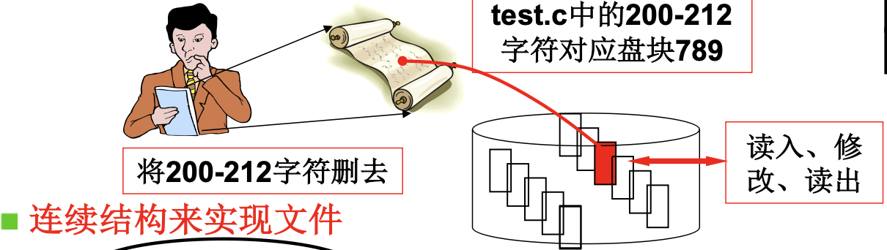
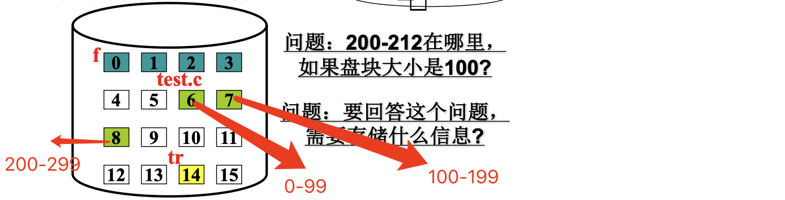
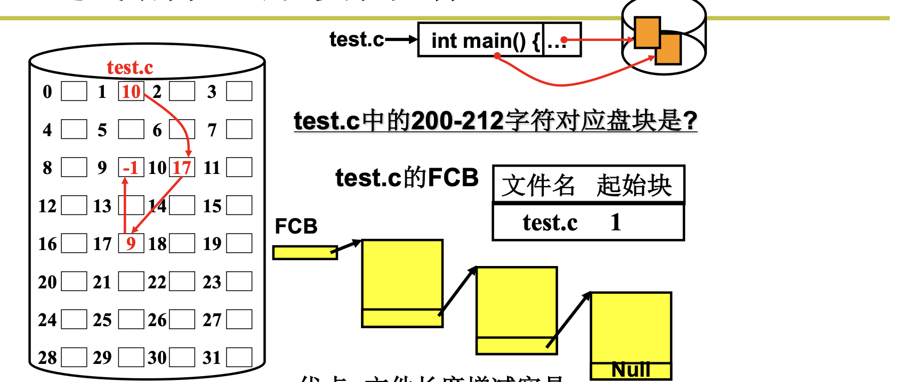
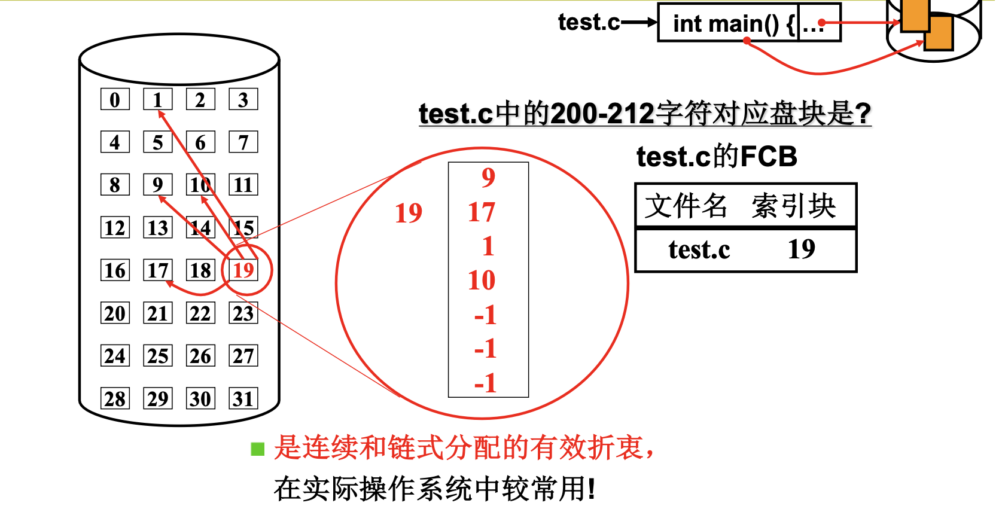
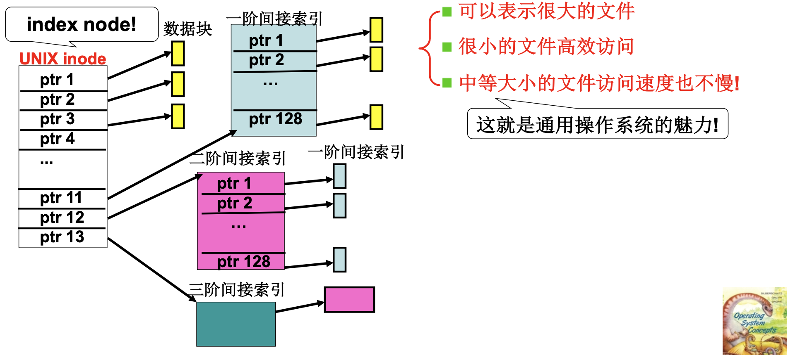

# 📘 L29 从生磁盘到文件 (From Raw Disk to File)

> 来源说明：哈工大操作系统（李治军）| 本节涵盖：文件作为磁盘使用的第三层抽象，字符流到盘块集合的映射，三种文件实现结构及多级索引

---

## 🧠 核心概念总览（严格按原文顺序）

> 🔗 **返回知识库主页**：[操作系统笔记主页](./README.md)
- [*知识点1: 为什么引入文件——生磁盘的问题*](#id1)
- [*知识点2: 文件的本质——字符流到盘块集合的映射*](#id2)
- [*知识点3: 连续结构实现文件*](#id3)
- [*知识点4: 链式结构实现文件*](#id4)
- [*知识点5: 索引结构实现文件*](#id5)
- [*知识点6: 多级索引与inode*](#id6)
- [*知识点7: 文件存储结构的选择*](#id7)

---

## ✅ 知识点1: 为什么引入文件——生磁盘的问题

**为什么要用文件的方式去抽象盘块? 这是对磁盘的第3层抽象...**
- <b>生磁盘(`raw disk`)</b>的访问方式要求用户直接操作盘块号（扇区号）—— **这对普通用户极不友好**!
  - 许多用户连<b>扇区(`sector`)</b>是什么都不知道，更不可能根据盘块号来访问磁盘
- 需要在盘块之上引入更高层次的抽象概念方便用户使用 —— **文件(`file`)**
- 文件是操作系统对磁盘使用的**第三层抽象**：
  - 第一层：生磁盘 → 通过盘块号直接读写
  - 第二层：磁盘驱动 → 使用`CHS`或`LBA`寻址
  - 第三层：**文件系统** → 用户通过文件名访问，无需关心物理位置

> ⚠️ **关键区分**：生磁盘(raw disk) vs 熟磁盘(cooked disk)——文件系统让磁盘变得"对用户友好"

---

## ✅ 知识点2: 文件的本质——字符流到盘块集合的映射

**理论**
- **用户眼里的文件**：一个**字符序列(`character stream`)**，即字符流
  
- **磁盘上的文件**：一个**盘块集合(`block collection`)**
  
- **文件的核心作用**：建立**字符流到盘块集合的映射关系**
- 用户操作的是字符位置（如第200-212个字符），文件系统负责将其映射到对应的物理盘块

---

## ✅ 知识点3: 连续结构实现文件

**我们来看例子加深对映射的理解...**
- **修改文件流程示例**：
  1. 发出要删除 `test.c` 的 200 - 212 字符的请求 → 实际上就是对对应盘块7,8,9进行修改
  2. 操作系统解释请求 → 通过**映射表**查找修改字符对应的盘块位置
  3. 发出磁盘读写请求 → 放到请求队列上 → 实现这个请求
  

- 所以系统肯定需要一个映射表结构！那具体什么样子呢？
- **连续结构(`contiguous allocation`)**：文件在磁盘上占用连续的盘块
- **映射表**：通过**文件名**找到**起始块号**和**块数**，即可计算任意字符对应的盘块位置
  - 映射表里就需要存放 这个文件的 FCB，用于保存**文件名，起始块，块数**信息：
    
  - **文件控制块(`FCB, File Control Block`)**：存储文件名、起始块、块数等元数据
- **查询示例**：
  
  - 文件`test.c`：起始块=6，块数=3
  - 占用盘块：6, 7, 8
  - 若盘块大小为100字节，则第200-212字符对应：
    - 第200字节 → 盘块 $6 + \lfloor 200/100 \rfloor = 8$ 
- **优点**：访问速度快（直接计算）
- **缺点**：**增删文件长度增减困难**
  - 因为，文件字符增加后可能写到下一个块，然而下一个块可能是另外一个文件了，那么后面所有的文件都要一次挪动，可能涉及大量数据移动

---

## ✅ 知识点4: 链式结构实现文件

**有没有别的结构实现映射表来解决这个问题？**
- **链式结构(`linked allocation`)**：文件盘块通过指针链接，每个盘块存储下一个盘块的地址
- **映射方式**：`FCB`只存储文件名和**起始块号**，通过依次跟随指针找到后续盘块
- **查询示例**：
  
  - 文件`test.c`：起始块=1
  - 读取盘块1，指针指向盘块10 → 读取盘块10，指针指向盘块17 → 读取盘块17，找到目标字符
- **优点**：文件长度增减容易（只需修改指针）
- **缺点**：
  - **顺序访问慢**（必须依次读取，无法随机访问）
  - **可靠性差**（一个指针损坏，后续数据全部丢失）

> ⚠️ **关键区分**：链式结构牺牲随机访问能力，换取动态扩展的灵活性

---

## ✅ 知识点5: 索引结构实现文件

**如此，如何解决问题？**
- **索引结构(`indexed allocation`)**：连续和链式分配的有效折衷，实际操作系统中较常用
- **映射方式**：
  - `FCB`存储**文件名**和**索引块号**
  - 索引块中存储文件所有盘块号的列表 
- **查询示例**：
  
  - 文件`test.c`：索引块=19
  - 读索引块19的内容：`[9, 17, 1, 10, -1, -1, -1, ...]` 
    - 文件占用盘块：9, 17, 1, 10（-1表示空闲/结束）
- **访问第200-212字符**（假设块大小100）：
  - 先读取索引块19，找到盘块列表
  - 第200字节 → 盘块 $\lfloor 200/100 \rfloor = 2$ 号列表项 → 盘块1

> ⚠️ **关键区分**：索引结构需要一次额外的磁盘读取（读索引块），但支持随机访问且扩展灵活

---

## ✅ 知识点6: 多级索引与inode

**实际系统是多级索引...**
- **UNIX `inode`(`index node`)**：实际系统采用的多级索引结构
- **inode结构** = **FCB 的索引块**（ptr集合） + 文件元数据（权限、大小、时间、引用计数）
  
  - 直接指针：直接指向数据块
  - 一阶间接指针：指向一个索引块，该块含128个数据块指针
  - 二阶间接指针：指向一个索引块，该块含128个一阶间接索引块指针
  - 三阶间接指针：指向一个索引块，该块含128个二阶间接索引块指针
- **最大文件大小计算**（假设块大小=1KB，指针大小=4B）：
  - 直接指针：$12 \times 1KB = 12KB$
  - 一阶间接：$128 \times 1KB = 128KB$
  - 二阶间接：$128 \times 128 \times 1KB = 16MB$
  - 三阶间接：$128 \times 128 \times 128 \times 1KB = 2GB$
  - 总计：约 **2GB+**
- **设计优势**：
  - **很小的文件高效访问**：12个直接指针覆盖大多数小文件
  - **中等大小的文件访问速度也不慢**：只需一次间接索引
  - **很大的文件也能表示**：多级索引支持极大文件

> ⚠️ **关键区分**：直接指针 vs 间接指针——小文件直接用直接指针，大文件才用间接指针，避免小文件访问额外开销

---

## ✅ 知识点7: 文件存储结构的选择

**没有最好的，只有最合适的...**
- **不同场景选择不同的文件结构**：
  - **连续结构**：适合**只读不写的静态文件**（如词典、光盘文件系统），访问最快
  - **链式结构**：适合**频繁增删的日志型文件**，但现代系统很少直接使用
  - **索引结构**：**通用操作系统的首选**，兼顾随机访问和动态扩展
- **思考题**：专门为像词霸这样的词典设计文件存储，采用哪种结构最好？
  - **答案：A. 顺序（连续结构）**
  - 原因：词典文件通常是**只读**的，大小固定，需要最快的随机访问速度

---

## 🔑 核心要点总结

1. **文件是磁盘的第三层抽象**：让用户通过文件名操作字符流，隐藏物理盘块细节
2. **三种实现结构**：连续（快但难扩展）、链式（易扩展但慢）、索引（折衷方案）
3. **inode多级索引**：小文件直接访问，大文件间接索引，兼顾效率与容量
4. **通用操作系统选索引结构**：UNIX/Linux的inode是经典设计，体现操作系统设计的魅力

---

