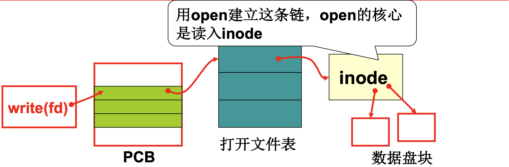
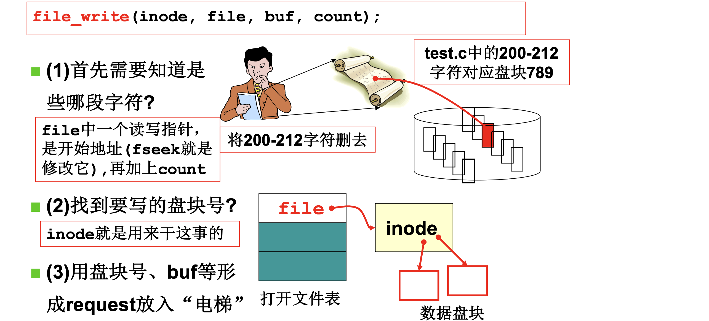

# 📘 4.5 文件使用磁盘的实现 (Files Implementation)

> 来源说明：哈工大操作系统课程 L30 | 本节涵盖：通过文件系统抽象统一磁盘与设备的访问，实现 file_write、_bmap、proc 文件系统

---

## 🧠 核心概念总览（严格按原文顺序）

> 🔗 **返回知识库主页**：[操作系统笔记主页](./README.md)
- [*知识点1: 通过文件使用磁盘*](#id1)
- [*知识点2: `file_write` 的工作过程*](#id2)
- [*知识点3: `file_write` 实现代码分析*](#id3)
- [*知识点4: `create_block` / `_bmap` — 文件抽象的核心*](#id4)
- [*知识点5: `m_inode` 与设备文件*](#id5)
- [*知识点6: 伟大的文件视图 — 统一两条路*](#id6)
- [*知识点7: `proc` 文件系统实现*](#id7)
- [*知识点8: 让 `inode` 选择数据通路*](#id8)

---

<a id="id1"></a>
## ✅ 知识点1: 通过文件使用磁盘

**通过一个例子走进故事...**
- 操作系统通过文件这一抽象，让用户再次使用磁盘
- 核心调用链：`write(fd)` → `sys_write()` → `file_write()` → 磁盘
  
- `sys_write` 在 `fs/read_write.c` 中实现：
  ```c
  int sys_write(int fd, const char* buf, int count) {
      struct file *file = current->filp[fd];
      struct m_inode *inode = file->inode;
      if(S_ISREG(inode->i_mode))
          return file_write(inode, file, buf, count);
  }
  ```
- **主要任务**：
  - 用户进程调用 `write` 时，内核通过 `fd` 查进程文件表拿到 `inode`，若是普通文件则转交 `file_write` 处理
- **核心机制**：`open` 建立 "PCB → 打开文件表 → inode → 数据盘块" 这条链
  - `open` 的核心作用是**读入 inode**，并通过 inode 找到对应盘块去读写
- 可以看出全过程不涉及盘块的处理而是对字符流的处理


> 💡 **理解技巧**：把文件当成一扇门——`open` 把门打开并记住门牌号（inode），`write` 通过门牌号找到背后的数据


---

<a id="id2"></a>
## ✅ 知识点2: `file_write` 的工作过程

**理论**
- `file_write(inode, file, buf, count)` 的任务是：将 `buf` 中的 `count` 个字符写入文件
- 以实例说明：将 `test.c` 中的 200-212 字符删去，对应盘块 789
  
- **工作过程分为三步**：
  1. **确定字符区间**：`file` 中有读写指针 `f_pos`（`fseek` 就是修改它）表示**开始地址**，加上 `count` 就知道要写入的字符段是 200-212
  2. **找到盘块号**：`inode` 就是用来干这事的，通过 `i_zone` 数组映射文件偏移到磁盘块号
  3. **形成请求放入"电梯"**：用盘块号、buf 等形成 `request`，放入磁盘请求队列（电梯算法调度）

> ⚠️ **关键区分**：`f_pos` 是文件内偏移，不是磁盘块号；需要通过 inode 的映射机制转换
> 💡 **理解技巧**：把文件想象成线性字符流，但实际存储在离散的磁盘块中——inode 是"流→块"的映射表


---

<a id="id3"></a>
## ✅ 知识点3: `file_write` 实现代码分析

**首先来看看如何得到 200 - 212这个区间的...**
- `file_write` 的核心逻辑：一块一块拷贝用户字符，修改 pos，放入电梯队列
- 代码核心逻辑：
  ```c
  int file_write(struct m_inode *inode, struct file *filp, char *buf, int count) {
      off_t pos;
      if(filp->f_flags & O_APPEND)
          pos = inode->i_size;      // 追加模式：从文件末尾写
      else
          pos = filp->f_pos;         // 普通模式：从当前位置写
      
      while(i < count){
          block = create_block(inode, pos/BLOCK_SIZE);  // 算出对应盘块
          bh = bread(inode->i_dev, block);               // 读入缓冲区
          int c = pos % BLOCK_SIZE;                      // 块内偏移
          char *p = c + bh->b_data;
          bh->b_dirt = 1;                                // 标记脏（需要写回）
          c = BLOCK_SIZE - c;
          pos += c;
          while(c-- > 0)
              *(p++) = get_fs_byte(buf++);              // 逐字节拷贝
          brelse(bh);                                    // 释放缓冲区
      }
      filp->f_pos = pos;  // 修改 pos，使之总是对
  }
  ```
- **主要任务**：
  1. **定位写入位置**：根据 `O_APPEND` 标志从文件末尾 `pos` 写，否则从当前文件偏移 `f_pos`指针 写
  2. **找到要读写的块**：第200字节 → 盘块 $6 + \lfloor 200/100 \rfloor = 8$ 
  3. **逐盘块处理**：读入对应盘块到内核缓冲区 `bh`，放在电梯请求队列中，标记为脏（`b_dirt = 1`），并随时更新文件大小 `pos`
  4. **拷贝数据**：`get_fs_byte(buf++)` 从用户态 `buf` 逐字节取数据，写入内核态 `bh->b_data`（即 p 指向的位置），完成跨特权级的数据拷贝，并b释放的是你对缓冲区的占用权
  5. **更新偏移**：写完后更新 `filp->f_pos`，记录新的文件读写位置


>⚠️ **关键警告**：`bh->b_dirt = 1` 不是立即写盘！内核后台有个"保洁阿姨"（bdflush 或同步机制），会定期扫描所有脏缓冲区，把它们写回磁盘
>💡 **理解技巧**：`create_block` 的命名暗示——如果写入位置超出了当前文件大小，需要**创建新块**


---

<a id="id4"></a>
## ✅ 知识点4: `create_block` / `_bmap` — 文件抽象的核心

**看看文件抽象的核心是如何完成的...**
- `create_block` 的核心是调用 `_bmap`：根据 inode 和逻辑块号，找到/创建对应的物理盘块号
- 代码逻辑：
  ```c
  int _bmap(m_inode *inode, int block, int create) {
      if(block < 7) {                    // 直接块：0-6
          if(create && !inode->i_zone[block]) {
              inode->i_zone[block] = new_block(inode->i_dev);//直接块中ptr直接对应一个数据块
              inode->i_ctime = CURRENT_TIME;
              inode->i_dirt = 1;           // inode 变脏，需写回
          }
          return inode->i_zone[block];
      }
      block -= 7;
      if(block < 512) {                   // 一重间接块：7
          bh = bread(inode->i_dev, inode->i_zone[7]);
          return (bh->b_data)[block];     // 盘块号占 2 字节
      }
      // ... 二重间接块：8
  }
  ```
- **主要任务**：
  1. 按逻辑块号范围分级查找（直接块 0-6 → 一重间接块 7 → 二重间接块 8），返回对应的物理盘块号。
      - 若不是 0-7 盘块：

        1. **`block -= 7`**：跳过 inode 里前 7 个直接块（`i_zone[0]`~`i_zone[6]`），得到在间接索引范围内的**相对偏移**。

        2. **`if(block < 512)`**：一个磁盘块 1KB，每个盘块号占 2 字节，所以一个间接块最多存 **512 个盘块号**。这行判断"你要的逻辑块是否落在单间接块能覆盖的范围内"。

        3. **`bread(inode->i_dev, inode->i_zone[7])`**：`i_zone[7]` 不指向数据，而是指向一个**专门的间接索引块**（里面密密麻麻存了 512 个盘块号）。`bread` 把这个索引块读进内核缓冲区 `bh`，然后再进行通过 `bread` 进行 block 修改与添加

  2. 若 `create` 为真且目标块尚未分配，则调用 `new_block` 动态分配新物理块，更新 inode 索引结构并标记为脏。`create=1` 时：没有映射就**创建映射**（分配新块）
- `d_inode` 结构：

  ```c
  struct d_inode {
      unsigned short i_mode;    // 文件类型和属性
      ...
      unsigned short i_zone[9]; // (0-6): 直接数据块，(7): 一重间接，(8): 二重间接
  };
  ```

 >⚠️ **关键计算**：一个盘块号占 2 字节，`512` 字节的一重间接块可存 `256` 个盘块号（但代码中写的是 `512`，对应 `1KB` 块大小）

---

<a id="id5"></a>
## ✅ 知识点5: `m_inode` 与设备文件

**`inode`在普通文件和特殊文件的多态**

- 对于普通文件来说 inode 存放着**文件读写的字符流位置 → 盘块的映射**表，但是对于特殊文件，就不会存放映射表，而是设备信息
- `m_inode`（内存 inode）结构：
  ```c
  struct m_inode {
      unsigned short i_mode;      // 文件的类型和属性
      ...
      unsigned short i_zone[9];   // 指向文件内容数据块
      struct task_struct *i_wait; // 等待该 inode 的进程队列
      unsigned short i_count;     // 引用计数
      unsigned char i_lock;       // 锁标志
      unsigned char i_dirt;       // 脏标志
      ...
  };
  ```
- 在 Linux 0.11 里有 `m_inode` 和 `d_inode` 

  - **`struct m_inode`**：
    - **内存中的 inode 结构**，除了包含磁盘上的文件元数据（大小、权限、块指针等），还额外加了内存管理字段——引用计数 `i_count`、锁 `i_lock`、脏标志 `i_dirt`、等待队列 `i_wait` 等。
    - 进程打开文件时，内核把磁盘 inode 读进内存，包装成 `m_inode` 使用。

  - **`struct d_inode`**：
    - **磁盘上存储的原始 inode 结构**，只存纯文件元数据（模式、大小、时间、直接/间接块指针），没有引用计数、锁等运行时字段。

- 代码里写的 **`inode`**：通常是 **`struct m_inode *inode`** 这种变量名，指的就是内存里的 `m_inode` 对象。

> ⚠️ **注意**：`m_inode` 是磁盘 inode 被读入内存后的**加强版**，加了运行时管理字段；`inode` 作为变量名时，一般就是指向 `m_inode` 的指针。


- **设备文件处理**：`sys_open` 中遇到字符设备：
  ```c
  int sys_open(const char* filename, int flag) {
      if(S_ISCHR(inode->i_mode)) {   // 字符设备
          if(MAJOR(inode->i_zone[0]) == 4)
              current->tty = MINOR(inode->i_zone[0]);
      }
  }
  #define MAJOR(a) (((unsigned)(a)) >> 8)   // 取高字节
  #define MINOR(a) ((a) & 0xff)              // 取低字节
  ```
- **主要任务**：打开字符设备时，若主设备号为 4（tty 终端），则将当前进程的 `tty` 字段绑定到该设备的次设备号。

- **普通文件 VS 设备文件 的区别**：
  - 设备文件：`i_zone[0]` 它本身不存数据，没有文件内容块；i_zone[0] 被复用来存设备号
  - 普通文件：`i_zone[0]` 存映射关系，存的是数据块指针（直接块、间接块），需要通过 `_bmap` 把逻辑块号映射到物理盘块。


---

<a id="id6"></a>
## ✅ 知识点6: 伟大的文件视图 — 统一两条路

**到现在，我们就有了整个文件视图...**
- 文件系统的伟大之处：将完全不同的底层操作，统一为相同的 `read/write` 接口
- **第一条路：读写磁盘**
  - `write(fd)` → `sys_write` → `file_write` → `inode` → 磁盘控制器 → 盘块
  - 请求队列 + 电梯算法调度
- **第二条路：输出到显示器**
  - `S_ISCHR(inode->i_mode)` → `crw_table[MAJOR(dev)]` → `tty_write(minor, buf)` → `con_write` → `mov ax, pos`
- 统一的视图：
  ```
  PCB → 打开文件表 → inode → ?
                              │
                              ├─ 普通文件 → 磁盘块
                              └─ 字符设备 → 驱动程序 → 显示器
  ```
- 用户无需关心背后是什么设备，统一用 `read/write` 操作

**注意点**
- ⚠️ **核心洞见**：文件视图是操作系统最重要的抽象之一——一切皆文件！
- 💡 **理解技巧**：把文件系统当成"转接器"——用户只看文件接口，底层可以是磁盘、键盘、显示器、甚至内存数据
- 🔄 **知识关联**：L4 操作系统接口 → L6 文件系统历史 → 本节一切皆文件的设计哲学
- 📋 **术语提醒**：`crw_table`（字符读写函数表）`character read-write table`，`tty_write`（终端写）`teletype write`

---

<a id="id7"></a>
## ✅ 知识点7: proc 文件系统实现

**理论**
- **proc 文件**：特殊文件，信息不在磁盘上，而是实时从内核数据结构（`task_struct`）中读取
- 示例：`/proc/psinfo` → 显示进程信息
  ```bash
  # cat /proc/psinfo
  pid state father counter start_time
  0   1     -1     0        0
  1   1     0      28       1
  ```
- `cat` 命令对应的程序：
  ```c
  main(char *argv[]) {
      fd = open(argv[1]);
      while(文件没有结束) {
          read(fd, buf, 100);
          printf(buf);
      }
  }
  ```
- **proc 读的实现**：
  ```c
  int sys_read(unsigned int fd, char* buf, int count) {
      ...
      if(S_ISPROC(inode->i_mode))
          proc_read(file, buf, count);
  }
  
  int proc_read(file, char* buf, int count) {
      task_struct *p;
      sprintf(krnbuf, "%d,%d", p[0]->pid...);
      // 按照 file->f_pos 和 count 将 krnbuf 拷贝到 buf 中
      // 修改 file->f_pos
      // 实际读出的数量 < 要读的 count，就认为文件结束了
  }
  ```

**注意点**
- ⚠️ **关键机制**：`proc_read` 从 `task_struct` 中实时取数据，而非磁盘——**伪文件系统**！
- ⚠️ **关键区分**：`proc` 文件没有磁盘块，`i_zone` 不指向任何盘块；`f_pos` 控制读取进度，读完即结束
- 💡 **理解技巧**：`proc` 是内核的"窗口"——用户通过读文件的方式查看内核内部状态，但数据是动态生成的
- 🔄 **知识关联**：L7 进程图像 → L9 多进程 → 本节通过 proc 查看进程信息
- 📋 **术语提醒**：`proc`（进程文件系统）`process filesystem`，`psinfo`（进程信息）`process info`

---

<a id="id8"></a>
## ✅ 知识点8: 让 inode 选择数据通路

**理论**
- 通过 `i_mode` 的类型判断，让 inode 决定数据从哪条路走：
  - `S_ISREG` → 普通文件 → 磁盘读写
  - `S_ISCHR` → 字符设备 → 驱动程序
  - `S_ISPROC` → proc 文件 → 内核数据结构
- 文件创建：
  ```c
  void init() {
      setup((void*) &drive_info);
      mkdir("/proc", 0755);
      mknod("/proc/psinfo", S_IFPROC | 0444);
  }
  ```
- 宏定义：
  ```c
  #define S_IFCHR  0020000   // 字符设备
  #define S_IFPROC 0040000   // proc 文件
  #define S_ISCHR(m)  (((m) & S_IFMT) == S_IFCHR)
  #define S_ISPROC(m) (((m) & S_IFMT) == S_IFPROC)
  ```
- `S_IFMT` 是类型掩码，提取文件类型位

**注意点**
- ⚠️ **核心设计**：`mknod` 创建特殊文件时，用 `i_mode` 标记类型；`open/read/write` 时根据类型分发到不同处理函数
- ⚠️ **权限注意**：`0444` 表示只读权限——`proc` 文件通常只允许读取内核信息
- 💡 **理解技巧**：inode 是"多态对象"——同样的接口，不同的行为；类型字段就是虚函数表指针！
- 🔄 **知识关联**：L4 系统调用实现 → L5 系统调用接口 → 本节基于 inode 类型的系统调用分发
- 📋 **术语提醒**：`mknod`（创建特殊文件）`make node`，`S_IFMT`（文件类型掩码）`file type mask`

---

## 🔑 核心要点总结

1. **文件抽象的统一性**：`read/write` 接口背后可以是磁盘、设备、或内存数据，inode 的 `i_mode` 决定走哪条路
2. **`file_write` 的三步**：确定字符区间（`f_pos` + `count`）→ 找到盘块号（`inode.i_zone` → `_bmap`）→ 拷贝数据（缓冲区 + 电梯队列）
3. **inode 多级索引**：直接块（0-6）+ 一重间接（7）+ 二重间接（8），与多级页表同构
4. **设备文件与 proc 文件**：复用 inode 结构，用 `i_zone[0]` 存设备号或 `proc_read` 函数，实现"一切皆文件"
5. **缓冲区的延迟写**：`bh->b_dirt = 1` 标记脏页，异步写回磁盘——平衡了效率与持久性

---