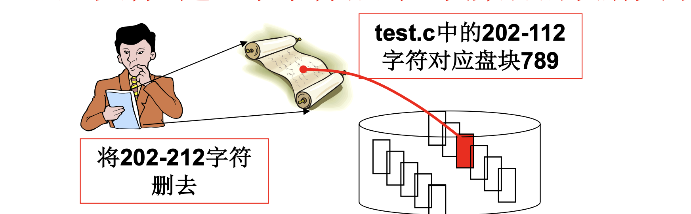
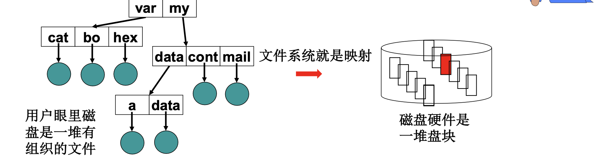

# 📘 L31 目录与文件系统 (File System)

> 来源说明：哈工大操作系统课程 L31 | 本节涵盖：文件与目录的抽象、文件系统的磁盘布局、目录解析机制、完整磁盘访问流程

---

## 🧠 核心概念总览（严格按原文顺序）

> 🔗 **返回知识库主页**：[操作系统笔记主页](./README.md)
- [*知识点1: 文件——抽象一个磁盘块集合*](#id1)
- [*知识点2: 文件系统——抽象整个磁盘（第四层抽象）*](#id2)
- [*知识点3: 从多个文件到集合划分*](#id3)
- [*知识点4: 引入目录树*](#id4)
- [*知识点5: 实现目录的关键问题*](#id5)
- [*知识点6: 树状目录的完整实现*](#id6)
- [*知识点7: 自举信息与磁盘布局*](#id7)
- [*知识点8: 完整映射下的磁盘使用流程*](#id8)

---

<a id="id1"></a>
## ✅ 知识点1: 文件——抽象一个磁盘块集合

**对磁盘的最后一层抽象 -- 目录树**
- 文件是对磁盘块集合的抽象
- **用户眼里文件的样子**：字符序列（字符流）
- **磁盘上文件的样子**：扇区集合（离散的磁盘块）
- **磁盘文件的本质**：建立了**字符流到盘块集合的映射关系**
  
- 实例：将 test.c 中的 202-212 字符删去，对应盘块 789
  - 用户操作：字符流层面的"删去 202-212 字符"
  - 底层操作：找到这些字符对应的磁盘块（789），修改该盘块内容

> ⚠️ **关键区分**：用户看到的是连续字符流，实际存储是离散磁盘块——文件系统负责这层映射
> 💡 **理解技巧**：文件 = "名字 + 映射表"，名字给用户用，映射表给系统用


---

<a id="id2"></a>
## ✅ 知识点2: 文件系统——抽象整个磁盘（第四层抽象）

**然而一个电脑不止一个文件...**
- 文件系统是**第四层抽象**：
  - 第一层：从 block 到 CHS
  - 第二层：多进程请求队列处理磁盘调度
  - 第三层：文件视图统一字符流到盘块映射
  - **第四层：文件系统管理整个磁盘的组织结构**
- **用户眼里磁盘**：一堆有组织的文件（目录树）
- **磁盘硬件实际**：一堆盘块
- **文件系统就是映射**：将用户的"文件树视图"映射到物理盘块
  
- **将这个抽象布局实现到磁盘布局**：
  
- **关键洞察**：在另一台计算机上，<b>应用结构（映射结构） + 存储的数据（磁盘数据结构）</b>可以得到那棵文件树，找到文件、读写文件——这才是系统，这就是文件系统
  - 应用映射结构正是这节课的核心


---

<a id="id3"></a>
## ✅ 知识点3: 从多个文件到集合划分

**理论**
- 所有文件放在一层（一个大集合）的问题：
  - 文件数量多时查找效率低
  - 命名冲突（不同用户可能创建同名文件）
  - 权限管理困难
- **解决方案：集合划分、分治**
  - 用户 1 的文件、用户 2 的文件、用户 3 的文件分开存放
  - 将一个大集合划分成多个子集合

**注意点**
- ⚠️ **核心问题**：无划分的单层结构扩展性差，文件数增长导致查找复杂度线性上升
- 💡 **理解技巧**：就像把所有人放在一个大房间（混乱）vs 按部门分办公室（有序）
- 🔄 **知识关联**：本节是目录树的动机 → 下一节目录树的具体实现
- 📋 **术语提醒**：`分治`（divide and conquer）算法设计的基本思想

---

<a id="id4"></a>
## ✅ 知识点4: 引入目录树

**理论**
- **目录树的构建**：将划分后的集合再进行划分
- k 次划分后，每个集合中的文件数为 **O(logₖN)**，查找效率大幅提升
- 树状结构的特点：
  - **扩展性好**：新增文件只需在对应分支添加
  - **表示清晰**：层次化的命名空间
- **引入了一个新的东西：目录**
  - 目录表示一个**文件集合**
  - 目录本身也是文件，但内容是"目录项"而非普通数据
- 示例目录树：
  ```
  /
  ├── cat
  ├── bo
  ├── hex
  ├── a
  ├── data
  ├── mail
  ├── var
  └── my
      └── data
          └── cont
  ```

**注意点**
- ⚠️ **关键区分**：目录是"集合的容器"，普通文件是"数据的容器"——两者都是文件，但内容含义不同
- 💡 **理解技巧**：目录 = "文件夹"，存的不是数据，而是"里面有什么"的列表
- 🔄 **知识关联**：本节目录树概念 → 下节目录的实现机制
- 📋 **术语提醒**：`目录`（directory）`文件夹`，`路径`（path）定位文件位置的字符串

---

<a id="id5"></a>
## ✅ 知识点5: 实现目录的关键问题

**理论**
- 三个核心问题：
  1. **目录怎么用？**
     - 用 `"/my/data/a"` 定位文件 a
     - 根据路径，得到文件的 FCB
  2. **目录中应该存什么？**
     - 存放目录下的所有文件的 FCB 吗？
     - 如果存完整 FCB，解析路径时需要读取大量数据
  3. **有什么办法让系统效率更高？**
     - 目录中存"文件名 + FCB 地址"而非完整 FCB
- 以解析 `/my/data/a` 为例：
  - 从根目录 `/` 开始，找到 `my`
  - 进入 `my` 目录，找到 `data`
  - 进入 `data` 目录，找到 `a`
  - 最终得到文件 `a` 的 FCB

**注意点**
- ⚠️ **关键设计**：目录中存**目录项**（文件名 + FCB 指针），而非完整 FCB——减少目录读取的数据量
- ⚠️ **效率考虑**：FCB 通常较大（包含 i_zone 等），如果目录存完整 FCB，每个目录块能存的文件数很少，路径解析需要更多磁盘读取
- 💡 **理解技巧**：目录就像"电话簿"——只存名字和指向详细信息的指针，不存完整信息
- 🔄 **知识关联**：本节目录设计问题 → 下节目录项结构 → 完整磁盘布局
- 📋 **术语提醒**：`目录项`（directory entry）文件名到 FCB 的映射记录

---

<a id="id6"></a>
## ✅ 知识点6: 树状目录的完整实现

**理论**
- 目录的本质：特殊文件，内容是**目录项数组**
- 目录项格式：**`⟨文件名, FCB 地址⟩`**
  - 文件名：如 `my`、`data`、`a`
  - FCB 地址：对应文件 FCB 在 inode 数组中的位置
- 示例：
  ```
  "/" 的 FCB → "/" 的数据块
  ┌─────────┬─────────┐
  │  var    │   13    │  ← 目录项：文件名 var，FCB 地址 13
  │  my     │   82    │  ← 目录项：文件名 my，FCB 地址 82
  └─────────┴─────────┘
  
  "my" 的 FCB → "my" 的数据块
  ┌─────────┬─────────┐
  │  data   │  103    │
  │  cont   │  225    │
  │  mail   │   77    │
  └─────────┴─────────┘
  ```
- 目录解析过程：
  1. 读取 `/` 的 FCB，找到其数据块
  2. 在 `/` 的目录项中查找 `my`，得到 FCB 地址 82
  3. 读取 `my` 的 FCB，找到其数据块
  4. 在 `my` 的目录项中查找 `data`，得到 FCB 地址
  5. 继续直到找到最终文件

**注意点**
- ⚠️ **关键机制**：目录也是文件，有 FCB 和数据块；FCB 的 `i_zone` 指向目录项数组所在的盘块
- ⚠️ **递归结构**：目录项指向的 FCB 可以是普通文件，也可以是另一个目录——形成树
- 💡 **理解技巧**：目录解析就像"逐级问路"——先到前台问部门在哪，再到部门问办公室在哪
- 🔄 **知识关联**：L30 _bmap 映射 → 本节目录项映射 → 完整路径解析
- 📋 **术语提醒**：`FCB 数组`（inode 数组）所有 FCB 的集中存储区

---

<a id="id7"></a>
## ✅ 知识点7: 自举信息与磁盘布局

**理论**
- 为使系统能**自举**（启动），磁盘需要存储元信息：
  ```
  | 引导块 | 超级块 | i节点位图 | 盘块位图 | i节点数组 | 数据区 |
  ```
- **引导块**（Boot Block）：
  - 存储操作系统启动代码
  - 计算机启动时 BIOS 读取引导块，加载操作系统
- **超级块**（Super Block）：
  - 记录文件系统整体信息
  - 如：两个位图的大小、i节点数量、数据区起始位置等
- **i节点位图**（inode Bitmap）：
  - 哪些 inode 空闲，哪些被占用
  - 位向量：`0011110011101...`
- **盘块位图**（Block Bitmap）：
  - 哪些盘块是空闲的
  - 硬盘大小不同，位图大小也不同
- **i节点数组**（inode Array）：
  - 所有 FCB 的集中存储
  - 每个文件/目录对应一个 inode
- **数据区**（Data Area）：
  - 普通文件的数据块
  - 目录的目录项数组
- 位向量示例：`0011110011101` 表示磁盘块 2、3、4、5、8、9、10、12 空闲

**注意点**
- ⚠️ **关键设计**：位图使用位向量（bit vector），每个位对应一个 inode/盘块，极大节省空间
- ⚠️ **超级块作用**：文件系统的"元数据索引"，挂载时必须首先读取
- 💡 **理解技巧**：磁盘布局就像图书馆——引导块是入口指示牌，超级块是总目录，位图是座位表，inode 是书架编号，数据区是书
- 🔄 **知识关联**：L28 磁盘物理结构 → 本节逻辑布局 → 文件系统管理
- 📋 **术语提醒**：`位向量`（bit vector）用位表示状态的紧凑数据结构，`自举`（bootstrap）系统启动过程

---

<a id="id8"></a>
## ✅ 知识点8: 完整映射下的磁盘使用流程

**理论**
- 以 `read test.c 202-212 字节` 为例，完整流程：
  ```
  用户调用 read(fd)
       ↓
  open("/xx/test.c")          // 1. 目录解析
       ↓
  找到 / 的 FCB → 读 / 的数据块 → 找到 xx 的目录项
       ↓
  找到 xx 的 FCB → 读 xx 的数据块 → 找到 test.c 的目录项
       ↓
  找到 test.c 的 FCB → 得到 inode
       ↓
  根据 FCB 和 file 中的 f_pos(202) + count(10) → 找到盘块 789
       ↓
  add_request(789)            // 2. 加入电梯队列
       ↓
  从队列中取出 789 → 算出 cyl, head, sector
       ↓
  outp(cyl, head, sector)     // 3. 写磁盘控制器
       ↓
  磁盘中断 → 读取完成
  ```
- 涉及的磁盘数据结构：
  - **inode 数组**：找到 FCB
  - **数据盘块**：读取目录项、文件数据

**注意点**
- ⚠️ **关键路径**：目录解析 → 磁盘调度 → 磁盘读写，三层机制协同工作
- ⚠️ **性能瓶颈**：目录解析需要多次磁盘读取（每级目录至少一次），缓存可优化
- 💡 **理解技巧**：打开文件是最"重"的操作（需要解析路径），读写字节是"轻"操作（只需盘块映射）
- 🔄 **知识关联**：L28 磁盘驱动 → L29 文件抽象 → L30 file_write → L31 目录解析 → 完整流程打通
- 📋 **术语提醒**：`open()` 是"重操作"，`read()/write()` 是"轻操作"（相对）

---

## 🔑 核心要点总结

1. **文件的三层抽象**：字符流（用户视图）→ 磁盘块（物理视图）→ FCB 映射（系统视图）
2. **文件系统的四层抽象**：生磁盘 → 磁盘块 → 文件 → 文件系统（目录树）
3. **目录的核心设计**：目录项存 `⟨文件名, FCB 地址⟩`，而非完整 FCB——空间效率与解析效率的平衡
4. **磁盘六大区域**：引导块、超级块、inode 位图、盘块位图、inode 数组、数据区——各司其职
5. **完整读文件流程**：open 目录解析 → _bmap 块映射 → 电梯调度 → 磁盘读写


---