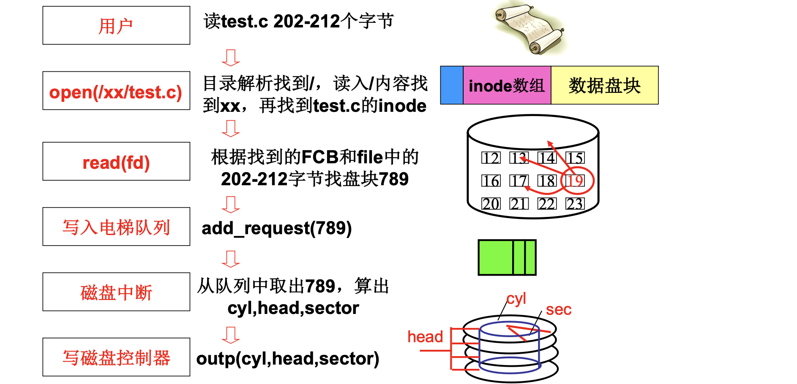
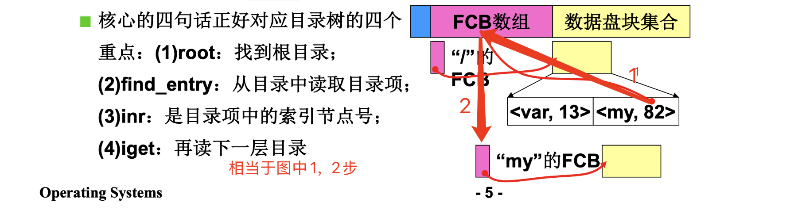
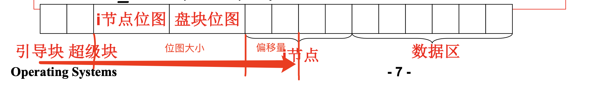

# 📘 4.7 目录解析代码实现 (Directory Resolution)

> 来源说明：哈工大操作系统课程 L32 | 本节涵盖：从 `open()` 到磁盘读取的完整目录解析代码链路，包括 `get_dir`、`find_entry`、`iget` 等核心函数实现

---

## 🧠 核心概念总览（严格按原文顺序）

- [*知识点1: 文件读写的完整调用链*](#id1)
- [*知识点2: `sys_open` 与目录解析入口*](#id2)
- [*知识点3: `get_dir` 核心目录解析逻辑*](#id3)
- [*知识点4: 根目录设置与 `mount_root`*](#id4)
- [*知识点5: `iget` 读取 inode 机制*](#id5)
- [*知识点6: 磁盘布局与 inode 块号计算*](#id6)
- [*知识点7: `find_entry` 目录项查找*](#id7)
- [*知识点8: 跨块目录遍历与 `bmap`*](#id8)
- [*知识点9: 目录解析完整调用链总结*](#id9)

---

<a id="id1"></a>
## ✅ 知识点1: 文件读写的完整调用链

**我们先复习一下整个流程...**
- 用户读取文件 `test.c` 第 202-212 字节的完整流程，串联了文件系统与磁盘管理的全部层次：
  1. **目录解析**找到文件的 `FCB(File Control Block)` 和文件内容
        - **`open(/xx/test.c)` 的目录解析过程** -- 本节课重点：
            - 从根目录 `/` 开始，读入 `/` 的内容找到 `xx`
            - 再从 `xx` 目录中找到 `test.c` 的 `inode`
  2. 根据 `FCB` 和文件逻辑位置（202-212 字节）**找到对应盘块**（如 789）
  3. 调用 `add_request(789)` 将请求**写入电梯队列**
  4. 从队列中取出 789，**计算物理地址**：`cyl(柱面)`, `head(磁头)`, `sector(扇区)`
  5. 调用 `outp(cyl, head, sector)` **写磁盘控制器**
  6. **磁盘中断**完成实际读取

    


---

<a id="id2"></a>
## ✅ 知识点2: `sys_open` 与目录解析入口

**那么既然如此我们看看，目录解析如何实现的 -- `open()`**
- 目录解析从 `open()` 系统调用开始，代码位于 `linux/fs/open.c`

- **代码**：
    ```c
    int sys_open(const char* filename, int flag)
    {
        i = open_namei(filename, flag, &inode);
        ...
    }

    int open_namei(...)
    {
        dir = dir_namei(pathname, &namelen, &basename);
        ...
    }

    static struct m_inode *dir_namei()
    {
        dir = get_dir(pathname);
    }
    ```
- **主要任务**：
    - `sys_open()` 的核心逻辑是调用 `open_namei()` 解析路径名，获取目标文件的 `inode`
    - `open_namei()` 进一步调用 `dir_namei()`，将路径名分解为**目录部分**和**基本文件名部分**
    - `dir_namei()` 最终调用 `get_dir()` 完成**真正的目录解析**
    - 调用链：`sys_open` → `open_namei` → `dir_namei` → `get_dir`

>⚠️ **关键区分**：`dir_namei` 是路径分解层，`get_dir` 才是真正"一层一层往下找"的目录解析引擎
>💡 **理解技巧**：`open_namei` 这个名字中的 `namei` = name to inode，即"把名字转换成 inode"


---

<a id="id3"></a>
## ✅ 知识点3: `get_dir` 核心目录解析逻辑

**先来看看如何完成真正的目录解析的...**
- `get_dir()` 是目录解析的**核心引擎**，代码体现了"从根目录出发，一层层递归往下找"的思想
- **代码**：
    ```c
    static struct m_inode *get_dir(const char *pathname)
    {
        if ((c = get_fs_byte(pathname)) == '/') {
            inode = current->root;  // 从根目录开始
            pathname++;
        } else if (c)
            inode = current->pwd;   // 从当前目录开始
        
        while (1) {
            if (!c) return inode;  // 路径解析完毕，正确出口
            
            bh = find_entry(&inode, thisname, namelen, &de);
            int inr = de->inode;        // 取目录项中的索引节点号
            int idev = inode->i_dev;    // 取当前设备号
            inode = iget(idev, inr);    // 读取下一层 inode
        }
    }
    ```
- **主要任务**：
  1. **找起点**：以 `/` 开头 → `current->root`（根目录）；否则 → `current->pwd`（当前目录）
        - 根文件系统是内核启动时挂载的，`init` 进程持有根目录 inode，后代进程通过 `fork` 继承 `current->root`，所以全都有根目录。
  2. **读目录项**：`find_entry(&inode, thisname, namelen, &de)` 从当前目录中找到匹配目录项
  3. **取 inode 号**：`inr = de->inode` 从目录项中获取索引节点号
  4. **读下一层**：`iget(idev, inr)` 根据设备号和 inode 号读取下一层目录的 inode
- 循环继续，直到路径名解析完毕（`c == 0`），返回最终目录的 inode



> ⚠️ **关键区分**：`get_dir` 返回的是**最后一层目录的 inode**，不是文件本身的 inode；`open_namei` 后续还会用 `basename` 查找文件名


---

<a id="id4"></a>
## ✅ 知识点4: 根目录设置与 `mount_root`

**看完核心，现在来看一下整个路径解析流程... 从根目录开始**
- `get_dir` 的起点来自 `current->root` 或 `current->pwd`，这是 `task_struct` 进程控制块中的字段

- **代码**：
    ```c
    void init(void)
    {
        setup((void *) &drive_info);
        ...
    }

    sys_setup(void * BIOS)  // 在 kernel/hd.c 中
    {
        hd_info[drive].head = *(2+BIOS);
        hd_info[drive].sect = *(14+BIOS);
        mount_root();  // 挂载根目录
        ...
    }

    void mount_root(void)  // 在 fs/super.c 中
    {
        mi = iget(ROOT_DEV, ROOT_INO);  // 读取根目录 inode
        current->root = mi;              // 设置为当前进程根目录
    }

    #define ROOT_INO 1  // 根目录 inode 号固定为 1
    ```
- **`current->root` 在 `init` 进程初始化时设置**：
  1. `init()` 调用 `setup()` 传递磁盘参数
  2. `sys_setup()` 读取磁盘参数后调用 `mount_root()`
  3. `mount_root()` 调用 `iget(ROOT_DEV, ROOT_INO)` 读取根目录 inode
  4. 将 `current->root = mi` 赋值，根目录挂载完成
- `ROOT_INO` 被定义为 1，即根目录的 inode 号是固定的 **1**
- 所有进程的 `root` 和 `pwd` 都是**拷贝自 `init` 进程**

>⚠️ **关键区分**：`mount_root` 在系统启动时只执行一次，不是每次 `open` 都执行；后续进程的 `root` 是拷贝得来的
>💡 **理解技巧**：`init` 进程是"第一个进程"，它的资源设置会被所有后续进程继承，所以根目录设置一次即可
>📋 **术语提醒**：`mount_root` = 挂载根目录；`ROOT_DEV` = 根目录所在设备号；`ROOT_INO` = 根目录 inode 号（固定为 1）

---

<a id="id5"></a>
## ✅ 知识点5: `iget` 读取 inode 机制

**看看是如何将根目录读进来的...**
- `iget(dev, nr)` 的作用是根据**设备号**和 **inode 号**读取 inode 内容到内存


- **代码**
    ```c
    struct m_inode *iget(int dev, int nr)
    {
        struct m_inode *inode = get_empty_inode();
        inode->i_dev = dev;
        inode->i_num = nr;
        read_inode(inode);
        return inode;
    }

    static void read_inode(struct m_inode *inode)
    {
        struct super_block *sb = get_super(inode->i_dev);
        lock_inode(inode);
        block = 2 + sb->s_imap_blocks + sb->s_zmap_blocks + 
                (inode->i_num - 1) / INODES_PER_BLOCK;
        bh = bread(inode->i_dev, block);
        inode = bh->data[(inode->i_num - 1) % INODES_PER_BLOCK];
        unlock_inode(inode);
    }
    ```
- **主要任务**：
  1. `get_empty_inode()`：从内存 inode 表中获取一个空闲 inode 结构
  2. 设置 `i_dev = dev`，`i_num = nr`：表示我要读的那个inode的编号
  3. 调用 `read_inode(inode)` 从磁盘读取实际 inode 数据
- **`read_inode()` 的核心是计算 inode 所在的磁盘块号**：
  - 磁盘布局：
    
  - 从 block=2（超级块后）开始，跳过 i节点位图和盘块位图占据的块，通过偏移量来定位到**目标i节点的盘块号**
  - 公式：`block = 2 + s_imap_blocks + s_zmap_blocks + (inode->i_num - 1) /INODES_PER_BLOCK`
    - `(inode->i_num - 1) / INODES_PER_BLOCK`：i节点的盘块偏移
    - `s_imap_blocks`：超级块中i节点位图占用的块数
    - `s_zmap_blocks`：盘块位图占用的块数
    - `INODES_PER_BLOCK`：每块容纳的 inode 数量
   - `bread()`：读出 盘块 的数据
   - `bh->data[(inode->i_num - 1) % INODES_PER_BLOCK]`：一个盘块有多个inode, 计算在本盘块的偏移，拿出目标inode数据

> ⚠️ **关键区分**：`iget` 先查内存 inode 缓存，命中则直接返回；未命中才从磁盘读取（代码中省略了缓存检查）


---

<a id="id6"></a>
## ✅ 知识点6: 磁盘布局与 inode 块号计算

**理论**
- Linux 0.11 文件系统的磁盘布局（从 block 0 开始）：

| 区域 | 块号 | 内容 |
|:---|:---|:---|
| 引导块 | 0 | 系统启动代码 |
| 超级块 | 1 | 文件系统元信息（块大小、inode 总数等） |
| i节点位图 | 2 ~ (2+s_imap_blocks-1) | 标记哪些 inode 被使用 |
| 盘块位图 | (2+s_imap_blocks) ~ (2+s_imap_blocks+s_zmap_blocks-1) | 标记哪些数据块被使用 |
| **i节点区** | 2 + s_imap_blocks + s_zmap_blocks ~ | 所有 inode 的存储区域 |
| 数据区 | i节点区之后 | 文件实际内容 |

- inode 块号计算公式解析：
  - `block = 2 + s_imap_blocks + s_zmap_blocks + (i_num - 1) / INODES_PER_BLOCK`
  - `2` = 跳过引导块(0)和超级块(1)
  - `s_imap_blocks + s_zmap_blocks` = 跳过两个位图区
  - `(i_num - 1) / INODES_PER_BLOCK` = 在 i节点区内的块偏移
  - 块内偏移：`(i_num - 1) % INODES_PER_BLOCK`

**教材示例/公式**
```
┌─────────┬─────────┬─────────┬─────────┬─────────┬─────────┐
│ 引导块  │ 超级块  │i节点位图│ 盘块位图│  i节点  │  数据区  │
└─────────┴─────────┴─────────┴─────────┴─────────┴─────────┘
  block=0  block=1   block=2  ...               2+imap+zmap  ...
```

**注意点**
- ⚠️ **关键区分**：`i_num` 从 1 开始计数（`ROOT_INO = 1`），所以计算时用 `(i_num - 1)` 来对齐 0-based 索引
- 💡 **理解技巧**：磁盘布局就像"一本书的目录结构"——引导块是封面，超级块是目录页，位图是索引卡片，inode 是章节摘要，数据区是正文
- 🔄 **知识关联**：L31 讲过目录与文件系统的概念，磁盘布局是文件系统"落地"到磁盘的物理结构
- 📋 **术语提醒**：`bread(dev, block)` = block read，从磁盘读取指定块到缓冲区；`buffer_head` = 缓冲块头，管理磁盘块在内存中的缓存

---

<a id="id7"></a>
## ✅ 知识点7: find_entry 目录项查找

**理论**
- `find_entry()` 的作用：在**一个目录文件**中，按名称查找匹配的目录项
- 目录项结构 `dir_entry`：
  - `inode`（unsigned short）：该目录项对应的 inode 号
  - `name[NAME_LEN]`（char[14]）：文件名，最大长度 14 字节
- `find_entry` 的算法：
  1. 计算目录项总数：`entries = dir->i_size / sizeof(struct dir_entry)`
  2. 读取目录的第一个数据块：`block = dir->i_zone[0]`
  3. 用 `bread` 读入块，遍历每个 `dir_entry`
  4. 调用 `match(namelen, name, de)` 匹配文件名
  5. 匹配成功则返回 `bh`（缓冲块头）和 `de`（目录项指针）

**教材示例/公式**
```c
struct dir_entry {
    unsigned short inode;      // i节点号
    char name[NAME_LEN];       // 文件名
};

#define NAME_LEN 14

static struct buffer_head *find_entry(
    struct m_inode **dir, 
    char *name, 
    ..., 
    struct dir_entry **res_dir)
{
    int entries = (*dir)->i_size / (sizeof(struct dir_entry));
    int block = (*dir)->i_zone[0];  // 目录的第一个数据块
    *bh = bread((*dir)->i_dev, block);
    struct dir_entry *de = bh->b_data;  // 目录项数组起始
    
    while (i < entries) {
        if (match(namelen, name, de)) {  // 匹配文件名
            *res_dir = de;  // 返回匹配到的目录项
            return bh;
        }
        de++;  // 下一个目录项
        i++;
    }
}
```

**注意点**
- ⚠️ **关键区分**：`find_entry` 只查找**一个目录块**内的目录项，如果目录跨多个块，需要外层循环处理（见知识点8）
- 💡 **理解技巧**：目录文件在磁盘上存储为一堆 `dir_entry` 的数组，就像一本电话簿，每页（块）有若干条记录
- 🔄 **知识关联**：L31 讲过目录的 FCB 数组和数据盘块集合，`find_entry` 就是在 FCB 对应的数据块中搜索
- 📋 **术语提醒**：`de` = directory entry（目录项）；`res_dir` = result directory entry（输出参数）；`bh` = buffer head（缓冲块头）

---

<a id="id8"></a>
## ✅ 知识点8: 跨块目录遍历与 bmap

**理论**
- 当目录文件较大、目录项跨越多个磁盘块时，`find_entry` 需要**跨块遍历**
- 外层循环：`while (i < entries)` 遍历所有目录项
- 跨块检测：`(char*)de >= BLOCK_SIZE + bh->b_data`，当当前块的目录项遍历完时：
  1. `brelse(bh)` 释放当前缓冲块
  2. `bmap(*dir, i / DIR_ENTRIES_PER_BLOCK)` 计算下一个逻辑块对应的物理块号
  3. `bread()` 读入新块
  4. `de = bh->b_data` 重置目录项指针到块首
- 然后继续 `match` 匹配，直到找到或遍历完所有目录项

**教材示例/公式**
```c
while (i < entries)  // entries 是目录项总数
{
    if ((char*)de >= BLOCK_SIZE + bh->b_data) {
        brelse(bh);
        block = bmap(*dir, i / DIR_ENTRIES_PER_BLOCK);  // 计算下一个块号
        bh = bread((*dir)->i_dev, block);  // 读入下一块
        de = (struct dir_entry*)bh->b_data;  // 从头开始
    }  // 读入下一块上的目录项继续 match
    
    if (match(namelen, name, de)) {
        *res_dir = de;
        return bh;
    }
    de++;  // 下一个目录项
    i++;
}

#define BLOCK_SIZE 1024  // 两个扇区（512×2）
```

**注意点**
- ⚠️ **关键区分**：`bmap` 负责"逻辑块号 → 物理块号"的转换，对于小文件直接查 `i_zone[0..9]`，大文件需查间接块（一级/二级间接索引）
- 💡 **理解技巧**：目录项遍历就像翻书——一页看完翻下一页，`bmap` 就是"翻页"时查页码
- 🔄 **知识关联**：L30 讲过文件使用磁盘的实现，`bmap` 的逻辑与文件块号映射完全一致；L22 多级页表的思想与此类似
- 📋 **术语提醒**：`brelse` = buffer release（释放缓冲块）；`bmap` = block map（块号映射）；`DIR_ENTRIES_PER_BLOCK` = 每块目录项数（1024/16 = 64）

---

<a id="id9"></a>
## ✅ 知识点9: 目录解析完整调用链总结

**理论**
- 从用户调用 `open()` 到最终读取 inode 的完整代码链路：

```
sys_open(filename, flag)
    └── open_namei(filename, flag, &inode)
            └── dir_namei(pathname, &namelen, &basename)
                    └── get_dir(pathname)
                            ├── 获取起点: current->root 或 current->pwd
                            └── while 循环:
                                    ├── find_entry(&inode, name, ..., &de)  // 找目录项
                                    ├── inr = de->inode                     // 取i节点号
                                    └── inode = iget(idev, inr)            // 读下一层inode
```

- **核心四步对应**：
  1. `root` → 找到根目录（或当前目录）
  2. `find_entry` → 从目录中读取目录项
  3. `inr` → 目录项中的索引节点号
  4. `iget` → 读取下一层目录的 inode
- 循环直到路径名解析完毕，返回最终目录的 inode

**关键宏定义速查**

| 宏 | 值 | 含义 |
|:---|:---|:---|
| `ROOT_INO` | 1 | 根目录 i节点号 |
| `NAME_LEN` | 14 | 文件名最大长度 |
| `BLOCK_SIZE` | 1024 | 块大小（两个扇区） |

**关键函数速查**

| 函数 | 作用 | 位置 |
|:---|:---|:---|
| `sys_open` | 打开文件入口 | `linux/fs/open.c` |
| `open_namei` | 路径名 → inode | `fs/namei.c` |
| `dir_namei` | 分解路径为目录+文件名 | `fs/namei.c` |
| `get_dir` | 核心目录解析引擎 | `fs/namei.c` |
| `find_entry` | 在目录中查找目录项 | `fs/namei.c` |
| `iget` | 读取 inode | `fs/inode.c` |
| `read_inode` | 从磁盘计算并读取 inode | `fs/inode.c` |
| `mount_root` | 挂载根目录 | `fs/super.c` |

**注意点**
- ⚠️ **关键区分**：`get_dir` 返回的是**目录**的 inode，不是文件；`open_namei` 后续还会用 `basename` 调用 `find_entry` 查找文件本身
- 💡 **理解技巧**：整个目录解析就是"一层一层剥洋葱"——从根目录开始，每次剥一层路径分量，直到找到目标
- 🔄 **知识关联**：这是 L7-L31 全部内容的**代码汇总**——进程管理(`current`)、内存管理(无，但 bread 用到了缓冲区)、磁盘管理(`bmap`, `bread`)、文件系统(inode, 目录项)全部串联
- 📋 **术语提醒**：`pathname` = 路径名；`basename` = 基本文件名（路径最后一部分）；`namelen` = 路径分量长度

---

## 🔑 核心要点总结

1. **目录解析的本质**：从根目录/当前目录出发，逐层解析路径分量，通过 `find_entry` 匹配目录项，`iget` 读取下一层 inode，直到路径耗尽
2. **根目录是全局起点**：`mount_root` 在系统启动时设置 `current->root = iget(ROOT_DEV, 1)`，所有进程继承此根目录
3. **inode 读取是地址计算**：`read_inode` 通过磁盘布局公式定位 inode 所在块，本质是多级偏移计算
4. **跨块目录遍历**：`bmap` 负责逻辑块→物理块映射，使 `find_entry` 能处理大目录的多块场景
5. **调用链记住三层**：`sys_open` → `open_namei` → `dir_namei` → `get_dir` → `find_entry` → `iget`

---